<p align="center">
  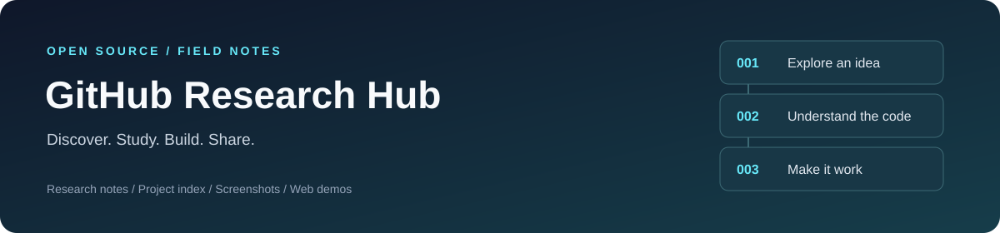
</p>

# 开源项目研究与实践

记录日常在 GitHub、X 等渠道发现的项目与开发案例：从理解能力、运行体验，到源码研究、实践改造，形成可检索的研究档案。项目的开源状态、许可证和可复现程度逐项核实。

首页提供**摘要、顺序索引、项目图片和演示入口**；完整笔记、代码与运行说明保存在各子项目中。

[项目索引](#项目索引) · [项目预览](#项目预览) · [在线目录](https://yydshly.github.io/0913_codex_project/) · [新增项目指南](docs/adding-projects.md) · [研究模板](templates/project/README.md) · [网页演示说明](docs/deployment.md)

## 项目索引

按固定三位编号升序排列，从 `001` 开始。编号分配后保留，目录、研究标题、截图说明及演示路径使用同一编号。

<!-- PROJECT_INDEX_START -->
| 编号 | 研究项目 | 摘要 / 关注点 | 原始网页 | 进度 | 在线演示 |
| :--- | :--- | :--- | :--- | :--- | :--- |
| 001 | [PaperRoute](projects/001-paperroute/README.md) | 浏览器 3D 送报、障碍反馈与七日进程；AI 辅助常规迭代案例，可复用技术价值有限 | [PaperRoute 官网](https://www.paperroute.lol/) | 已总结 | [研究汇总](https://yydshly.github.io/0913_codex_project/001-paperroute/research.html) · [研究原型](https://yydshly.github.io/0913_codex_project/001-paperroute/) |
| 002 | [Dunhuang Aura](projects/002-dunhuang-aura/README.md) | 敦煌美术风格与出图流程说明书；可复用配色、构图、提示词和修图要求，未新增绘图能力，质量与效率增益未验证 | [govin-ai/dunhuang-aura-skill](https://github.com/govin-ai/dunhuang-aura-skill) | 已总结 | [研究结论与参考价值](https://yydshly.github.io/0913_codex_project/002-dunhuang-aura/) |
| 003 | [Mountain Railway Diorama · 白鹭河谷](projects/003-mountain-railway-diorama/README.md) | 可调四季场景、车站人物、动物与声音；沉淀场景创作和联动方法，附最终实景与后续产品方向 | [iamtechartist/mountain-railway-diorama](https://github.com/iamtechartist/mountain-railway-diorama) | 阶段完成 · V38 暂停迭代 | [成果导览](https://yydshly.github.io/0913_codex_project/003-mountain-railway-diorama/guide.html) · [研究总结](projects/003-mountain-railway-diorama/research-summary.md) · [实际场景](https://yydshly.github.io/0913_codex_project/003-mountain-railway-diorama/scene.html) |
| 004 | [Eanpa Sky · 听雨山居](projects/004-eanpa-sky/README.md) | 天空与天气联动研究：晴雨昼夜、雪与冰雹、地面水迹和对应声音；实际截图、实现理解及后期扩展 | [SkyeShark/Eanpa-Sky](https://github.com/SkyeShark/Eanpa-Sky) | 已总结 | [研究摘要](https://yydshly.github.io/0913_codex_project/004-eanpa-sky/) · [实时天气演示](https://yydshly.github.io/0913_codex_project/004-eanpa-sky/lab/) |
| 005 | [Stick & Steel](projects/005-stick-steel/README.md) | 火柴人游戏效果构建；后续以 Skill 制作游戏效果视频或同类风格游戏 | [Genex 原作](https://genex.games/stick-steel) | 已复现 | [研究导览](https://yydshly.github.io/0913_codex_project/005-stick-steel/) · [游戏效果](https://yydshly.github.io/0913_codex_project/005-stick-steel/demo/?view=capabilities) |
| 006 | [游戏效果、交互与教学体验](projects/006-emberfall-arpg/README.md) | 从 ARPG 效果参考与可玩实践，理解情绪、实时反馈和物理教学；附三图导览与完整研究 | 用户提供截图，原作 URL 待核实 | 研究中 | [研究导览](https://yydshly.github.io/0913_codex_project/006-emberfall-arpg/research/) · [试玩 ARPG](https://yydshly.github.io/0913_codex_project/006-emberfall-arpg/) |
| 007 | [Mini Moto — Pine Ridge Park](projects/007-mini-moto-park/README.md) | 迷你越野摩托公园；已定位并体验原作，参考赛道与比赛联动、跟随镜头和车手能力；源码许可待核实 | [作者原帖](https://x.com/chrisjdimarco/status/2098919328368197682) | 已总结 | — |
| 008 | [山地巡游实验室](projects/008-terrain-motion-lab/README.md) | 沉淀道路、地表、树木的素材、生成规则与表现能力；三图操作导览、共享组件、加载反馈和三份可运行快照 | [参考原作](https://mini-moto-park.chipchaunceytheonlyone.chatgpt.site/) | 已总结 · 原型持续打磨 | [能力与图片导览](https://yydshly.github.io/0913_codex_project/008-terrain-motion-lab/capabilities.html) · [山林效果](https://yydshly.github.io/0913_codex_project/008-terrain-motion-lab/outdoor.html?layout=valley&view=sunrise#stage) |
| 009 | [城景工坊 · 城市景点汇总 Skill](projects/009-city-landmark-map/README.md) | 汇总城市及周边景点，以图鉴展示特色、介绍与大体位置；后期需要优化实现 | [YouMind相关线索](https://youmind.com/skills/yhbukK6TtKX0t9) · 原版本待核实 | 研究原型 · 待优化 | [实际演示导览](https://yydshly.github.io/0913_codex_project/009-city-landmark-map/archive.html) |
| 010 | [Mini Moto 赛车游戏参考与实践总结](projects/010-mini-moto-comparison/README.md) | 赛车类游戏参考：核心为场景构建与赛车手能力构建；保留基础竞速和驾驶演示，后续按项目需求开发 | [作者原作](https://mini-moto-park.chipchaunceytheonlyone.chatgpt.site/) | 已总结 | [网页研究与比赛](https://yydshly.github.io/0913_codex_project/010-mini-moto-comparison/) · [自由驾驶练习](https://yydshly.github.io/0913_codex_project/010-mini-moto-comparison/ride.html) |
| 011 | [前端视觉实验室](projects/011-frontend-visual-lab/README.md) | 内容结构、视觉设计、动效编排、场景特效四种优化方式；64项交互、16个原版组件和V4.3实际作品场景 | [Canvas UI](https://canvasui.dev/) · [GSAP](https://gsap.com/) | 已上线 | [摘要与看图体验](https://yydshly.github.io/0913_codex_project/011-frontend-visual-lab/research.html) |
<!-- PROJECT_INDEX_END -->

进度：`待研究` → `研究中` → `已复现` → `已总结`；暂时停止的项目标为 `暂缓`。演示未上线时填写 `—`。

## 项目预览

<!-- PROJECT_PREVIEWS_START -->
### 001 · PaperRoute

浏览器 3D 骑车送报游戏，包含投递、障碍、七日挑战与成绩展示。**对我们的价值：**观察交互效果和作品完成度；开发流程仍是原型、打磨与优化，暂未确认独有方法或可复用代码，保留为低优先级案例参考。

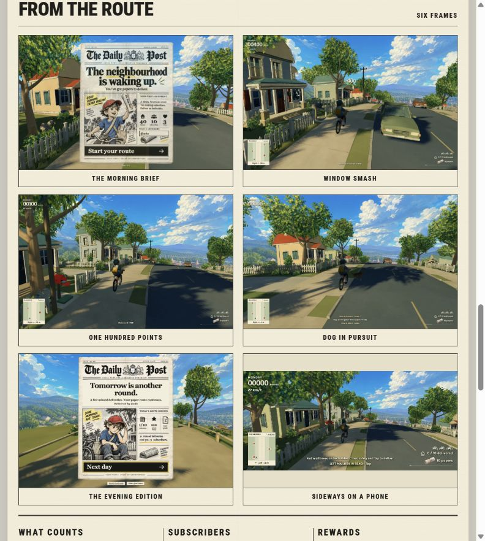

*2026-09-13 官网画廊截图；画面由上游提供，非本项目实际游玩截图。*

[研究汇总](projects/001-paperroute/README.md) · [在线研究页](https://yydshly.github.io/0913_codex_project/001-paperroute/research.html) · [试玩研究原型](https://yydshly.github.io/0913_codex_project/001-paperroute/) · [原始网页](https://www.paperroute.lol/) · [原版游戏](https://www.paperroute.lol/play/) · [实践指南](projects/001-paperroute/practical-guide.md)
### 002 · Dunhuang Aura

**本质是敦煌主题的美术指导与制作流程，不是绘图模型。** 后续可参考它如何整理配色、构图、文字限制和修改保留项，作为特定风格任务的说明模板。技术创新较低，质量与效率增益未验证；暂作为美术规范和提示词组织参考归档，不继续扩展。


*本次依据上游规则调用 imagegen 生成，1983 × 793，约 5:2。子项目另附香氛广告、中文标题封面和删除飘带的修图对照；未做同模型有无 Skill 的评测。*

[在线研究结论](https://yydshly.github.io/0913_codex_project/002-dunhuang-aura/) · [完整研究](projects/002-dunhuang-aura/README.md) · [实验与延伸设计](https://yydshly.github.io/0913_codex_project/002-dunhuang-aura/studio.html#generation-note) · [原始仓库](https://github.com/govin-ai/dunhuang-aura-skill)
### 003 · Mountain Railway Diorama / 白鹭河谷

从原作拆解到独立四季场景，验证地形、环境、人物动物与声音的联动。**阶段收尾于 V38**；本次增加研究总结、最终实景与可选产品方向，待具体需求再继续。

[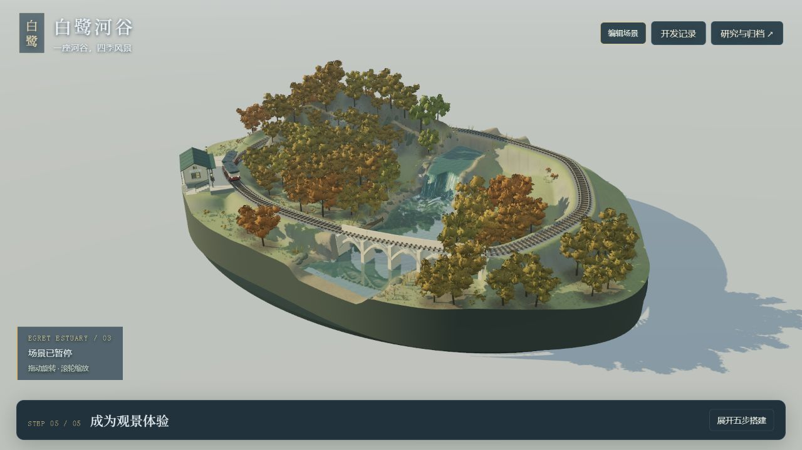](projects/003-mountain-railway-diorama/README.md)

*本研究独立重建的 V24 实景，2026-09-14 本地浏览器截图；点击图片进入研究与效果导览。*

[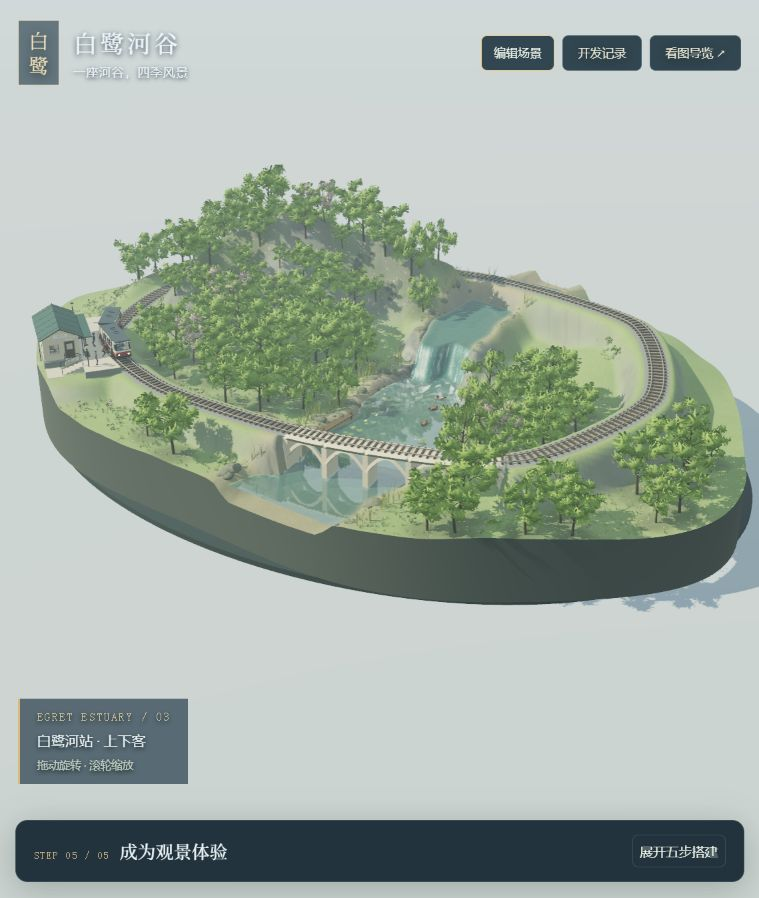](https://yydshly.github.io/0913_codex_project/003-mountain-railway-diorama/guide.html#final-results)

*上图下方新增 V38 最终实景，2026-09-15 线上采集。最新能力含冬季兔子与雪印；本次收尾补充[理解摘要](projects/003-mountain-railway-diorama/research-summary.md)，不新增场景功能。*

[研究分析](https://yydshly.github.io/0913_codex_project/003-mountain-railway-diorama/) · [实际场景](https://yydshly.github.io/0913_codex_project/003-mountain-railway-diorama/scene.html) · [开发过程](https://yydshly.github.io/0913_codex_project/003-mountain-railway-diorama/dev-log.html) · [看效果与操作导览](projects/003-mountain-railway-diorama/README.md) · [查当前能力](projects/003-mountain-railway-diorama/capabilities.md) · [本地运行](projects/003-mountain-railway-diorama/app/README.md) · [开发记录](projects/003-mountain-railway-diorama/development-log.md) · [直接体验 V23 归档](https://yydshly.github.io/0913_codex_project/003-mountain-railway-diorama/archives/v23/scene.html) · [列车与站房研究](projects/003-mountain-railway-diorama/train-station-research.md) · [后续路线](projects/003-mountain-railway-diorama/next-steps.md) · [上游原作演示](https://iamtechartist.github.io/mountain-railway-diorama/)

### 004 · Eanpa Sky / 听雨山居

**核心价值：实时天空与天气，以及对光线、地面和声音的共同影响。** 我们提取引擎搭建山居，演示晴雨、昼夜、雪、冰雹、檐口滴水与融雪补水；当前已满足阶段需求，后期按用途扩展。

[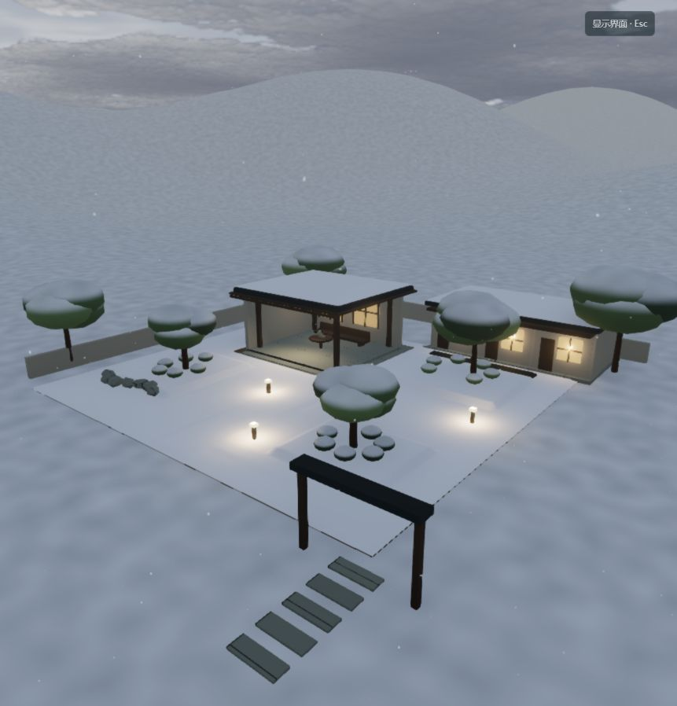](projects/004-eanpa-sky/README.md)

*2026-09-14 本项目实际运行截图，非上游宣传图；雪景为宿主扩展。*

[在线研究摘要](https://yydshly.github.io/0913_codex_project/004-eanpa-sky/) · [我们的天气演示](https://yydshly.github.io/0913_codex_project/004-eanpa-sky/lab/) · [核心理解与效果](projects/004-eanpa-sky/README.md) · [后期扩展](projects/004-eanpa-sky/next-steps.md) · [实践归档](projects/004-eanpa-sky/practice-history.md) · [本地运行](projects/004-eanpa-sky/app/README.md)

### 005 · Stick & Steel

[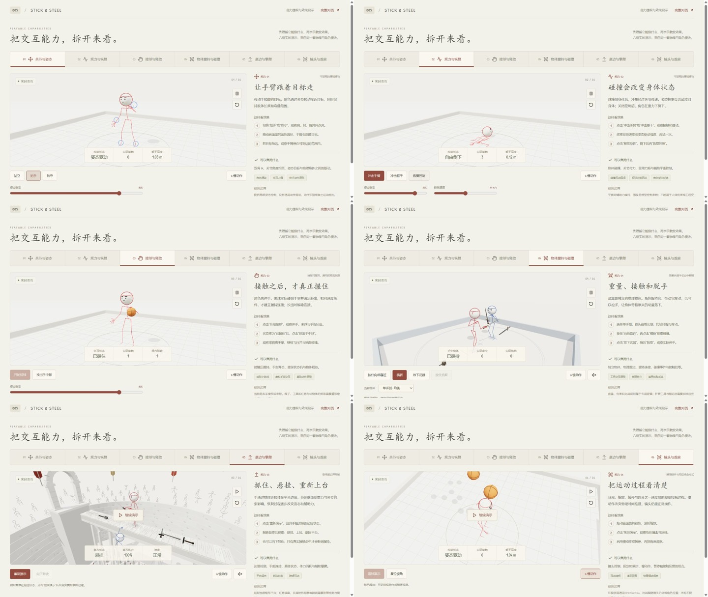](https://yydshly.github.io/0913_codex_project/005-stick-steel/)

**本质：用火柴人形象构建游戏效果。** 通过关节、动作、碰撞、受力、握持与攀爬表现角色操作和游戏反馈。后续将这套效果与制作流程沉淀为 Skill，由 Codex 等代理驱动，制作火柴人游戏效果视频，或构建采用同类火柴人风格与物理效果的游戏。现有人物和生活故事是风格与表演的扩展实验；视频导出与 Skill 尚待开发。

*2026-09-14 六组实际交互截图；选择性复用上游 MIT 模块。点击图片进入研究导览，再亲手体验火柴人游戏效果。*

[在线效果导览](https://yydshly.github.io/0913_codex_project/005-stick-steel/) · [配音故事](https://yydshly.github.io/0913_codex_project/005-stick-steel/demo/?view=stories) · [研究说明](projects/005-stick-steel/README.md) · [当前能力](projects/005-stick-steel/capabilities.md) · [后续开发与 Skill](projects/005-stick-steel/next-steps.md) · [本地运行](projects/005-stick-steel/app/README.md) · [验证记录](projects/005-stick-steel/notes.md) · [上游原作](https://genex.games/stick-steel)

### 006 · 游戏效果、交互与教学体验

从暗黑 ARPG 的视觉效果出发，经过可玩场景与教学工坊，进一步探索物理驱动的自由实验。**我们的理解：**画面吸引、交互反馈和规律理解需要分别成立；以情绪价值为主要驱动，让游戏与教学场景产生可探索、可比较的体验。

| 原来的效果 · 用户参考 | 我们实现的效果 · 可玩 ARPG | 物理驱动 · 交互与教学尝试 |
| :--- | :--- | :--- |
| [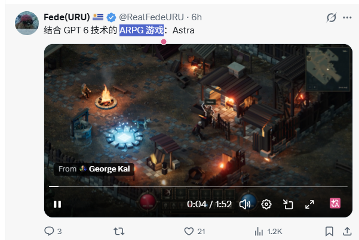](projects/006-emberfall-arpg/research-summary.md) | [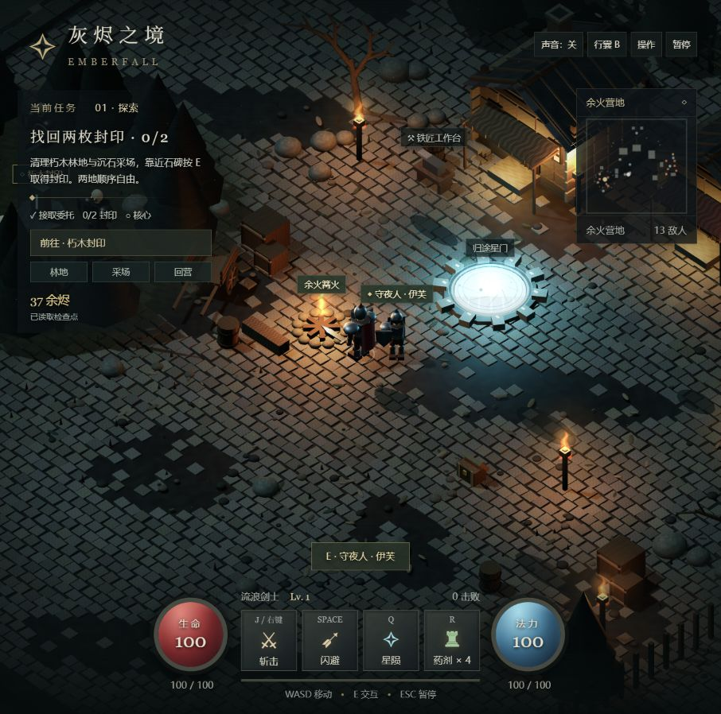](projects/006-emberfall-arpg/game-design.md) | [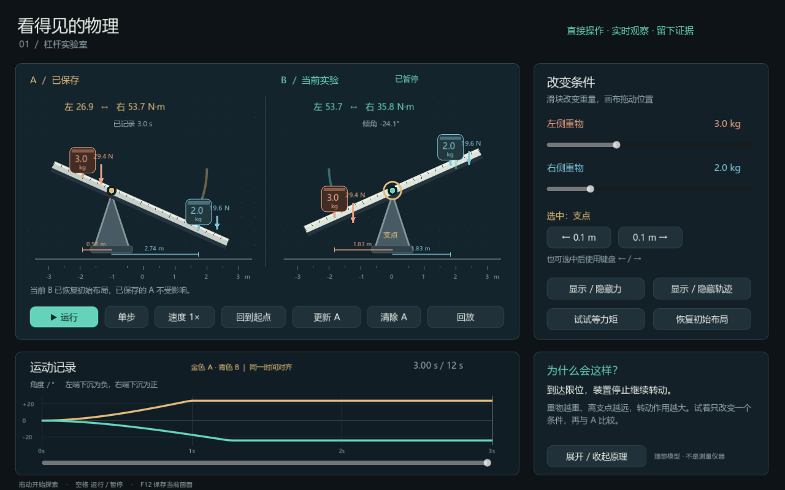](projects/006-emberfall-arpg/physics-lab.md) |

*左图为用户参考，原作与许可待核实；中图为实际浏览器画面；右图为 Godot 原生渲染。三图呈现研究推进，不是同一场景画质比较。杠杆实验台为当前样件，学习效果待验证，ARPG 与研究页已上线；物理实验台仍为本地样件。*

[在线试玩 ARPG](https://yydshly.github.io/0913_codex_project/006-emberfall-arpg/) · [在线研究导览](https://yydshly.github.io/0913_codex_project/006-emberfall-arpg/research/) · [先读我们的理解](projects/006-emberfall-arpg/research-summary.md) · [项目与三图介绍](projects/006-emberfall-arpg/README.md) · [研究网页本地运行](projects/006-emberfall-arpg/app/README.md#研究汇总网页) · [游戏实现](projects/006-emberfall-arpg/game-design.md) · [物理体验](projects/006-emberfall-arpg/physics-lab.md) · [实际验证](projects/006-emberfall-arpg/notes.md)

### 007 · Mini Moto — Pine Ridge Park

已找到截图对应原作并验证自主比赛、头盔镜头与驾驶权切换。参考可编辑赛道、车手能力取舍和场景运镜；公开源码及许可证待核实，尚未本地复现。

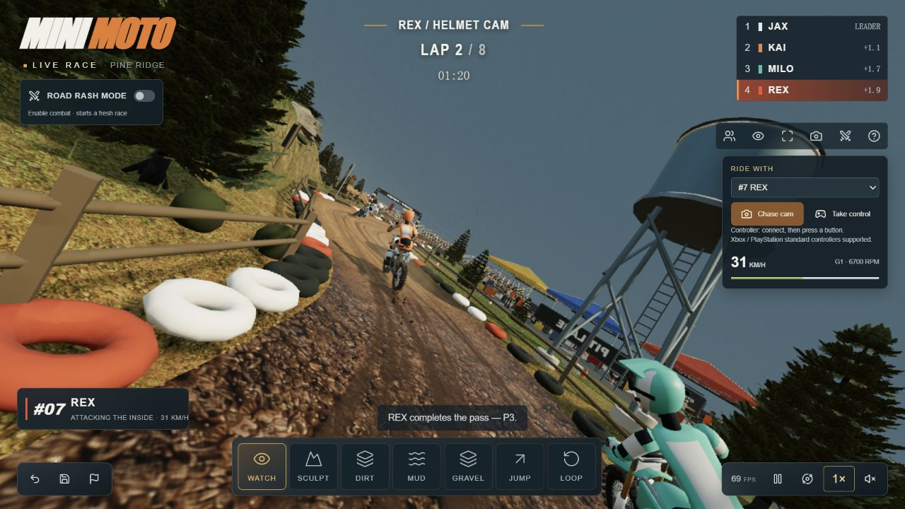

*2026-09-14 作者线上演示实测截图，非本仓库重建。*

[完整研究](projects/007-mini-moto-park/README.md) · [技术与验证](projects/007-mini-moto-park/notes.md) · [作者原版](https://mini-moto-park.chipchaunceytheonlyone.chatgpt.site/) · [原帖](https://x.com/chrisjdimarco/status/2098919328368197682)

### 008 · 道路、地表与树木能力沉淀

**项目意义：积累可复用的自然环境构建能力。** 道路贴合地形，地表组合泥土、草岩与地被，树木从单株分枝到成片分布并参与受光。巡游与营地用于操作、对照与复用验证；户外页提供加载进度、有限重试与错误提示。当前已有共享模块，尚非成熟 SDK，真实感与性能基准仍需完善。

[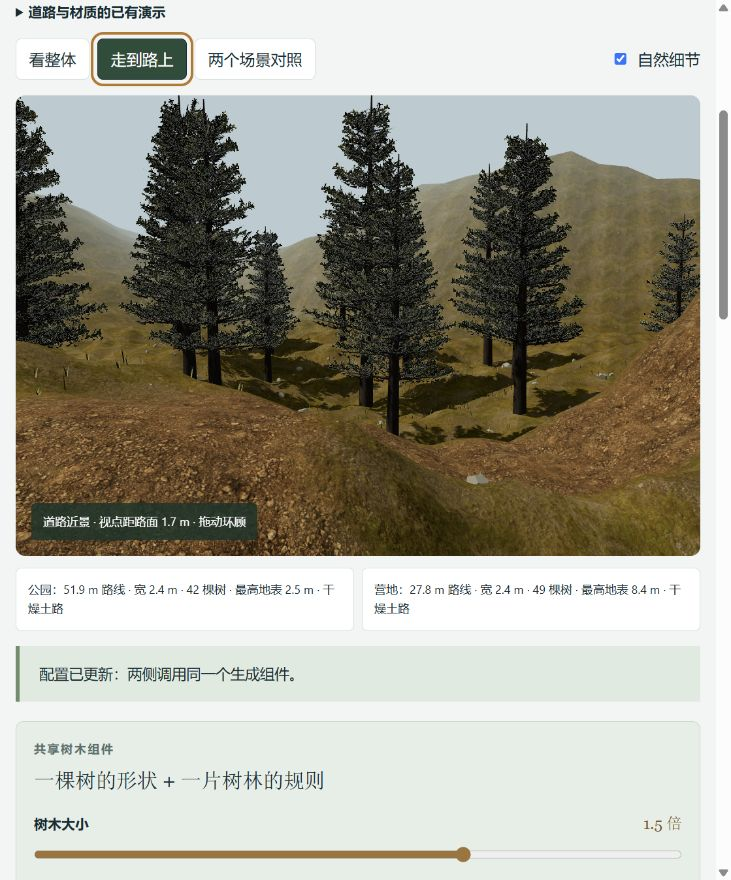](https://yydshly.github.io/0913_codex_project/008-terrain-motion-lab/capabilities.html#effect-guide)

*2026-09-14 本项目实际浏览器截图，非实景照片或上游宣传图；三图导览说明看什么、动哪个控制、沉淀什么。*

[在线能力与图片导览](https://yydshly.github.io/0913_codex_project/008-terrain-motion-lab/capabilities.html) · [理解与效果导览](projects/008-terrain-motion-lab/README.md) · [能力与边界](projects/008-terrain-motion-lab/CAPABILITIES.md) · [效果记录](projects/008-terrain-motion-lab/effect-log.md) · [版本快照](projects/008-terrain-motion-lab/snapshots/README.md) · [运行](projects/008-terrain-motion-lab/app/README.md)

### 009 · 城景工坊 / 城市景点汇总 Skill

城市景点汇总 Skill：收集城市及周边值得去的景点，以景区图鉴的方式展示景点特色、简要介绍和大体位置，帮助用户直观了解与探索城市。 当前展示西安样稿与研究资料，后期需要优化景点筛选、位置准确性、画面效果和生成流程。

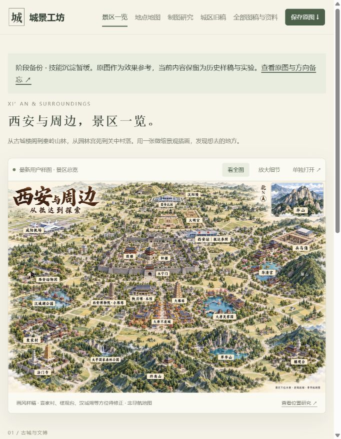

*2026-09-14实际浏览器截图；画面中的插画为用户样稿，含已记录的位置问题。*

[实际演示导览](https://yydshly.github.io/0913_codex_project/009-city-landmark-map/archive.html) · [全部图稿资料](https://yydshly.github.io/0913_codex_project/009-city-landmark-map/library.html) · [项目摘要与资料](projects/009-city-landmark-map/README.md) · [发布记录](projects/009-city-landmark-map/publishing.md)

### 010 · Mini Moto 赛车游戏参考与实践总结

[](projects/010-mini-moto-comparison/README.md)

**赛车类游戏参考，核心是场景构建和赛车手能力构建。** 场景提供路线、地形和路面选择，车手能力连接主体表现、驾驶操作、参数与反馈。基础演示已验证；研究已总结，后续按具体项目需求开发，当前不是成熟赛车框架。

*2026-09-14 原作游戏实测效果图，来自 007 来源档案；非 010 重建画面。上游源码与许可待核实。*

[网页研究与比赛](https://yydshly.github.io/0913_codex_project/010-mini-moto-comparison/) · [自由驾驶练习](https://yydshly.github.io/0913_codex_project/010-mini-moto-comparison/ride.html) · [研究总结](projects/010-mini-moto-comparison/README.md) · [运行与操作](projects/010-mini-moto-comparison/app/README.md) · [原作对比](projects/010-mini-moto-comparison/comparison.md) · [实现与验证](projects/010-mini-moto-comparison/notes.md)

### 011 · 前端视觉实验室

**工具提供能力，产品需求决定如何使用。** 将网页优化归纳为内容与结构、视觉设计、动效编排、场景特效四种方式。Product Design帮助设计探索，GSAP连接进入与返回，Canvas UI提供云雾和冰霜等局部表现；完整保留64项自编交互、16个原版组件和V4.3作品页。

[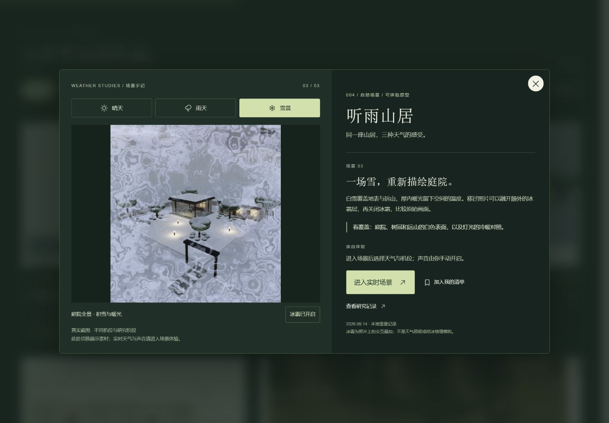](projects/011-frontend-visual-lab/README.md)

*2026-09-15实际浏览器截图。点击从研究进入看图体验；完整HTML变形取决于浏览器能力，截图与实时场景分别说明。*

[在线摘要与看图体验](https://yydshly.github.io/0913_codex_project/011-frontend-visual-lab/research.html) · [完整实验室](https://yydshly.github.io/0913_codex_project/011-frontend-visual-lab/) · [理解摘要](projects/011-frontend-visual-lab/understanding.md) · [能力与操作](projects/011-frontend-visual-lab/README.md) · [全部优化记录](projects/011-frontend-visual-lab/portfolio-iterations.md) · [发布范围与验证](projects/011-frontend-visual-lab/publishing.md)

<!-- PROJECT_PREVIEWS_END -->

## 仓库结构

```text
.
├── README.md                 # 对外总览：摘要、索引、项目预览
├── projects/                 # 研究子项目：001-slug、002-slug……
├── templates/project/        # 可复制的研究模板、图片与应用目录
├── assets/images/            # 首页公共图片
├── docs/                     # 收录规范与部署说明
└── site/                     # GitHub Pages 导航与构建输出目录
```

## 使用方式

1. 选定一个原始网页或仓库，按[新增项目指南](docs/adding-projects.md)分配编号并复制模板。
2. 在子项目中记录研究目标、上游版本、运行步骤、截图与结论。
3. 更新本页对应的索引行和预览卡片，保持编号升序。
4. 有可展示的网页时，再按[部署说明](docs/deployment.md)添加演示入口。

## 来源与使用说明

每个子项目单独记录原始仓库、作者、许可证及研究使用的版本。第三方代码和素材遵循原项目许可证；本仓库目前未为原创内容指定开源许可证。
