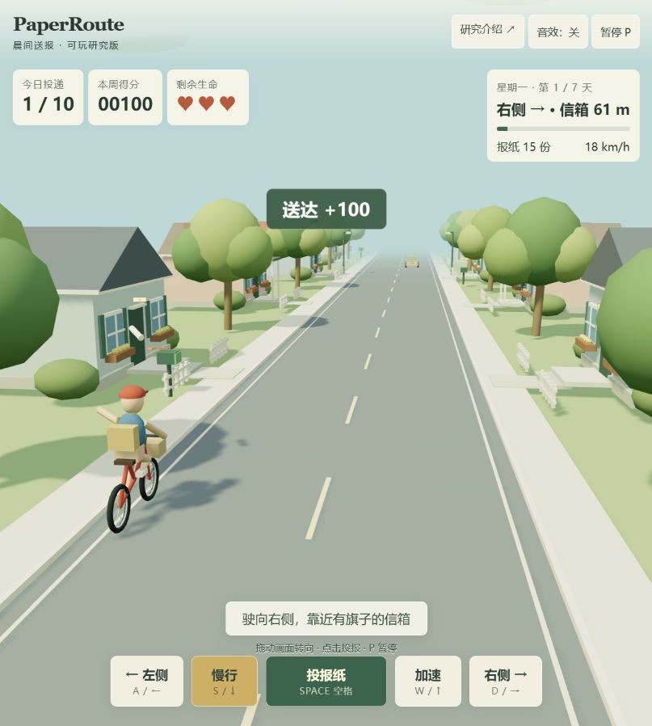
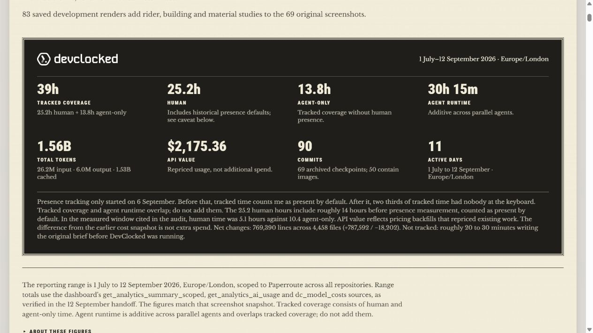
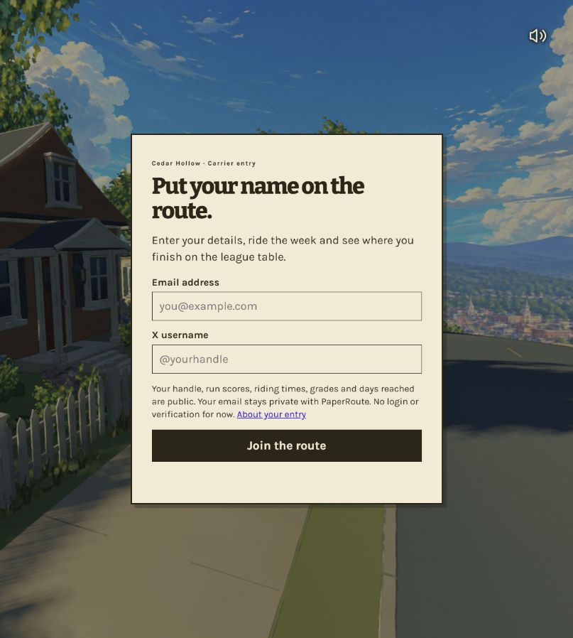

# 001 · PaperRoute：能力、研究结论与实践

PaperRoute 是一款浏览器 3D 骑车送报游戏，官网介绍骑行投递、障碍反馈、七日进程、手机操作和成绩展示，并公开 AI 辅助开发日志。当前将其收录为开发案例；源码公开性与许可证待核实，不能作为已确认开源的通用游戏库。

**研究结论：开发过程仍是“想法 → 原型 → 细节打磨 → 优化 → 产品”，AI 参与其中的实现工作。对我们有交互效果、完成度和过程记录的参考价值，但现有材料不足以支持独有开发方法、可直接复用技术或可量化效率优势；保留为低优先级案例，不继续扩展为特殊方法论。**

*2026-09-13 截取的[官网画廊](https://www.paperroute.lol/#gallery-title)，画面由上游提供。用于展示原作能力，不代表本项目已实测这些流程。*

**现已上线[中文研究汇总](https://yydshly.github.io/0913_codex_project/001-paperroute/research.html)和[独立可玩原型](https://yydshly.github.io/0913_codex_project/001-paperroute/)。** 原型可以实际骑行、投报、躲避障碍并进行跨日挑战，也可按[运行说明](app/README.md)在本地启动。原型为独立简化实现，不是原站源码或精确复刻。下文的上游观察与本地实现分开记录；上游完整玩法仍未实测，开源状态待核实。

| 项目 | 内容 |
| :--- | :--- |
| 固定编号 | 001 |
| 原始网页 | [PaperRoute 官网](https://www.paperroute.lol/) |
| 源码仓库线索 | [sketchymedia/Paperroute](https://github.com/sketchymedia/Paperroute)，来自开发日志；本次访问返回 404，公开可用性待核实 |
| 原作者 | [BuiltBySketch](https://x.com/BuiltBySketch)，官网署名 |
| 发现渠道 | 用户提供官网链接 |
| 上游许可证 | 待核实，未确认代码或素材的开放许可 |
| 研究日期 | 2026-09-13（Asia/Shanghai） |
| 研究版本 | 当日线上页面；部署对应 commit/tag 待核实。日志出现历史短 SHA `1af3b18`，不能据此认定当前线上版本 |
| 进度 | 已总结：能力、价值判断与独立研究原型已整理；上游源码复现未完成 |
| 研究优先级 | 低：保留为作品案例；如后续公开源码、完整任务记录或效率对照，再评估深入研究 |
| 技术线索 | 作者资料提及 Astra、Blender、Three.js、Supabase、Vercel；具体版本及当前配置待核实 |
| 上游体验 | [游戏入口](https://www.paperroute.lol/play/)，本次可加载，进入游戏前展示邮箱与 X 用户名表单 |
| 本仓库在线演示 | [研究页](https://yydshly.github.io/0913_codex_project/001-paperroute/research.html) · [可玩原型](https://yydshly.github.io/0913_codex_project/001-paperroute/)，GitHub Pages，2026-09-13 实际访问通过 |

[返回总索引](../../README.md#项目索引) · [拆解与实践指南](practical-guide.md) · [证据与研究笔记](notes.md) · [图片来源](assets/README.md) · [游戏运行说明](app/README.md) · [研究展示源码](app/research.html)

需要具体指导时，从[六轮实践指南](practical-guide.md)开始：按规则、手感、素材、镜头、状态和交付逐步拆解，附每轮 AI 指令与验收方法，并结合本地代码解释投递窗口、计分时序和下一步练习。指南中的新任务尚未实施。

## 本地可玩版本

*本仓库实现的游戏实际截图。可以用方向键或 A/D 转向、空格投报、上下方向键调整速度、P 暂停；鼠标与触屏可使用屏幕按钮。完整启动方式、简化规则和验证结果见[游戏说明](app/README.md)。*

与上游的区别：模型为本项目程序生成，路线、投递窗口和难度经过简化；没有复制上游模型、音乐或源码，也没有实现联网排行榜。下文展示的官方玩法不能视为本地原型已经实现的全部功能。

## 一眼看懂它在展示什么

*2026-09-13 实际官网截图。画面显示首屏设计，不是本仓库制作的页面。*

米色背景、粗黑刊头、细分隔线和插画构成报纸版面。对于“送报”这个题材，这些元素既说明世界观，也让操作教程具有报刊栏目的感觉。以下设计意义是本项目基于页面的分析，不代表转化率或用户研究结果。

## 能力展示

| 能力 | 页面呈现或官方描述 | 意义（研究判断） | 本次证据 |
| :--- | :--- | :--- | :--- |
| 浏览器 3D 场景 | 游戏入口加载街道、房屋、天空及标题画面 | 链接可以承载沉浸式体验，适合作品展示与试玩分发 | 已观察入口场景，未测帧率 |
| 骑行与投递 | 自动前进，玩家控制方向、速度与投报时机 | 少量动作形成连续判断：走哪一侧、何时减速、何时出手 | [官网玩法](https://www.paperroute.lol/#controls-title)，未实测 |
| 障碍与反馈 | 车辆、坑洞和追逐的狗；投递、撞击影响结果 | 把重复任务变成需要注意力和技巧的挑战 | 官方说明及下方画廊 |
| 跨日进程 | 七日任务；漏送失去订户，完美表现增加订户 | 将一次操作的后果带到下一轮，形成长期目标 | [官网周计划](https://www.paperroute.lol/#week-title)，未通关验证 |
| 桌面与触屏输入 | 方向键、空格、鼠标以及手机拖动/点击说明 | 同一规则需要适配不同输入方式，不能只缩小页面 | 已阅读说明，未做真机触控测试 |
| 排名与传播 | 成绩榜、结算报纸和分享入口 | 给玩家提供比较、回访和展示成果的理由 | 页面与作者说明；未上传成绩或分享 |
| 统一视觉叙事 | 宣传页与游戏简报都使用报纸主题 | 教程、进场和结算保持同一身份，降低体验割裂 | 首页实拍与官方画廊 |
| 开发过程展示 | 可浏览历史阶段和统计说明 | 可以研究修改过程，而不仅看最终效果 | 已阅读并截图开发档案 |

*本次截取的是官网展示的六幅画面，不是本研究实际游玩产生的截图。来源：[官网画廊](https://www.paperroute.lol/#gallery-title)。*

下图按官网规则归纳体验流程，不表示已核实的源码架构：

## 对我们的价值与取舍

| 问题 | 当前判断 | 依据与后续处理 |
| :--- | :--- | :--- |
| 是否提供新开发流程 | 未看到可验证的新流程 | 基本动作仍是需求、原型、迭代、打磨与发布 |
| 是否值得观察成品 | 有案例参考价值 | 可观察目标提示、输入反馈、七日状态与题材一致性 |
| 是否可直接作为库使用 | 暂不能确认 | 仓库线索返回 404，源码、接口和许可证未核实 |
| 是否证明 AI 的效率优势 | 证据不足 | 缺少同任务基线与完整分工、返工和成本对照 |
| 是否继续投入研究 | 暂不优先 | 保存证据与结论，避免重复整理通用方法 |

以下是通用设计经验，不将其视为 PaperRoute 独有的方法。完整的实践拆分见[操作指南](practical-guide.md)，其中 AI 指令为本研究编写，非作者原始提示词。

### 1. 小题材也能承载完整的体验设计

“送报”容易理解，但设计可以从即时操作延伸到风险判断、长期进度和成绩展示。值得借鉴的是围绕同一个动作组织规则：每增加一个系统，都应帮助玩家理解目标或愿意继续，而不是单纯增加按钮和功能数量。

对本仓库后续实践，可以先选择一个明确动作，再设计“输入—反馈—结束—重试”的最小流程。这个方法适用于互动教学、小游戏和带操作过程的产品演示。

### 2. 美术与文案可以承担功能

报纸主题能够同时容纳说明、任务和成绩。把界面元素放进题材语境，用户更容易把各个页面理解为同一段经历。研究视觉设计时应同时记录其功能：某个版式是否说明优先级，某个图像是否帮助识别任务，某段文案是否推动下一步。

这是一种可借鉴的设计策略；本次没有用户访谈、点击数据或对照实验，不能断言它提高了多少参与率。

### 3. AI 辅助开发的价值需要从迭代过程判断

作者在[开发日志](https://www.paperroute.lol/devlog/)中将作品描述为受 Paperboy 启发的个人创作，并强调方向调整和持续打磨。日志呈现了从原型到模型、视觉、交互和发布页面的演进。

本项目的判断是：这个案例提供局部协作线索，但没有足够材料完整还原哪些工作由人或 AI 完成、怎样减少返工，以及节省多少投入。评价效率还需要相同任务下的基线、人力投入、运行成本和维护结果。仅看一个成功作品，无法得出所有团队都能以相同投入复现的结论。

### 4. 展示过程也是产品能力的一部分

带版本线索的过程记录比一张最终效果图更利于研究：可以追问改变了什么、解决了什么、怎样验证。后续项目应把截图与日期、版本和观察条件一起保存，并将作者声明与本地验证分开。这也是本子项目保留证据表和图片来源的原因。

## 如何理解开发统计

| 指标 | 首页摘要 | 开发日志当前说明 |
| :--- | :--- | :--- |
| 记录覆盖时间 | 35h | 39h；人工 25.2h、仅代理 13.8h |
| Token 总量 | 1.51B | 1.56B，其中缓存约 1.53B |
| 阶段数量 | 69 个检查点 | 69 个检查点，与统计中的 90 次提交不是同一指标 |

两页数字不同；日志统计区间为 2026-07-01 至 2026-09-12。以上均为**作者自报，未独立审计**。日志还说明早期人工在场时间采用默认归类；并行代理运行时间与覆盖时间有重叠，不能相加。其 `$2,175.36 API value` 是重定价估值，不能直接写成实际账单或新增花费。[统计来源与口径](https://www.paperroute.lol/devlog/)

本项目用这些数字说明“作者提供了哪些过程证据”，不把 token 数视为产出代码量，也不据此推导自主完成比例或通用开发成本。

## 实际访问边界

本次进入游戏后观察到资料表单，未填写或提交身份资料，因此没有验证实际投递、暂停恢复、七日结算、成绩保存与上传。网页抓取中的隐藏游戏状态或备用错误文案，也不作为实测通过或加载失败的依据。

[排行榜说明](https://www.paperroute.lol/leaderboard/)表示用户名和成绩等信息公开，邮箱保存在其私有 Supabase 数据库；页面还注明启动分数包含合成数据，身份未经核验。本次只核对公开说明，没有验证后端数据或安全性，不能把榜单当成真实活跃用户规模的证据。

## 研究状态与后续路径

- [x] 按模板建立独立项目，并同步根索引与预览。
- [x] 整理能力展示、体验流程和意义分析。
- [x] 保存真实页面截图，说明来源和观察范围。
- [x] 记录上游源码线索、统计差异及验证边界。
- [ ] 核实可公开访问的源码、LICENSE 与线上部署版本。
- [ ] 在具备体验条件后验证完整玩法、移动输入和成绩流程。
- [ ] 获取可复现条件后再补充本地依赖、运行命令和性能结果。

已在 `app/` 完成独立 3D 送报原型，并保留中文研究页 `research.html`。两者已部署到 GitHub Pages。本地规则已测试，线上浏览器已观察成功投递、暂停与恢复；这不等于上游源码复现或上游七日通关。完整环境、发布版本与边界见[运行说明](app/README.md)和[发布记录](notes.md)。

## 来源与许可

来源为 [官网](https://www.paperroute.lol/)、[游戏入口](https://www.paperroute.lol/play/)、[开发日志](https://www.paperroute.lol/devlog/)和[排行榜说明](https://www.paperroute.lol/leaderboard/)，访问日期均为 2026-09-13。截图中的商标、插画和游戏画面属于上游内容，许可待核实；本项目未将其标为可自由复用素材。详细出处见 [图片记录](assets/README.md)。
