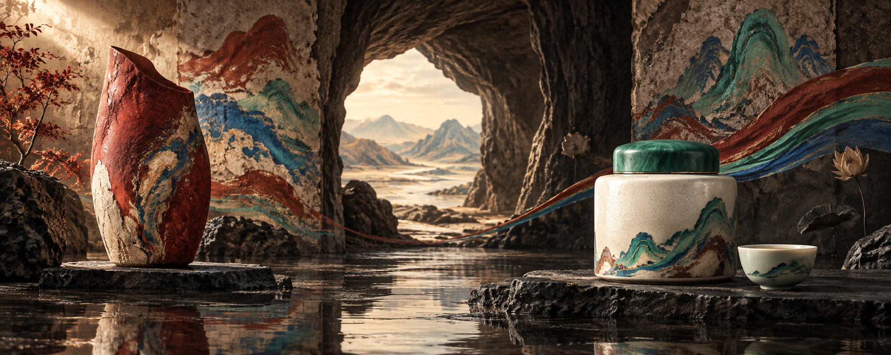
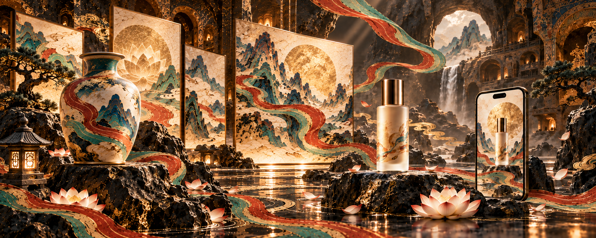
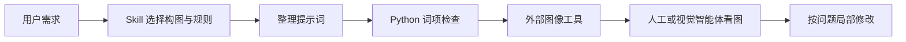
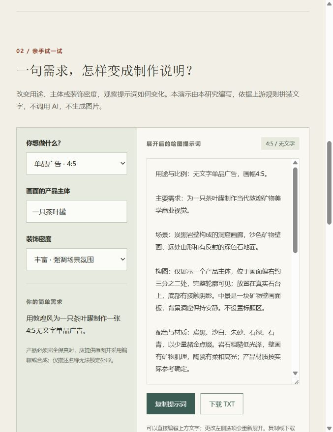

# 002 · Dunhuang Aura：能力、效果与意义

**核心结论：它是一份敦煌主题的美术风格说明书，加上一套商业图片制作与修改流程。它负责把要求写清楚，实际绘制由外部图像大模型完成；没有新增绘图模型、训练方法或渲染算法。**

**后续参考价值：**参考其整理配色、构图、文字政策、提示词结构、修改保留项和人工验收清单的方法。遇到敦煌主题封面、品牌氛围图或同风格系列提案时，可以作为起草要求的模板；不应当作为通用设计引擎、产品保真工具或图片质量保证。

**研究处置：已总结，暂不继续扩展。** 保留为美术规范与提示词组织的参考案例。它可能减少重复描述和需求遗漏，但尚无对照实验证明更美观、更稳定或更省时间，技术创新和独立商业价值均不应高估。

| 值得带走的经验 | 后续如何使用 | 尚不能证明什么 |
| :--- | :--- | :--- |
| 把审美要求写成具体规则 | 记录色板、材质、主次、构图与禁用元素 | 规则齐全就会出好图 |
| 把出图需求组织成模板 | 用途、主体、比例、文字、限制一起交付 | 优于有经验的人独立编写提示词 |
| 修改时明确不变量 | 单次修改写清要改什么、保留什么 | 图像模型能准确锁定其他区域 |
| 将检查纳入流程 | 提示词检查与成品人工验收分别执行 | 关键词检查可以判断审美与商品保真 |

我们后来制作的合成工具、品牌物料方案和三张独立产品海报属于研究延伸，不能反算为上游库的能力。尤其慢光、PaperRoute、OpenMAIC 的第二版海报主要来自助手的产品理解与独立提示词，未严格沿用 Skill。详见 [产品落地分析](product-opportunities.md)、[工作台归因说明](app/studio.html#generation-note) 与 [实验记录](notes.md)。

| 项目 | 内容 |
| :--- | :--- |
| 固定编号 | 002 |
| 原始仓库 | [govin-ai/dunhuang-aura-skill](https://github.com/govin-ai/dunhuang-aura-skill) |
| 作者 / 组织 | Govin / govin-ai |
| 发现渠道 | 用户提供 GitHub 仓库链接 |
| 上游许可证 | MIT，保留 [原始许可](app/UPSTREAM-LICENSE.txt) |
| 研究版本 | `4b8ff65b99729a002072108467ae5b3f99fed939`，main；未使用 tag |
| 研究日期 | 2026-09-13；结论归档 2026-09-14 |
| 进度 | 已总结并归档；保留实测与延伸探索，暂不继续扩展；上游原图未复现 |
| 上游技术 | Markdown 规则与模板、YAML 元数据、Python 标准库检查器 |
| 本地演示 | HTML、CSS、原生 JavaScript、Node.js 静态构建；无第三方包 |
| 在线演示 | 尚未部署 |

[返回索引](../../README.md#项目索引) · [演示源码页面](app/index.html) · [运行说明](app/README.md) · [实验记录](notes.md) · [素材来源](assets/README.md)

## 按产品特色重新设计

用户反馈原先截图模板效果不佳后，新增慢光（厚涂日落）、PaperRoute（骑行投递）、OpenMAIC（轨道实验）三张独立宣传概念图。使用内置 imagegen，以已有产品画面作参考重新创作；不是软件实测结果，也不是原截图的保真编辑。**这三张主要来自 AI 助手的产品理解与独立提示词设计，没有严格沿用 Dunhuang Aura Skill，不能作为 Skill 提升效果的证据。**见 [工作台新版海报](app/studio.html#redesign)。

## 本次新生成的实际效果

**新增：[六个扩展方向与效果](experiments/extensions.md)**——清淡青绿茶广告、壁画礼盒、几何海报、织物配件、茶空间和出版纸品。每组附实际生成图、真实用途、需要覆盖的原规则和生产边界；另有 [扩展演示页面](app/extensions.html)。



2026-09-13 使用内置 imagegen，完成 **无字茶品牌横幅、香氛单品广告、中文展览封面**，并对香氛图做了 **删除红色飘带** 的单变量编辑。每次保留首轮结果，未裁切或后期加字。网页首屏与新图画廊展示这四张结果。

| 场景 | 实际效果 | 观察到的局限 |
| :--- | :--- | :--- |
| 茶品牌横幅 | 两侧主体、中间景深，无明显文字 | 左侧陶瓶可能抢走茶叶罐的注意力 |
| 香氛广告 | 单瓶轮廓、磨砂玻璃与台座阴影 | 虚构瓶型，未验证真实商品保真 |
| 千年壁色封面 | 四字正确，两行布局，直接生成在图片里 | 字体未完全遵循无衬线要求 |
| 删除飘带 | 飘带消失，瓶子与光线大体保留 | 壁画和石材纹理也发生重绘 |

实际宽幅为 1983 × 793、竖幅为 1122 × 1402，均只接近请求比例，未达到提示词中的目标像素。详细原图、完整提示词、生成条件和逐张观察见 [实际生成实验](experiments/README.md)。未进行同模型有无 Skill 的对照，不能量化 Skill 的提升。

## 上游自带样张（参考）



图为上游原始 PNG，1983 × 793，约 5:2；不是本研究生成的图片，也不是使用前后对照。来源固定到上述提交，许可信息随项目保留。

**观察：**矿物色、陶瓷、壁画面板和洞窟组成华丽的产品广告。左右有视觉重点，前后层次明显。金色与发光效果较强、莲花重复较多，与“克制用金、减少装饰”的规则仍有偏差。这是视觉判断，没有测量颜色面积。

**不能证明：**产品精确保真、准确中文生成、批量一致性或使用 Skill 比普通提示词好多少。当前材料未提供可复现该样张的完整模型版本、种子与生成参数记录。

## 能力与适用范围

| 能力 | 上游如何指导 | 条件 / 边界 |
| :--- | :--- | :--- |
| 无字横幅 | 5:2，两侧有重点，中间有景深，明确禁字 | 需要外部图像工具，出图后检查 |
| 带标题封面 | 准确文字、约 38%–48% 标题区域 | 不能保证中文正确，可后期排版 |
| 产品主视觉 | 主体数量、位置、完整轮廓和接触阴影 | 严格保真应使用原图编辑或合成 |
| 修图 | 去字、补满、调整左右、减少装饰 | 每次写清主要变化与保留项，仍可能漂移 |
| 系列物料 | 先审核主图，再锁定色板、材质、光线 | 是流程约定，没有批量服务或一致性算法 |
| 提示词检查 | 比例、色板、材质、构图、光线和文字约束 | 检查文本词项，不识别图片 |

适合品牌提案、茶与香氛等产品氛围图、文章封面和文化活动视觉探索。考古复原、具体洞窟历史重建不属于现有商业模式。

## 主要风格与敦煌风的关系

本库风格：**矿物配色 + 壁画肌理 + 洞窟空间 + 现代产品摄影式光影**。炭黑和沙白构成底色，朱砂、石绿、石青用于飘带，赭金用于光线和装饰。产品、壁画、洞窟构成三层空间。

现代设计中的“敦煌风”借鉴石窟壁画、彩塑和装饰纹样。敦煌艺术跨越多个时代，并非固定滤镜。本库默认排除佛像、菩萨和飞天人物；黑金洞窟、手机和产品舞台属于现代演绎，不代表敦煌艺术全貌。参考 [敦煌研究院：壁画颜料研究](https://skytyz.dha.ac.cn/CN/Y2022/V1/I1/47)、[第420窟纹样介绍](https://www.dha.ac.cn/info/1425/3551.htm)。

## 技术原理



上图是规则定义的建议流程，不是上游提供了自动执行所有节点的程序。

| 上游文件 | 职责 |
| :--- | :--- |
| `SKILL.md` | 生成 / 编辑模式、文字政策、提示词顺序与交付要求 |
| `references/style-system.md` | 色彩、材料、装饰、构图与光线 |
| `references/prompt-recipes.md` | 不同交付物的提示词模板 |
| `references/workflows.md` | 单变量编辑、主图到系列物料的流程 |
| `references/qa-checklist.md` | 生成后的看图验收清单 |
| `scripts/check_prompt.py` | 关键词、比例字符串与简单正则检查 |

没有自研模型、训练程序或图像 API 接入。文字是软约束，不会在像素或几何层面锁定效果。没有图像工具时，上游要求输出提示词和检查清单。

## 交互演示与本地运行

[演示页面](app/index.html)支持三种用途：无字横幅（5:2，两侧有主体）、单品广告（4:5，一个产品）、带标题封面（5:2，左侧约44%标题区）。输入产品、调整装饰密度，可观察提示词变化，并编辑、复制或下载 TXT。

**页面表单使用确定性文字拼装，不实时调用模型。新增画廊展示本次在会话中实际调用图像工具得到的四张文件，不会随表单变化，也不表示任意当前输入的输出。**



*2026-09-13 本地浏览器实拍。复制功能已验证；TXT 已触发下载请求，但当前内置浏览器未确认文件保存，可使用复制替代。*

在仓库根目录执行，无需安装 npm 依赖：

```powershell
node projects/002-dunhuang-aura/app/build.mjs
node projects/002-dunhuang-aura/app/preview.mjs
```

打开 `http://127.0.0.1:4174`。Node.js v22.15.0 已验证。上游检查器在 Python 3.10.11 下验证：

```powershell
python -m unittest discover -s projects/002-dunhuang-aura/app/validator/tests -v
python projects/002-dunhuang-aura/app/validator/scripts/check_prompt.py projects/002-dunhuang-aura/app/validator/tests/valid-text-free.txt --mode text-free --ratio 5:2
```

## 意义与价值

| 对谁有用 | 价值 | 局限 |
| :--- | :--- | :--- |
| 不熟悉绘图需求的人 | 将模糊风格拆成明确要求，减少遗漏 | 仍需判断结果并迭代 |
| 同风格物料制作团队 | 统一色板、构图与修改语言 | 未量化节省的时间或成本 |
| 已有成熟提示词经验的人 | 参考局部规范与清单 | 新增价值有限 |
| 寻找新图像技术的开发者 | 参考领域经验的封装方式 | 没有新的生成算法，技术创新程度较低 |

扩展建议：原产品合成、独立准确排版、OCR 与尺寸检查、生成参数归档及同模型有无 Skill 的对照评测。**这些是研究建议，上游尚未实现。**

## 验证与来源

已查看上游样张、阅读核心文件、运行上游两项测试且通过；现已补充三次实际生成与一次编辑。文本测试不等于图像效果评测。新增图片逐张观察见 [实验记录](experiments/README.md)，网页验证见 [notes.md](notes.md)。部署状态见 [仓库部署记录](../../docs/deployment.md)。

固定来源：[完整版本](https://github.com/govin-ai/dunhuang-aura-skill/tree/4b8ff65b99729a002072108467ae5b3f99fed939)、[主规则](https://github.com/govin-ai/dunhuang-aura-skill/blob/4b8ff65b99729a002072108467ae5b3f99fed939/SKILL.md)、[风格规范](https://github.com/govin-ai/dunhuang-aura-skill/blob/4b8ff65b99729a002072108467ae5b3f99fed939/references/style-system.md)、[工作流程](https://github.com/govin-ai/dunhuang-aura-skill/blob/4b8ff65b99729a002072108467ae5b3f99fed939/references/workflows.md)、[检查器](https://github.com/govin-ai/dunhuang-aura-skill/blob/4b8ff65b99729a002072108467ae5b3f99fed939/scripts/check_prompt.py)。

上游仅收录一张样图、最小检查器与测试及 MIT 许可，没有复制完整上游仓库或嵌套 `.git`。四张新生成作品、网页、中文研究和交互逻辑由本次研究新增，与上游素材分别标记。
