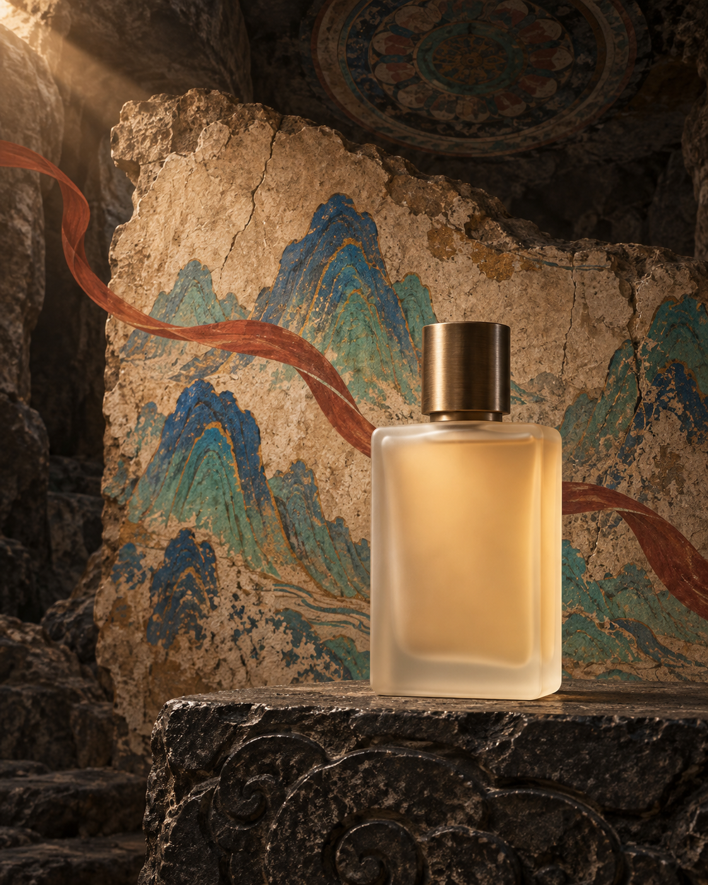
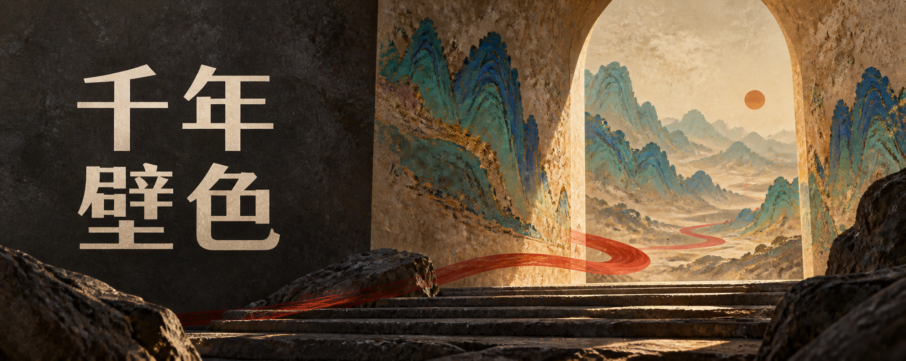
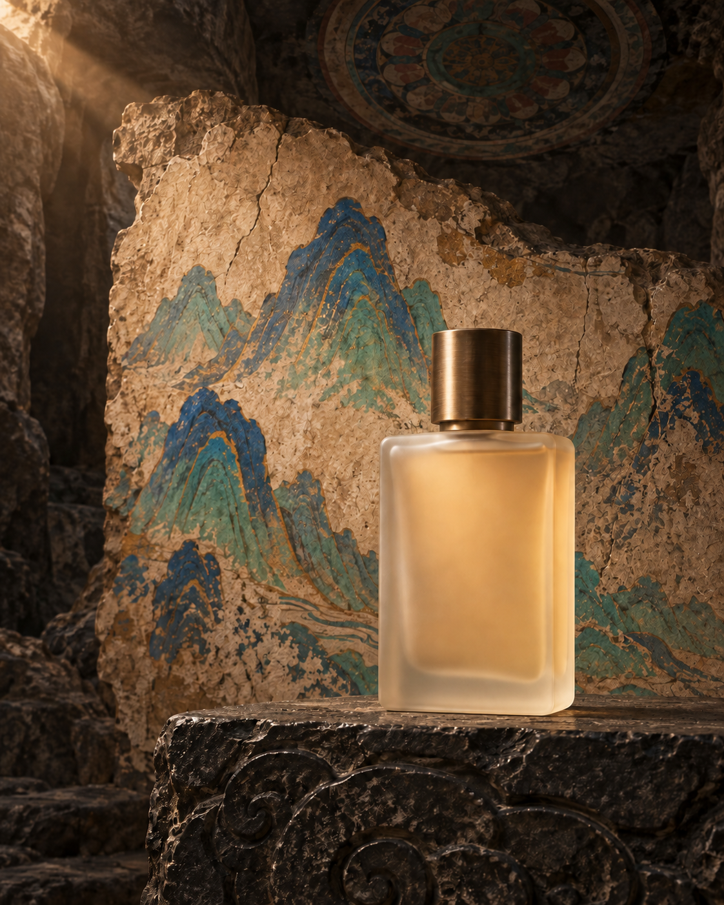

# 002 · 本次实际图像生成与编辑

后续新增三种明显不同的视觉探索，见 [扩展方向与实际效果](extensions.md)。本页保留首轮商业风的三张生成图与一次编辑记录。

2026-09-13，用户要求更多实际效果，新增三次文生图和一次参考图编辑。使用内置 `imagegen` 工具，根据上游固定版本 `4b8ff65b99729a002072108467ae5b3f99fed939` 的配色、构图、文字政策和单变量修图流程组织提示词。没有安装整个上游 Skill，也没有使用上游样图作为生成参考。

**每个任务一次调用，保留首轮结果；未裁切、缩放、调色或后期加字。** 输出为虚构产品 / 活动视觉，不是现实品牌、活动或历史场景的记录。

## 四张实际结果

### A · 无字茶品牌横幅

- [实际提示词](tea-panorama.txt)；首次文生图，无参考图。
- 请求 2560 × 1024、严格 5:2；实际 1983 × 793，约 5:2，未调整尺寸。
- 观察：两侧视觉重点、中央通道、陶瓷与壁画材质可辨认；未见明显可读文字。
- 局限：左侧花瓶较大，可能分散对茶叶罐的注意力。提示词中的布局数量并未精确落实为可明确计数的两块独立面板。色彩面积未测量。

### B · 香氛单品广告

- [实际提示词](fragrance-portrait.txt)；首次文生图，无参考图。
- 请求 1024 × 1280、严格 4:5；实际 1122 × 1402，约 4:5。
- 观察：单瓶完整，青铜盖、磨砂玻璃、台座接触阴影和壁画层次可辨认，未见明显文字。
- 局限：产品为生成的虚构瓶型，未与真实商品对照，不支持“商品保真”结论；玻璃光学仅作视觉观察，没有物理测量。

### C · 带中文标题的展览封面

- [实际提示词](exhibition-cover.txt)；首次文生图，无参考图。
- 请求 2560 × 1024、严格 5:2；实际 1983 × 793，约 5:2。
- 观察：直接生成的“千年壁色”四字正确，只出现一次，分为“千年 / 壁色”两行；标题区与右侧画面区分明确。未后期排字。
- 局限：字体有明显衬线笔意，未完全满足提示词要求的无衬线字体。单个四字标题成功不能推导长文案准确率。

### D · 对 B 进行单变量修图

- [实际编辑提示词](fragrance-remove-ribbon.txt)；唯一参考图 / 编辑目标为 B。
- 目标：删除整条红色飘带，补全背景；保留瓶型、位置、尺寸、光线、台座和构图。
- 实际 1122 × 1402，与输入尺寸一致。
- 观察：飘带被移除，瓶子位置、外形及主要光线大体保留。
- 局限：壁画颗粒、山形边缘和部分石材细节也被重绘，不能描述为像素级不变，也不是蒙版锁定编辑。

## 生成条件与证据边界

- 工具：内置 `imagegen`；具体后端模型版本、seed、采样参数与质量档位未返回，记为未提供，不猜测。
- 提示词由本研究依据上游规则编写，四份原文均已保存；目标像素与实际像素分别记录。
- 每张均打开观察。宽高从 PNG 文件头读取；无字、文字正确和视觉保持情况为人工看图判断，未运行 OCR、像素差异评分或物体识别。
- 本次没有修改上游检查器，没有把关键词测试通过当作图片质量合格。
- 没有同一模型下普通提示词与 Skill 的 A/B 对照；上游原图与本次生成图不可作为这种对照，模型与输入条件不同。
- 三张生成图 + 一次编辑展示可行结果，不能证明批量稳定性、产品精确保真或通用文字准确率。

## 来源与保存

四张图片均由本次工具新生成，复制原始输出到本项目 `assets/`，工具原件保留。上游 MIT 许可适用于引用的上游文件与原始样图；本次新生成作品单独标记来源，不直接宣称它们是上游 MIT 素材。

完整请求记录见同目录四份 TXT；机器可读记录见 [generation-record.json](generation-record.json)。返回 [研究汇总](../README.md)。
