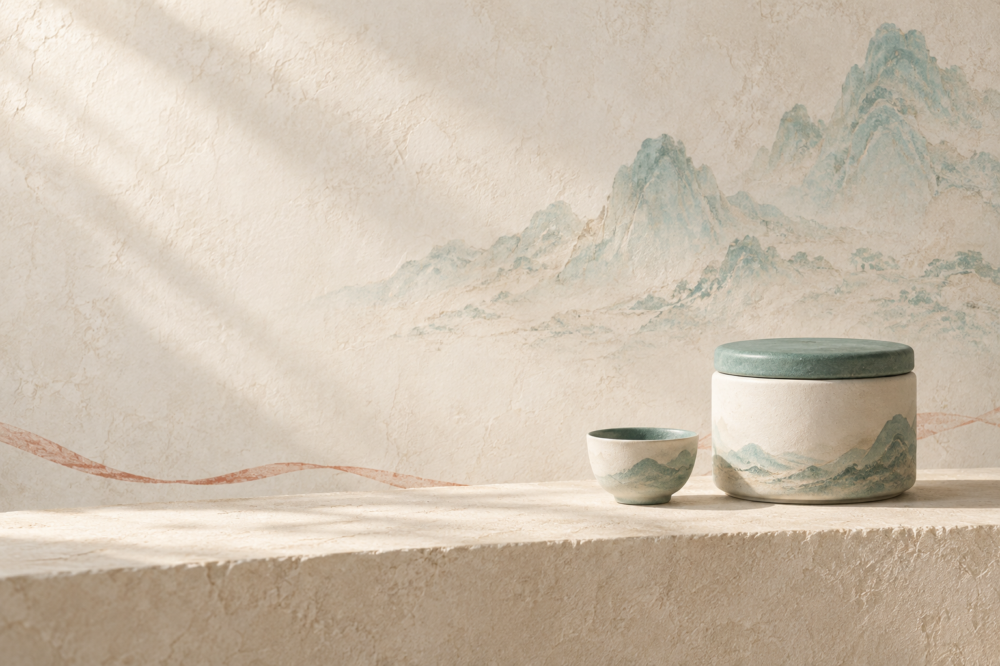
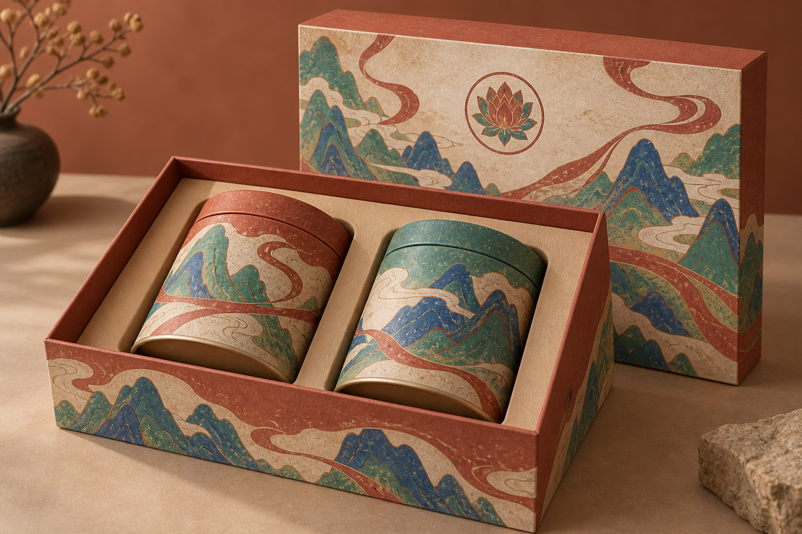
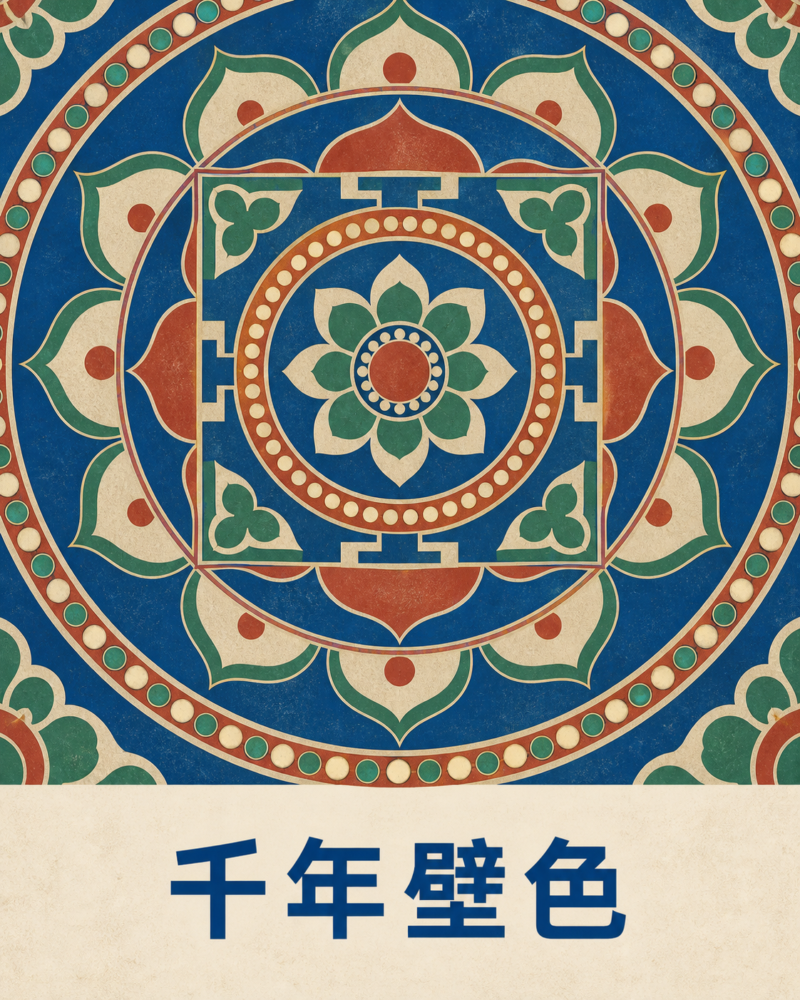
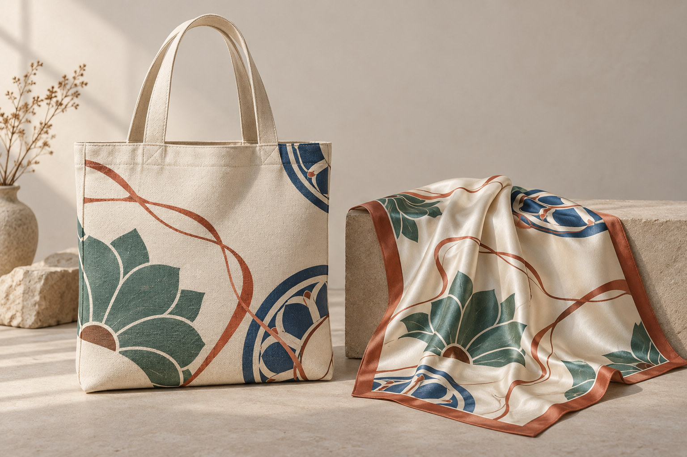
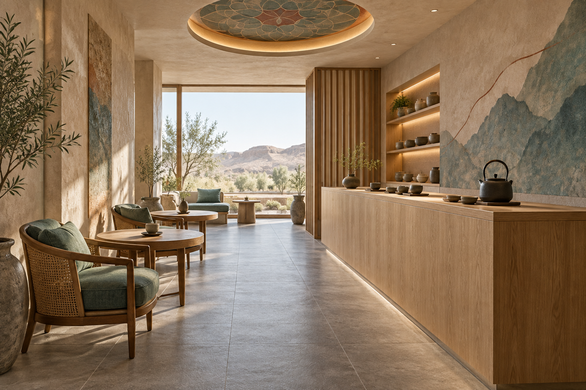
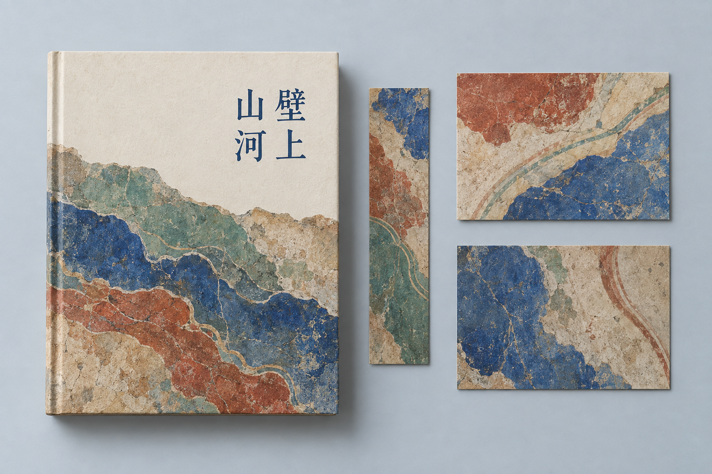

# 六个扩展方向：描述、效果与真实用途

2026-09-13，用户要求扩展方向的描述和实际效果。本轮用内置 imagegen 完成三次独立文生图，无参考图，每次保留首轮输出，未裁切、缩放、调色或后加文字。具体后端模型版本与 seed 未返回。三组均为本研究对原规则的扩展，不是上游已经内置的三个模式。

同日用户要求继续增加，第二批补充织物配件、现代茶空间和出版纸品，条件仍为每组一次文生图、无参考图与后期处理。以下累计六个方向；新增为第4–6组。

[本地扩展页面源码](../app/extensions.html) · [返回研究汇总](../README.md)

## 1. 清淡青绿：商品宣传与茶空间活动

- **描述：**以浅沙白、淡青绿和自然光替换黑色洞窟、强金光，保留矿物肌理、山形和陶瓷。目的在于安静、轻盈和适合文案排版。
- **实际场景：**茶叶上新广告、茶空间活动横幅、生活方式品牌宣传。正式使用需要真实产品原图、品牌文案及目标平台尺寸。
- **实际效果：**留白、柔和光线与单罐加杯子的构图成立；没有明显文字。敦煌特征变得含蓄，更接近广义东方青绿审美。
- **扩展边界：**主动覆盖原库暗底占比、洞窟空间和戏剧光线默认值，不是忠实保留默认风格。
- **输出：**1536 × 1024，严格 3:2。[实际提示词](extension-light-tea.txt)。

## 2. 平面壁画：礼盒与包装外观

- **描述：**将青绿山形、飘带和莲花纹样作为包装表面图案，不依赖洞窟背景。平面插画用于立体包装样机。
- **实际场景：**茶叶、香品、文创礼盒的设计提案，节日礼赠系列的外观方向沟通。
- **实际效果：**一个礼盒、两只茶罐和盒盖形成完整组合，盒身与罐身采用协调但不完全相同的图案。
- **扩展边界：**没有尺寸、刀模、出血、印刷分色、材质选型及打样记录，不能当作印刷文件或已验证可生产的结构。后续需设计师按真实包装重绘与打样。
- **输出：**1536 × 1024，严格 3:2。[实际提示词](extension-mural-packaging.txt)。

## 3. 藻井几何：展览海报与文化物料

- **描述：**从藻井提取同心、旋转和层层展开的几何秩序，用平面色块替代摄影式场景。这里是原创抽象，不对应某一真实洞窟。
- **实际场景：**展览海报、活动手册封面、票券和文创纸品的视觉方向。应用到完整活动前需加入日期、地点、主办方并重新分配版面。
- **实际效果：**几何纹样视觉明确，直接生成的“千年壁色”四字正确；样图不含真实活动信息。
- **扩展边界：**模型把纹样放大到约八成高度，未完全遵循上部三分之二与外围留白要求；圆珠带少量立体阴影，未完全平面化。栅格图片不是可直接修改路径的矢量文件。
- **输出：**1122 × 1402，接近 4:5，未做尺寸调整。[实际提示词](extension-caisson-poster.txt)。

## 4. 丝巾与手提袋：可穿戴的图案系统

- **描述：**简化莲瓣、圆弧与飘带，使图案适应丝绸褶皱与帆布平面，使用相同色彩但不同裁切。
- **真实场景：**博物馆文创、品牌礼赠、服饰联名和活动伴手礼的外观设计提案。
- **实际观察：**帆布粗织纹理与丝绸柔和光泽可辨认，丝巾自然垂落，两件物品视觉相关。模型额外加入了背景花瓶和枝条。
- **落地条件：**图中没有完整展示背面与提手连接，不构成缝制结构验证。需要另外确定尺寸、裁片、花型展开、接缝对位与面料印花打样。
- **输出：**1536 × 1024，3:2。[实际提示词](extension-textile-accessories.txt)。

## 5. 现代茶空间：把配色与肌理变成材料

- **描述：**将矿物色放到墙面和织物，将壁画肌理转为灰泥材料，将简化藻井用作局部吊顶设计。
- **真实场景：**茶馆、酒店茶室、文化体验店和品牌快闪空间的氛围沟通与室内概念提案。
- **实际观察：**茶台、座位、中央通道与自然采光关系清晰。模型增加了远端座位和小桌；吊顶图案明显大于提示词中的“小型局部细节”，未完全服从数量和尺度要求。
- **落地条件：**这是虚构概念空间，不是实景照片。家具尺寸、材料性能、灯光、设备和流线需要基于真实场地设计，本图不能作为施工依据。
- **输出：**1536 × 1024，3:2。[实际提示词](extension-tea-interior.txt)。

## 6. 艺术书与纸品：统一的编辑视觉

- **描述：**采用抽象矿物色面、斑驳纹理和中文竖排，将一套视觉应用到艺术书、书签与明信片。
- **真实场景：**展览图录、文化出版提案、艺术书封面和博物馆纸品套装。
- **实际观察：**一本书、一枚书签、两张卡片的数量符合要求；书名“壁上山河”正确，右列“壁上”、左列“山河”。纹样覆盖了书封的大半和卡片的几乎全部面积，超过需求中的克制留白与小面积细节。
- **落地条件：**虚构出版物，未提供封底、书脊信息、版权页、内页或印刷文件；正式制作需补齐编辑内容并依据成品尺寸重排。
- **输出：**1536 × 1024，3:2。[实际提示词](extension-editorial-stationery.txt)。

## 六组观察的共同边界

三张样图分别展示色彩与光线、实物载体、平面图形语言的扩展。变化来自本研究改写美术要求与外部图像模型的执行能力，不能全部归为上游原生能力。没有普通提示词与 Skill 的同模型对照，也没有商品保真或批量一致性评测。

第二批将探索延伸到织物、室内和出版。同样只证明可以生成外观方向，并未获得服装生产、空间施工或出版交付能力。示例中的产品、空间和出版物均为虚构。

本轮新生成素材独立标记来源，不直接套用上游 MIT 素材许可。机器记录见 [expansion-record.json](expansion-record.json)。
