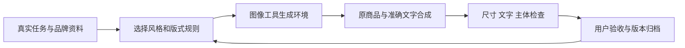

# 从视觉样图到可落地产品：对我们的经验与意义

> 归档结论（2026-09-14）：当前不继续扩展产品。库本身保留为美术风格规范、提示词组织与修图流程参考；下文方案仅为历史探索，不是已验证的产品机会或后续实施承诺。

> 更新（2026-09-13）：已实现 [品牌物料工作台](app/studio.html) 的本机合成原型，包括商品上传、准确文案、三套固定模板和三尺寸 PNG 导出，附三个历史产品模拟案例。下文完整产品范围仍是路线规划；AI 背景、品牌标识、项目保存、审核未实现，商业价值未验证。

**结论：适合作为垂直视觉产品的风格模块和流程参考，不能直接当作完整产品。** 下一步更值得验证的是“帮助用户完成一套合格物料”，而不是继续扩大画风数量。优先考虑单品品牌活动物料助手，其次是设计提案助手；已有稳定团队需求后，再考虑视觉规范执行工具。

本文是本研究的产品判断与待验证方案，不是上游路线图、已实现功能或已有客户需求。尚无用户访谈、付费记录、耗时对照或真实商品交付证据。

[返回研究汇总](README.md) · [产品落地展示页](app/products.html) · [六组视觉扩展](experiments/extensions.md)

## 一、当前实际具备什么

| 层次 | 已有事实 | 还不能据此声称 |
| :--- | :--- | :--- |
| 上游 Skill | 美术规则、提示词模板、编辑流程、看图清单、关键词检查器 | 完整出图服务、产品保真和自动质量保障 |
| 本研究演示 | 三张商业图、六张扩展图和一次局部编辑；原始提示词已保存 | 多尺寸同品牌一致性交付、真实商品适配、效率提升 |
| 当前网页 | 展示实测与提示词；新增商品上传、文案排版、两套固定模板、三种尺寸 PNG 导出 | 实时调用图像模型、自动抠图、项目保存、团队协作 |
| 图像工具 | 本次实际生成与编辑成功 | 后端模型版本、seed 或长期稳定性已掌握 |

## 二、三个可验证的产品方向

### 方向 A：品牌活动物料助手（优先验证）

**目标用户假设：**反复为同一批商品制作宣传图的小品牌运营、电商运营和设计服务团队。

**具体任务：**“这款茶罐上新，用已经确定的品牌风格，制作店铺横幅、竖版宣传图和方形社交图；商品不能变形，标题与活动信息必须正确。”

**建议流程：**

1. 收集真实产品原图、品牌标识、文案、品牌色和目标尺寸；标记必须保留的部分。
2. 选择一个已确认的风格包；Dunhuang Aura 只是其中一个可选包。
3. 生成环境 / 背景，保留真实商品为单独图层；必要时先抠图或人工处理素材。
4. 用排版工具叠加准确文字和标识，按真实像素尺寸合成，保留边距。
5. 为每种比例重新布局并检查主体，避免直接裁切导致商品被截断。
6. 输出文件和制作记录，经用户验收后保存为该品牌下次可复用的模板。

**最小版本范围：**一个商品、一套品牌资料、一个风格包、三种明确尺寸、可编辑文案、图片导出和人工验收。暂不做商城、自动发布、无限风格、复杂团队权限。

**上游可以复用：**风格规范、构图分支、文字政策和修图保留项。

**我们必须补齐：**素材处理、品牌资料、模型接入、图片与文字分层、精确导出、错误反馈和结果归档。保留商品图层可以减少模型重绘商品的风险，但抠图、合成光影和原图质量仍需校准。

**价值假设：**让运营人员少重复解释品牌要求、少返工，交付一套一致且可用的物料。是否成立需与现有人工 / 设计工具流程对照；当前没有节省时长或成本的数据。

### 方向 B：设计方向提案助手

**目标用户假设：**设计工作室、品牌设计师、文创项目经理。

**具体任务：**“为一个文创礼盒提供三个差异明确的方向，让客户能比较并选定方向。”

**建议流程：**读取需求 → 生成差异维度 → 每个方向提供效果图与适用解释 → 客户标记保留 / 排除项 → 汇总选择并生成设计任务单。

**最小版本范围：**一个项目、三个方向、统一比较结构、评审意见、导出提案。区别应明确，例如淡色 / 浓彩、平面 / 摄影、克制 / 装饰，不只是换一个主体或改颜色。

**上游可以复用：**把模糊评价转成具体动作、一次修改一个主要变量、保留已接受结果。

**我们必须补齐：**对比组织、评审记录、客户选择归档与提案导出。图像本身必须清楚标注概念边界。

**价值假设：**更快发现客户偏好，减少在错误方向上继续制作。最初可先作为服务团队内部工具验证，无需立即做公开订阅平台。

**限制：**文创礼盒、织物和空间图仍是视觉提案，不能承诺自动产出生产稿或施工方案。

### 方向 C：品牌视觉规范执行工具

**目标用户假设：**多人、多渠道、长期重复制作视觉内容的品牌团队。

**具体任务：**“无论谁制作，都使用批准的商品、标识、字体、配色和版式；审核时能看到哪里不符合要求。”

**建议流程：**建立品牌规范 → 明确可改项与锁定项 → 生成 / 编辑 → 规则校验 → 人工审核 → 保存批准版本供复用。

**最小版本范围：**单品牌规范包、批准素材、尺寸 / 文案规则、版本记录、审核状态。OCR 可以辅助发现错字；美术主次、文化语境和商品视觉还需要人工判断。

**上游可以复用：**视觉不变量、清单式验收、先批准主图再延展的流程。

**我们必须补齐：**品牌资料管理、图像级检查、例外处理、审核流与版本管理。上游关键词检查器不能承担这些职责。

**竞争与边界：**Adobe Express 已公开提供包含标识、颜色、字体、图形与模板的 Brand Kit，也提供模板风格限制。通用品牌资料管理并非空白市场。我们若进入，应验证某个具体行业的特殊流程、私有素材与交付要求，而不是只增加一个敦煌主题。[Adobe Brand Kit](https://experienceleague.adobe.com/en/docs/creative-cloud-enterprise-learn/cce-learning-hub/expressoverview/expresshowto/brand) · [模板风格限制](https://helpx-origin.aws116.adobeitc.com/express/web/brands-libraries-projects/create-manage-brands/template-control-overview.html)

## 三、这次实测带来的六条产品经验

| 实际观察 | 对产品设计的启发 | 可以落实的动作 |
| :--- | :--- | :--- |
| 指定 2560 × 1024，返回 1983 × 793 | 提示词不能代替精确尺寸控制 | 最终画布与导出尺寸由程序设置，逐张检查 |
| “千年壁色”正确，但字体未完全服从要求 | 正确短标题不等于稳定文字与排版 | 重要文字使用排版图层；图像模型主要处理视觉背景 |
| 删除飘带后，背景纹理也重绘 | 一次编辑可能改变用户已接受的内容 | 保存版本、缩小改动范围、对比关键区域，允许回退 |
| 礼盒、丝巾、空间外观看起来完整 | 好看的效果图与生产文件之间仍有工作 | 定义交付类型，区分概念图、成品宣传图、印刷稿和施工图 |
| 扩展到浅色或几何后与默认规则明显不同 | 增加场景要重新定义规则，不只是换名称 | 将配色、材料、构图与限制拆成可替换的风格配置 |
| 上游测试通过，但数量、留白仍有偏差 | 输入文本完整不代表输出正确 | 将提示词检查和图像验收分开，保存失败与返工原因 |

## 四、可复用的方法，实际很小但有用

这是一条建议产品流程，当前仓库没有实现全部节点。上游贡献主要集中在 B，以及 E 的人工检查内容；其余需要自己的产品与工程实现。

浏览器 Canvas 提供绘制与导出图像的基础能力，例如 `toBlob()` 可以将画布转换为图像文件；这支持本地排版导出的技术可行性，不意味着本项目已具备相应编辑器。[MDN 文档](https://developer.mozilla.org/en-US/docs/Web/API/HTMLCanvasElement/toBlob)

我们真正值得沉淀的是：需求结构、风格配置、明确的保留项、审核标准与可追溯版本。单份提示词容易替代，持续积累的批准素材和真实交付经验更难直接复制。

## 五、下一步怎样判断值得投入

建议先用真实单品完成一次完整物料交付，再决定是否扩成产品。以下是待执行验证方案，**没有声称已经完成**：

1. 选定一个实际品牌和单品，取得可用产品图、标识、文案与尺寸。
2. 沿用品牌现有制作方式完成基线，再用拟议工作流完成同一个需求。
3. 将双方准备与返工时间都计入，记录采用率、错字、商品变形、裁切问题、修改次数和模型调用成本。
4. 由实际使用者判断文件能否直接用于指定渠道，并记录还需手工处理的项目。
5. 再重复到若干个不同需求；先看能否稳定交付，而不是只看最好的一张。

### 继续与停止的条件

- 如果交付更稳定、返工更少，而且使用者愿意继续使用，再补齐模板复用与素材管理。
- 如果每张都需要专业人员大幅返工，先作为设计师辅助工具，不承诺自动交付。
- 如果需求偶发、单一风格容易被现有工具替代，保留成一个内部 Skill 即可，不必做独立产品。

## 对本项目的最终定位

**绘图技术创新较低；可借鉴的流程组织方式较明确；独立商业价值尚未验证。** 当前更适合作为我们构建“品牌物料助手”的一个风格插件和小规模验证案例。真实产品价值应由交付成功率、返工与复用效果证明，不能用累计生成图片数量替代。
