# 003 · Mountain Railway Diorama / 白鹭河谷

## V38 发布说明

当前发布包含此前仅在本地验证的 V29—V38，研究首页、实际场景、开发记录及真实图片一起发布。历史条目中的“未部署”保留当时状态，当前发布结果以 publishing.md 为准。V36 冻结包仍仅在本机保存。

## V38 · 冬季兔子与雪印（仅本地）

冬季安全空地加入至多两只兔子，随机停留嗅闻、缓慢转身和短跳。脚印在落地时从四足位置生成，贴合地表并约 75 秒淡去；固定容量避免不断累积。活动避开铁路、水面、站房、树干和岩石，地形不合适时数量减少。

**查看：编辑场景 → 动物与栖息地 → 近看冬季兔子与脚印。** 按钮会切到冬季，保留暂停状态；可独立开关并随方案保存。当前是冬季生态展示，尚未实现全年兔子活动、狗、洞穴或人物互动。本轮仅本地，V36 冻结版不变。

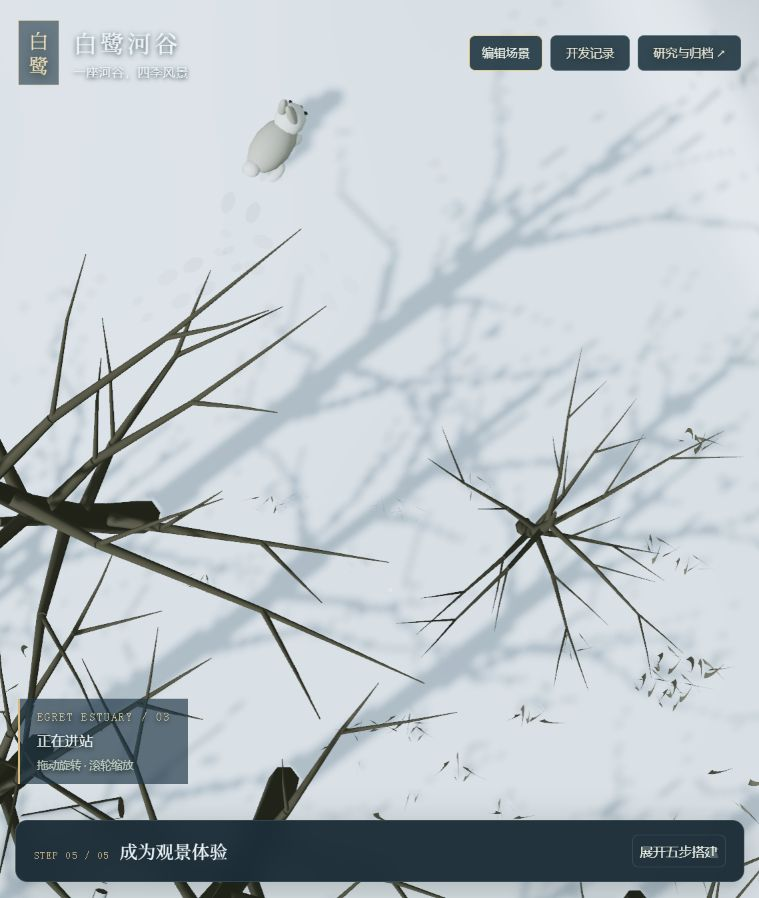

## V37 · 叶簇分型与花形层次（仅本地）

近景叶簇改为四块共享图集，区分细长、宽叶与圆叶排列；按树种及实例分配，不重排树木。可见叶片与投影使用相同坐标，继续沿用四季显隐与风动。花朵增加五瓣、八瓣、六瓣比例和少量基生叶，蝴蝶停栖高度保持兼容。

**查看：编辑场景 → 动物与栖息地 → 近看花间蝴蝶。** 仍是风格化叶簇曲面，不是逐叶真实建模。V36 本地冻结包保持原样，本轮不提交、不推送、不部署。

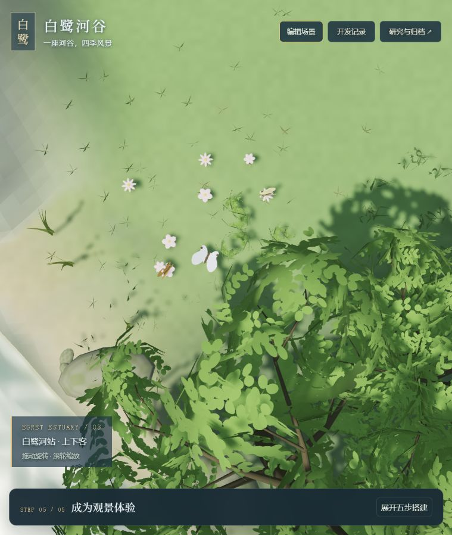

## V36 · 花丛过渡与阶段冻结（仅本地）

当前版本形成了可体验的微缩场景原型：地形与三种构图、四季天气、水流与植被、列车与站房、人物上下客、鸟鱼鸭与季节蝴蝶，以及环境声音和 MiniMax 播报。本轮在花丛外围加入不规则疏草和低对比土色，随季节转色、随风轻动，冬季收起。没有改写原有水面或树叶。

**查看方式：编辑场景 → 动物与栖息地 → 近看花间蝴蝶。** 用“重新分布”观察不同位置。冻结说明见归档文档，开发记录保留修改前后和季节实景。本轮不提交、不推送、不部署。

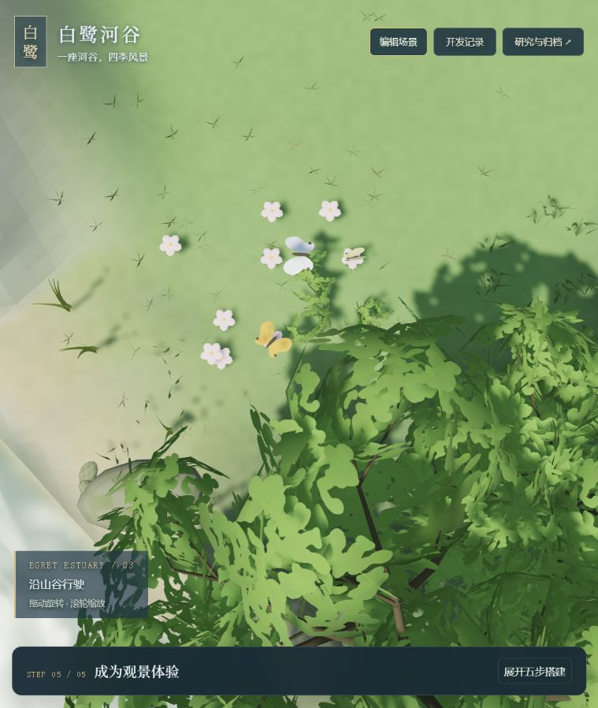

## V35 · 花丛与季节蝴蝶（仅本地）

在适合的平缓空地分散生成小花丛，蝴蝶随机选择花朵，完成短途飞行和停栖。最多五处花丛、十五只蝴蝶，实际数量受地形与已有物体限制；避开铁路、站房、水面和岩石。春夏较多、秋季少量、冬季隐藏；夜间、雨天或强风时减少起飞，已起飞的蝴蝶落花后休息。

操作：**编辑场景 → 动物与栖息地 → 近看花间蝴蝶**。可开关、重新分布，并将分布种子随场景方案保存。近看按钮保留当前季节和暂停状态；冬季没有蝴蝶，暂停时动作也停止。

104 项自动检查通过，涵盖随机分布复现、位置约束、连续访花、起落转向、暂停、季节天气与方案兼容。该效果为通用微缩蝴蝶样例，尚未实现跨花丛迁飞、繁殖、捕食或其他陆生昆虫。**仅本地，未提交、未推送、未部署。**

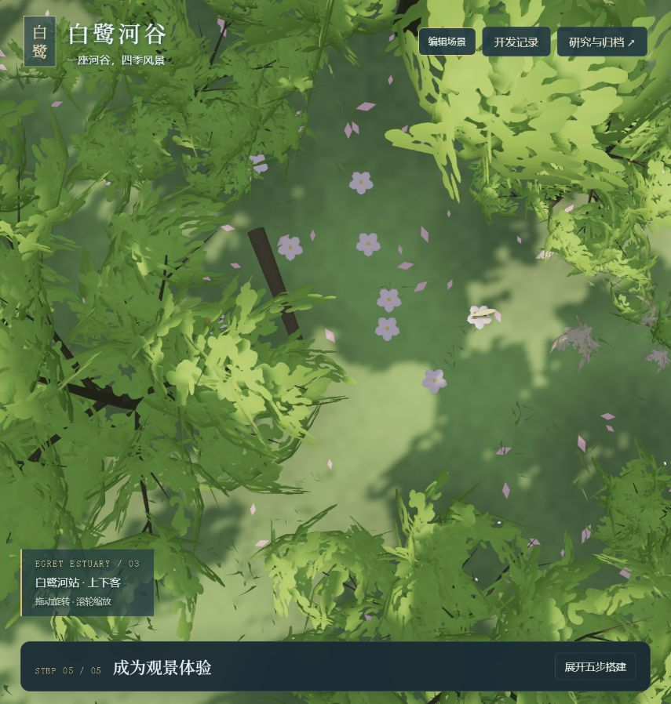

## V34 · 站房内外与门口通路（仅本地）

站房由实心方块改为有厚度的墙、真实门窗开口、候车室和值班室。站台侧保留候车室入口；原来朝向岛边的后门移至入口侧端墙，作为值班室出口，通过有护栏的平台接回站台。拆除临崖窄道和旧后门；雨棚中柱移到门两侧，避免挡路。

在 **编辑场景 → 车站生活** 使用 **查看候车室与值班室**、**查看站房背面与侧门**，可揭顶并打开两扇门。内部设座椅、办公桌和分区照明。人物尚未进入站房，未提供室内寻路或办票流程。

100 项自动检查通过：三种构图门口开闭、内部通道、侧门平台接续、地板、窗户、夜灯与既有场景回归。开门和揭顶属于临时观察，不单独存档；观察机位可保存。**本轮未提交、未推送、未部署。**

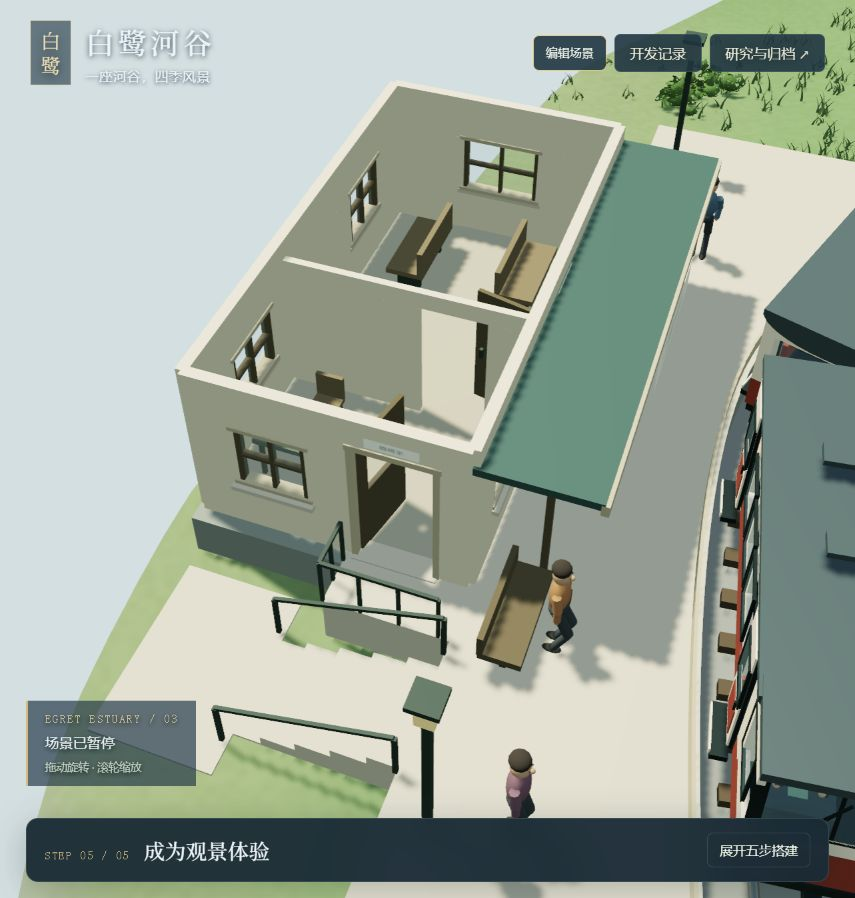

## V33 · 车头、司机与 MiniMax 播报（仅本地）

车头加入斜面挡风玻璃、前灯、雨刷、控制台和坐姿司机。车身侧窗与车门窗是真实开口上的透明玻璃，可看到车内；司机随列车移动，雨刷随降雨工作。保持微缩场景风格，尚非具体车型的工业复刻。

- **编辑场景 → 车站生活 → 近看车头与司机**：停靠并暂停近看。继续场景后恢复运行。
- **天气、列车与镜头 → 场景声音 → 开启声音**，再点 **演示到站上下客**：听 MiniMax 生成的中文到站及关门提醒。每次停站各触发一次，有独立播报开关。
- 风、水、雨与轮轨仍是本地合成音，狗叫等音效尚未接入。乘客仍站立乘车；司机动作与控制台操作为简化程序动画。

96 项自动检查通过，浏览器可见车内司机并成功加载两段 MP3；听感尚待用户试听。配置留在仓库外，浏览器只读取音频成品。**未提交、未推送、未部署。**

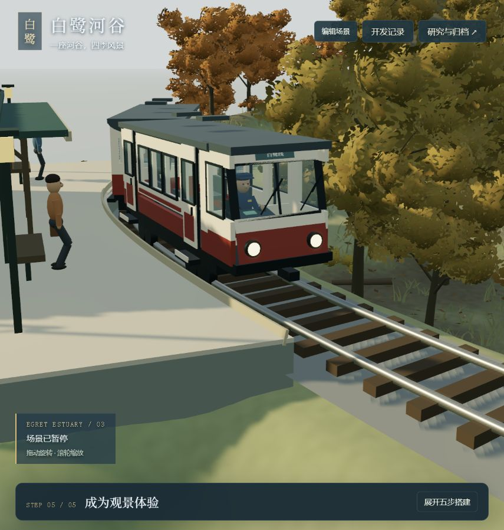

## V32 · 人物与列车、场景声音（仅本地）

列车停稳开门后，列车员下车看护，一位乘客完成上下车，列车员回车并关门后才能发车。另两位人物继续站台生活。真实门洞与滑动门片取代贴在实心侧壁上的门；乘车人员随车移动，当前为站立乘车。

**车站生活 → 演示到站上下客** 可直接观察，按钮会主动停靠并运行流程。**天气、列车与镜头 → 场景声音 → 开启声音** 可听风、水、雨与列车合成音；支持总音量、分类开关、距离衰减和左右声像，默认静音。还没有狗叫或清晰对白。

92 项回归检查通过；真实音频输出已检测，音色自然度尚待听感评估。细节、实景与限制见开发记录。**未提交、未推送、未部署。**

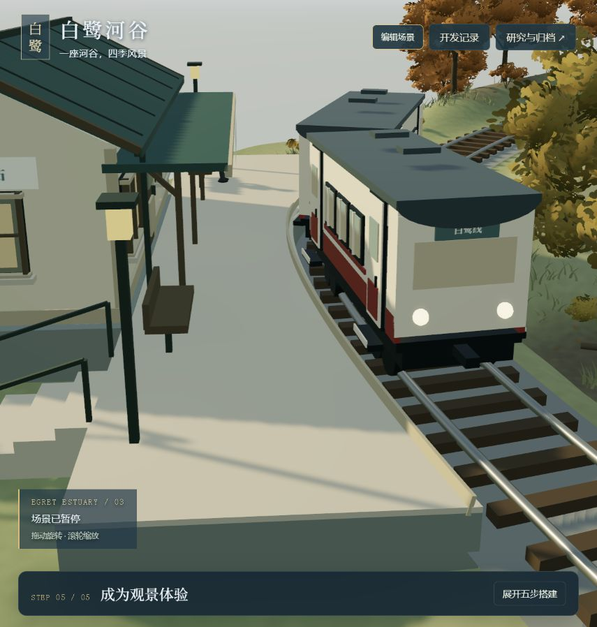

## V31 · 车站生活样例（仅本地）

新增四位旅客，在站台、长椅与入口活动：步行、候车、坐下休息和起身离开。脚步按台阶高度落地，停步收脚，转向有速度限制；雨天在露天撑伞，遮棚下收伞，冬季加围巾。人物开关和机位可随场景方案保存。

操作：**编辑场景 → 车站生活 → 近看站台人物**。这是少量人物的程序动画样例，还没有上下车、车门联动或全场景导航。89 项回归检查通过，末次人物微调又通过 3 项定向检查；实景与限制见开发记录。**未提交、未推送、未部署。**

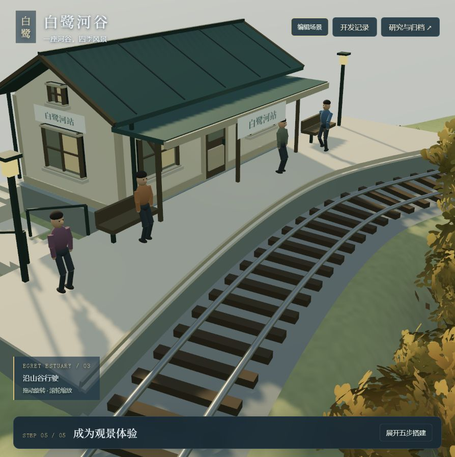

## V30 · 连续航迹与初冬薄冰（仅本地）

白鹭会飞离河谷，在岛外连续飞行后从远处回来，整段航程通常约两三分钟。观察机位留在河谷；不会用近景隐藏与重生代替远行。所有曲线连接处共享切向，并按实际路程前进。鱼鸭转向有角速度和角加速度限制，停留时也逐渐收住旋转。

冬季采用**岸边浅缓水结薄冰、河心与跌水保留开水面**的初冬规则。冰区水面起伏受抑制；鸭子读取同一冰区规则，岸上休息、水中避开冰缘；鱼保持水下慢游。水色和透明混合不变。尚未提供温度历史、冰厚、破冰或全河封冻。

在本地场景的“动物与栖息地”选择 **观察白鹭飞离与返回**。本轮未提交、未推送、未部署。

## V29 · 动物行为重建（仅本地）

白鹭新增停栖、起飞、巡飞与降落，收翼和伸腿随阶段变化；野鸭新增游泳、停留、靠岸、上岸、短距离行走和下水；鱼群独立选点，交替缓游、悬停与短促游动，并作邻近分离和弱对齐。沿实际岸坡选择通道，避开铁路、树干和大块岩石。风、四季与昼夜继续参与行为。

本轮没有更改水材质、透明度或桥梁。局部岸石为上岸通道和短距离活动区让出空间；分流石保留。**未提交、未推送、未部署，线上仍为此前版本。**

本地打开 `http://127.0.0.1:8034/app/dist/scene.html`，进入 **编辑场景 → 动物与栖息地**，使用“跟随野鸭游泳与上岸”“跟随白鹭飞行与落地”“俯看水下鱼群”。行为需要时间发展，各只动物不会同时动作。

这是有约束的程序动画，尚无觅食、捕食、受惊逃离或完整生态系统；选点使用可复现的伪随机数。没有安全岸坡时减少动物数量。细节见开发记录。

## V28 · 修复水色、动物运动与石桥

降低 V26 引入的透底程度；鱼鸭改成独立选点、停游与平滑转向，保留身体间距；蜻蜓不再匀速绕圈。修复石桥上突出轨面的长石块，桥面按轨道曲线水平铺设。可通过 **水下鱼群、岸边睡莲、浅色拱桥** 三个机位检查。

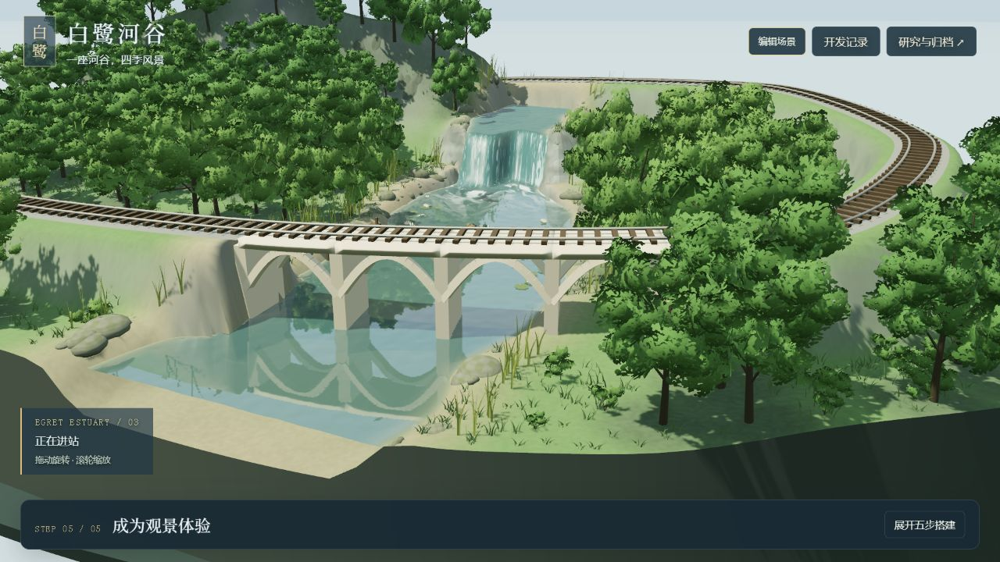

仍为规则驱动的景观原型，白鹭航线和真实生态行为尚未重做。

## V27 · 岸边睡莲与蜻蜓

在现有鱼、白鹭和野鸭之外，新增岸边浮叶、春夏睡莲与小蜻蜓。打开实际场景，选择 **编辑场景 → 动物与栖息地 → 近看岸边睡莲**；春夏适合看花，秋季转色，冬季休眠。开关可随方案保存。

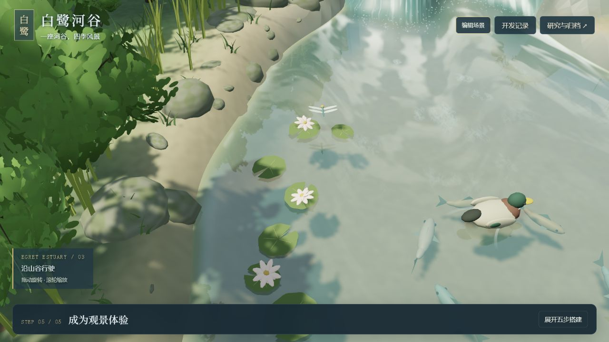

采用固定栖息区与季节动画，不是完整生态模拟。开发过程与验证见[开发记录](development-log.md)。

## V26 · 水下鱼群

V26 加入七条真实水下鱼：摆尾、转向、分层游动，冬季与夜间减速。平缓水面透出水下模型，鱼保留深度遮挡；厚水层、雨天和强反光降低可见度。

打开实际场景 → **编辑场景 → 动物与栖息地 → 俯看水下鱼群**。鱼群可独立隐藏，开关和机位会随方案保存。平缓水域新增透明混合，会显露河床并改变水色；当前仍是规则动画，没有觅食或群体避让。

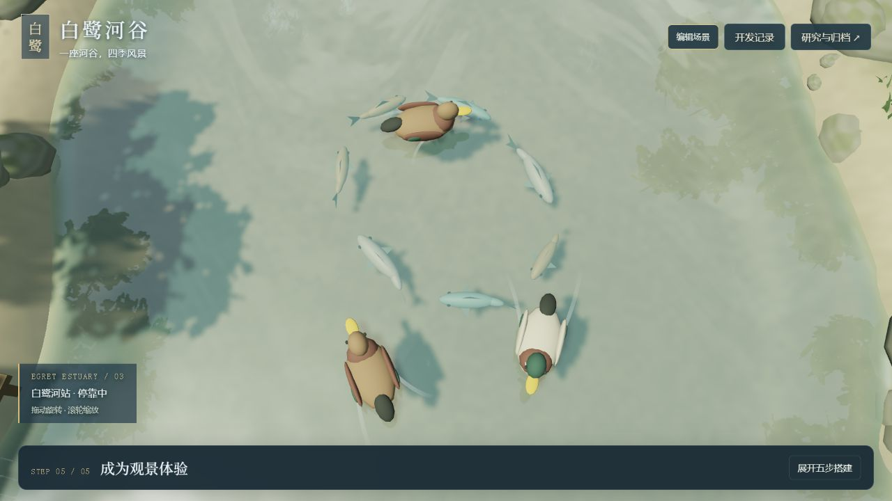

## V25 · 动物与风

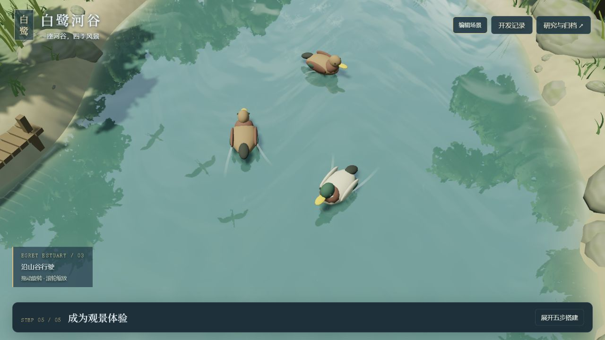

V25 新增林缘白鹭与缓水野鸭：飞行、扑翼、转向、贴水游动与尾迹，读取现有风力、风向、阵风、季节、昼夜和雨量。属于规则驱动的动物表现，尚无完整生态模拟。

操作：**编辑场景 → 动物与栖息地 → 近看水边野鸭 / 观察林缘白鹭**；展开“风与水的关系”调整风力和风向。夜间飞鸟退场，野鸭减速。隐藏动物的选择及两个观察机位随场景方案保存。

[▶ 在线体验 V23 固定归档版](https://yydshly.github.io/0913_codex_project/003-mountain-railway-diorama/archives/v23/scene.html) · [当前持续更新场景](https://yydshly.github.io/0913_codex_project/003-mountain-railway-diorama/scene.html)

[列车与站房实景研究](train-station-research.md) · [研究与归档入口](https://yydshly.github.io/0913_codex_project/003-mountain-railway-diorama/archive.html)

[V23 归档与技术原理](archive.md) · [在线原理说明](https://yydshly.github.io/0913_codex_project/003-mountain-railway-diorama/archive.html)

**研究一个山间铁路微缩作品，并把理解落到可操作的网页场景。** 本项目固定版本研究原作 Yamaai（山あい），另以景区观景展示为用途，独立重建“白鹭河谷”：调整地形与河道，切换四季和光线，观察风、树木、水流如何共同变化。

*2026-09-14，V24 在本地浏览器中的实际画面，1280×720；独立重建原型，不是上游截图或生成图。*

[研究分析](https://yydshly.github.io/0913_codex_project/003-mountain-railway-diorama/) · [实际场景](https://yydshly.github.io/0913_codex_project/003-mountain-railway-diorama/scene.html) · [开发过程](https://yydshly.github.io/0913_codex_project/003-mountain-railway-diorama/dev-log.html) · [先看实际能力](capabilities.md) · [启动并操作](app/README.md#运行) · [看实现过程](development-log.md) · [看现有问题与下一步](next-steps.md) · [看上游原作](https://iamtechartist.github.io/mountain-railway-diorama/)

## 三分钟理解这个项目

| 想了解什么 | 从哪里看 | 可以得到什么 |
| --- | --- | --- |
| 最终能做什么 | 本页实景与 [能力清单](capabilities.md) | 已实现、已验证和未完成部分分开说明 |
| 如何体验 | [打开在线场景](https://yydshly.github.io/0913_codex_project/003-mountain-railway-diorama/scene.html)，也可按 [运行说明](app/README.md#运行) 在本地启动 | 调整地形、四季、风力与水流，直接观察三维变化 |
| 怎么实现的 | [技术笔记](notes.md) 与 [开发记录](development-log.md) | 从空间函数到材质、动画、灯光和验证的实现依据 |
| 还差什么 | [提交后实景分析](next-steps.md) | 有截图依据的画面问题，以及保存/比较/空间创作路线 |

首次体验建议：先在“层峦溪谷”切换春夏秋冬；再选择“水流近景”比较三种水流；最后调整河宽、地形起伏和风力，观察地面、植被与水面联动。GitHub 中的 HTML 链接是源码浏览入口，运行方式见上方说明。

## V24 · 列车与站房的空间衔接

曲线站台沿轨道布置，基础随地形接地，入口配有台阶与扶手；两节车的停车位置和踏步与站台对齐。补齐车门、窗框及站房端墙、背面、檐口、站牌，延用四季覆雪与夜间照明。

体验方式：打开实际场景 → 编辑场景 → 天气、列车与镜头 → **列车到站近看**。此操作主动移车并暂停；点击“继续场景”恢复运行。

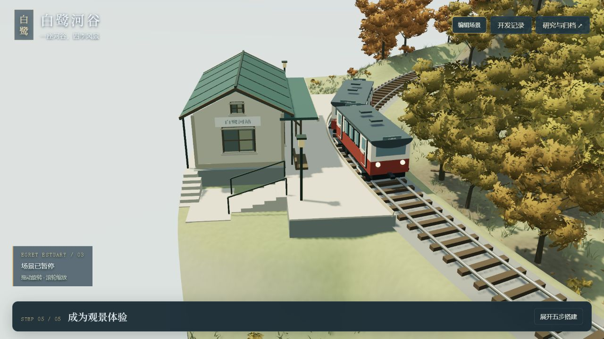

[本轮开发记录](development-log.md) · [从研究到实现](train-station-research.md)。V23 固定归档保持原效果。

## V23 · 河流跌口与岸坡的局部衔接

调整连续跌水两岸的收束、坡肩和岩面层次，并修复低地形、宽河道、高落差组合的水网格外缘包覆。58 项检查通过，四季与其他水流模式已做代表实景检查；整体自然感仍有提升空间。

| 当前版本修改前 | 本轮修改后 |
| --- | --- |
| 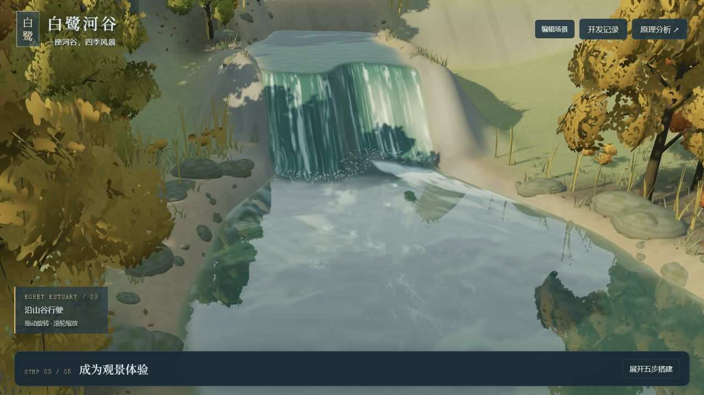 | 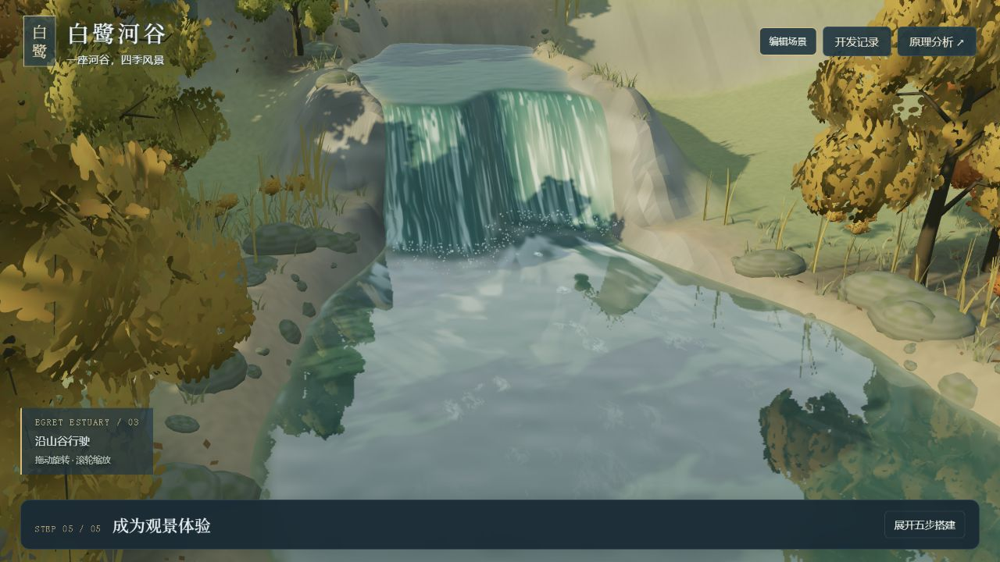 |

1280×720 同机位真实截图，动画帧不同。[本轮实现、修复与验证](development-log.md#v23--河流跌口与岸坡的局部衔接)。

## V22 · 当前水流的细水丝与入潭冲击

以本轮修改前的当前场景为对照，细化下落水丝、减轻厚重绿面，并让入潭翻白不再被倒影削弱。关闭白沫仍保留水丝；夜景随环境光变暗，浅滩不显示瀑布式水丝。地形和岩石布局未改变。

| 本轮修改前 · 春季岩间分流 | 本轮修改后 · 同一机位与设置 |
| --- | --- |
| 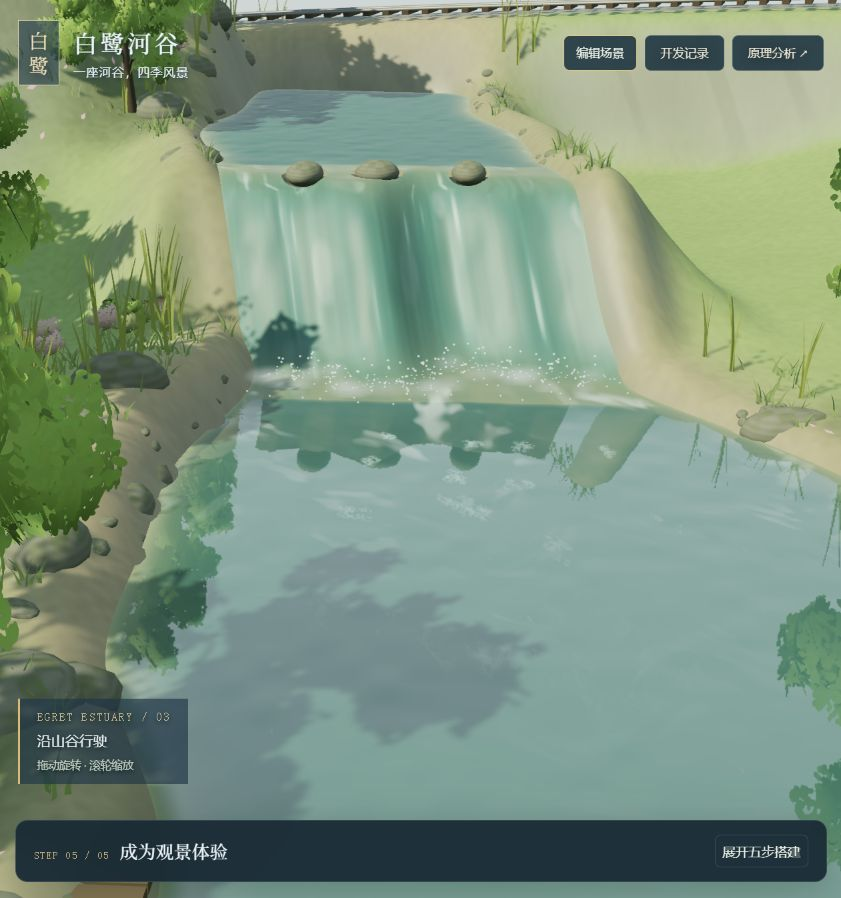 | 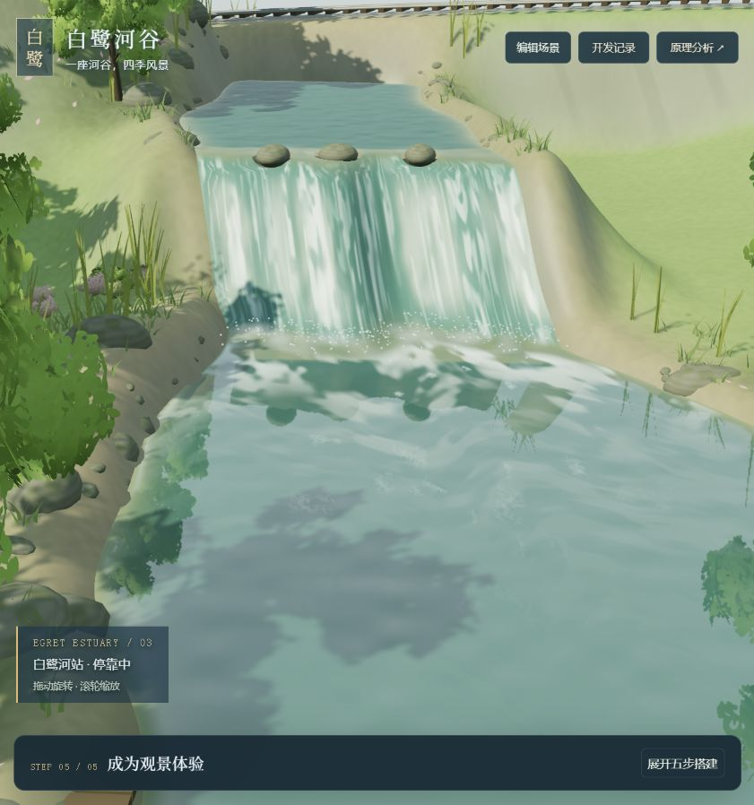 |

841×898 真实截图，动画时刻不同。水流更易辨认，但当前岸坡与分流结构仍有限制。 [水流控制、四季及验证记录](development-log.md#v22--当前水流的细水丝与入潭冲击)。

## V21 · 连续跌水与岸坡衔接样件

针对当前近景的规则水帘与光滑槽岸，调整局部跌口错位、河床收束和坡肩过渡；落水点、飞溅与白沫共用轮廓。保留无挡水石的连续水路，其他两种水流维持原形态。

| 修改前 · V20 | 局部形态样件 · V21 |
| --- | --- |
| 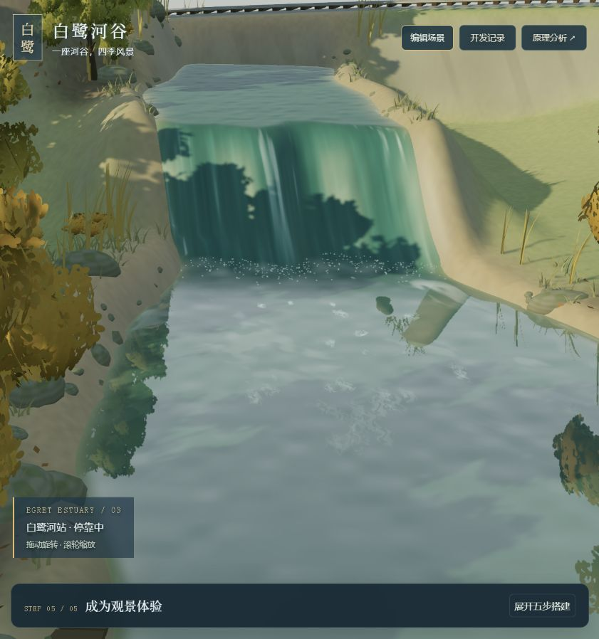 | 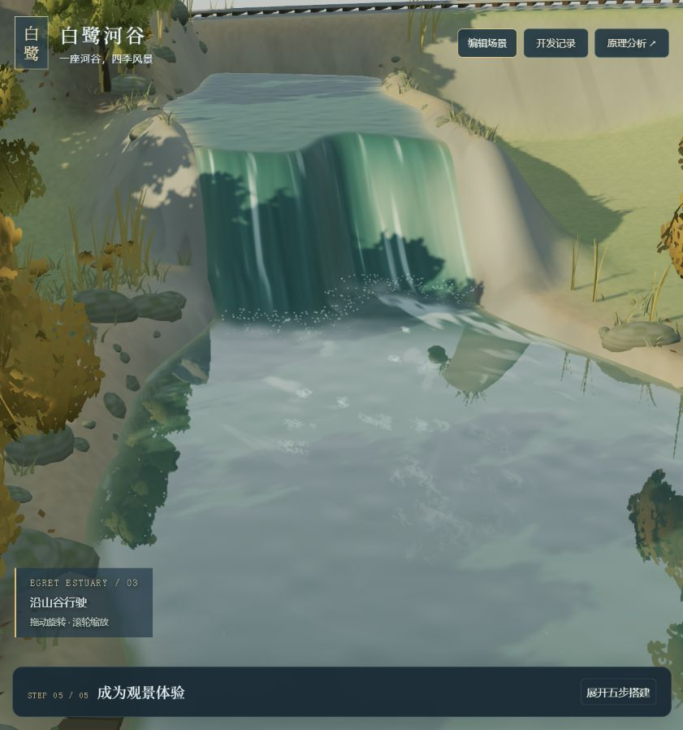 |

同一层峦溪谷、秋季推荐光线与水流近景，841×898 真实截图。**跌口变化可见，但岸坡仍偏光滑、整片水帘感仍存在，不能把样件等同于自然感目标完成。** [四季和回归实景](development-log.md#v21--连续跌水与岸坡衔接样件)。

## V20 · 山后坡面的草土与露岩分区

从“山后坡地”观察：较陡的干燥坡面增加连续的岩色与土色分区，缓坡保留草地，河岸与铁路近旁淡出。复用原有四季颜色与覆雪，不增加物件，不移动树木，也不改变地形高度。

| 修改前 · V19 | 修改后 · V20 |
| --- | --- |
| 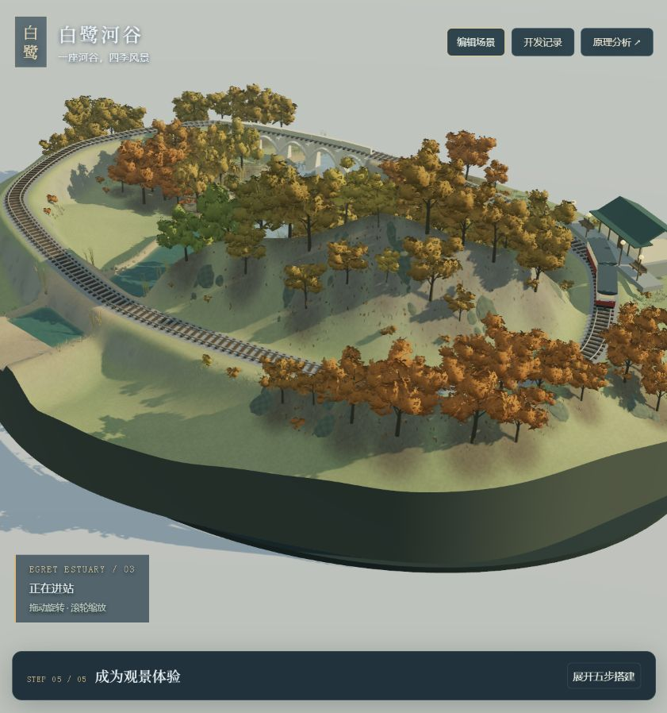 | 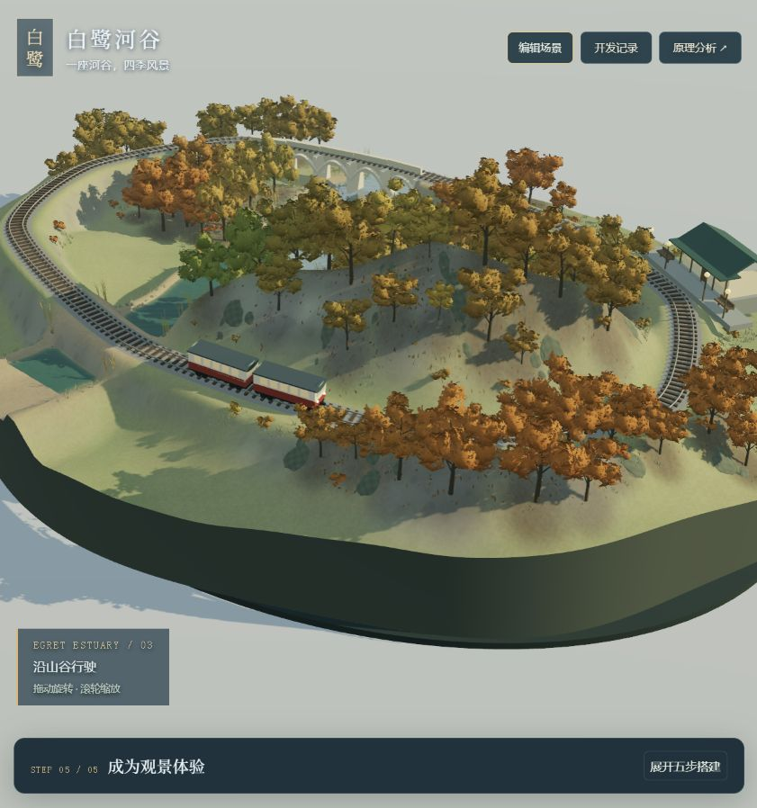 |

同一层峦溪谷、秋季推荐黄昏与山后机位，841×898 实际浏览器截图；树影、风和列车时刻不同。改动保持柔和风格，仍未建立侵蚀、地质或自由雕刻系统。[四季与验证记录](development-log.md#v20--山后坡地的草土与露岩分区)

## V19 · 白沫从圆片变为破碎薄片

保持连续跌水默认 50% 白沫、秋季推荐黄昏与同一机位，只改变白沫形态：落水处成组出现，沿流向伸展，下游逐渐散开。保留原落点、生命周期和水石布局，并扩大薄片避石检查范围。

| 修改前 · V18 圆片轮廓 | 修改后 · V19 破碎薄片 |
| --- | --- |
| 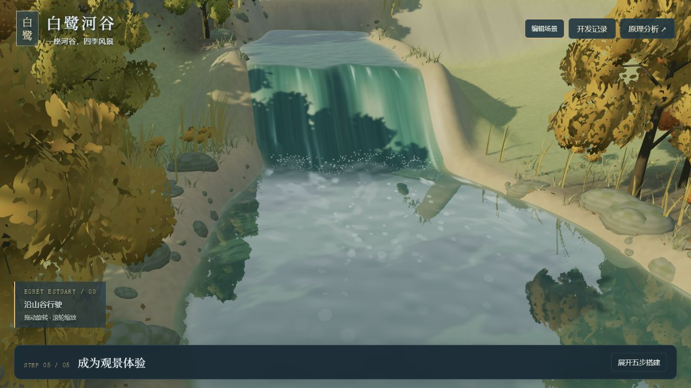 | 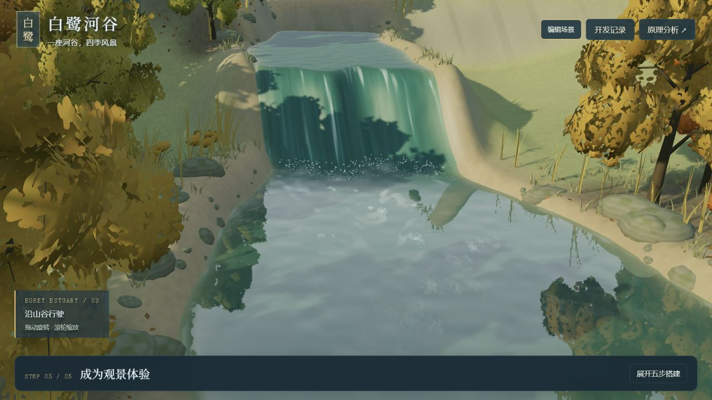 |

两张均为真实浏览器截图，1280×720；配置与镜头一致，风与水流时刻不同。可在“水流近景”将白沫降到 10% 或关闭，查看更克制的表现。跌水整片帘面感仍待打磨，当前也不是真实流体模拟。[完整过程及四季、夜雨实景](development-log.md#v19--白沫薄片轮廓与成组消散)

## 历史 V17 实景导览：从全景到细节

| 水流近景 · 看跌水、白沫与倒影 | 山后坡地 · 看主镜头之外的地形与植被 |
| --- | --- |
|  |  |

同一 V17 基线、秋季推荐黄昏、连续跌水默认参数，1280×720；不同机位和动画时刻，点击图片查看原图。其中圆点状白沫已在 V19 调整；部分均一坡面和重复树群轮廓仍待打磨，详见 [实景分析](next-steps.md)。四季与其他水流模式的真实对照保留在 [V17 开发记录](development-log.md#v17--跌水流动层次与落点一致性)。

**当前定位：**适合程序化景观研究、主题场景试作和交互观景展示；已经能调场景，但还不是完整创作工具。V18 已支持命名方案、本地保存、刷新恢复、文件导入导出与同机位比较；未实现任意地形雕刻、自由绘轨或真实流体。57 项自动检查通过，不代表画质已经达到原作。

## 来源与版本

Yamaai 是具有完整视觉表现的具体作品；本地“白鹭河谷”是独立重建，两者能力和截图分别标注。

| 项目 | 内容 |
| :--- | :--- |
| 固定编号 | 003 |
| 原始仓库 | [iamtechartist/mountain-railway-diorama](https://github.com/iamtechartist/mountain-railway-diorama) |
| 原作者 | iamtechartist；许可证署名 Techartist |
| 发现渠道 | 用户提供的 GitHub 仓库链接 |
| 上游许可证 | MIT，见 [许可原文](assets/upstream-LICENSE.txt) |
| 研究版本 | `6e8b0fbb806e486d7819b6d297b92f4ecf3d258b`；package 版本 `2.2.0`，未以 release tag 定位 |
| 研究日期 | 2026-09-14（Asia/Shanghai） |
| 进度 | 已总结：固定版本研究完成；独立场景升级为“白鹭河谷”，新增四季主题、地形编辑、共享风场与水面反射 |
| 技术栈 | 原生 JavaScript ES Modules、Three.js r185、WebGL 2、GLSL、HTML/CSS；Node.js 检查与构建；Python 本地服务 |
| 上游演示 | [Yamaai](https://iamtechartist.github.io/mountain-railway-diorama/)，已在浏览器打开验证 |
| 本研究项目演示 | [在线场景](https://yydshly.github.io/0913_codex_project/003-mountain-railway-diorama/scene.html) · [原理分析](https://yydshly.github.io/0913_codex_project/003-mountain-railway-diorama/index.html) · [开发记录](https://yydshly.github.io/0913_codex_project/003-mountain-railway-diorama/dev-log.html)；2026-09-14 发布后已检查场景加载 |

[当前能力基线](capabilities.md) · [返回总索引](../../README.md#项目索引) · [真实场景源码入口](app/scene.html) · [交互分析网页](app/index.html) · [网页运行说明](app/README.md) · [开发与优化记录](development-log.md) · [源码与验证笔记](notes.md) · [扩展方向](extensions.md) · [图片来源](assets/README.md)

## 实践演进：“白鹭河谷”四季场景

以河岸观景铁路为使用场景，独立构建开阔河口、低矮河岸、细碎叶簇、芦苇、浅色拱桥和跌水。网页可直接调整地形起伏、河道宽度与弯曲、水位落差和树木数量，河床、岸线与植被随之重建。

风力、风向与阵风共享到枝干、叶片、芦苇、水纹和雨丝。水流速度单独控制；下游水面新增定时更新的真实场景倒影。三种基底可以快速切换，五步搭建仍可展开查看。新增花瓣、落叶、夏夜萤火、可调降雪与雾量，以及春、夏、秋、冬四套主题，在固定布局与同一机位下比较嫩叶花树、浓绿树冠、错落秋色、裸枝覆雪及水体与光照变化。

*历史 V3 截图，用于说明四季主题的实现起点；当前效果见本页顶部。*

这是一份重新编写的风格化原型，仍使用固定闭合轨道，未提供任意地形雕刻、真实流体或树木力学。没有声称画面细节已达到原作。使用入口、文件分工与验证范围见 [应用说明](app/README.md)。第一版“雾溪山线”的截图与记录保留用于对照。

## 用网页理解如何实现相似效果

新增交互分析页，围绕“输入 → 计算 → 输出”拆解八项能力。可切换原作截图标记、调节教学参数，并按六阶段路线生成带交付物与验收要求的实施任务。实验包括曲线采样、进站制动、环境联动、镜头避地形与性能预算。

这份网页用于驱动分析和实施规划，参数作用于教学模型，不直接控制原作 3D 场景。完整启动方式和验证范围见 [app/README.md](app/README.md)。

## 研究目标

- [x] 核实能力、技术原理、实现效果和适用场景。
- [x] 固定 commit，运行上游检查与构建，记录真实结果。
- [x] 本地加载固定版本并保存场景截图。
- [x] 提出扩展方向，区分已实现功能与未来设想。
- [ ] 实施配置化或导览改造。
- [ ] 跨设备性能和移动端完整交互测试。

## 上游核心能力

| 能力 | 已有实现 | 边界 |
| :--- | :--- | :--- |
| 微缩场景 | 山体、峡谷、桥梁、隧道、车站、神社、植被、河流、瀑布 | 布局由代码预设，无可视化编辑器 |
| 自动列车 | 两节编组闭环运行、弯道减速、进站制动、停车与出发 | 简化运动控制，未提供多车调度 |
| 环境变化 | 白天、黄昏、雨天、夜晚；雨量和风力调节；材质与灯光联动 | 美术预设，不接入实时天气 |
| 用户观察 | 旋转、缩放、平移、暂停、0.25×—1.8×列车速度、12 个视角选项 | 主要面向观看，没有游戏任务系统 |
| 自动运镜 | 依据列车进度选择过桥、出隧道、到站等构图，平滑移动 | 编排规则，没有 AI 镜头生成 |
| 静态运行 | 运行依赖随 `vendor/` 提供，HTTP 加载 ES Modules | 需要 WebGL 2，无业务后端 |

源码入口及固定版本链接见 [模块地图](notes.md#模块地图)。

## 上游技术原理

### 程序化建模

高度函数组合山峰、山脊和起伏，生成带顶点颜色的三角网格。铁路附近整平，河谷降低地形，站台形成平台。隧道口裁剪网格留出实际通道，内部沿线路生成连续拱形结构。

轨道采用闭合 Catmull–Rom 曲线，钢轨截面沿曲线扫掠，枕木和桥梁构件重复布置。固定随机种子负责细节变化，空间规则让植被避开轨道、建筑和关键视线。这是预设布局与程序化细节的组合，不是任意地图的自动生成器。

### 列车路径运动

以累计行驶距离采样轨道，利用前后采样点计算车身方向，转向架独立对齐局部切线。目标速度受弯道与进站距离约束，加减速度限制使运行平滑；到站约停留 6.2 秒后继续。它服务于展示，未实现完整铁路车辆动力学。

### 水体、天气与材质

河面贴合河床边界，深度影响透明度和颜色；Shader 噪声、法线扰动、泡沫、雨滴涟漪和反射营造流动感。瀑布单独建模。雨丝、薄雾、萤火虫和落叶通过批量几何与时间驱动动画实现。水流与天气属于视觉模拟，不是流体或气象求解。

### 灯光与镜头

共享状态驱动时间、风、湿度、夜色和日光。环境切换同时插值天空、雾、光照、曝光与材质。车灯、灯笼、车窗结合 HDR 高光和低分辨率 Bloom。自动镜头按列车进度选择视角，在移动中采样地形高度以减少穿地。

### 性能优化

重复物体使用几何合并和实例化；树木、道砟按距离切换细节层级（LOD）；阴影和反射限制更新频率；GPU 计时可用时根据持续压力调整像素密度。低分辨率 Bloom 限制光晕成本。具体参数与限制见 [研究笔记](notes.md)。

## 上游实现效果

以下图片来自固定 commit 的本地运行，未使用图像生成或视觉修饰。整体呈现秋日微缩模型风格：切面岩石、深绿与金红植被、跨峡谷钢桥和多级瀑布共同形成层次。

截图来源和未采集范围见 [图片目录](assets/README.md)。截图只证明单帧视觉表现，不能单独证明流畅度或长期稳定性。

本次上游检查通过：21 个模块、52 个导入、198 个网格几何数值检查、36 条隧道净空射线、6 项物件支撑检查，以及模拟 250 秒内 3 次停车。构建产生 24 个静态文件及额外 manifest。详细输出见 [本次验证结果](notes.md#本次验证结果)。

上游文档写有 201 个网格，以及测试浏览器静止视角通常约 60 fps、移动约 40—60 fps。本次网格数为 **198**，按实测记录；帧率仅为作者观察，本研究没有复测性能基准，也没有直接沿用作者的无警告结论。

## 使用场景

以下为结合现有实现提出的适用性判断：

| 场景 | 可利用基础 | 需要补充 |
| :--- | :--- | :--- |
| Three.js 学习 | 建模、路径运动、Shader、镜头、优化均有模块入口 | 算法拆解和独立示例 |
| 文旅 / 品牌展示 | 景观浏览、环境氛围、自动运镜 | 地方内容、点击说明、品牌资源和移动端适配 |
| 数字展品 / 氛围网页 | 自动运行、昼夜雨景、模型风格 | 声音、长时运行与低性能设备验证 |
| 轻量游戏原型 | 列车运动和空间布局 | 任务、规则、存档、反馈与奖励 |

真实交通平台、工程仿真和通用地图编辑器需要新增主要系统，不能视为已有能力。

## 扩展方向与复用价值

优先建议 **场景配置化 → 点击导览 → 主题变化**：拆出轨道、建筑和环境参数，为导览对象建立稳定标识，再复用结构制作其他景观。声音、多车调度、编辑器和真实地理数据接入的成本及验收建议见 [extensions.md](extensions.md)，均尚未实施。

最值得借鉴的是多种常见图形技术围绕完整景观协同工作。复用前需要理解固定坐标、共享状态、地形查询和材质之间的联系。换主题相对容易，泛化为编辑器或调度平台需要明显的结构调整。

## 本地运行与实践状态

固定版本已在 Windows、Node.js `v22.15.0`、Python `3.10.11` 下完成检查、构建与浏览器加载。Windows 使用 `python serve.py`；上游开发脚本写的是 `python3 serve.py`，本机没有使用该别名启动。

完整命令见 [app/README.md](app/README.md)。上游克隆仅放在 Git 忽略的 `.tmp/`，正式子项目未导入完整源码或嵌套 `.git`。`app/` 包含独立的效果驱动分析网页及可编辑的白鹭河谷三维场景，仅随应用提供 Three.js 库文件与 MIT 许可。初期研究仅在本地运行；2026-09-14 已通过仓库现有 Actions 发布 GitHub Pages。

## 来源与许可

- [固定版本源码](https://github.com/iamtechartist/mountain-railway-diorama/tree/6e8b0fbb806e486d7819b6d297b92f4ecf3d258b)。
- [作者验证说明](https://github.com/iamtechartist/mountain-railway-diorama/blob/6e8b0fbb806e486d7819b6d297b92f4ecf3d258b/VALIDATION.md)：与本次实测分开记录。
- [上游 MIT 许可原文](assets/upstream-LICENSE.txt)：原始场景由 Techartist 创作，本次仅运行、截图和研究。
- 逐模块证据、验证限制与截图来源见 [notes.md](notes.md) 和 [assets/README.md](assets/README.md)。

## 第五版实践：以秋日河谷检查画质

新增三个直接观景入口：**河谷全景 → 河岸植被 → 岩间跌水**。水体采用不规则细波、错落跌水高程和入潭泡沫；岩石放在跌水上沿与潭边。乔木增加间距及高矮变化，河岸补入随风与季节变化的灌木和草丛，同时调整秋季暖光、环境反射与阴影。

树木目标数量受地形、铁路避让和间距约束，实际数量可能更少。该版仍采用程序化几何与艺术化水流，尚未达到写实植被、真实流体碰撞或积雪厚度模拟；不能据此声称已超过原作画质。[三个近景证据与来源](assets/README.md#第五版秋季画质基准)。

## 第六版：分段跌水与开发记录

将跌水段分为五条宽窄不同的水束，间隙露出连续岩壁；水花和水雾集中在各自落点。默认秋季机位见下图，仍属于艺术化程序动画。

新增 [开发与优化记录](development-log.md)，包含从研究起点到本轮的七个条目。实景与分析网页顶部均可进入记录页，查看目标、实现选择、问题修正、验证与遗留边界；后续维护约定已写入本子项目 AGENTS.md。

## 第七版：按反馈恢复连续水流，保留多模式

用户认为挡水石头和固定路径降低了合理感。因此默认恢复无遮挡连续跌水，将岩间分流保留为可选方向，另加浅滩缓流。三种模式分别驱动有效落差、坡段、岩壁可见性、泡沫、飞沫与流动比例。切换保留机位、河宽与季节；浅滩会改变河床与实际落差。

[三模式实景对照](assets/README.md#第七版三种水流模式) · [反馈与开发记录](development-log.md) · [后续优化方向](extensions.md#水体优化路线v7-用户反馈后的调整)。技术检查通过不代表美术效果已被用户认可。

## 第八版：连续水流与独立精调

保留默认无遮挡的连续水面，增加上游较慢、跌落加速、入潭减速的流动层次，并修正调节流速时水纹跳位。水层厚薄、白沫、水雾、倒影、水纹可即时调节，各模式在本次页面打开期间分别记住设置，可单独恢复默认。

22 项自动检查通过；实景验证默认与全零设置、模式切换保留设置和单独重置。厚薄仍为视觉着色，水流仍为艺术化驱动；刷新不保留设置。[运行与精调说明](app/README.md#第八版水流精调) · [开发记录](development-log.md) · [截图对照与来源](assets/README.md#第八版连续水流精调)

## 第九版：河岸衔接与白沫消散

以秋季连续跌水为样板，细化河床与浅水岸缘，减少长直亮纹，增加入潭白沫的生成、扩散和渐隐。保留原植被布点参考与统一观察机位；修正水下河床进入倒影的问题。24 项自动检查通过，已查看三个秋季机位、浅滩零白沫及冬季兼容性。

[修改前后与三个机位](assets/README.md#第九版河岸衔接与白沫消散) · [开发过程与边界](development-log.md) · [网页运行说明](app/README.md#第九版河岸与入潭细节)。平面反射与水流仍是视觉近似，画质是否更符合预期需由实际观感判断。

## 第十版：两种景观与四季光线匹配

新增可扩展构图配置：**层峦溪谷**以西侧叠岭、树林分组和窄溪组织画面；**疏林浅湾**采用低缓地形、宽水和疏林，默认浅滩。两者共用四季、天气、风场、水体精调和列车系统，保留原有河谷入口。

| 层峦溪谷 · 秋 | 疏林浅湾 · 秋 |
| :--- | :--- |
|  |  |

景观分别记住地形与水流模式。手动光线跨季节保留，也可勾选随季节推荐。27 项检查通过，已逐一查看两种新景观四季，另查夜景、雨景与编辑缓存。详细规则见 [运行说明](app/README.md#第十版景观构图与四季光线匹配)，截图与边界见 [图片来源](assets/README.md#第十版景观构图与四季光线) 和 [开发记录](development-log.md)。

## 第十一版：树冠体积与四季植被

增加弯曲、多朝向叶簇及树冠内外明暗，按树型和区域组织花色、秋色与叶量；冬季展现连续分叉、逐渐变细的裸枝。保持共享风场与落叶阴影规则，宽窗口支持收起编辑面板。

30 项自动检查通过，实景检查两种景观的八个四季组合、秋冬近景、手动夜景和零风力跨构图保持。近景片面感与枝条折线感尚存，几何开销增加且未测量性能收益。[实现与验证](development-log.md) · [四季截图与来源](assets/README.md#第十一版树冠与冬季枝形) · [运行说明](app/README.md#第十一版树冠与冬季枝形)

## 第十二版：草地配色与地表分区

针对大片灰绿地面，改用四季独立色板，并区分草坡、林地、湿岸裸土和陡坡岩面。秋季枯草与残绿成片过渡，草丛同步换季；冬季降低地表细密纹路。

32 项检查通过。实景对照覆盖溪谷、浅湾四季，以及代表性日光、夜景和雨景；保留原有布局、树木和水体参数。[开发记录](development-log.md) · [截图来源与参数](assets/README.md#第十二版地表配色与四季对照) · [运行说明](app/README.md#第十二版地表分区与四季草地)。当前仍是程序化地表，未加入精细草坪纹理或生态模拟。

## 第十三版：草丛与树下地表

回应大片地面过空、树下偏黄的反馈：增加疏密短草、跟随实际树木的林地暗土、细颗粒地表变化，以及更细碎的贴地落叶。保持四季与风场联动，草根逐点贴地并避开铁路、水域。

34 项检查通过，记录包含两种景观四季和秋冬夏近景。当前仍有简化草叶重复感，新增几何开销尚未完成设备评测。[开发记录与前后对照](development-log.md) · [截图来源](assets/README.md#第十三版草丛与树下地表) · [运行说明](app/README.md#第十三版短草林下暗土与落叶)

## 第十四版：补齐空地与山背面

新增「林间空地」「山后坡地」观察入口，并按地形补充低矮灌木、坡草、局部露岩和少量倒木。空地机位寻找较少树冠遮挡的位置，山后陡切坡增加薄嵌岩与局部表面起伏。

36 项自动检查通过；新区域沿用四季、光线和风场。空地保留开阔区，浅湾按低缓地形减少露岩，轨道与水流通道不额外加入障碍。[开发过程与对照](development-log.md) · [图片来源](assets/README.md#第十四版空地与山后坡地) · [运行说明](app/README.md#第十四版林间空地与山后坡地)。岩面造型与植被仍为程序化近似。

## 第十五版：山体、坡脚与空地衔接

铁路旁的高地切坡改为圆滑坡脚、较宽坡面与山脊连接；降低大块直立面的墙感。露岩逐顶点贴合地形，底壳埋入，周边小碎石顺坡分布。地形更新时树根、草丛与露岩同步重建，保留四季、夜景与雨天材质联动。

38 项自动检查通过，保存 13 张修改前后及代表场景实景；包含山后四季、正面、空地、夜雨及另外两种构图。路堤、岛体侧壁和近景重复感仍待细化。[完整开发记录](development-log.md) · [截图来源](assets/README.md) · [运行说明](app/README.md)

## 第十六版：修复铁路岩石与水石冲突

岸石和分流石按完整体积避开轨道，岸石按脚印低处安放，避免挂在切坡上。岩间分流取消固定五条竖带，改由实际石块截面决定水面缺口；水纹局部偏转、白沫避让，连续与浅滩模式不放分流石。

40 项自动检查通过，开发记录保存 7 张实际画面。该实现属于固体遮挡和局部流纹表现，尚不能模拟整河堵塞后的蓄水与溢流。[本轮前后对照和问题记录](development-log.md) · [运行说明](app/README.md)

## 第十七轮：跌水流动与落点同步

水面增加沿流向移动的纵向细纹、小幅起伏和连续加减速；关闭白沫、水雾仍能观察流动。白沫与飞沫按各条水线的实际跌落末端定位，保持三种水流模式、既有水石遮挡与四季材质。

43 项自动检查通过，保存 12 张实际画面；代表检查包含四季、夜景、雨景、高落差、浅湾及强风。仍是风格化水面表现，不求解堵河后的蓄水和溢流。[开发记录与前后对照](development-log.md) · [技术与验证范围](notes.md)

## 第十八轮：保存作品与比较方案

“编辑场景”顶部新增“我的场景方案”，可另存、恢复、导入导出，保留全部构图/水流/环境和镜头设置。设定基准后可同机位查看并返回修改。49 项检查通过；V17 画面算法保持，方案不包含动画帧和历史渲染代码。[操作与限制](app/README.md#v18--我的场景方案) · [实际验证](development-log.md)

