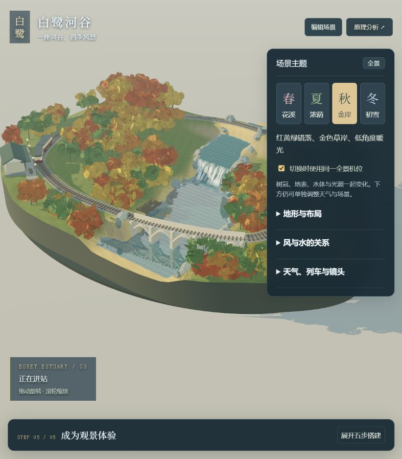
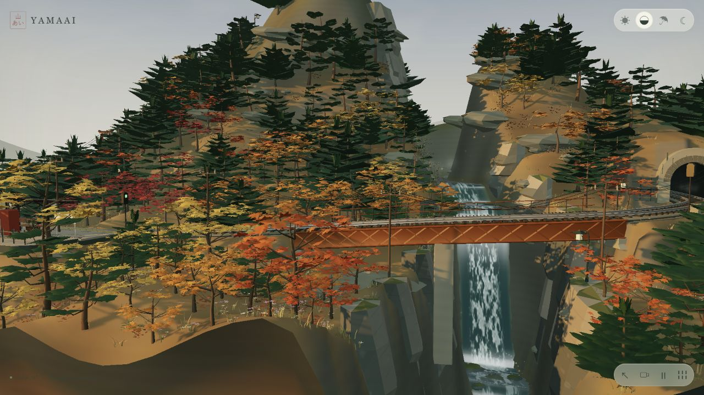
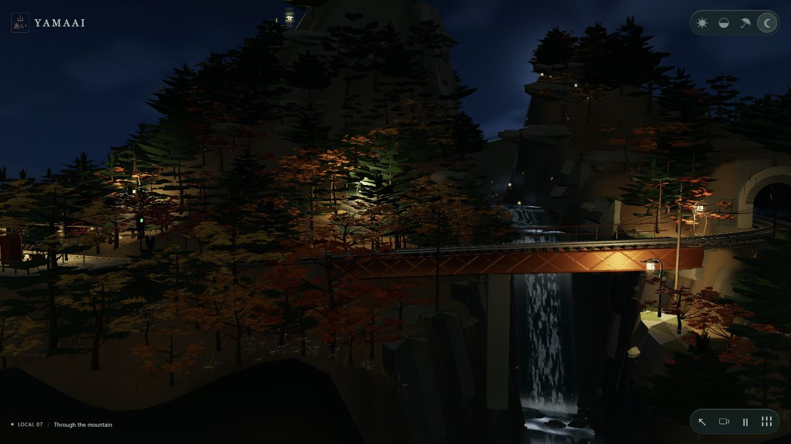
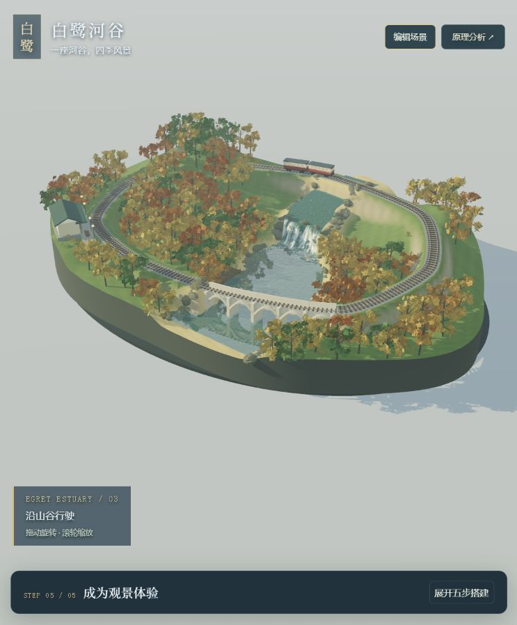
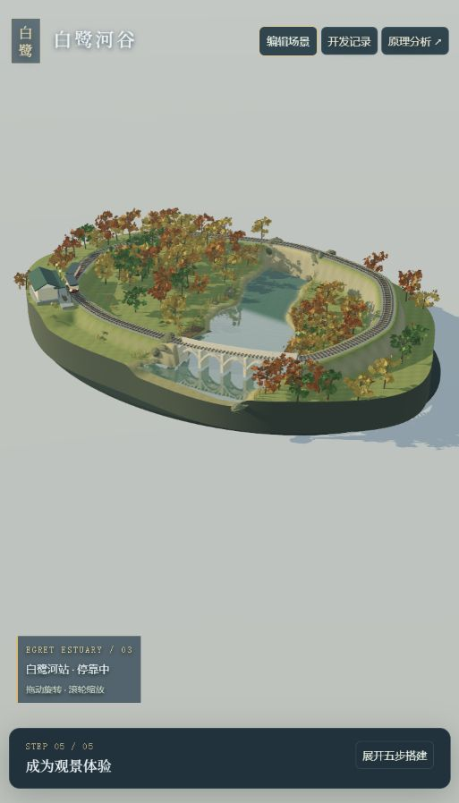
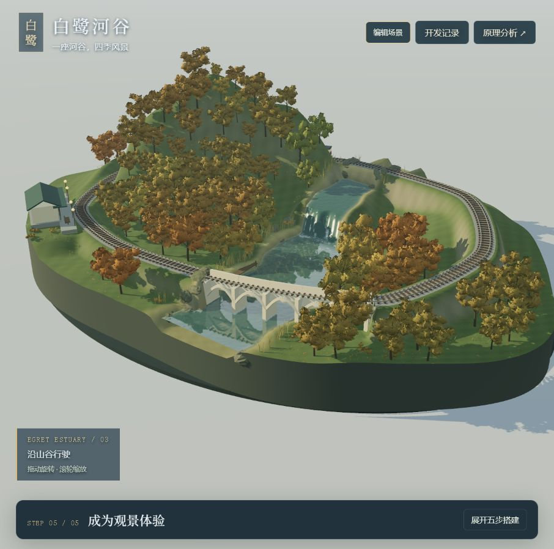

# 003 · Mountain Railway Diorama

Yamaai（山あい）是一个可在浏览器中旋转、缩放和切换天气的日式山间铁路微缩景观。研究价值集中在**程序化几何、列车路径运动、水体与天气 Shader、场景灯光、自动运镜和渲染优化的组合实现**。

它是具有完整视觉表现的具体作品，尚未提供通用地图编辑器、多车调度平台或工程级仿真能力。

| 项目 | 内容 |
| :--- | :--- |
| 固定编号 | 003 |
| 原始仓库 | [iamtechartist/mountain-railway-diorama](https://github.com/iamtechartist/mountain-railway-diorama) |
| 原作者 | iamtechartist；许可证署名 Techartist |
| 发现渠道 | 用户提供的 GitHub 仓库链接 |
| 上游许可证 | MIT，见 [许可原文](assets/upstream-LICENSE.txt) |
| 研究版本 | `6e8b0fbb806e486d7819b6d297b92f4ecf3d258b`；package 版本 `2.2.0`，未以 release tag 定位 |
| 研究日期 | 2026-09-14（Asia/Shanghai） |
| 进度 | 已总结：固定版本研究完成；独立场景升级为“白鹭河谷”，新增四季主题、地形编辑、共享风场与水面反射 |
| 技术栈 | 原生 JavaScript ES Modules、Three.js r185、WebGL 2、GLSL、HTML/CSS；Node.js 检查与构建；Python 本地服务 |
| 上游演示 | [Yamaai](https://iamtechartist.github.io/mountain-railway-diorama/)，已在浏览器打开验证 |
| 本研究项目演示 | 真实三维场景与交互分析页均可本地运行，尚未部署；见 [网页运行说明](app/README.md) |

[当前能力基线](capabilities.md) · [返回总索引](../../README.md#项目索引) · [真实场景源码入口](app/scene.html) · [交互分析网页](app/index.html) · [网页运行说明](app/README.md) · [开发与优化记录](development-log.md) · [源码与验证笔记](notes.md) · [扩展方向](extensions.md) · [图片来源](assets/README.md)

## 实践：“白鹭河谷”四季场景

以河岸观景铁路为使用场景，独立构建开阔河口、低矮河岸、细碎叶簇、芦苇、浅色拱桥和跌水。网页可直接调整地形起伏、河道宽度与弯曲、水位落差和树木数量，河床、岸线与植被随之重建。

风力、风向与阵风共享到枝干、叶片、芦苇、水纹和雨丝。水流速度单独控制；下游水面新增定时更新的真实场景倒影。三种基底可以快速切换，五步搭建仍可展开查看。新增花瓣、落叶、夏夜萤火、可调降雪与雾量，以及春、夏、秋、冬四套主题，在固定布局与同一机位下比较嫩叶花树、浓绿树冠、错落秋色、裸枝覆雪及水体与光照变化。

这是一份重新编写的风格化原型，仍使用固定闭合轨道，未提供任意地形雕刻、真实流体或树木力学。没有声称画面细节已达到原作。使用入口、文件分工与验证范围见 [应用说明](app/README.md)。第一版“雾溪山线”的截图与记录保留用于对照。

## 用网页理解如何实现相似效果

新增交互分析页，围绕“输入 → 计算 → 输出”拆解八项能力。可切换原作截图标记、调节教学参数，并按六阶段路线生成带交付物与验收要求的实施任务。实验包括曲线采样、进站制动、环境联动、镜头避地形与性能预算。

这份网页用于驱动分析和实施规划，参数作用于教学模型，不直接控制原作 3D 场景。完整启动方式和验证范围见 [app/README.md](app/README.md)。

## 研究目标

- [x] 核实能力、技术原理、实现效果和适用场景。
- [x] 固定 commit，运行上游检查与构建，记录真实结果。
- [x] 本地加载固定版本并保存场景截图。
- [x] 提出扩展方向，区分已实现功能与未来设想。
- [ ] 实施配置化或导览改造。
- [ ] 跨设备性能和移动端完整交互测试。

## 核心能力

| 能力 | 已有实现 | 边界 |
| :--- | :--- | :--- |
| 微缩场景 | 山体、峡谷、桥梁、隧道、车站、神社、植被、河流、瀑布 | 布局由代码预设，无可视化编辑器 |
| 自动列车 | 两节编组闭环运行、弯道减速、进站制动、停车与出发 | 简化运动控制，未提供多车调度 |
| 环境变化 | 白天、黄昏、雨天、夜晚；雨量和风力调节；材质与灯光联动 | 美术预设，不接入实时天气 |
| 用户观察 | 旋转、缩放、平移、暂停、0.25×—1.8×列车速度、12 个视角选项 | 主要面向观看，没有游戏任务系统 |
| 自动运镜 | 依据列车进度选择过桥、出隧道、到站等构图，平滑移动 | 编排规则，没有 AI 镜头生成 |
| 静态运行 | 运行依赖随 `vendor/` 提供，HTTP 加载 ES Modules | 需要 WebGL 2，无业务后端 |

源码入口及固定版本链接见 [模块地图](notes.md#模块地图)。

## 技术原理

### 程序化建模

高度函数组合山峰、山脊和起伏，生成带顶点颜色的三角网格。铁路附近整平，河谷降低地形，站台形成平台。隧道口裁剪网格留出实际通道，内部沿线路生成连续拱形结构。

轨道采用闭合 Catmull–Rom 曲线，钢轨截面沿曲线扫掠，枕木和桥梁构件重复布置。固定随机种子负责细节变化，空间规则让植被避开轨道、建筑和关键视线。这是预设布局与程序化细节的组合，不是任意地图的自动生成器。

### 列车路径运动

以累计行驶距离采样轨道，利用前后采样点计算车身方向，转向架独立对齐局部切线。目标速度受弯道与进站距离约束，加减速度限制使运行平滑；到站约停留 6.2 秒后继续。它服务于展示，未实现完整铁路车辆动力学。

### 水体、天气与材质

河面贴合河床边界，深度影响透明度和颜色；Shader 噪声、法线扰动、泡沫、雨滴涟漪和反射营造流动感。瀑布单独建模。雨丝、薄雾、萤火虫和落叶通过批量几何与时间驱动动画实现。水流与天气属于视觉模拟，不是流体或气象求解。

### 灯光与镜头

共享状态驱动时间、风、湿度、夜色和日光。环境切换同时插值天空、雾、光照、曝光与材质。车灯、灯笼、车窗结合 HDR 高光和低分辨率 Bloom。自动镜头按列车进度选择视角，在移动中采样地形高度以减少穿地。

### 性能优化

重复物体使用几何合并和实例化；树木、道砟按距离切换细节层级（LOD）；阴影和反射限制更新频率；GPU 计时可用时根据持续压力调整像素密度。低分辨率 Bloom 限制光晕成本。具体参数与限制见 [研究笔记](notes.md)。

## 实现效果

以下图片来自固定 commit 的本地运行，未使用图像生成或视觉修饰。整体呈现秋日微缩模型风格：切面岩石、深绿与金红植被、跨峡谷钢桥和多级瀑布共同形成层次。

截图来源和未采集范围见 [图片目录](assets/README.md)。截图只证明单帧视觉表现，不能单独证明流畅度或长期稳定性。

本次上游检查通过：21 个模块、52 个导入、198 个网格几何数值检查、36 条隧道净空射线、6 项物件支撑检查，以及模拟 250 秒内 3 次停车。构建产生 24 个静态文件及额外 manifest。详细输出见 [本次验证结果](notes.md#本次验证结果)。

上游文档写有 201 个网格，以及测试浏览器静止视角通常约 60 fps、移动约 40—60 fps。本次网格数为 **198**，按实测记录；帧率仅为作者观察，本研究没有复测性能基准，也没有直接沿用作者的无警告结论。

## 使用场景

以下为结合现有实现提出的适用性判断：

| 场景 | 可利用基础 | 需要补充 |
| :--- | :--- | :--- |
| Three.js 学习 | 建模、路径运动、Shader、镜头、优化均有模块入口 | 算法拆解和独立示例 |
| 文旅 / 品牌展示 | 景观浏览、环境氛围、自动运镜 | 地方内容、点击说明、品牌资源和移动端适配 |
| 数字展品 / 氛围网页 | 自动运行、昼夜雨景、模型风格 | 声音、长时运行与低性能设备验证 |
| 轻量游戏原型 | 列车运动和空间布局 | 任务、规则、存档、反馈与奖励 |

真实交通平台、工程仿真和通用地图编辑器需要新增主要系统，不能视为已有能力。

## 扩展方向与复用价值

优先建议 **场景配置化 → 点击导览 → 主题变化**：拆出轨道、建筑和环境参数，为导览对象建立稳定标识，再复用结构制作其他景观。声音、多车调度、编辑器和真实地理数据接入的成本及验收建议见 [extensions.md](extensions.md)，均尚未实施。

最值得借鉴的是多种常见图形技术围绕完整景观协同工作。复用前需要理解固定坐标、共享状态、地形查询和材质之间的联系。换主题相对容易，泛化为编辑器或调度平台需要明显的结构调整。

## 本地运行与实践状态

固定版本已在 Windows、Node.js `v22.15.0`、Python `3.10.11` 下完成检查、构建与浏览器加载。Windows 使用 `python serve.py`；上游开发脚本写的是 `python3 serve.py`，本机没有使用该别名启动。

完整命令见 [app/README.md](app/README.md)。上游克隆仅放在 Git 忽略的 `.tmp/`，正式子项目未导入完整源码或嵌套 `.git`。`app/` 包含独立的效果驱动分析网页及可编辑的白鹭河谷三维场景，仅随应用提供 Three.js 库文件与 MIT 许可。本次未部署网页。

## 来源与许可

- [固定版本源码](https://github.com/iamtechartist/mountain-railway-diorama/tree/6e8b0fbb806e486d7819b6d297b92f4ecf3d258b)。
- [作者验证说明](https://github.com/iamtechartist/mountain-railway-diorama/blob/6e8b0fbb806e486d7819b6d297b92f4ecf3d258b/VALIDATION.md)：与本次实测分开记录。
- [上游 MIT 许可原文](assets/upstream-LICENSE.txt)：原始场景由 Techartist 创作，本次仅运行、截图和研究。
- 逐模块证据、验证限制与截图来源见 [notes.md](notes.md) 和 [assets/README.md](assets/README.md)。

## 第五版实践：以秋日河谷检查画质

新增三个直接观景入口：**河谷全景 → 河岸植被 → 岩间跌水**。水体采用不规则细波、错落跌水高程和入潭泡沫；岩石放在跌水上沿与潭边。乔木增加间距及高矮变化，河岸补入随风与季节变化的灌木和草丛，同时调整秋季暖光、环境反射与阴影。

树木目标数量受地形、铁路避让和间距约束，实际数量可能更少。该版仍采用程序化几何与艺术化水流，尚未达到写实植被、真实流体碰撞或积雪厚度模拟；不能据此声称已超过原作画质。[三个近景证据与来源](assets/README.md#第五版秋季画质基准)。

## 第六版：分段跌水与开发记录

将跌水段分为五条宽窄不同的水束，间隙露出连续岩壁；水花和水雾集中在各自落点。默认秋季机位见下图，仍属于艺术化程序动画。

新增 [开发与优化记录](development-log.md)，包含从研究起点到本轮的七个条目。实景与分析网页顶部均可进入记录页，查看目标、实现选择、问题修正、验证与遗留边界；后续维护约定已写入本子项目 AGENTS.md。

## 第七版：按反馈恢复连续水流，保留多模式

用户认为挡水石头和固定路径降低了合理感。因此默认恢复无遮挡连续跌水，将岩间分流保留为可选方向，另加浅滩缓流。三种模式分别驱动有效落差、坡段、岩壁可见性、泡沫、飞沫与流动比例。切换保留机位、河宽与季节；浅滩会改变河床与实际落差。

[三模式实景对照](assets/README.md#第七版三种水流模式) · [反馈与开发记录](development-log.md) · [后续优化方向](extensions.md#水体优化路线v7-用户反馈后的调整)。技术检查通过不代表美术效果已被用户认可。

## 第八版：连续水流与独立精调

保留默认无遮挡的连续水面，增加上游较慢、跌落加速、入潭减速的流动层次，并修正调节流速时水纹跳位。水层厚薄、白沫、水雾、倒影、水纹可即时调节，各模式在本次页面打开期间分别记住设置，可单独恢复默认。

22 项自动检查通过；实景验证默认与全零设置、模式切换保留设置和单独重置。厚薄仍为视觉着色，水流仍为艺术化驱动；刷新不保留设置。[运行与精调说明](app/README.md#第八版水流精调) · [开发记录](development-log.md) · [截图对照与来源](assets/README.md#第八版连续水流精调)

## 第九版：河岸衔接与白沫消散

以秋季连续跌水为样板，细化河床与浅水岸缘，减少长直亮纹，增加入潭白沫的生成、扩散和渐隐。保留原植被布点参考与统一观察机位；修正水下河床进入倒影的问题。24 项自动检查通过，已查看三个秋季机位、浅滩零白沫及冬季兼容性。

[修改前后与三个机位](assets/README.md#第九版河岸衔接与白沫消散) · [开发过程与边界](development-log.md) · [网页运行说明](app/README.md#第九版河岸与入潭细节)。平面反射与水流仍是视觉近似，画质是否更符合预期需由实际观感判断。

## 第十版：两种景观与四季光线匹配

新增可扩展构图配置：**层峦溪谷**以西侧叠岭、树林分组和窄溪组织画面；**疏林浅湾**采用低缓地形、宽水和疏林，默认浅滩。两者共用四季、天气、风场、水体精调和列车系统，保留原有河谷入口。

| 层峦溪谷 · 秋 | 疏林浅湾 · 秋 |
| :--- | :--- |
|  |  |

景观分别记住地形与水流模式。手动光线跨季节保留，也可勾选随季节推荐。27 项检查通过，已逐一查看两种新景观四季，另查夜景、雨景与编辑缓存。详细规则见 [运行说明](app/README.md#第十版景观构图与四季光线匹配)，截图与边界见 [图片来源](assets/README.md#第十版景观构图与四季光线) 和 [开发记录](development-log.md)。

## 第十一版：树冠体积与四季植被

增加弯曲、多朝向叶簇及树冠内外明暗，按树型和区域组织花色、秋色与叶量；冬季展现连续分叉、逐渐变细的裸枝。保持共享风场与落叶阴影规则，宽窗口支持收起编辑面板。

30 项自动检查通过，实景检查两种景观的八个四季组合、秋冬近景、手动夜景和零风力跨构图保持。近景片面感与枝条折线感尚存，几何开销增加且未测量性能收益。[实现与验证](development-log.md) · [四季截图与来源](assets/README.md#第十一版树冠与冬季枝形) · [运行说明](app/README.md#第十一版树冠与冬季枝形)

## 第十二版：草地配色与地表分区

针对大片灰绿地面，改用四季独立色板，并区分草坡、林地、湿岸裸土和陡坡岩面。秋季枯草与残绿成片过渡，草丛同步换季；冬季降低地表细密纹路。

32 项检查通过。实景对照覆盖溪谷、浅湾四季，以及代表性日光、夜景和雨景；保留原有布局、树木和水体参数。[开发记录](development-log.md) · [截图来源与参数](assets/README.md#第十二版地表配色与四季对照) · [运行说明](app/README.md#第十二版地表分区与四季草地)。当前仍是程序化地表，未加入精细草坪纹理或生态模拟。

## 第十三版：草丛与树下地表

回应大片地面过空、树下偏黄的反馈：增加疏密短草、跟随实际树木的林地暗土、细颗粒地表变化，以及更细碎的贴地落叶。保持四季与风场联动，草根逐点贴地并避开铁路、水域。

34 项检查通过，记录包含两种景观四季和秋冬夏近景。当前仍有简化草叶重复感，新增几何开销尚未完成设备评测。[开发记录与前后对照](development-log.md) · [截图来源](assets/README.md#第十三版草丛与树下地表) · [运行说明](app/README.md#第十三版短草林下暗土与落叶)

## 第十四版：补齐空地与山背面

新增「林间空地」「山后坡地」观察入口，并按地形补充低矮灌木、坡草、局部露岩和少量倒木。空地机位寻找较少树冠遮挡的位置，山后陡切坡增加薄嵌岩与局部表面起伏。

36 项自动检查通过；新区域沿用四季、光线和风场。空地保留开阔区，浅湾按低缓地形减少露岩，轨道与水流通道不额外加入障碍。[开发过程与对照](development-log.md) · [图片来源](assets/README.md#第十四版空地与山后坡地) · [运行说明](app/README.md#第十四版林间空地与山后坡地)。岩面造型与植被仍为程序化近似。

## 第十五版：山体、坡脚与空地衔接

铁路旁的高地切坡改为圆滑坡脚、较宽坡面与山脊连接；降低大块直立面的墙感。露岩逐顶点贴合地形，底壳埋入，周边小碎石顺坡分布。地形更新时树根、草丛与露岩同步重建，保留四季、夜景与雨天材质联动。

38 项自动检查通过，保存 13 张修改前后及代表场景实景；包含山后四季、正面、空地、夜雨及另外两种构图。路堤、岛体侧壁和近景重复感仍待细化。[完整开发记录](development-log.md) · [截图来源](assets/README.md) · [运行说明](app/README.md)

## 第十六版：修复铁路岩石与水石冲突

岸石和分流石按完整体积避开轨道，岸石按脚印低处安放，避免挂在切坡上。岩间分流取消固定五条竖带，改由实际石块截面决定水面缺口；水纹局部偏转、白沫避让，连续与浅滩模式不放分流石。

40 项自动检查通过，开发记录保存 7 张实际画面。该实现属于固体遮挡和局部流纹表现，尚不能模拟整河堵塞后的蓄水与溢流。[本轮前后对照和问题记录](development-log.md) · [运行说明](app/README.md)

## 第十七轮：跌水流动与落点同步

水面增加沿流向移动的纵向细纹、小幅起伏和连续加减速；关闭白沫、水雾仍能观察流动。白沫与飞沫按各条水线的实际跌落末端定位，保持三种水流模式、既有水石遮挡与四季材质。

43 项自动检查通过，保存 12 张实际画面；代表检查包含四季、夜景、雨景、高落差、浅湾及强风。仍是风格化水面表现，不求解堵河后的蓄水和溢流。[开发记录与前后对照](development-log.md) · [技术与验证范围](notes.md)

