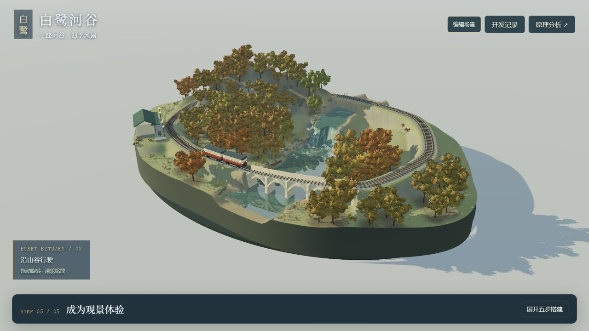
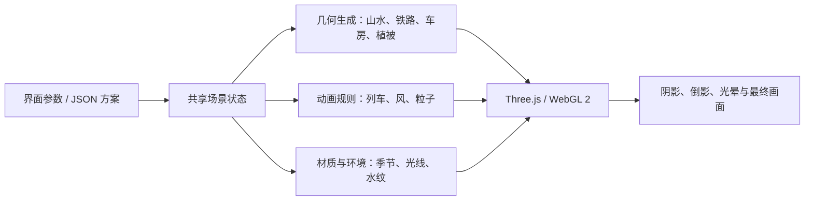

# V23 版本归档与技术原理

[▶ 在线体验 V23 固定归档版](https://yydshly.github.io/0913_codex_project/003-mountain-railway-diorama/archives/v23/scene.html) · [当前持续更新场景](https://yydshly.github.io/0913_codex_project/003-mountain-railway-diorama/scene.html)

2026-09-14 · 003-v23-archive-2026-09-14

当前归档冻结的是 V23 风格化铁路观景原型：三种构图、可调地形、两节列车与车站、三种水流、植被与风、四季和天气、镜头及方案保存。归档不代表最终画质验收，也不新增人物或动物。

[在线归档与原理](https://yydshly.github.io/0913_codex_project/003-mountain-railway-diorama/archive.html) · [归档发布与下载](https://github.com/yydshly/0913_codex_project/releases/tag/003-v23-archive-2026-09-14) · [能力清单](capabilities.md) · [机器可读清单](archive-manifest.json)

## 归档边界

- 场景源码基线：`66c1e1d0807510213b59e9a3552103ea3d088ca1`。归档标签指向包含本说明的归档提交，场景运行模块与该基线一致。
- 包含本子项目源码、随项目提供的 Three.js、研究与开发记录、真实效果截图和构建脚本；不包含其他项目或嵌套仓库。
- 私人方案仍保存在浏览器中，未导出的方案不在源码归档里。需要保留作品时，在“我的场景方案”中另行导出 JSON。
- 本轮重新执行 58 项检查，全部通过；复用 V23 的 10 张真实截图，未把旧截图算作新一轮实景验证。



## 核心原理

这是“程序化三维建模＋实时着色器＋规则动画＋共享场景状态”的组合。CPU 生成或更新几何与行为，GPU 绘制材质、光影与部分动画。



### 空间与地形

参数 → 高度函数 → 三角网格。山体由多个隆起函数叠加；河道以中心线、宽度和水位塑造河床，两岸向周边地形过渡。铁路附近按规则整平并保留净空。

能调起伏、宽度、弯曲和落差；不能直接拖动山体或自由绘轨。 对应文件：[scene-world.mjs](app/scene-world.mjs)、[scene-composition.mjs](app/scene-composition.mjs)。

### 列车与车站

车与房由箱体、圆柱、挤出屋顶等几何体组合。列车按运行距离采样闭合曲线，用前后采样点决定车厢姿态，转向架跟随轨道方向；车轮角度由路程除以半径得到。到站前按距离制动，停留后再出发。

已有两节列车、车轮、转向架、灯光、站台、雨棚、长椅；不是动力学车辆或完整建筑编辑器。 对应文件：[scene-train.mjs](app/scene-train.mjs)、[scene-service.mjs](app/scene-service.mjs)、[scene-landscape.mjs](app/scene-landscape.mjs)。

### 树木与风

树干、分枝和叶簇程序化生成；同类几何使用实例化批量绘制。共享风场由时间、位置、风向、风力和阵风构成，顶点着色器让树根固定、上部摆动，不同植物使用不同柔韧系数。

枝叶与阴影同步变化；没有完整树木力学或破坏模拟。 对应文件：[scene-vegetation.mjs](app/scene-vegetation.mjs)、[scene-tree-shape.mjs](app/scene-tree-shape.mjs)。

### 水流与岩石

水面是沿河道生成的网格。着色器叠加流向噪声、细水丝、深浅色和波纹；白沫、飞沫以动画生命周期表现落水冲击。岩石布局同时供水面裁剪、流纹偏转和白沫避让使用。

有连续跌水、浅滩、岩间分流；没有压力、蓄水、溢流或侵蚀求解，厚薄滑块主要改变观感。 对应文件：[scene-water.mjs](app/scene-water.mjs)、[scene-water-modes.mjs](app/scene-water-modes.mjs)、[scene-rocks.mjs](app/scene-rocks.mjs)。

### 水面倒影

把相机关于下游水面镜像，再把场景画到一张纹理中，叠到水面并按视角、波纹和白沫调节强度。倒影最多约每 120 毫秒更新一次。

是平面反射，主要用于下游；不是全场光线追踪，也不是完整折射。 对应文件：[scene-water.mjs](app/scene-water.mjs)。

### 四季、时间与天气

季节权重逐步插值，统一改变地表、叶量、色板与覆雪；昼夜雨景控制光线、雾和湿润度。雨丝、花瓣、落叶、雪花和萤火使用循环粒子动画。

已有环境表现；没有雨后积水演化、积雪厚度或人与动物的天气行为。 对应文件：[scene-seasons.mjs](app/scene-seasons.mjs)、[scene-details.mjs](app/scene-details.mjs)、[scene-atmosphere.mjs](app/scene-atmosphere.mjs)。

### 渲染与镜头

Three.js r185 使用 WebGL 2 把真实三维几何绘制到浏览器画布。方向光、半球光、阴影与环境贴图构成照明；自定义后处理提取亮部、模糊光晕并压缩明暗范围。透视相机支持自由观察与预设机位。

外观像微缩模型，底层是可旋转的三维场景；并非图片拼接或逐帧生成视频。 对应文件：[scene.mjs](app/scene.mjs)、[scene-atmosphere.mjs](app/scene-atmosphere.mjs)。

### 方案与驱动

界面把用户操作转换为状态。形态参数触发地形重建；材质参数更新 GPU 共享变量；动画每帧按时间推进。方案以带版本号的 JSON 校验并保存到当前来源的浏览器存储。

可保存、恢复、文件迁移和同机位比较；没有通用撤销、云同步或动画同帧恢复。 对应文件：[scene.mjs](app/scene.mjs)、[scene-plans.mjs](app/scene-plans.mjs)、[scene-plans-ui.mjs](app/scene-plans-ui.mjs)。

## 从参数到画面的例子

改变河宽，会重建河床、岸线、水面及关联植被；改变风力，主要更新共享变量，让树叶、芦苇、雨丝和水纹响应；切换冬季，通过权重过渡改变叶量、地表和雪的表现；列车的位置由每帧累计的运行距离决定。它们使用不同驱动方式，不是所有滑块都重新生成整个场景。

## 已有能力与后续扩展

列车已有车轮与转向架、进站制动和车灯；站房已有门窗、雨棚、站台、长椅与灯具。程序化模型的存在不等于美术质量已经完成。

当前没有人物、鱼群、白鹭或森林鸟兽的模型与行为系统。夏夜萤火属于粒子表现。后续方向如下，均不计入本次已实现能力：

| 方向 | 范围 |
| --- | --- |
| 近期候选 | 查看列车进站近景，评估车体、站房、站台的比例与细节；先看实际效果，再确定开发范围。 |
| 人物 | 候车、站务、上下车、沿路行走；需要模型、动作、路径、接地与碰撞规则。 |
| 水域动物 | 浅水鱼群、河岸白鹭及其他候选；需要水深、岸线、避石和活动区域。 |
| 森林动物 | 林鸟优先，松鼠、兔子等为候选；需要停栖点、攀爬或飞行路径、遮挡规则。 |
| 天气联动 | 晴阴雨过渡、雨后湿润和积水、屋檐滴水、雪与融雪；再逐步影响列车、建筑、人与动物。 |
| 布局创作 | 河道、山体、铁路及建筑的编辑、空间约束、撤销重做；当前仅保留为后续方向，不在本次归档实施。 |

## 已知限制

水槽感、局部圆滑岸坡、下游较大片反射、树群与建筑细节尺度仍有提升空间。没有完整流体、地形侵蚀、自由绘轨、多车调度、通用对象编辑、人物或动物行为。手机性能和长时资源稳定性尚未完整验收。停止无边界的水域打磨，后续按当前效果与具体场景需要立项。

## 恢复和运行

解压归档后进入项目目录：

```powershell
node app/build.mjs
python -m http.server 8034 --bind 127.0.0.1
```

打开 `http://127.0.0.1:8034/app/dist/scene.html`，原理分析为 `/app/dist/index.html`，归档说明为 `/app/dist/archive.html`。如端口已有服务，可使用其他端口。运行需要支持 WebGL 2 的浏览器；依赖随项目提供，无需 npm 安装。

验证命令：

```powershell
node --test app/model.test.mjs app/scene.test.mjs app/scene-plans.test.mjs
```

归档 ZIP 的 SHA-256 随发布附件提供。`archive-manifest.json` 记录运行模块的 SHA-256；Git 标签固定本次源码和说明。
