# 003 · 项目图片与来源

本节前两张图片为 2026-09-14 在 Windows 浏览器中加载固定上游 commit `6e8b0fbb806e486d7819b6d297b92f4ecf3d258b` 后采集的原始截图。运行入口为本地临时服务 `http://localhost:8033/`；此地址仅用于复现，不是部署入口。

| 文件 | 内容 | 用途 |
| :--- | :--- | :--- |
| [01-evening-hero.jpg](01-evening-hero.jpg) | 默认黄昏主视角，树林、钢桥、山体与瀑布 | 原作代表图；1280 × 720 |
| [02-night-hero.jpg](02-night-hero.jpg) | 切换 Night 后的主视角，深色山体和沿线灯光 | 夜景对照；1280 × 720 |
| [upstream-LICENSE.txt](upstream-LICENSE.txt) | 上游 MIT 许可原文，Copyright (c) 2026 Techartist | 原始场景的来源与许可归档 |

原始场景由 [Techartist](https://github.com/iamtechartist/mountain-railway-diorama) 创作，本次只运行、截取和整理研究。图片未使用 imagegen 或其他方式修改场景。列车会移动，截图时可能在隧道或其他路段，不能因单帧不见列车推断运行失败。

原作未保存白天、雨天和全景截图，也未采集移动端截图；相应能力以源码或明确记录的操作为依据。单帧图片不证明帧率、长时稳定性或所有交互均通过。

## 独立重建场景：雾溪山线

以下为 2026-09-14 本研究新写的 Three.js 场景在本地浏览器中的实际截图，没有使用图像生成或后期修图。新布局、新模型和应用代码位于 `app/scene*.mjs`，使用 Three.js r185，许可见 [THREE-LICENSE.txt](../app/vendor/THREE-LICENSE.txt)。这些图片不代表上游原作。

| 文件 | 实际画面 | 尺寸 |
| :--- | :--- | :--- |
| [scene-01-foundation.jpg](scene-01-foundation.jpg) | 第一步：山体、轨道与峡谷桥 | 835 × 898 |
| [scene-03-landscape.jpg](scene-03-landscape.jpg) | 第三步：增加列车、茶站、树林与瀑布；首页预览 | 1280 × 720 |
| [scene-05-night.jpg](scene-05-night.jpg) | 第五步夜间全景：窗灯、车站灯光、水面和瀑布 | 835 × 898 |

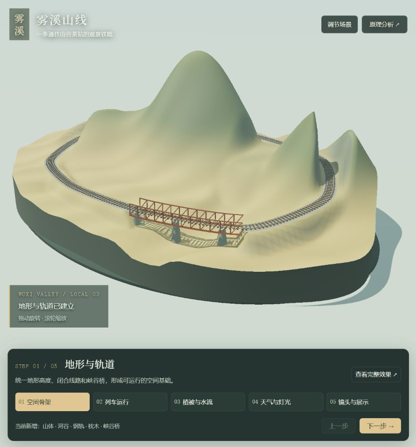

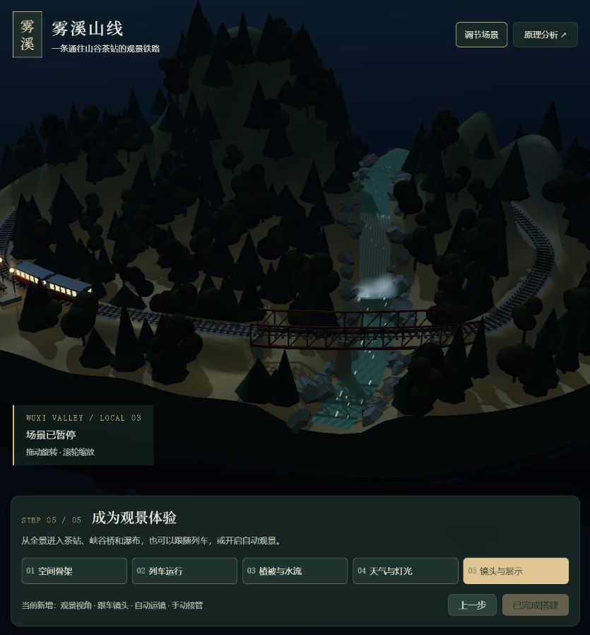

窄屏 390 × 844 布局已在桌面浏览器模拟检查；未将其视为真实手机性能验证。夜景截图采于沿线树冠留空微调前，第三步预览已更新至最终留空规则。

## 第二版：白鹭河谷

2026-09-14 本研究场景更新后的真实浏览器截图，均为 787 × 898。新场景代码仍在 `app/`；图片没有生成或后期修改。

| 文件 | 内容 |
| :--- | :--- |
| [scene-v2-wetland.jpg](scene-v2-wetland.jpg) | 完整河谷与真实地形编辑面板；根目录新版预览 |
| [scene-v2-wind-calm.jpg](scene-v2-wind-calm.jpg) | 风力 0% 的河岸叶簇、枝干、芦苇与水面倒影 |
| [scene-v2-wind-gust.jpg](scene-v2-wind-gust.jpg) | 风力 100%、阵风 100%、风向 15° 的实际画面 |

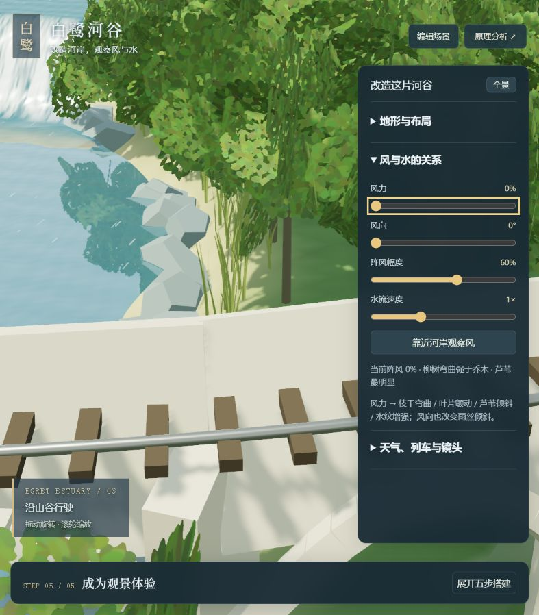

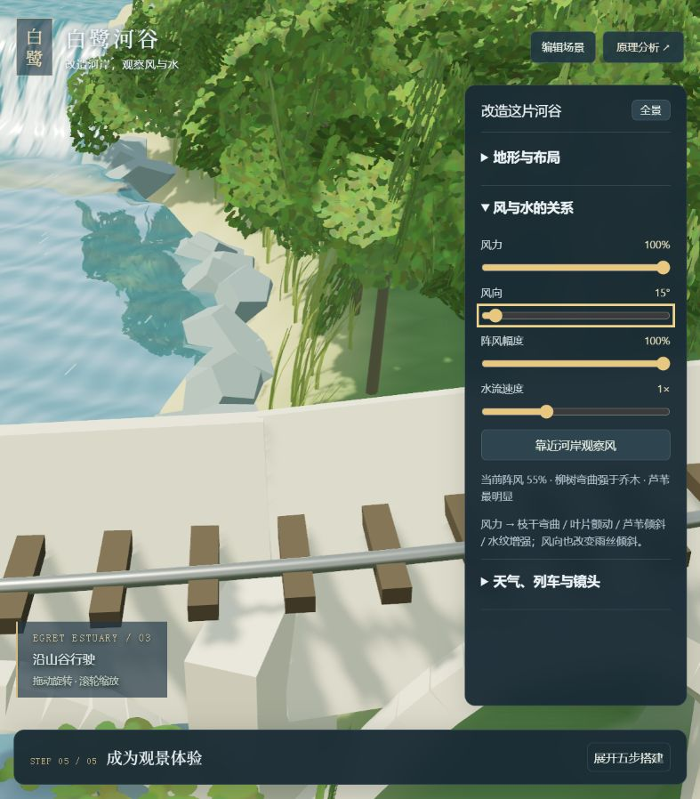

两张风力截图拍摄时间不同，展示交互效果，不是物理精度或性能基准。原作图片、第一版雾溪山线图片、第二版白鹭河谷图片分别归档，互不混用。

## 第三版：同机位四季

2026-09-14 在同一地形与预设全景机位下，实际切换主题采集。列车、风和水纹随拍摄时间变化；图片未使用生成或后期修改。

| 春 · 花溪 | 夏 · 浓荫 |
| :--- | :--- |
| 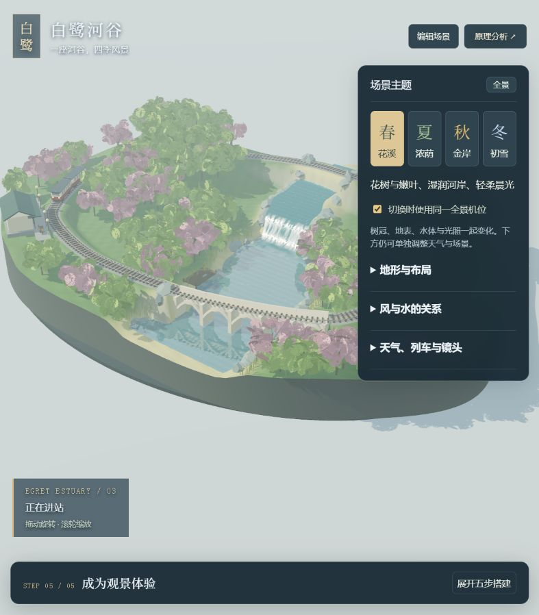 | 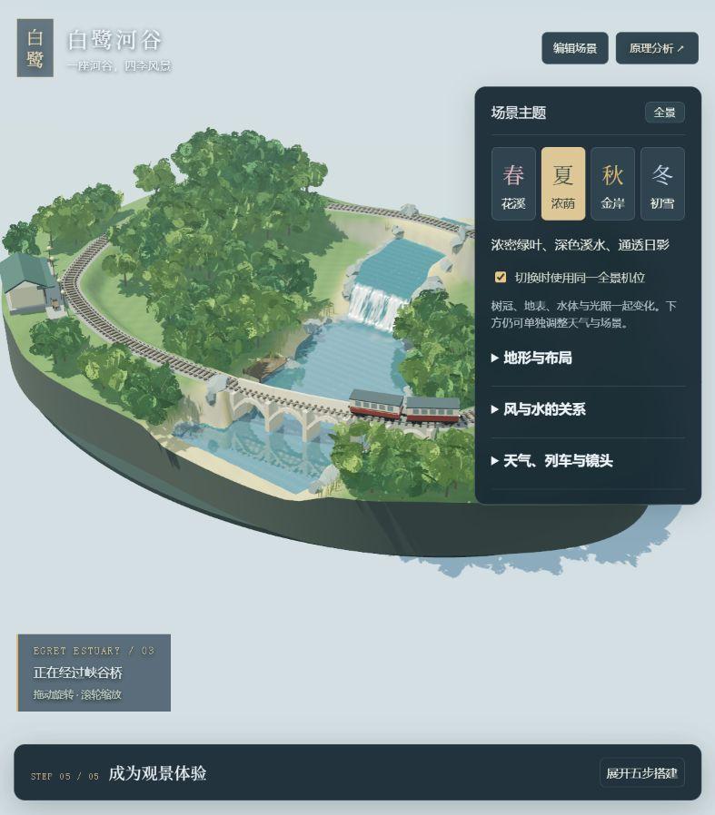 |

| 秋 · 金岸 | 冬 · 初雪 |
| :--- | :--- |
|  | 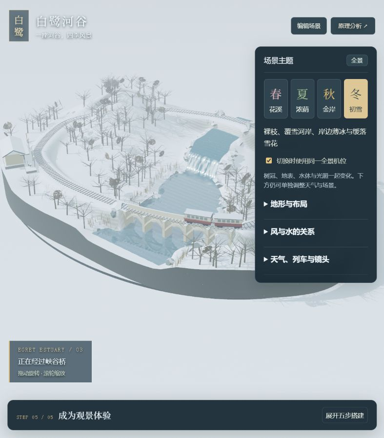 |

四张图均为 787 × 898。秋季图曾作为根目录代表图，当前预览已更新为第十版。覆雪、花树和岸冰采用艺术化材质与叶簇处理，不代表真实积雪、花瓣建模或冰冻仿真。

## 第四版：动态细节近景

2026-09-14 的实际浏览器画面，均为 787 × 898。动态细节与地面覆盖设为 100%；静态截图只能记录某一帧，不代表动画全过程。

- [scene-v4-autumn-details.jpg](scene-v4-autumn-details.jpg)：秋季近景的枝叶、树下叶片与岸边水面。
- [scene-v4-summer-night.jpg](scene-v4-summer-night.jpg)：夏夜河岸的萤火光点、跌水与倒影。

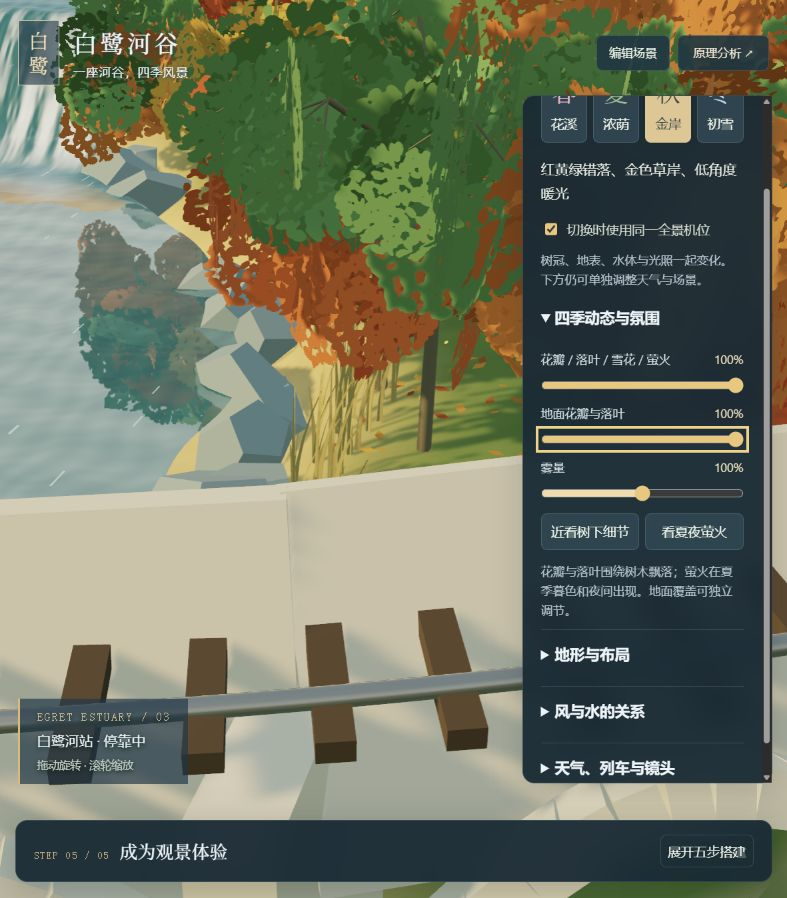

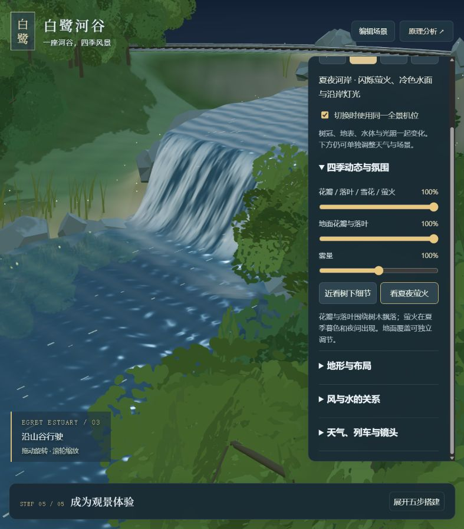

## 第五版：秋季画质基准

2026-09-14 实际本地浏览器截图，使用默认湿地、秋季主题、动态与地面覆盖 60%、雾量 100%。收起编辑面板后拍摄，未生成或修饰图片；列车、落叶与水纹随采集时间变化。

- [河谷全景](scene-v5-autumn-overview.jpg)：完整底座、树木疏密、拱桥、跌水与倒影，曾作为根目录预览，现已更新为第十版。
- [河岸植被](scene-v5-autumn-bank.jpg)：从河面一侧观察树冠、枝干、岸边苇叶与倒影。
- [岩间跌水](scene-v5-autumn-waterfall.jpg)：上游露岩、错落水面与入潭泡沫。

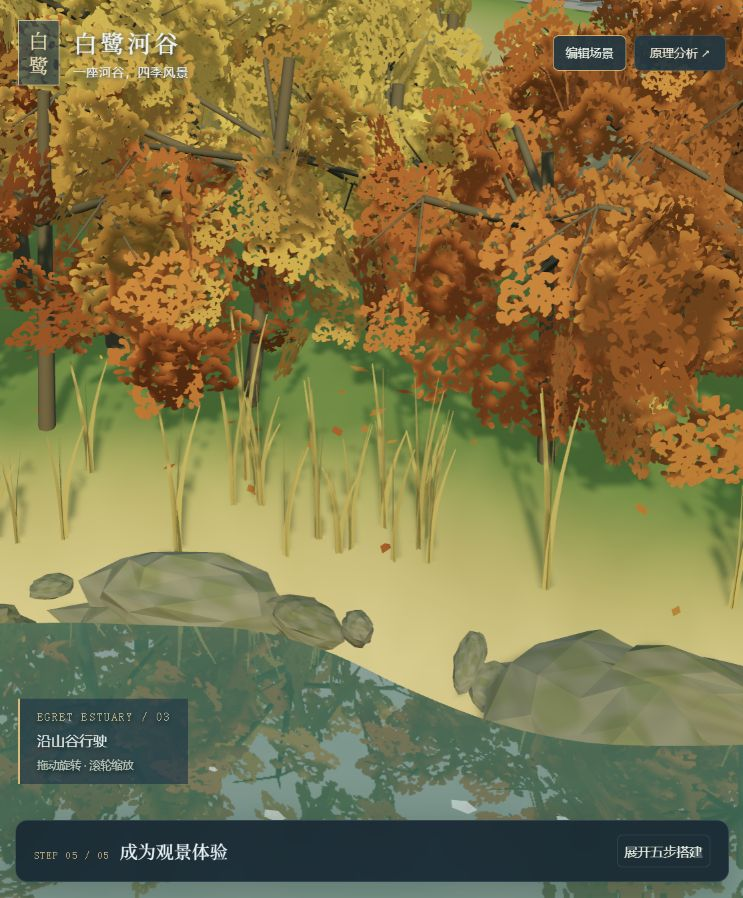

这些截图证明场景已实际渲染，不代表已达到写实标准或超过原作。水流仍是程序化视觉效果，岩石周围没有真实流体求解。

## 第六版：岩壁分段跌水

2026-09-14 从本地构建后的实景网页拍摄，默认湿地与秋季主题、流速 0.8×、动态与地面覆盖 60%、雾量 100%，使用「岩间跌水」机位并收起面板。未生成或后期修饰。

第五版跌水图仍保留供对照；动画采集时刻不同，不是同步物理实验。

## 第七版：三种水流模式

2026-09-14，本地构建网页中从默认湿地、秋季、流速 0.8× 和同一个水流近景机位，依次切换模式拍摄。切换未重新选择机位；浅滩会降低有效落差并重建岸线，因此植物布点也可能改变。列车、水纹和落叶随时间变化，图片未生成或后期修饰。

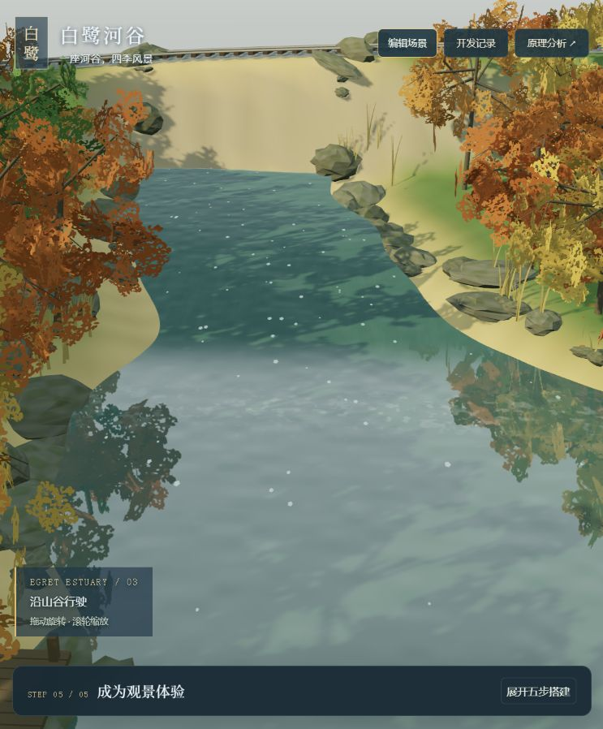

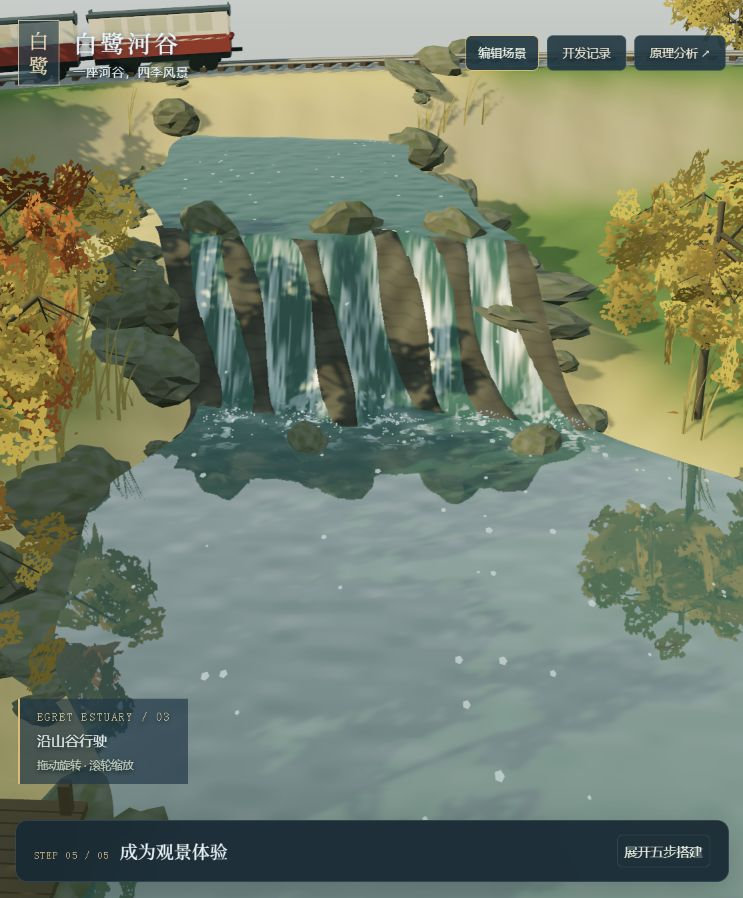

连续跌水图曾用于根目录预览，当前已更新为第十版。岩间分流图用于方向对照，不代表用户已认可该版效果。

## 第八版：连续水流精调

2026-09-14 从本地实际运行的 `app/dist/scene.html` 采集。两图使用秋季、默认湿地、连续跌水与同一水流近景机位，落差 3.6 m、水流速度 0.8。仅调整五项精调；动画帧不同，不能用于逐像素或性能比较。

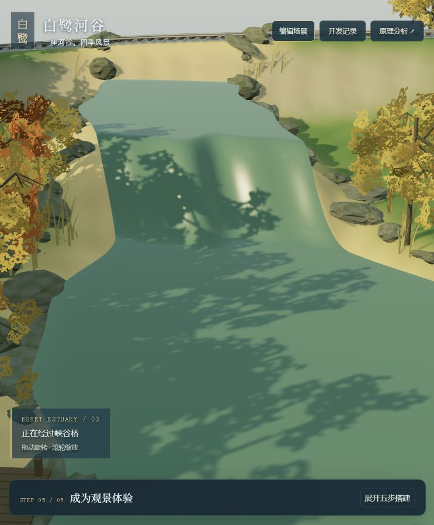

该默认图曾作为根目录预览，现保留为第八版开发记录配图。厚薄为水色与水层观感控制，不是真实厚度测量；这些截图证明实际渲染与控制效果，不代表流体仿真或画质已获用户认可。

## 第九版：河岸衔接与白沫消散

2026-09-14 在本地 `app/dist/scene.html` 实际采集，743×898。秋季、默认湿地、连续跌水；落差 3.6 m、流速 0.8，精调为 65/50/45/60/40%。以下修改前后使用同一水流近景位置；本轮统一了初始加载和重建后的机位。河岸横断面确实改变，树木参考布点保留、根部高度随地形更新。动画时刻不同，不能作像素差异或帧率比较。

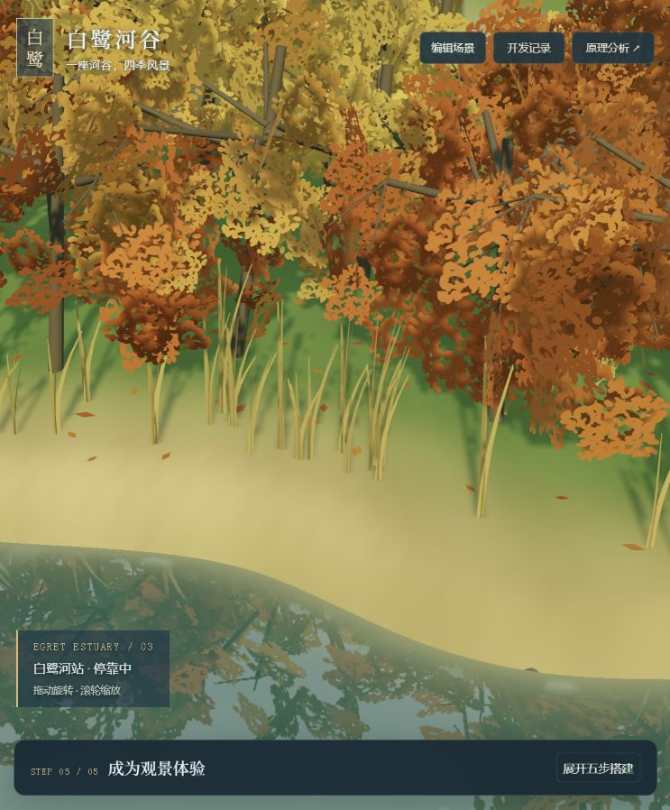

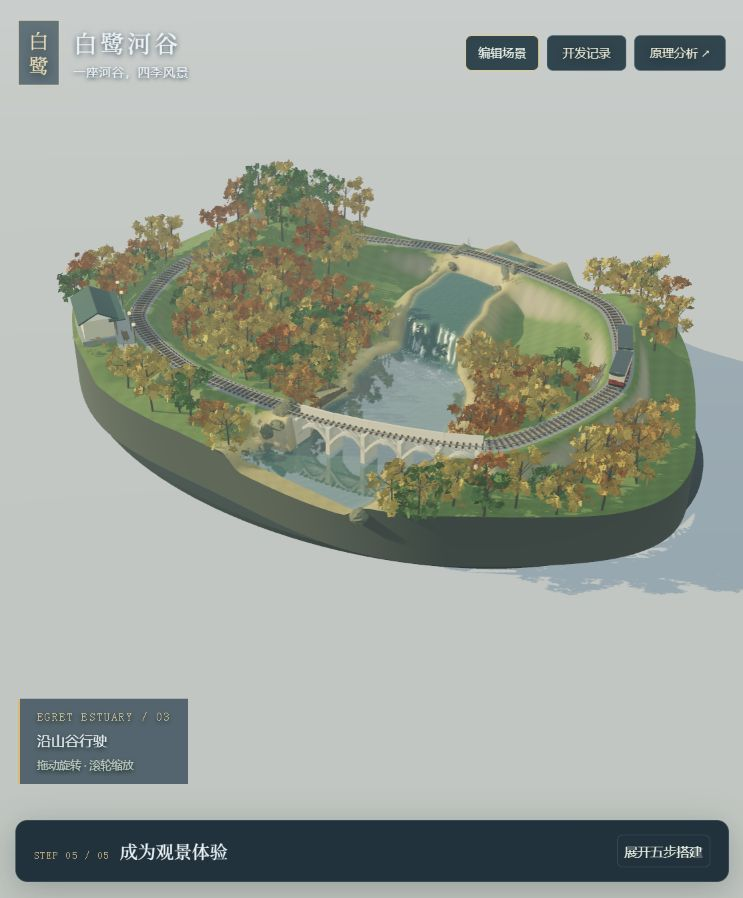

该水流近景曾作为根目录预览，现保留在第九版记录中。网页开发记录包含修改前后两图。截图证明实际渲染，不证明真实流体、折射或整体性能提升；平面反射仍有简化轮廓。

## 第十版：景观构图与四季光线

2026-09-14 从本地 `app/dist/scene.html` 实际采集，共十张。使用当时窄窗口尺寸，同一景观四季保持同一全景机位，地形和水流模式不随季节改变；不同景观使用各自机位，不作像素对比。树木位置固定，动画帧和列车位置不同。没有使用生成图。

| 景观 | 春 | 夏 | 秋 | 冬 |
| :--- | :--- | :--- | :--- | :--- |
| 层峦溪谷 | [春季](scene-v10-ridge-spring.jpg) | [夏季](scene-v10-ridge-summer.jpg) | [秋季](scene-v10-ridge-autumn.jpg) | [冬季](scene-v10-ridge-winter.jpg) |
| 疏林浅湾 | [春季](scene-v10-marsh-spring.jpg) | [夏季](scene-v10-marsh-summer.jpg) | [秋季](scene-v10-marsh-autumn.jpg) | [冬季](scene-v10-marsh-winter.jpg) |

- 溪谷：起伏 1.05、半宽参数 6 m、弯曲 4 m、落差 3.6 m，连续跌水，实际 114 棵树。
- 浅湾：起伏 0.25、半宽参数 10.5 m、弯曲 6.5 m、落差设置 1.4 m，浅滩缓流的有效落差 0.308 m，实际 90 棵树。
- 上表采用季节推荐光线：春夏冬为白天，秋为黄昏；保留各模式默认精调。
- [浅湾冬季手动夜景](scene-v10-marsh-winter-night.jpg)：先选夜间，再切冬季，验证光线未被季节覆盖。
- [原有河谷春季手动雨景](scene-v10-classic-spring-rain.jpg)：先选雨景，再切构图和季节，雨量约 70%。

截图不代表全部 48 个光线组合都经过视觉验收。窄窗口雾量已按镜头拉远比例补偿；冬季裸枝的规则感等美术限制保留在开发记录中。

## 第十一版：树冠与冬季枝形

2026-09-14 从本地 `app/dist/scene.html` 实际采集，未使用生成图。新版截图为 906×898 窗口，收起编辑面板；四季使用各景观的固定全景机位、默认水流参数及推荐光线（春夏冬白天，秋季黄昏）。

| 景观 | 春 | 夏 | 秋 | 冬 |
| :--- | :--- | :--- | :--- | :--- |
| 层峦溪谷 | [春](scene-v11-ridge-spring.jpg) | [夏](scene-v11-ridge-summer.jpg) | [秋](scene-v11-ridge-autumn.jpg) | [冬](scene-v11-ridge-winter.jpg) |
| 疏林浅湾 | [春](scene-v11-marsh-spring.jpg) | [夏](scene-v11-marsh-summer.jpg) | [秋](scene-v11-marsh-autumn.jpg) | [冬](scene-v11-marsh-winter.jpg) |

- [秋季河岸树冠近景](scene-v11-ridge-bank.jpg)：溪谷默认秋季风力 40%，推荐黄昏。
- [冬季河岸裸枝近景](scene-v11-ridge-winter-bank.jpg)：溪谷冬季推荐白天，过渡完成后记录。
- [修改前河岸近景](scene-v11-before-bank.jpg)：V10 实际画面，编辑面板展开。两版布点、面板状态与动画帧不同，只用于观察形态变化，不作逐像素对照。

本版溪谷 116 棵树，切四季保持根部位置不变。几何开销和近景片面感等边界见开发记录 V11。

## 第十二版：地表配色与四季对照

2026-09-14 从本地 `app/dist/scene.html` 以 906×898 窗口实际采集，收起编辑面板，未使用生成图。前后采用溪谷秋季默认全景、推荐黄昏和默认水流参数；树木位置不变，列车、粒子和风场动画帧不同。

[修改前地表](scene-v12-before-ground.jpg) · [修改后地表](scene-v12-ridge-autumn.jpg)

| 景观 | 春 | 夏 | 秋 | 冬 |
| :--- | :--- | :--- | :--- | :--- |
| 层峦溪谷 | [春](scene-v12-ridge-spring.jpg) | [夏](scene-v12-ridge-summer.jpg) | [秋](scene-v12-ridge-autumn.jpg) | [冬](scene-v12-ridge-winter.jpg) |
| 疏林浅湾 | [春](scene-v12-marsh-spring.jpg) | [夏](scene-v12-marsh-summer.jpg) | [秋](scene-v12-marsh-autumn.jpg) | [冬](scene-v12-marsh-winter.jpg) |

四季使用对应景观全景机位，光线随季节推荐：春夏冬为白天，秋为黄昏。溪谷使用连续跌水，浅湾使用浅滩。

- [溪谷秋季手动白天](scene-v12-ridge-autumn-day.jpg)
- [溪谷秋季手动夜间](scene-v12-ridge-autumn-night.jpg)
- [浅湾夏季手动雨景](scene-v12-marsh-summer-rain.jpg)
- [溪谷秋季河岸近景](scene-v12-ridge-bank.jpg)

本轮共十三张。截图用于确认渲染与颜色关系，不代表全部光线组合经过视觉验收；最终配色仍需依据实际观感调整。

## 第十三版：草丛与树下地表

2026-09-14 从本地 `app/dist/scene.html` 实际采集，906×898 窗口，面板收起，未使用生成图。共十二张。前后沿用秋季河岸植被机位和推荐黄昏；树木位置保持，列车与风场动画帧不同。

[树下修改前](scene-v13-before-bank.jpg) · [树下修改后](scene-v13-ridge-bank.jpg) · [冬季枯草近景](scene-v13-ridge-winter-bank.jpg) · [浅湾夏季草丛](scene-v13-marsh-summer-bank.jpg)

| 景观 | 春 | 夏 | 秋 | 冬 |
| :--- | :--- | :--- | :--- | :--- |
| 层峦溪谷 | [春](scene-v13-ridge-spring.jpg) | [夏](scene-v13-ridge-summer.jpg) | [秋](scene-v13-ridge-autumn.jpg) | [冬](scene-v13-ridge-winter.jpg) |
| 疏林浅湾 | [春](scene-v13-marsh-spring.jpg) | [夏](scene-v13-marsh-summer.jpg) | [秋](scene-v13-marsh-autumn.jpg) | [冬](scene-v13-marsh-winter.jpg) |

溪谷采用用户本轮开始时选择的岩间分流，浅湾采用默认浅滩；其它地形为对应构图默认值。春夏冬白天，秋季黄昏，风力随季节推荐。落叶地面覆盖为默认 60%，夏冬隐藏落叶。全景季节过渡阈值到达后采集，少量极低种子叶簇可能尚处于过渡末尾；冬季近景在完整过渡后采集。

## 第十四版：空地与山后坡地

2026-09-14 从本地 `app/dist/scene.html` 实际采集，窗口 906×898，编辑面板收起，未使用生成图。网页记录包含十一张图片；另保留一张空地机位试拍。

[山后修改前](scene-v14-before-back.jpg) · [山后修改后](scene-v14-ridge-back-summer.jpg)。两图同为溪谷夏季、推荐白天、岩间分流和山后机位；动画帧不同。地表增加局部起伏，树木布点参考不变。

| 观察区域 | 春 | 夏 | 秋 | 冬 |
| :--- | :--- | :--- | :--- | :--- |
| 溪谷山后 | [春](scene-v14-ridge-back-spring.jpg) | [夏](scene-v14-ridge-back-summer.jpg) | [秋](scene-v14-ridge-back-autumn.jpg) | [冬](scene-v14-ridge-back-winter.jpg) |
| 浅湾空地 | [春](scene-v14-marsh-meadow-spring.jpg) | [夏](scene-v14-marsh-meadow-summer.jpg) | [秋](scene-v14-marsh-meadow-autumn.jpg) | [冬](scene-v14-marsh-meadow-winter.jpg) |

- [溪谷夏季空地](scene-v14-ridge-meadow-summer.jpg)：根据实际树木布局选出的站旁林间开阔位置。
- [浅湾夏季山后](scene-v14-marsh-back-summer.jpg)：低缓地形的同类观察入口。
- [首轮空地机位试拍](scene-v14-before-meadow.jpg)：被树冠遮挡，后续已换机位；不能与最终空地画面作同机位对比，不放入网页效果图库。

四季勾选光线随季节推荐，取消换季返回全景，以固定新机位对照。溪谷用本轮用户已选的岩间分流，浅湾为默认浅滩。冬季截图在季节过渡阈值到达后采集，可能有极少数叶簇仍在过渡末尾。

## 第十五版山体与坡脚

来源：2026-09-14 在本地 app/dist/scene.html 运行 Three.js 实景，由浏览器截图工具采集，763×898，编辑面板收起。未使用生成图。

修改前为 V14 山后夏季、默认溪谷地形与岩间分流；最终图均为 V15 岩面与覆雪兼容修复后重新采集。山后预设改用旧布点参考高程以维持观察尺度，前后机位可能有微小高度差，列车位置与风动时刻不同。

| 文件 | 场景参数与观察位置 |
| :--- | :--- |
| scene-v15-before-back.jpg | V14 溪谷夏季白天，山后，岩间分流 |
| scene-v15-ridge-back-spring.jpg | 溪谷山后 · 春 |
| scene-v15-ridge-back-summer.jpg | 溪谷山后 · 夏 |
| scene-v15-ridge-back-autumn.jpg | 溪谷山后 · 秋 |
| scene-v15-ridge-back-winter.jpg | 溪谷山后 · 冬 |
| scene-v15-ridge-overview-summer.jpg | 溪谷全景 · 夏 |
| scene-v15-ridge-overview-winter.jpg | 溪谷全景 · 冬 |
| scene-v15-ridge-meadow-summer.jpg | 林间空地 · 夏 |
| scene-v15-ridge-night.jpg | 溪谷夏夜 |
| scene-v15-ridge-back-rain.jpg | 溪谷山后 · 夏雨 |
| scene-v15-marsh-back-summer.jpg | 浅湾山后 · 夏 |
| scene-v15-classic-back-summer.jpg | 原有河谷 · 夏 |
| scene-v15-classic-canyon-summer.jpg | 原有河谷 · 高起伏基底 |

溪谷沿用默认地形 relief=1.05、width=6、bend=4、fall=3.6、density=190，水流 rocky；春夏冬为季节推荐白天，秋为推荐黄昏。夏夜为手动 night，夏雨为手动 rain。浅湾使用默认地形与 stream；原有河谷使用默认地形与 continuous，高起伏基底图改为 relief=1.55、width=4、bend=2、fall=6、density=260。季节图在环境过渡就绪后采集，春夏秋冬山后机位固定。

本轮仅对上述代表组合做实际画面检查，不能据此声称全角度、所有天气或参数极值均通过美术验收。

## 第十六版铁路净空与水石修复

2026-09-14 在本地 app/dist/scene.html 用浏览器截图采集，无生成图。修改前与秋季最终近景为 858×898；其余最终图片为 698×898。窗口及自由镜头在检查中变化，夏季为石块俯视，冬季与两种无分流石模式为自由全景，春季为水流预设近景。

| 文件 | 场景与参数 |
| :--- | :--- |
| scene-v16-before-water.jpg | V15 秋季 rocky，用户厚薄/白沫/水雾/倒影/水纹 34/5/14/55/50 |
| scene-v16-rocky-autumn.jpg | 秋季水流近景 · 用户精调 |
| scene-v16-rocky-summer.jpg | 夏季岩石俯视 |
| scene-v16-rocky-winter.jpg | 冬季自由全景 |
| scene-v16-rocky-spring.jpg | 春季水流近景 |
| scene-v16-continuous-autumn.jpg | 秋季连续跌水 · 全景 |
| scene-v16-stream-autumn.jpg | 秋季浅滩缓流 · 全景 |

全部为默认层峦溪谷地形。rocky 保留用户精调，春夏冬使用季节推荐白天、秋季黄昏；continuous 和 stream 使用各自默认精调。最终图全部在固体片元裁切、跌水色调和粗糙度修复后采集。不同视角不构成像素级前后对照，也不代表全部编辑组合已视觉验收。

## V17 · 跌水流纹与落点同步

2026-09-14 从本地 app/dist/scene.html 实际采集。除独立强风页为 1280×720，其余均为 549×898；没有使用生成图。前后为溪谷秋季、水流近景、连续跌水默认精调，零白沫对照仅将白沫和水雾设为 0。峡谷采用高落差基底；强风图为浅湾夏季缓流，风力/阵风/水纹 100%、流速 0。动态时刻不同，不用于像素或帧率对比。

| 文件 | 画面 |
| --- | --- |
| [scene-v17-before-water.jpg](scene-v17-before-water.jpg) | 修改前 V16 · 秋季连续跌水 |
| [scene-v17-water-only-a.jpg](scene-v17-water-only-a.jpg) | 零白沫零水雾 · 时刻 A |
| [scene-v17-water-only-b.jpg](scene-v17-water-only-b.jpg) | 零白沫零水雾 · 时刻 B |
| [scene-v17-continuous-autumn.jpg](scene-v17-continuous-autumn.jpg) | 连续跌水 · 秋季 |
| [scene-v17-continuous-spring.jpg](scene-v17-continuous-spring.jpg) | 连续跌水 · 春季 |
| [scene-v17-continuous-summer.jpg](scene-v17-continuous-summer.jpg) | 连续跌水 · 夏季 |
| [scene-v17-continuous-winter.jpg](scene-v17-continuous-winter.jpg) | 连续跌水 · 冬季 |
| [scene-v17-rocky-night.jpg](scene-v17-rocky-night.jpg) | 岩间分流 · 夏夜 |
| [scene-v17-rocky-rain.jpg](scene-v17-rocky-rain.jpg) | 岩间分流 · 雨景 |
| [scene-v17-canyon-rocky.jpg](scene-v17-canyon-rocky.jpg) | 峡谷高落差 · 岩间分流 |
| [scene-v17-marsh-stream.jpg](scene-v17-marsh-stream.jpg) | 浅湾 · 缓流 |
| [scene-v17-marsh-max-wind.jpg](scene-v17-marsh-max-wind.jpg) | 浅湾 · 最大风力阵风水纹，零流速 |

## B1 提交后实景分析

2026-09-14，在本地 Git 基线 b670133 提交后，独立临时浏览器页访问 app/dist/scene.html 实际采集，1280×720。层峦溪谷、秋季推荐黄昏、连续跌水默认精调，面板收起。未改变场景算法，三个机位动画时刻不同；分析完成关闭临时页，用户原页面未操作。

- [全景](b1-review-overview.jpg)：默认河谷全景。
- [水流近景](b1-review-water.jpg)：水流近景按钮。
- [山后坡地](b1-review-back.jpg)：山后坡地按钮。

截图用于定位现有版本的美术问题，不是已修复证据或跨版本像素对比。

## V18 · 方案保存与基准比较

2026-09-14，本地 app/dist/scene.html 实测，1280×720，无生成或合成图。scene-v18-restored.jpg 为刷新后恢复“溪谷冬夜 · 示例”：溪谷河宽 7、岩间分流白沫 12%、冬季手动夜景、风力 57%、风向 105°、流速 0.45×、雨量 21%、暂停。scene-v18-compare.jpg 为沿用该全景机位查看 V17 默认秋季基准；不同方案参数，不是画面算法修改前后。

## V19 · 白沫薄片与同机位回归（2026-09-14）

以下 12 张均来自本地真实 WebGL 场景的浏览器截图，1280×720，未经生成或修图。`scene-v19-before.jpg` 在修改前采集（V18）；其余为 V19。

| 文件 | 条件与用途 |
| --- | --- |
| `scene-v19-before.jpg` / `scene-v19-after.jpg` | 层峦溪谷、连续跌水、秋季推荐黄昏、白沫 50%，同一导出配置与水流近景机位，比较圆片与薄片轮廓 |
| `scene-v19-low.jpg` / `scene-v19-zero.jpg` | 同一配置和机位，白沫分别为 10% / 0%；水雾仍为默认 45% |
| `scene-v19-rocky.jpg` / `scene-v19-stream.jpg` | 同一镜头、秋季黄昏，岩间分流 / 浅滩缓流默认值，白沫分别 65% / 20% |
| `scene-v19-spring.jpg` / `scene-v19-summer.jpg` / `scene-v19-winter.jpg` | 连续跌水 50% 白沫，在界面切换季节推荐光线与风速/流速，取消切季节重置机位；冬季为岸冰与缓流，非真实冻结模拟 |
| `scene-v19-night.jpg` / `scene-v19-rain.jpg` | 岩间分流，秋季夜景 / 雨景（雨量 70%），关闭推荐光线，沿用近景 |
| `scene-v19-overview.jpg` | V19 秋季默认连续跌水、河谷全景，用于项目与根索引预览 |

近景镜头位置约 `[9.1076, 8.9125, 18]`，目标 `[8.1076, 1.6125, -3]`；地形参数：起伏 1.05、半宽 6、弯曲 4、落差 3.6、乔木目标 190。截图保持配置/机位，不同步动画时刻，不是逐像素比较。另实际查看三种模式各自零白沫与 10% 低白沫；未为所有检查额外归档图片。
