# 白鹭河谷 · 开发与优化记录

> 本文由 app/development-records.mjs 在构建时生成；后续在该内容源新增条目，网页与本文同步更新。

历史条目依据已有 notes.md 与实景截图回填；没有记录的操作与验证不补造。版本号属于本研究迭代，与上游版本无关。

[研究总览](README.md) · [技术证据](notes.md) · [记录网页源码](app/dev-log.html)

## 持续记录约定

每一轮保留目标、原因、实现步骤、发现的问题、实际验证和当前边界。代码完成后先标记“验证中”；检查通过并记录证据后再改为“已验证”。旧记录追加更正，不抹去曾经存在的问题。

## V18 · 场景方案保存、恢复与同机位比较

2026-09-14 · 已验证 · 场景创作 / 完整配置 / 保存与比较

让调好的场景可以命名保存、刷新恢复、文件迁移，并在同一机位查看基准与返回修改。

**为什么这样改：** 用户确认先补创作成果保存与比较，保持 V17 画面算法，避免调整后无法恢复或准确对照。

### 实现过程

1. 定义版本 1 纯数据方案格式，包含三套构图、各水流模式精调、环境与观察设置、镜头位置和目标。
2. 对整个输入校验后一次重建；直接同步状态，避免季节默认值覆盖手动光线、风力与流速。
3. 新增本地另存、列表恢复、文件导入导出与文本兜底；读取失败时停止写入，保存失败保留旧数据。
4. 保留 V17 默认参数，支持设置当前基准；比较时保持当前机位、暂停动画并锁编辑，返回后恢复修改方案。近景会进入基准地形时拒绝比较并提示切全景。
5. 保存前重新读取方案库，减少多标签页陈旧列表覆盖；自动检查加入已有 Pages 工作流。

### 问题与修正

- 首轮恢复中多元素查询被错误写为单元素查询，导致控件同步失败；已修正并重新实际检查导入、恢复与返回。
- 小数流速被原滑块步长取整；恢复时允许精确范围值，春季 1.25× 与冬季 0.45× 实际显示一致。

### 实际验证

- 49 项自动检查通过：既有 43 项，加完整配置往返、非法参数/版本、输入大小与附加字段、刷新存储、写入失败、容量与镜头边界 6 项。
- 浏览器导入冬夜方案后再次导出，全部配置一致；比较后返回导出仍一致，保存并刷新后恢复导出仍一致。
- 实际选择 JSON 文件导入成功；修改过的非当前浅湾河宽 9 m、浅滩白沫 9% 在切换后保留。未来版本文件被拒绝且应用计数不变。
- 最终检查春季流速恢复为 1.25×；采集冬夜恢复和默认基准比较两张 1280×720 实景。
- 在 localhost 独立来源地址实际选择 JSON 文件导入，再导出与原配置一致，检查没有 error 级日志；自定义冬夜基准可切入并返回默认修改。开发记录三处图片全部加载。

### 当前边界

- 本地方案按浏览器与来源网址隔离，刷新后手动选择恢复；无账号云同步，最多 40 项。
- 比较保存的是参数与机位，不包含历史渲染源码、动画时钟、水流相位或列车进度，不保证同帧或跨设备逐像素一致。
- 基准与未另存的修改仅在当前页面会话内；无通用撤销/重做或方案删除界面。
- 资源异常时尝试回退；极端内存不足可能仍需刷新。自动检查不能代替全部设备和参数组合验收。

对应实现：[scene-plans.mjs](app/scene-plans.mjs) · [scene-plans-ui.mjs](app/scene-plans-ui.mjs) · [scene.mjs](app/scene.mjs) · [scene.html](app/scene.html) · [scene.css](app/scene.css) · [scene-plans.test.mjs](app/scene-plans.test.mjs)

四季与光线实景：[恢复冬夜方案 · 本地存档](assets/scene-v18-restored.jpg) · [沿用相同机位 · 查看秋季默认基准](assets/scene-v18-compare.jpg)

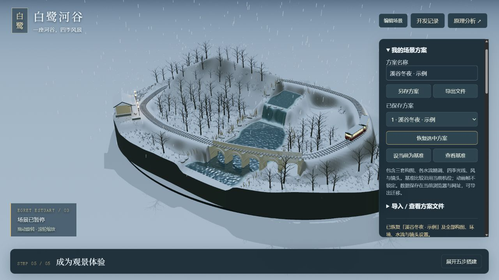

## B1 · 截至 V17 的能力整理与源码基线

2026-09-14 · 已验证 · 能力清单 / 版本归档

整理本地已实现能力、既有优化、验证证据和未完成部分，建立继续工作的 Git 基线。

**为什么这样改：** 用户要求先整理并提交当前成果，随后分析如何继续，避免反复提出已经完成的优化。

### 实现过程

1. 核对实际控件、源码与 V1—V17 开发记录，区分上游与本地能力。
2. 新增能力清单，明确参数记忆仅限本次页面会话，保存/恢复与空间编辑尚未实现。
3. 重新运行已有检查，将本项目与公共索引中的 003 内容纳入本地 Git 归档。
4. 基线提交 b670133 后，从独立页面采集全景、水流近景与山后三张截图，另写 next-steps.md 分析实际问题与保存/比较工作流。
5. 补充面向外部读者的简明摘要、当前全景与水流/山后效果导览，标明早期截图与源码入口，并按用户要求推送远端。
6. 按用户反馈将研究分析、实际场景与开发过程三种线上入口并列到公共索引和项目首屏，避免只看到实景。

### 问题与修正

- 此前下一步建议重复了已经完成的河岸、林下及季节优化；改用已实现/待验收/未实现的划分。

### 实际验证

- 本次重新执行 43 项自动检查，全部通过。
- 基线归档阶段沿用 V17 视觉证据；提交后独立查看秋季默认连续跌水的三个机位，保存三张新截图用于分析，未修改画面算法或声称新问题已解决。
- 提交后检查页只捕获既有阴影弃用警告，没有新增渲染错误；范围仅限当前三机位。
- 远端发布补记：b64aae8 已推送 origin/main，Pages 运行 34818941356 成功；209 处本地发布引用检查通过，8 个代表线上地址返回 200，GitHub 三张引导图加载成功，在线默认秋季场景完成渲染。
- 再次核实本地 /app/ 与线上项目目录均为“山间铁路 · 效果驱动分析”；线上八个模块显示，水流参数实验及六阶段实现路线可打开，检查未捕获 error 级日志。

### 当前边界

- 2026-09-14 已推送并通过原有工作流发布 GitHub Pages；线上检查仍捕获阴影弃用及 Shader 浮点精度编译警告，详见 notes.md。
- 画质对标、全参数视觉验收与跨设备长时性能仍未完成。

对应实现：[../capabilities.md](app/../capabilities.md) · [development-records.mjs](app/development-records.mjs) · [../next-steps.md](app/../next-steps.md)

## V17 · 跌水流动层次与落点一致性

2026-09-14 · 已验证 · 水面形态 / 落点白沫 / 回归检查

关闭白沫、水雾时仍能看清水面流向与跌落，保持三种模式和已有遮挡修复。

**为什么这样改：** 用户确认继续改善跌水形态，并要求全面检查避免引入其他问题。

### 实现过程

1. 记录当前连续跌水的秋季机位和参数。
2. 上游引入平滑加速，跌水加速与下游减速的行程及一阶速度连续；横向水线使用与几何相同的边缘偏移。
3. 沿水面法线增加小幅运动起伏，使用多尺度纵向流纹与沿流向法线扰动；靠近岩石、岸缘时减弱位移。
4. 白沫出生和飞沫入口按每条横向水线的实际跌落末端定位；保留原有遮挡、三种模式、四季材质和暂停时钟。
5. 提取实际水面网格构建函数，直接检查极端地形下的网格属性与分流石遮挡。

### 问题与修正

- 首轮强风检查时自由镜头移到岸壁，不能据此验收水面；另开临时检查页复核，不将该试拍当作最终结果。

### 实际验证

- 43 项自动检查通过：新增流纹行程与速度连续、横向行程可逆、落点对应、水面网格与遮挡属性检查；既有铁路、水石、四季和模式回归检查保留。
- 零白沫、零水雾下保存两个不同时刻的水面画面，流纹仍存在并变化；暂停后两个水面局部截图字节完全一致。
- 已查看连续跌水四季、岩间夜景/雨景与高落差基底、低缓浅湾；最终重载后的上述检查仅捕获既有阴影类型弃用警告，没有新增渲染错误。
- 独立临时页面复核浅湾缓流：风力、阵风、水纹均为 100%，流速为 0；水面和岸缘未见新增破口。完成后关闭临时页，主页面恢复溪谷、秋季、连续跌水和默认精调。

### 当前边界

- 水面起伏、变薄色调与加速属于风格化视觉模型，不是自由落体水膜或质量守恒模拟。
- 自动检查覆盖指定组合与网格属性，实景检查覆盖代表季节、天气及极值；不等同所有自定义参数组合、设备性能或长时运行均已验收。

对应实现：[scene-water.mjs](app/scene-water.mjs) · [scene-water-modes.mjs](app/scene-water-modes.mjs) · [scene-world.mjs](app/scene-world.mjs) · [scene-cascade.mjs](app/scene-cascade.mjs) · [scene.test.mjs](app/scene.test.mjs)

四季与光线实景：[零白沫零水雾 · 时刻 A](assets/scene-v17-water-only-a.jpg) · [零白沫零水雾 · 时刻 B](assets/scene-v17-water-only-b.jpg) · [连续跌水 · 秋季](assets/scene-v17-continuous-autumn.jpg) · [连续跌水 · 春季](assets/scene-v17-continuous-spring.jpg) · [连续跌水 · 夏季](assets/scene-v17-continuous-summer.jpg) · [连续跌水 · 冬季](assets/scene-v17-continuous-winter.jpg) · [岩间分流 · 夏夜](assets/scene-v17-rocky-night.jpg) · [岩间分流 · 雨景](assets/scene-v17-rocky-rain.jpg) · [峡谷高落差 · 岩间分流](assets/scene-v17-canyon-rocky.jpg) · [浅湾 · 缓流](assets/scene-v17-marsh-stream.jpg) · [浅湾 · 最大风力阵风水纹，零流速](assets/scene-v17-marsh-max-wind.jpg)

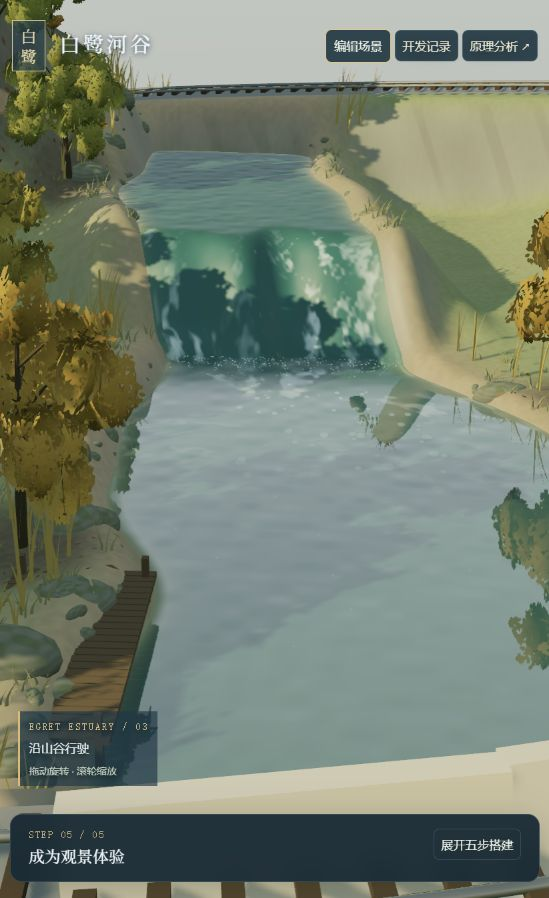

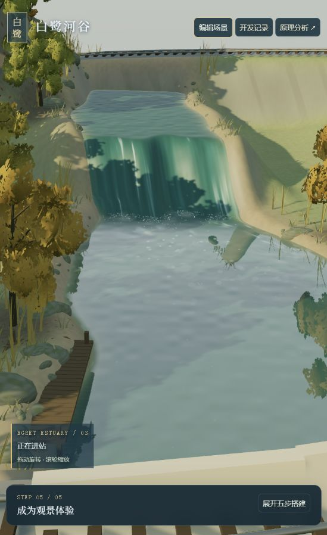

## V16 · 铁路净空与水石一致性修复

2026-09-14 · 已验证 · 问题修复 / 铁路净空 / 水流遮挡

消除铁路岩石和水流穿石，统一固体、水面缺口与白沫的空间关系。

**为什么这样改：** 用户指出铁路上有岩石，水流遇石仍穿过，不符合场景逻辑。

### 实现过程

1. 保存用户当前秋季岩间分流近景与精调参数。
2. 统一岸石与分流石布局，以石块完整范围避让轨道，并让水面读取同一障碍描述。
3. 岸石按完整水平包围半径避让铁路，沿完整脚印取较低地表支撑高程；跌水中段不再散布悬空岸石。
4. 水面、流动纹理与白沫读取同一椭球石块截面；固体内部裁掉水面，边缘弯曲纹理，白沫避开石块。
5. 取消固定五条竖带的水面裁切，降低分流石高度，水从实际露岩两侧通过后重新连成跌水。
6. 分流石增加片元级精确截面裁切，避免水网格插值让水面漏进石块；调整跌水基础色与粗糙度，减少浅水黄底和塑料高光。

### 问题与修正

- 原岸石散布没有轨道净空检查，新增整块避让。
- 原石块位置与水束通道不一致，改为实际石块决定水面缺口。
- 首轮沿固定通道抬高岩脊造成机械条带，撤回该方式，保留水下承托岩面，取消无对应障碍的断水。

### 实际验证

- 40 项自动检查通过，新增 36 组构图、基底和水流组合的岸石/分流石完整顶点净空检查，以及遮挡与绕行方向检查。
- 最终浏览器检查覆盖秋季修复前后水流近景、夏季俯视岩石、冬季全景、春季水流近景、连续跌水与浅滩缓流全景；保存 7 张实际画面。
- 水流模式切换后分流石只出现在 rocky；恢复秋季、岩间分流和用户精调：厚薄 34%、白沫 5%、水雾 14%、倒影 55%、水纹 50%。
- 最终重载后的代表检查未捕获新增渲染错误，仅保留既有阴影类型弃用警告。

### 当前边界

- 这是确定性障碍遮挡与局部流纹偏转，不是流体压力、蓄水或质量守恒求解；当前不能推演任意堆石堵住整条河后的水位变化。
- 岩石仍使用简化椭球几何；岸石避让按保守包围半径计算，靠近铁路会减少布点数量。
- 本轮代表视角检查不能替代所有自定义地形、河宽与落差极值的美术验收。

对应实现：[scene-rocks.mjs](app/scene-rocks.mjs) · [scene-landscape.mjs](app/scene-landscape.mjs) · [scene-water.mjs](app/scene-water.mjs) · [scene-cascade.mjs](app/scene-cascade.mjs) · [scene.test.mjs](app/scene.test.mjs) · [scene-water-modes.mjs](app/scene-water-modes.mjs) · [build.mjs](app/build.mjs)

四季与光线实景：[秋季水流近景 · 用户精调](assets/scene-v16-rocky-autumn.jpg) · [夏季岩石俯视](assets/scene-v16-rocky-summer.jpg) · [冬季自由全景](assets/scene-v16-rocky-winter.jpg) · [春季水流近景](assets/scene-v16-rocky-spring.jpg) · [秋季连续跌水 · 全景](assets/scene-v16-continuous-autumn.jpg) · [秋季浅滩缓流 · 全景](assets/scene-v16-stream-autumn.jpg)

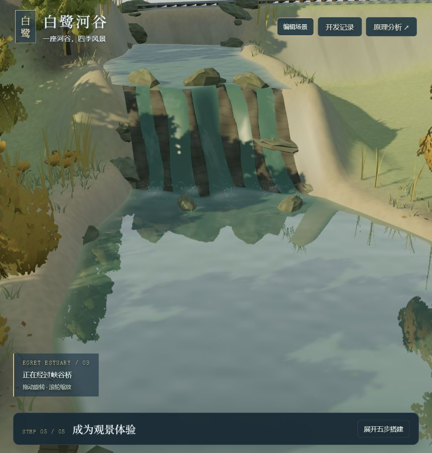

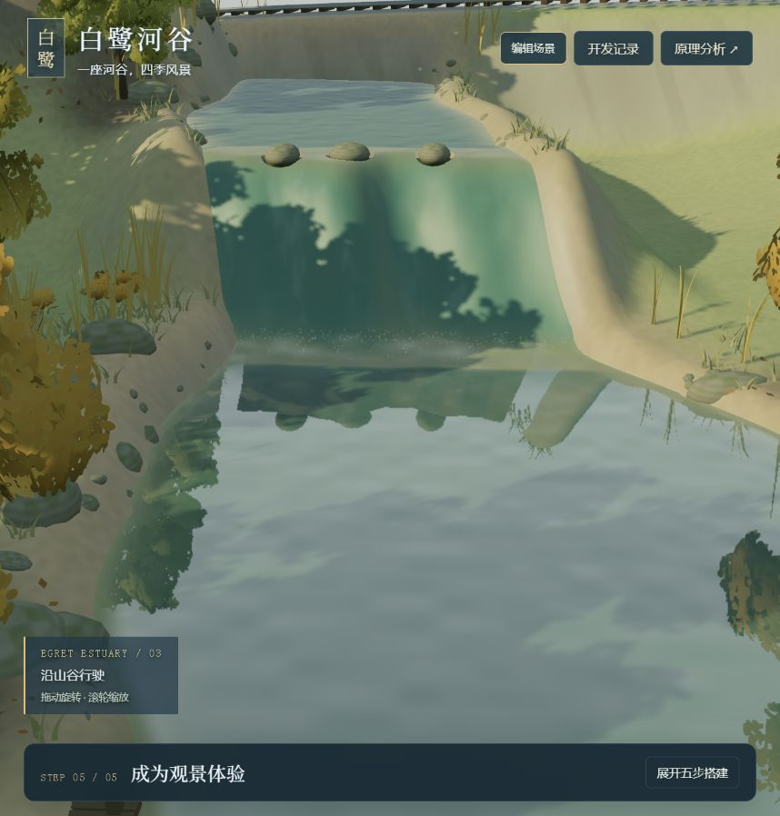

## V15 · 山体、坡脚与空地的连续衔接

2026-09-14 · 已验证 · 地形轮廓 / 坡脚过渡 / 四季检查

降低铁路旁的墙面感，让山体轮廓、露岩、坡草与空地形成连续关系。

**为什么这样改：** 在补齐山后细节后，优先修正基础地形，避免靠堆叠物件掩盖陡切坡。

### 实现过程

1. 保存山后修改前实际画面。
2. 把铁路旁上升地形改为圆滑坡脚、宽切坡与山脊的连续衔接，保留布树参考布局和铁路高程。
3. 移除旧的陡壁岩片布点，改成低矮露岩群及顺坡的小碎石；逐顶点贴合实际地形，底壳埋入土层。
4. 露岩、草坡按连续坡度和宽尺度斑块混合，沿用现有四季覆雪与雨天湿润处理。

### 问题与修正

- 小碎石缩小后原布点余量不足，设置最小 0.65 m 边缘余量并重新通过既有布点检查。
- 贴坡岩石初次试拍颜色偏亮，降低底色并加入细微纹理；纹理变量与覆雪变量同名造成编译错误，改为独立名称后重新加载，最终检查未捕获新增渲染错误。
- 山后镜头改用稳定的布局参考高度，避免削坡后机位随之降低，方便观察轮廓差异。

### 实际验证

- 38 项自动检查全部通过，新增山后坡度、坡脚连续、轨道平台净空和完整岩石顶点贴地检查。
- 默认溪谷山后指定采样区域的最大坡度由旧参考约 10.858 降至 1.819；只代表该采样区域与默认配置。
- 保存 13 张实际画面：修改前山后、溪谷山后四季、夏冬全景、夏季空地、夏夜全景、夏雨山后、浅湾夏季山后、原有河谷默认及高起伏基底夏季山后。
- 浏览器实际切换三种构图、四季、夜间和雨景，并编辑原有河谷的高起伏基底；恢复其默认基底后回到溪谷，夏季、岩间分流、自动季节光线与山后机位已恢复。
- 最终重新加载后的检查范围未捕获新增着色器错误，仅保留既有 PCFSoftShadowMap 弃用警告。

### 当前边界

- 本轮只修正高地被铁路切开的上升坡面；低地抬升路堤、岛体侧壁和近河岸的局部陡面仍是简化造型。
- 靠近铁路的山体局部高度随开坡降低；山后机位改用旧布点参考高度，前后图是同一观察入口，镜头高度与目标点可能存在微小差异，列车和风动时刻不同。
- 露岩按地表投影形成薄壳，近看仍有面片和程序化重复感，草丛疏密与车站周边的生活内容还需细化。
- 自动坡度与顶点检查不代表所有编辑参数的美术验收；本轮未完成移动设备、长时性能基准、侵蚀或真实地质模拟。

对应实现：[scene-world.mjs](app/scene-world.mjs) · [scene-regions.mjs](app/scene-regions.mjs) · [scene-landscape.mjs](app/scene-landscape.mjs) · [scene-ground.mjs](app/scene-ground.mjs) · [scene.test.mjs](app/scene.test.mjs)

四季与光线实景：[溪谷山后 · 春](assets/scene-v15-ridge-back-spring.jpg) · [溪谷山后 · 夏](assets/scene-v15-ridge-back-summer.jpg) · [溪谷山后 · 秋](assets/scene-v15-ridge-back-autumn.jpg) · [溪谷山后 · 冬](assets/scene-v15-ridge-back-winter.jpg) · [溪谷全景 · 夏](assets/scene-v15-ridge-overview-summer.jpg) · [溪谷全景 · 冬](assets/scene-v15-ridge-overview-winter.jpg) · [林间空地 · 夏](assets/scene-v15-ridge-meadow-summer.jpg) · [溪谷夏夜](assets/scene-v15-ridge-night.jpg) · [溪谷山后 · 夏雨](assets/scene-v15-ridge-back-rain.jpg) · [浅湾山后 · 夏](assets/scene-v15-marsh-back-summer.jpg) · [原有河谷 · 夏](assets/scene-v15-classic-back-summer.jpg) · [原有河谷 · 高起伏基底](assets/scene-v15-classic-canyon-summer.jpg)

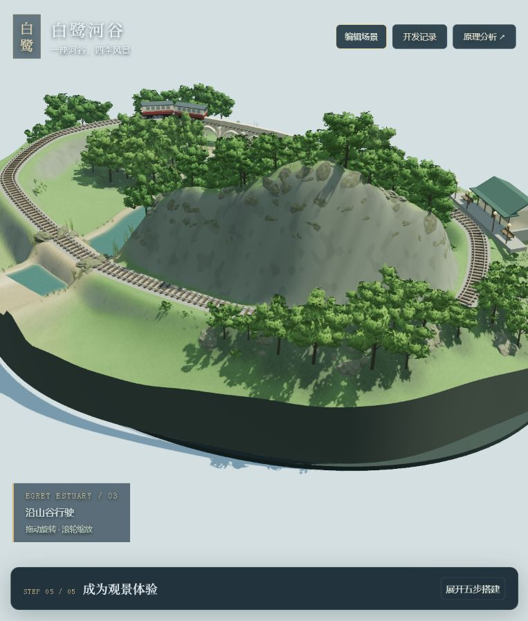

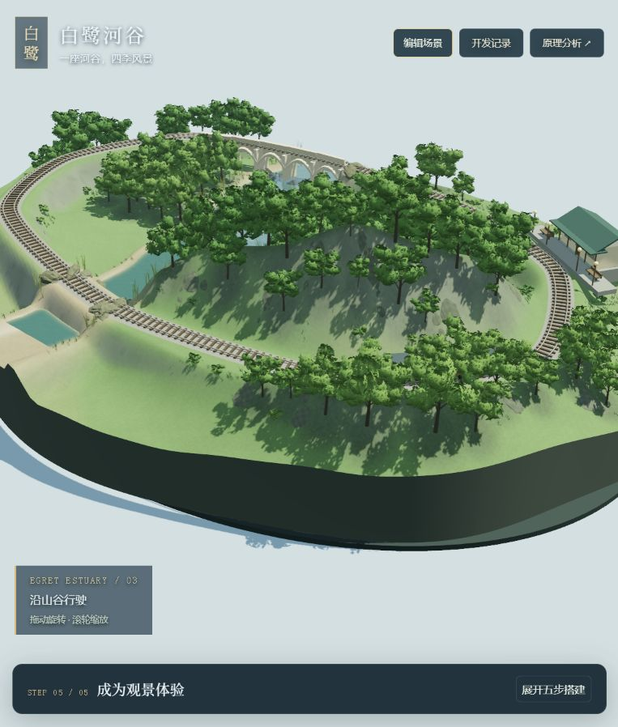

## V14 · 空地、山后坡地与全域细节

2026-09-14 · 已验证 · 整体场景 / 坡地 / 植被

补齐主镜头之外的空地和山背面，形成疏密与地形对应的细节。

**为什么这样改：** 用户要求继续补全此前忽略的空地、山背面等区域。

### 实现过程

1. 增加林间空地、山后坡地观察入口，先保存山后同机位修改前画面。
2. 按坡度、树冠覆盖、铁路与岸距在全岛散布低矮灌木、坡草和局部岩石群；保留开阔地，不按镜头方向放置。
3. 新增灌木有枝干和叶簇，沿用季节与共享风场；少量倒木沿地表落置，石块与倒木沿用覆雪处理。
4. 针对铁路整平造成的陡切坡补充薄嵌岩和局部微起伏，布点参考地形保持旧值，轨道中心地形不受起伏影响。
5. 空地机位根据实际树木密度、坡度和岸距选择开阔位置；地形重建后两个新机位同步更新。

### 问题与修正

- 第一次空地机位被树冠遮挡；抬高后仍不够开阔，进一步改为搜索实际空地。试拍留在 assets，未作为最终机位对照。
- 初版坡面色带过于规则，改为不规则斑驳；陡坡露岩集中在坡顶，改用更薄岩片、按三维距离分散至不同高度。
- 低缓浅湾缺少符合条件的露岩，保留该结果，不强行补足与溪谷同样数量。

### 实际验证

- 36 项自动检查全部通过，新增全域细节可复现、后坡覆盖、布点避让、机位随地形调整、枯木贴地等检查。
- 另外用三种默认构图且空树列表检查新增岩石变换后顶点，距轨道中心最近 2.768 m，未越出岛边界；该数值不代表所有编辑组合。
- 实景查看溪谷山后四季、浅湾空地四季，另看溪谷夏季空地与浅湾夏季山后；网页保存十张最终画面和一张山后修改前图。
- 修正后检查范围内未捕获新增渲染错误；有驱动浮点精度编译警告及既有阴影类型弃用警告，画面正常渲染。
- 构图切换后溪谷保留岩间分流，浅湾使用默认浅滩；最后恢复溪谷夏季与山后机位。

### 当前边界

- 铁路整平形成的陡切坡仍是简化地形，岩片与微起伏不能替代完整地质建模或侵蚀模拟。
- 保留部分裸地和空隙；新灌木与草丛仍有程序化重复感，冬季灌木使用简化裸枝。
- 新增几何和全域采样增加构建开销，尚未做设备性能基准与远近细节分级。
- 实景检查覆盖两个新机位的代表组合，并非所有视角、天气和地形极值都已视觉验收。

对应实现：[scene-regions.mjs](app/scene-regions.mjs) · [scene-vegetation.mjs](app/scene-vegetation.mjs) · [scene-landscape.mjs](app/scene-landscape.mjs) · [scene-ground.mjs](app/scene-ground.mjs) · [scene-world.mjs](app/scene-world.mjs) · [scene.mjs](app/scene.mjs) · [scene.html](app/scene.html) · [scene.test.mjs](app/scene.test.mjs)

四季与光线实景：[溪谷山后 · 春](assets/scene-v14-ridge-back-spring.jpg) · [溪谷山后 · 夏](assets/scene-v14-ridge-back-summer.jpg) · [溪谷山后 · 秋](assets/scene-v14-ridge-back-autumn.jpg) · [溪谷山后 · 冬](assets/scene-v14-ridge-back-winter.jpg) · [浅湾空地 · 春](assets/scene-v14-marsh-meadow-spring.jpg) · [浅湾空地 · 夏](assets/scene-v14-marsh-meadow-summer.jpg) · [浅湾空地 · 秋](assets/scene-v14-marsh-meadow-autumn.jpg) · [浅湾空地 · 冬](assets/scene-v14-marsh-meadow-winter.jpg) · [溪谷空地 · 夏](assets/scene-v14-ridge-meadow-summer.jpg) · [浅湾山后 · 夏](assets/scene-v14-marsh-back-summer.jpg)

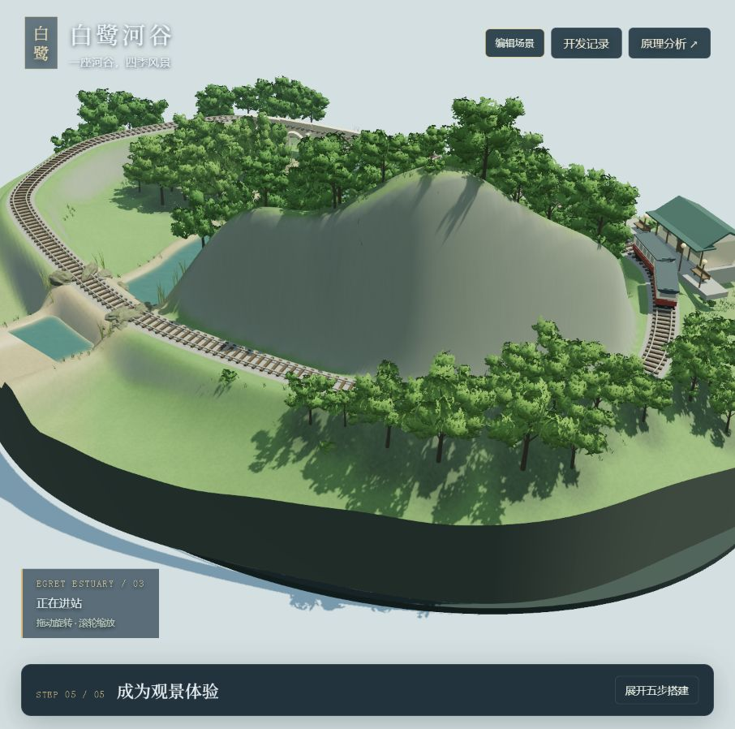

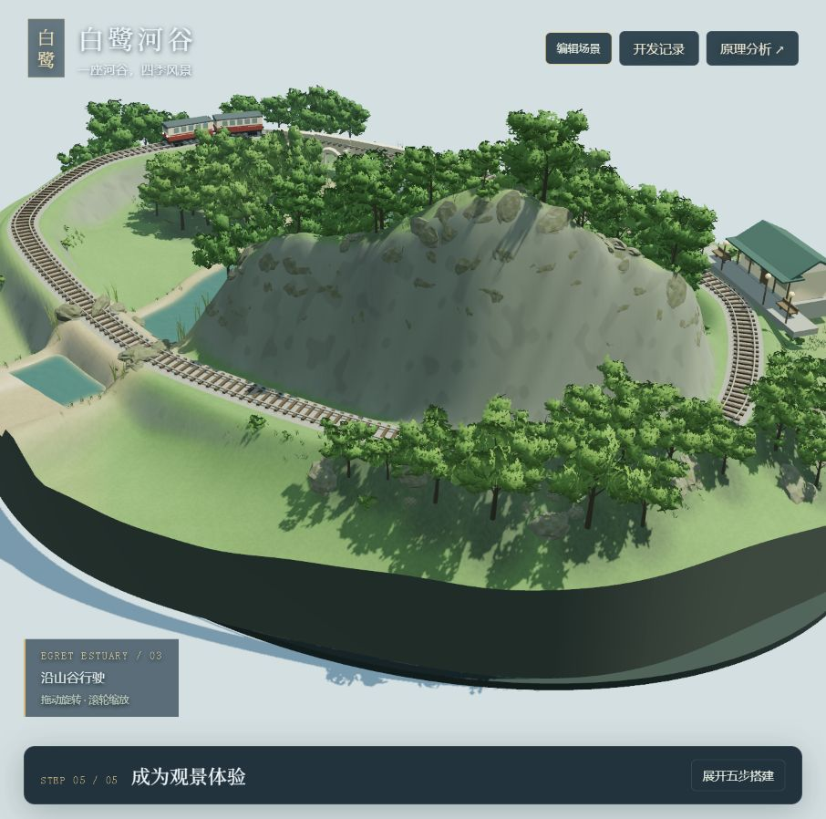

## V13 · 草丛疏密与真实树下地表

2026-09-14 · 已验证 · 地表 / 植被 / 用户反馈

减少空旷草地与树下黄底，补充贴地草丛、落叶和暗土。

**为什么这样改：** 用户指出 V12 地表仍过空，树下呈现大片黄色，需要更接近现实场景的地面层次。

### 实现过程

1. 保存秋季河岸同机位修改前画面；保留用户当前的岩间分流水流模式。
2. 先生成植被，再根据实际树根位置与树高建立连续的林地覆盖范围，地形重建时同步更新。
3. 增加独立种子的疏密短草分布，林下较稀，避开水域、轨道、树干与车站主体；每根草根部贴合地形。
4. 秋季林地底色改为较暗土色，加入细颗粒与斑驳变化；草坡保留更多绿灰色，减弱大片黄底。
5. 每树落叶候选从 17 片增加至 70 片，缩小叶片、压暗颜色，每个顶点贴合坡面，继续由季节与地面覆盖滑块控制。

### 问题与修正

- 自动检查发现林地色压缩了岸缘裸土；林地覆盖改为随岸距淡出，修正后所有检查通过。
- 旧草丛偏移后仍沿用中心高度，现重新采样每个根部高度，减少斜坡悬浮。
- 使用独立草丛随机源，避免新增短草连带改变原树木布点。

### 实际验证

- 34 项自动检查全部通过；新增实际树木移动/删除后的林地响应、分区归一、短草可复现、贴地及避让铁路水域车站树干检查。
- 实际查看并保存溪谷与浅湾八个四季全景，秋季树下修改前后、冬季溪谷近景与夏季浅湾近景，共十二张截图。
- 检查时溪谷实际 116 棵树、10536 根草叶，地面落叶候选 7702 片；可见数量受季节及地面覆盖滑块影响，这些不是全部同时可见。
- 切换构图后返回溪谷仍保留岩间分流；最后恢复秋季推荐光线，停留河岸植被机位方便查看修改。
- 检查范围内未捕获新增渲染错误；有驱动浮点精度编译警告及既有阴影类型弃用警告，当前画面可正常渲染。

### 当前边界

- 树下覆盖由树根和树高估算，不是精确冠层投影、土壤水分或真实生态模拟。
- 短草采用重复的简化叶片与程序化散布；极近景仍有片面感，陡岸和铁路周围保留裸地。
- 本轮增加草叶及落叶几何开销，未完成设备性能基准或远近细节分级。
- 视觉检查覆盖八个四季组合与近景，不代表所有天气和编辑参数组合都已视觉验收。

对应实现：[scene-ground.mjs](app/scene-ground.mjs) · [scene-ground-cover.mjs](app/scene-ground-cover.mjs) · [scene-vegetation.mjs](app/scene-vegetation.mjs) · [scene-details.mjs](app/scene-details.mjs) · [scene-seasons.mjs](app/scene-seasons.mjs) · [scene.mjs](app/scene.mjs) · [scene.test.mjs](app/scene.test.mjs)

四季与光线实景：[层峦溪谷 · 春](assets/scene-v13-ridge-spring.jpg) · [层峦溪谷 · 夏](assets/scene-v13-ridge-summer.jpg) · [层峦溪谷 · 秋](assets/scene-v13-ridge-autumn.jpg) · [层峦溪谷 · 冬](assets/scene-v13-ridge-winter.jpg) · [疏林浅湾 · 春](assets/scene-v13-marsh-spring.jpg) · [疏林浅湾 · 夏](assets/scene-v13-marsh-summer.jpg) · [疏林浅湾 · 秋](assets/scene-v13-marsh-autumn.jpg) · [疏林浅湾 · 冬](assets/scene-v13-marsh-winter.jpg) · [溪谷冬季 · 枯草与雪面](assets/scene-v13-ridge-winter-bank.jpg) · [浅湾夏季 · 林下草丛](assets/scene-v13-marsh-summer-bank.jpg)

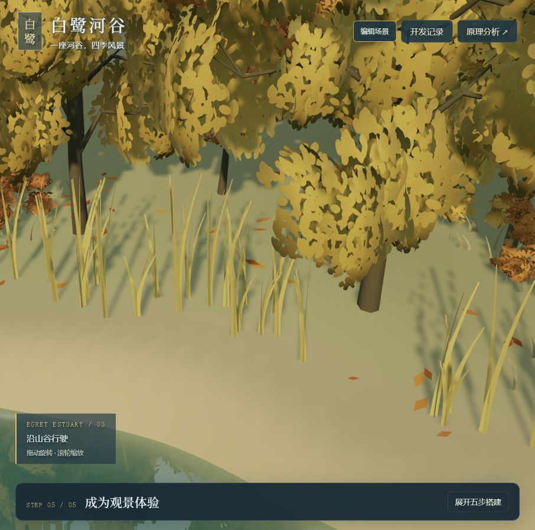

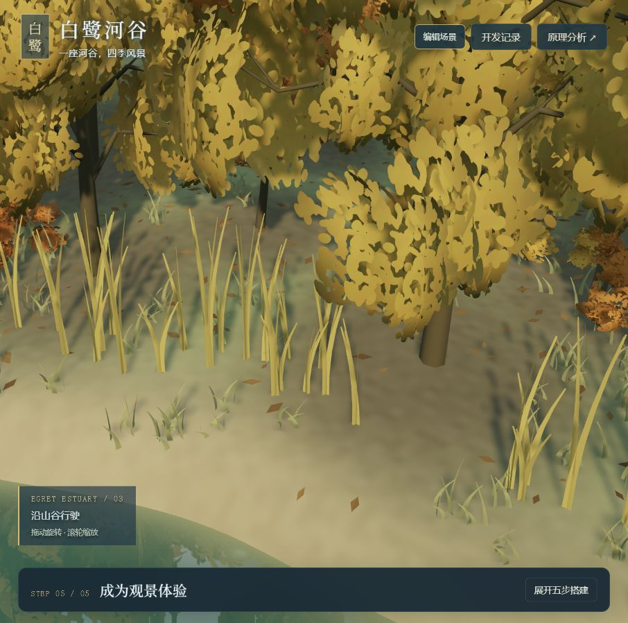

## V12 · 地表分区与四季草地配色

2026-09-14 · 已验证 · 地表 / 四季 / 配色

修正大片灰绿草地，协调草坡、林地、湿岸与裸土。

**为什么这样改：** 用户指出草地绿色不自然，确认先统一环境配色，再建设站点生活场景。

### 实现过程

1. 保存溪谷秋季同机位修改前画面，保留既有照明、树木和水体参数作为比较基础。
2. 取消统一绿色叠乘季节色，改用经过线性空间转换的四季独立地表色板。
3. 按坡度、岸距与种植区域生成草坡、林地、裸土和岩面权重，使用低频变化形成成片过渡。
4. 草丛从芦苇着色分支独立，共用草地季节色；秋季保留残绿，冬季使用枯草底色并降低雪面高频颜色扰动。
5. 保留湿润与反射剔除规则，在两种景观与代表性光线中检查地面和树木、水体的关系。

### 问题与修正

- 第一轮秋季地表过于米黄，压低草坡亮度并增加区域残绿后重新采集四季画面。
- 林地留白边界使用平滑过渡，混合余量限制为非负，避免微小负权重。
- 地表基础色覆盖旧颜色后，显式补回天气湿润系数，避免雨景湿润着色被覆盖。

### 实际验证

- 32 项自动检查全部通过，新增地表分区归一与连续性、陡坡露岩、近岸露土、零树密度、季节混合颜色有界和秋季残绿检查。
- 实际查看并保存溪谷与浅湾共八个四季全景，另保存秋季白天、秋季夜间、浅湾夏季雨景及秋季河岸近景；加修改前画面，共十三张。
- 切景观及四季后地表颜色正常更新；最终恢复溪谷秋季推荐黄昏与全景。树木布局、轨道和河床几何未改动。
- 最终重新加载后的检查范围内未捕获新增控制台错误；仍有既有 PCFSoftShadowMap 弃用警告，运行时自动回退 PCFShadowMap。

### 当前边界

- 林地色依据种植分区与密度近似，不是逐树树冠覆盖、烘焙阴影或生态模拟；向阳明暗由原有实时光照表现。
- 地表近景仍偏平滑，没有细密草坪纹理、法线贴图或植被生长模拟。
- 本轮保持树色和水色参数，以便观察地表调整的效果；站点生活样板尚未制作。
- 代表性光线检查不等于全部组合视觉验收，未做设备性能基准；配色仍需依据用户实际观感继续调整。

对应实现：[scene-ground.mjs](app/scene-ground.mjs) · [scene-world.mjs](app/scene-world.mjs) · [scene-seasons.mjs](app/scene-seasons.mjs) · [scene-vegetation.mjs](app/scene-vegetation.mjs) · [scene.test.mjs](app/scene.test.mjs)

四季与光线实景：[层峦溪谷 · 春](assets/scene-v12-ridge-spring.jpg) · [层峦溪谷 · 夏](assets/scene-v12-ridge-summer.jpg) · [层峦溪谷 · 秋](assets/scene-v12-ridge-autumn.jpg) · [层峦溪谷 · 冬](assets/scene-v12-ridge-winter.jpg) · [疏林浅湾 · 春](assets/scene-v12-marsh-spring.jpg) · [疏林浅湾 · 夏](assets/scene-v12-marsh-summer.jpg) · [疏林浅湾 · 秋](assets/scene-v12-marsh-autumn.jpg) · [疏林浅湾 · 冬](assets/scene-v12-marsh-winter.jpg) · [溪谷秋季 · 手动白天](assets/scene-v12-ridge-autumn-day.jpg) · [溪谷秋季 · 手动夜间](assets/scene-v12-ridge-autumn-night.jpg) · [浅湾夏季 · 手动雨景](assets/scene-v12-marsh-summer-rain.jpg) · [秋季河岸地表近景](assets/scene-v12-ridge-bank.jpg)

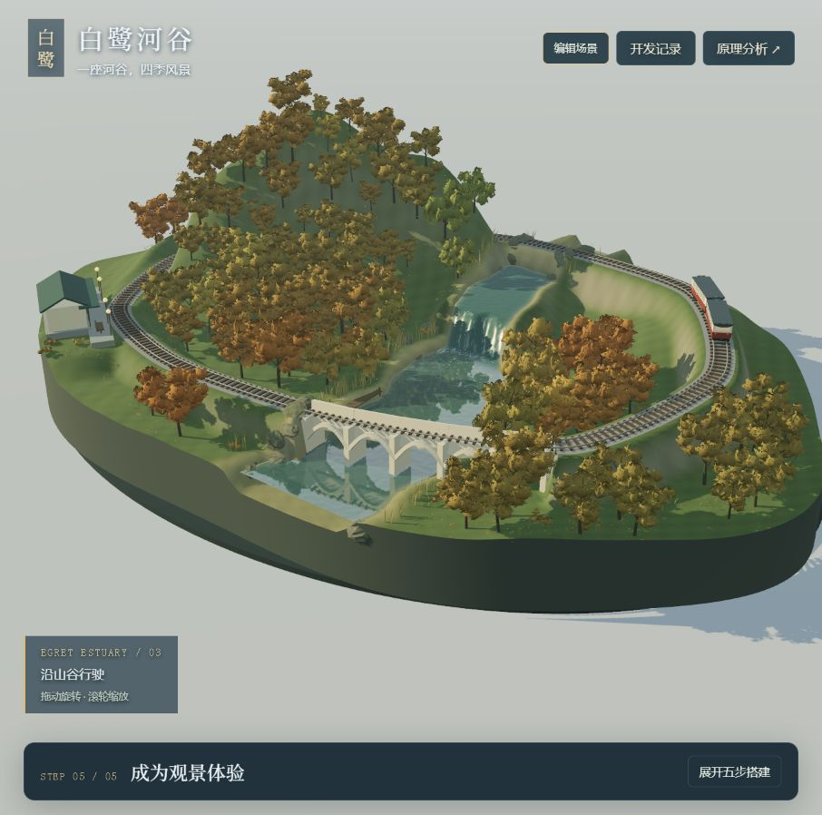

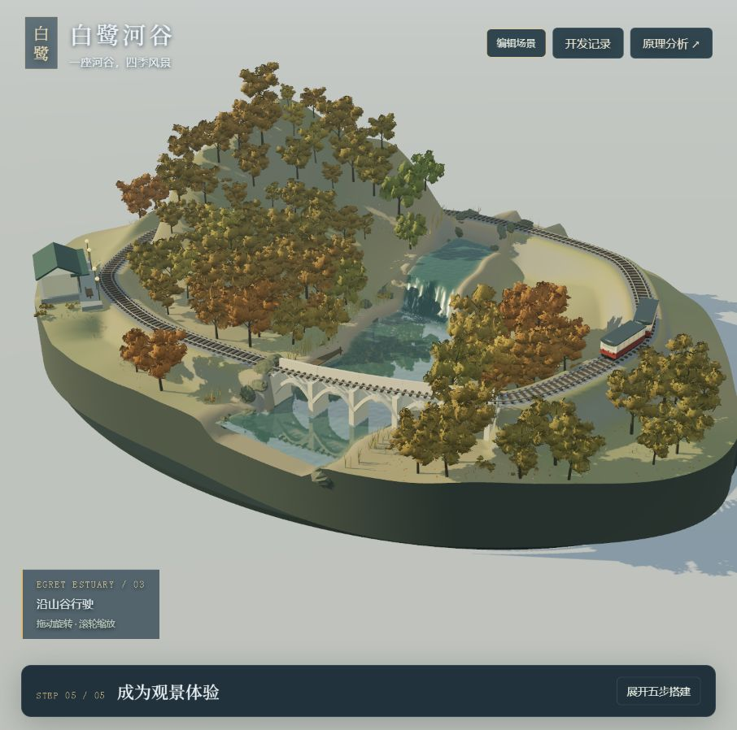

## V11 · 树冠体积、自然枝形与四季植被

2026-09-14 · 已验证 · 植被 / 四季 / 风场

改善树群体积与近景枝叶，在溪谷和浅湾两种构图中验证四季表现。

**为什么这样改：** 用户确认优先优化树林层次，同时保持四季、光线和现有控制匹配。

### 实现过程

1. 把树木形态生成与布点采样分开，使用固定种子的局部枝形，树型和区域色调由位置确定。
2. 主干分段弯曲，枝条连续分叉、逐级变细，岸树采用下垂末梢。
3. 叶簇改为三个朝向的弯曲片面，配合冠层法线和内部明暗，增加整体树冠厚度。
4. 按树型和区域控制春季花色、秋季变色及叶量；冬季过渡完成后落叶，画面与阴影共用规则。
5. 宽窗口增加收起编辑面板的入口，方便查看完整画面。

### 问题与修正

- 第一轮全景的叶簇间隙偏大，增加不同树型的叶簇重叠，重新检查并保存四季画面。
- 减少叶簇局部颤动幅度，枝干和叶簇继续使用共享风场；渐细枝条的可见材质与深度材质采用相同形变。

### 实际验证

- 30 项自动检查全部通过；新增枝形可复现、连续连接与逐级变细、三维叶簇几何和法线、区域色调与四季叶量检查。
- 实际检查并保存层峦溪谷、疏林浅湾共八个四季全景；另存秋季树冠、冬季裸枝近景及修改前近景。V11 溪谷实际 116 棵树，同一景观换季不重建植被。
- 浅湾冬季手动选择夜间，切夏季再切溪谷后仍为夜间，夏夜萤火权重为 1；设风力 0 后切浅湾仍为 0，且保留手动夜景。
- 实际查看秋季河岸风力 100% 近景，随后恢复秋季推荐风力与光线；最终页面回到溪谷秋季全景。
- 检查范围内没有捕获新增控制台错误；仍有既有 PCFSoftShadowMap 弃用警告，运行时自动使用 PCFShadowMap。

### 当前边界

- 仍是程序化枝形和叶簇：极近距离可见片面，裸枝还有折线感；未达到树木扫描或生长模拟的精度。
- 本轮分离形态与布点随机数后重新生成了树木位置，不能与 V10 逐树对比；同一版本四季保持位置不变。
- 单叶簇由 2 个三角形增加至 54 个，实例化保留但几何开销上升；未做设备性能基准或长期稳定性测试。
- 八个四季画面加代表性夜景和风场检查，不代表所有设置组合都通过视觉验收。

对应实现：[scene-tree-shape.mjs](app/scene-tree-shape.mjs) · [scene-vegetation.mjs](app/scene-vegetation.mjs) · [scene-seasons.mjs](app/scene-seasons.mjs) · [scene.css](app/scene.css) · [scene.test.mjs](app/scene.test.mjs)

四季与光线实景：[层峦溪谷 · 春](assets/scene-v11-ridge-spring.jpg) · [层峦溪谷 · 夏](assets/scene-v11-ridge-summer.jpg) · [层峦溪谷 · 秋](assets/scene-v11-ridge-autumn.jpg) · [层峦溪谷 · 冬](assets/scene-v11-ridge-winter.jpg) · [疏林浅湾 · 春](assets/scene-v11-marsh-spring.jpg) · [疏林浅湾 · 夏](assets/scene-v11-marsh-summer.jpg) · [疏林浅湾 · 秋](assets/scene-v11-marsh-autumn.jpg) · [疏林浅湾 · 冬](assets/scene-v11-marsh-winter.jpg) · [冬季裸枝近景](assets/scene-v11-ridge-winter-bank.jpg)

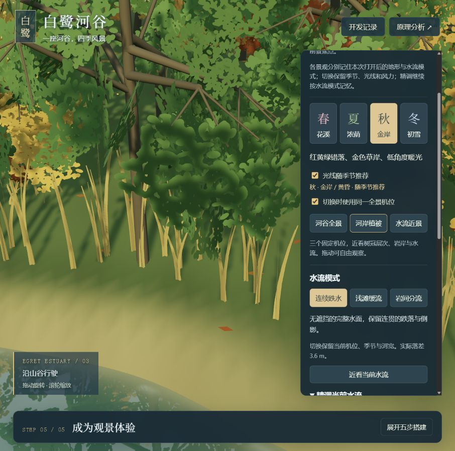

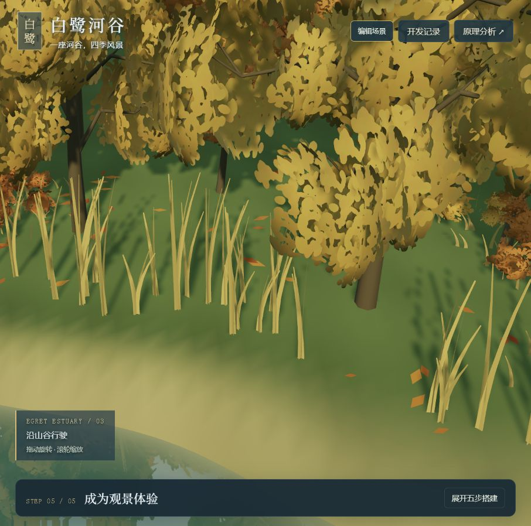

## V10 · 两种景观构图与四季光线匹配

2026-09-14 · 已验证 · 整体构图 / 四季 / 光线

以差异明显的溪谷和浅湾验证可复用地形、植被、材质与光照能力，保留既有场景控制。

**为什么这样改：** 用户确认用主场景与第二场景共同检验能力，特别要求匹配页面已有四季、光线等设置。

### 实现过程

1. 新增层峦溪谷、疏林浅湾构图配置，并保留第九版原有河谷。
2. 构图集中管理山体体块、岸线色带、树林分组与全景机位，使用同一套季节和水体系统。
3. 各景观分别缓存地形与水流模式；切换景观保留当前季节、光线和风力，精调仍按水流模式独立记忆。
4. 增加光线随季节推荐选项；手动选光线后跨季节保持，仍应用相应季节的色调。

### 问题与修正

- 窄窗口拉远全景后距离雾过浓，按镜头拉远比例补偿雾密度，重新检查两种景观四季。
- 窄窗口原样式隐藏光线说明，改为始终显示当前季节、光线与自动/手动状态。
- 季节、环境按钮选择器限定到按钮，避免与页面诊断属性混淆。

### 实际验证

- 27 项自动检查通过；新增 36 种构图/地形基底/水流组合的净空与水面关系、48 种构图/四季/光线参数组合、配置缓存隔离与植被疏密检查。
- 实际查看并保存两种新景观的八张四季截图：溪谷 114 棵树，浅湾 90 棵树；同一景观的四季不改变树木位置和数量。
- 浅湾手动夜景切冬季后保持夜间；切溪谷夏季仍为夜间，萤火可见权重为 1。原有河谷切春季保留雨景，雨量读数约 70%。
- 浅湾修改半宽 11 m 与岩间分流后切溪谷，溪谷仍为 6 m 与连续跌水；切回浅湾保留修改。风力 0 与手动雨景跨构图保持。既有高落差基底可继续应用。
- 修正后检查范围内未捕获新增控制台错误；网页开发记录提供四季和光线实景对照。

### 当前边界

- 铁路线路与建筑保持既有布局；本轮未实现任意轨道或场景生成器。
- 构图为可扩展配置，缓存只在本次页面打开期间有效；切季节仍会应用该季节的推荐风力和水流速度。
- 48 项组合指自动参数检查，不代表对每个组合都做了视觉验收；未做真实手机和长期性能评测。
- 树冠仍为叶簇，冬季裸枝仍有规则感；美术完成度需继续依据用户观感调整。

对应实现：[scene-composition.mjs](app/scene-composition.mjs) · [scene-world.mjs](app/scene-world.mjs) · [scene-vegetation.mjs](app/scene-vegetation.mjs) · [scene.mjs](app/scene.mjs) · [scene.html](app/scene.html)

四季与光线实景：[层峦溪谷 · 春](assets/scene-v10-ridge-spring.jpg) · [层峦溪谷 · 夏](assets/scene-v10-ridge-summer.jpg) · [层峦溪谷 · 秋](assets/scene-v10-ridge-autumn.jpg) · [层峦溪谷 · 冬](assets/scene-v10-ridge-winter.jpg) · [疏林浅湾 · 春](assets/scene-v10-marsh-spring.jpg) · [疏林浅湾 · 夏](assets/scene-v10-marsh-summer.jpg) · [疏林浅湾 · 秋](assets/scene-v10-marsh-autumn.jpg) · [疏林浅湾 · 冬](assets/scene-v10-marsh-winter.jpg) · [疏林浅湾 · 冬季手动夜景](assets/scene-v10-marsh-winter-night.jpg) · [原有河谷 · 春季手动雨景](assets/scene-v10-classic-spring-rain.jpg)

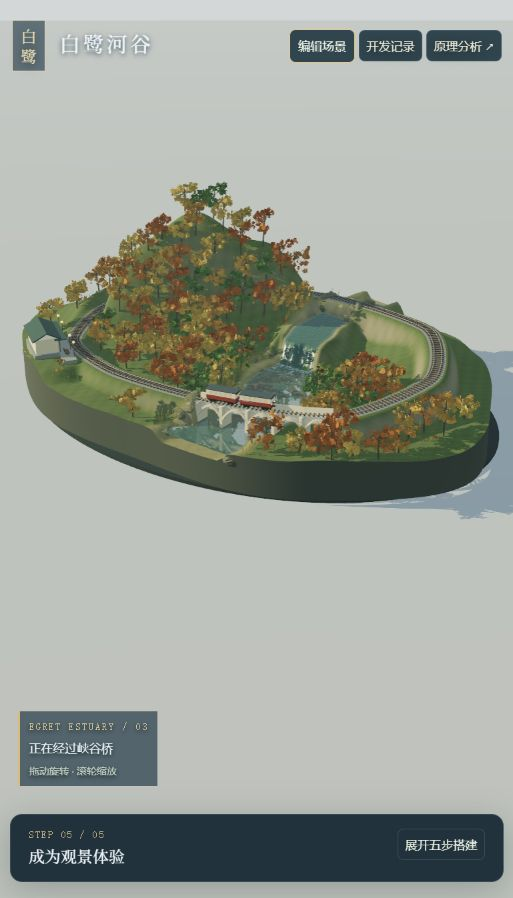

## V9 · 河岸衔接与入潭白沫消散

2026-09-14 · 已验证 · 水体 / 画质基准

以秋季连续跌水为样板，改善河岸接触、重复亮纹和入潭白沫。

**为什么这样改：** 用户确认先打磨默认画质；近景可见水面在固定宽度处截断，跌水亮纹过长、入潭白沫呈横带。

### 实现过程

1. 微调河床横断面与岸缘高度，让水面延伸至浅水和陆地交界，边缘扰动随水深收敛。
2. 湿润岸缘采用水面与地表高差着色，减弱浅水处倒影，保留季节覆雪。
3. 水纹加入多尺度噪声与坐标扰动，降低连续长亮条，保留快慢行程。
4. 入潭泡沫增加生成、横向扩散和渐隐过程；改为实例化绘制，减少独立网格。

### 问题与修正

- 首次材质使用了 GLSL 保留字 patch，浏览器编译失败；改名后重新检查，未捕获新增错误。
- 河岸修改导致植被随机布点连带变化；保留原布点参考横断面，根部仍贴合新地表。岸石避免随岸缘抬高而额外露出。
- 提高地表网格精度，减轻水陆交界折线；反射通道剔除上游水下河床，减少入潭处褐色反射。
- 统一首次加载与重建后的水流机位，使同机位对照可复现。

### 实际验证

- 24 项自动检查通过，新增九种地形/模式组合的岸缘高差、湿润属性边界，以及白沫生成/消散、沿下游移动、横向不越岸和行程反解检查。
- 实际查看秋季连续水流的水流近景、河岸植被、河谷全景，保存三张画面及修改前近景。默认湿地保留 150 棵树。
- 检查浅滩白沫为零及恢复默认；检查冬季后返回秋季连续跌水。修正后检查范围内未捕获新增控制台错误。

### 当前边界

- 河岸与水面交界使用程序化高度近似；平面倒影仍有简化轮廓，未实现真实折射或流体碰撞。
- 白沫为有生命周期的艺术化动画，不代表水量守恒。
- 提高地表精度增加了几何开销；实例化减少白沫绘制批次，但未测量整场景净性能收益。
- 本轮技术与实景检查不代表美术质量已经获得用户认可。

对应实现：[scene-water.mjs](app/scene-water.mjs) · [scene-water-modes.mjs](app/scene-water-modes.mjs) · [scene-world.mjs](app/scene-world.mjs) · [scene-seasons.mjs](app/scene-seasons.mjs) · [scene-vegetation.mjs](app/scene-vegetation.mjs) · [scene-landscape.mjs](app/scene-landscape.mjs) · [scene.mjs](app/scene.mjs) · [dev-log.mjs](app/dev-log.mjs)

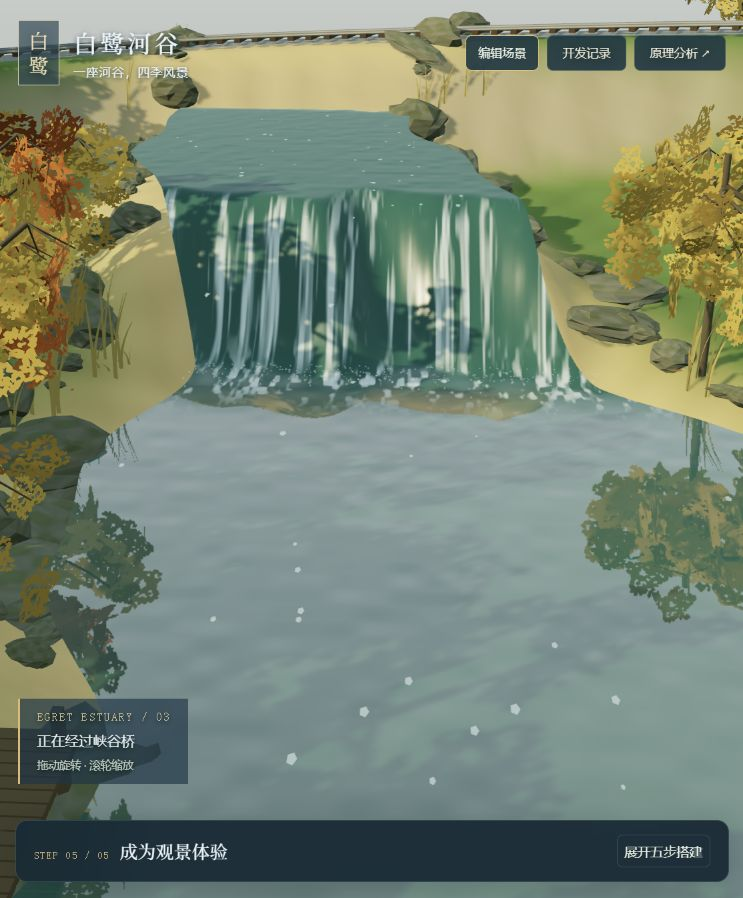

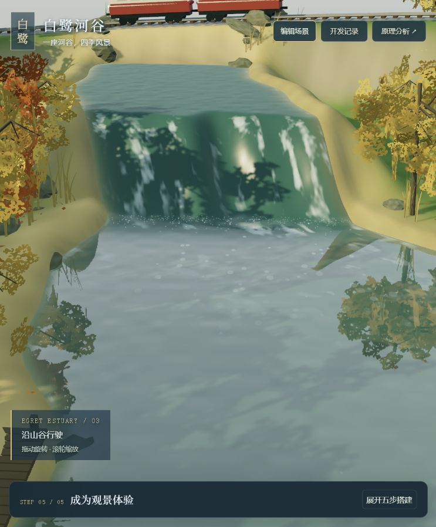

## V8 · 连续水流分段速度与独立精调

2026-09-14 · 已验证 · 水体 / 独立调节

保持无遮挡连续水流，改善流动层次，并让不同模式可独立调节细节。

**为什么这样改：** 用户确认继续精修连续水流；本轮不添加挡水岩石，转向上游、跌落、入潭的运动差异及可比较的细节控制。

### 实现过程

1. 建立连续行程函数：上游较慢、跌落逐渐加速、下游逐渐减速；水纹与漂浮泡沫使用同一行程。
2. 把流速乘绝对时间改为累积流动时间，避免调节流速导致水纹突然换位置。
3. 增加水层厚薄、白沫量、水雾量、倒影强度、水纹强度五个控制项，无需重建地形。
4. 每种模式独立保存本次页面打开期间的调节值，恢复默认只重置当前模式。

### 问题与修正

- 水雾原始透明度过低，扩大可调范围；零倒影停止平面反射更新。

### 实际验证

- 22 项自动检查通过，新增行程连续性、跌落加速与下游减速、暂停和零流速、模式参数隔离与重置检查。
- 浏览器查看默认连续水流，以及五项精调全部为零的同机位画面，保存两张实际截图。
- 切到浅滩显示该模式默认值，切回连续水流保留全零设置；恢复默认后显示 65%、50%、45%、60%、40%。检查范围内未捕获新增控制台错误。

### 当前边界

- 厚薄通过深浅水色和跌水色调表现，并非真实体积厚度或透射。
- 水流速度曲线为艺术化驱动，不等同流体模拟。
- 设置仅在本次页面打开期间保存，刷新后回到默认值。

对应实现：[scene-water-modes.mjs](app/scene-water-modes.mjs) · [scene-water.mjs](app/scene-water.mjs) · [scene.mjs](app/scene.mjs) · [scene.html](app/scene.html)

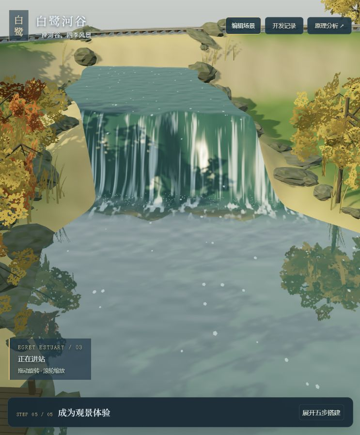

## V7 · 恢复连续水流，建立多模式比较

2026-09-14 · 已验证 · 用户反馈 / 水体 / 模式

恢复用户更认可的无遮挡水流，同时把岩石分流保留为可选方案。

**为什么这样改：** 用户认为加石头和固定水束路径后反而不如此前合理。增加细节不代表效果更好，应保留不同表现方向，用相同机位比较。

### 实现过程

1. 默认恢复连续跌水，移除跌水中的挡水岩块与强制分束，仅保留河岸景物。
2. 建立连续跌水、浅滩缓流、岩间分流三种模式，分别配置有效落差、坡段长度、泡沫、飞沫和流动速度比例。
3. 切换模式重建匹配的河床与水体，保留当前机位、季节、河宽及列车运行位置。
4. 面板显示实际落差，浅滩模式主动降低落差；地形预设和四季切换保留水流模式。

### 问题与修正

- 纠正“加岩石和分段就是画质升级”的判断；第六版保留为试验方向，不再作为默认。
- 连续模式中部分岸石伸入跌水面，向两岸退让，避免形成挡水物。
- 入潭泡沫的位置随模式的坡段末端更新，避免浅滩仍在旧瀑布位置出现白沫。

### 实际验证

- 20 项自动检查通过，新增模式改变有效落差与坡段、保持线路和河宽、默认不分束及无效模式拒绝检查。
- 同一秋季机位实际切换三种模式并保存三张截图；浅滩实测有效落差 0.792 m，面板显示 0.8 m。
- 切到冬季与沙洲地形后，岩间分流保持选中；再返回默认湿地、秋季与连续跌水。检查范围内未捕获新增控制台错误。

### 当前边界

- 岩间分流仍是视觉遮挡与人工设计水束，用户指出的生硬感尚未完全解决。
- 浅滩模式会改变有效落差与河床，不能视为只换材质的对比。
- 后续优先改善连续水流的动静层次、各模式的局部参数和自然过渡，不自动添加更多岩块。

对应实现：[scene-water-modes.mjs](app/scene-water-modes.mjs) · [scene-world.mjs](app/scene-world.mjs) · [scene-water.mjs](app/scene-water.mjs) · [scene-landscape.mjs](app/scene-landscape.mjs) · [scene.mjs](app/scene.mjs)

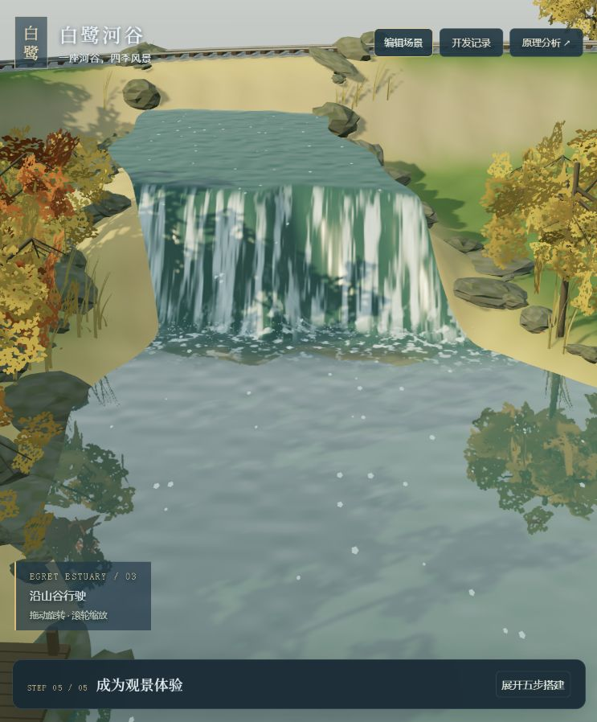

## V6 · 岩壁分段跌水与持续开发记录

2026-09-14 · 已验证 · 水体 / 开发记录

把一整片水帘改成可分辨的水束、露岩与落水区，同时建立可追踪的开发过程。

**为什么这样改：** 第五版虽加入露岩和噪声水纹，瀑布主体仍是一张连续曲面；只改颜色和泡沫密度，无法解决整齐水帘的轮廓问题。

### 实现过程

1. 建立五条宽窄不同的水束布局，让水面可见区域和飞沫落点共用数据。
2. 生成位于水束下方的连续承托岩壁；水束之间保留露岩，加入岩层颜色与潮湿区域。
3. 在跌水段裁去水束之间的水面，减少整片发白；平缓河面继续连通。
4. 每条水束配置落水飞沫和局部水雾，强度随水流速度、落差变化；暂停沿用场景时间。
5. 新增网页记录入口；同一内容源生成仓库中的开发记录，保留历史版本和截图。

### 问题与修正

- 第五版继续加露岩仍无法打破连续水帘，因此改为水束可见区域与连续岩壁共同构成轮廓。
- 首次近景中岩层横纹过于整齐，增加不规则相位并降低纹理对比。
- 将落水飞沫与岩壁间隙共用水束布局，避免水花均匀铺满整条河宽。

### 实际验证

- 19 项自动检查通过，新增水束与露岩同时存在、三种地形下岩壁与落点有效、飞沫暂停与零流速隐藏检查。
- 实际查看秋季跌水，切换高落差地形与冬季后返回；检查范围内未捕获新增控制台错误。
- 实景页可进入开发记录，七个版本条目正常显示；网页与 Markdown 共用内容源。保存本轮秋季跌水截图，保留第五版作对照。

### 当前边界

- 采用程序化曲面、可见性遮罩和粒子动画，尚未求解真实流体碰撞、体积或质量守恒。
- 水束布局目前由设计给定，不会自动寻找任意地形上的流路。
- 后续用户反馈：岩石和固定路径效果不佳，更认可无遮挡水流。V7 将其保留为可选模式，技术检查通过不等同于美术效果获认可。

对应实现：[scene-cascade.mjs](app/scene-cascade.mjs) · [scene-water.mjs](app/scene-water.mjs) · [development-records.mjs](app/development-records.mjs) · [dev-log.html](app/dev-log.html) · [build.mjs](app/build.mjs)

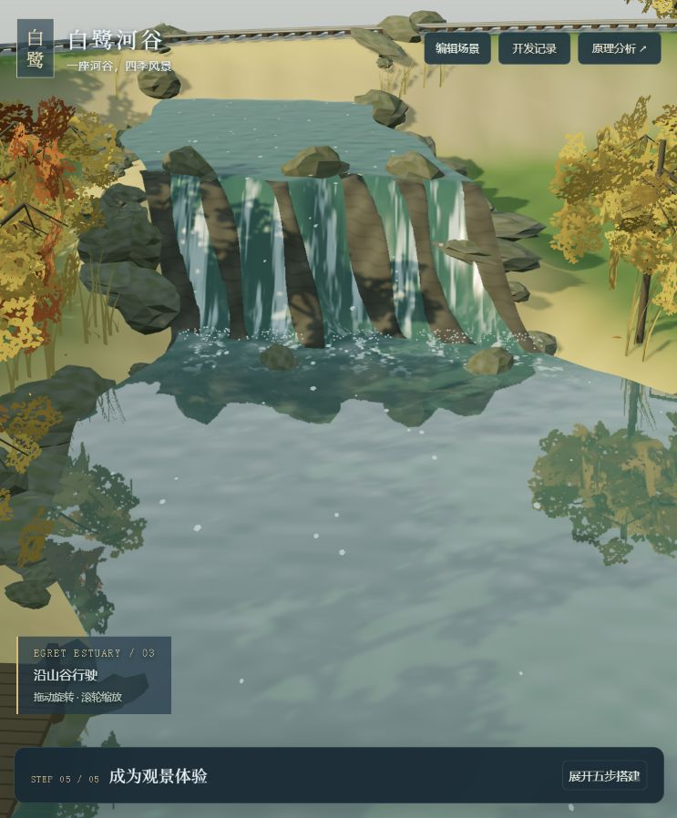

## V5 · 秋日画质基准与三个观景机位

2026-09-14 · 已验证 · 水体 / 植被 / 光照

围绕同一秋季场景改善近景水体、植物层次及整体构图。

**为什么这样改：** 场景需要形成稳定的画质基准，单纯增加粒子和开关无法提升整体完成度。

### 实现过程

1. 连续噪声替换规则波纹，跌水高程增加横向错落；河床采用相同高程函数。
2. 乔木保持最小间距，增加树高和叶簇差异；补入灌木和草丛。
3. 调整秋季暖光、反射和柔化阴影，增加全景、河岸、跌水三个入口。

### 问题与修正

- 第一轮树冠过稀，补回叶片密度。
- 近景被桥体、前景树遮挡，改从河面一侧观察；全景取消横向偏移并适当拉远。
- 发现跌水偏移影响下游水位，限定偏移只作用于跌水段。
- 露岩有悬浮感，移动到上游岩沿。

### 实际验证

- 17 项自动检查通过；检查过春夏秋冬与高落差地形重建。
- 保存三个秋季实景机位；最终重载后未捕获新增控制台错误。

### 当前边界

- 瀑布仍有连续水帘感，成为第六版的优化起点。
- 树冠有平面叶簇特征，裸枝偏规则；未做真实手机和长时间性能基准。

对应实现：[scene-water.mjs](app/scene-water.mjs) · [scene-vegetation.mjs](app/scene-vegetation.mjs) · [scene-landscape.mjs](app/scene-landscape.mjs) · [scene-seasons.mjs](app/scene-seasons.mjs) · [scene.mjs](app/scene.mjs)

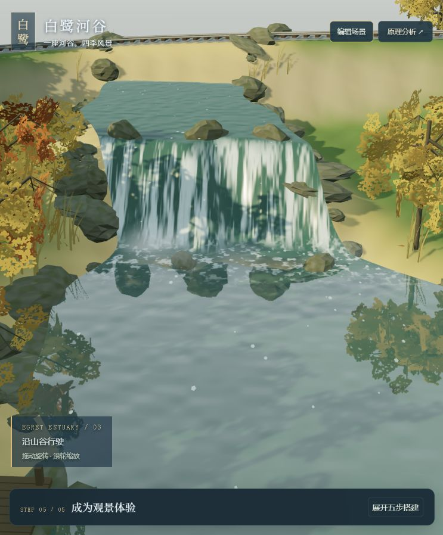

## V4 · 四季动态与地面细节

2026-09-14 · 历史回填 · 季节 / 动态

让季节变化延伸到空中、树下和河岸。

**为什么这样改：** 四季只有树冠和地表变化，还缺少可观察的季节动态。

### 实现过程

1. 从实际树木位置生成花瓣、落叶；在夏季暮色和夜间显示河岸萤火。
2. 增加地面叶片、可调降雪与雾量；地形改变后重建细节并释放旧几何。

### 问题与修正

- 粒子 Shader 使用保留字导致编译失败，改名后重新检查。

### 实际验证

- 当轮 16 项检查通过；实际查看秋季树下叶片和夏夜萤火，并保存截图。

### 当前边界

- 地面叶片不长期积累；萤火属于观景动画。

对应实现：[scene-details.mjs](app/scene-details.mjs) · [scene-seasons.mjs](app/scene-seasons.mjs)

## V3 · 同一河谷的四季主题

2026-09-14 · 历史回填 · 季节 / 光照

在同一机位比较春夏秋冬的最终效果。

**为什么这样改：** 主题需要让树冠、地表、水体和光照一起改变。

### 实现过程

1. 引入连续季节权重，联动树叶配色与保留量、地表雪色、岸冰和主题光照。
2. 可固定全景机位切换四季，避免镜头差异干扰比较。

### 问题与修正

- 落叶规则同步到阴影材质，避免叶片消失但阴影仍完整。

### 实际验证

- 保留四张同机位实景截图；季节权重有界和总和稳定纳入后续自动检查。

### 当前边界

- 花树、覆雪和岸冰主要通过材质表达，尚无真实花朵、积雪厚度或结冰过程。

对应实现：[scene-seasons.mjs](app/scene-seasons.mjs)

## V2 · 重建白鹭河谷与可编辑地形

2026-09-14 · 历史回填 · 地形 / 植被 / 水体

让地形参数真实改变场景，并与原作主题拉开差异。

**为什么这样改：** 第一版过于类似原作，地形可调性不足，风与植物的联系不直观。

### 实现过程

1. 改为河口湿地、浅色拱桥和河站；开放起伏、河宽、弯曲、落差及树木数量。
2. 调整后重建河床、岸线、植被，并给铁路保留通行空间。
3. 让柳树、乔木、芦苇、水纹和雨丝共用风向、风力与阵风；加入下游平面反射。

### 问题与修正

- 以实际地形查询约束植物布点与铁路净空；释放重建产生的旧资源。

### 实际验证

- 保留湿地、无风与强阵风截图；地形、风场、铁路净空验证纳入后续检查。

### 当前边界

- 闭合线路仍固定；不支持任意雕刻、隧道或对象自由编辑。

对应实现：[scene-world.mjs](app/scene-world.mjs) · [scene-vegetation.mjs](app/scene-vegetation.mjs) · [scene-water.mjs](app/scene-water.mjs)

## V1 · 从原理分析走向真实运行场景

2026-09-14 · 历史回填 · 场景 / 搭建

让用户实际观察逐步搭建的三维景观。

**为什么这样改：** 原理图和参数解释不能替代真实效果。

### 实现过程

1. 独立编写第一版雾溪山线，按地形轨道、列车、景观、天气、运镜五步叠加。
2. 提供暂停、天气切换、列车跟随和分阶段观察。

### 问题与修正

- 保留分析页，并把真实场景作为独立入口。

### 实际验证

- 保存基础、景观、夜景三阶段截图；列车服务和几何检查继续保留。

### 当前边界

- 美术同质化和植物水体表现不足，随后改为白鹭河谷。

对应实现：[scene-service.mjs](app/scene-service.mjs) · [scene-train.mjs](app/scene-train.mjs) · [scene.mjs](app/scene.mjs)

## R0 · 固定版本研究与效果驱动分析

2026-09-14 · 历史回填 · 研究

拆解上游作品的能力、原理、效果与扩展边界。

**为什么这样改：** 需要区分作品现有能力、可借鉴机制与尚未实现的产品设想。

### 实现过程

1. 固定上游 commit 6e8b0fbb806e486d7819b6d297b92f4ecf3d258b，核实 MIT 许可并运行验证。
2. 建立八项能力分析、参数实验与实施路线网页。

### 问题与修正

- 明确教学参数计算与真实场景不是同一套引擎。

### 实际验证

- 上游运行与构建结果保存在 notes.md；保留实测截图及许可证副本。

### 当前边界

- 上游能力和本研究自建场景分别记录，不把扩展设想写成已实现功能。

对应实现：[app.mjs](app/app.mjs) · [model.mjs](app/model.mjs) · [index.html](app/index.html)
