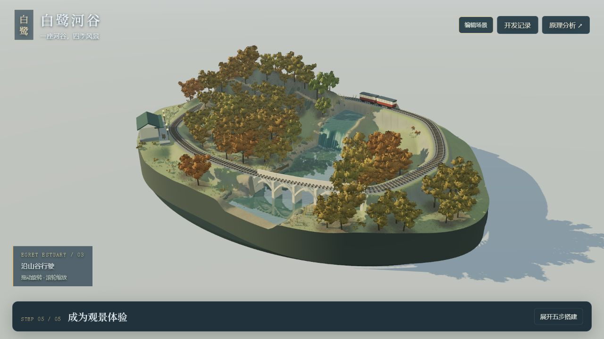
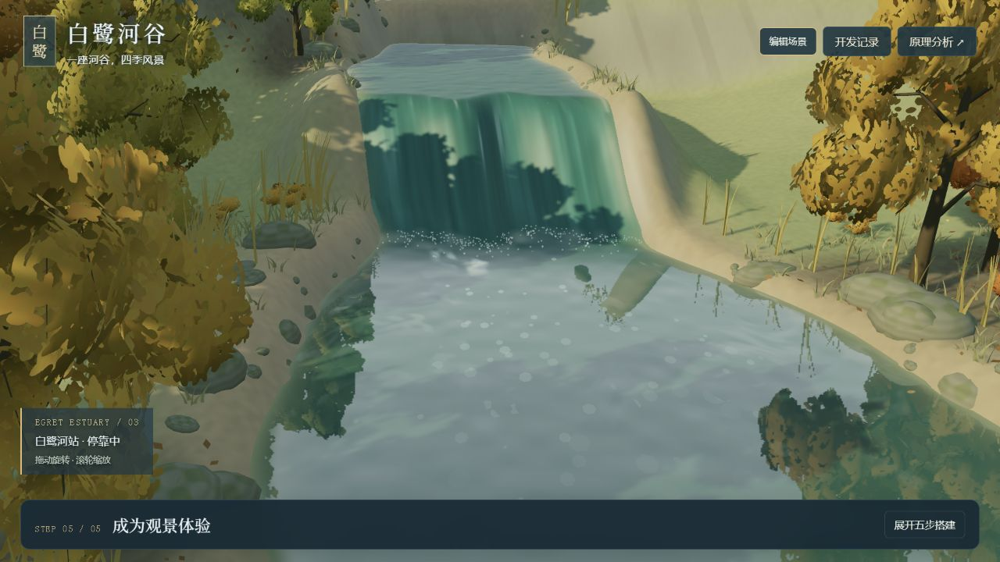
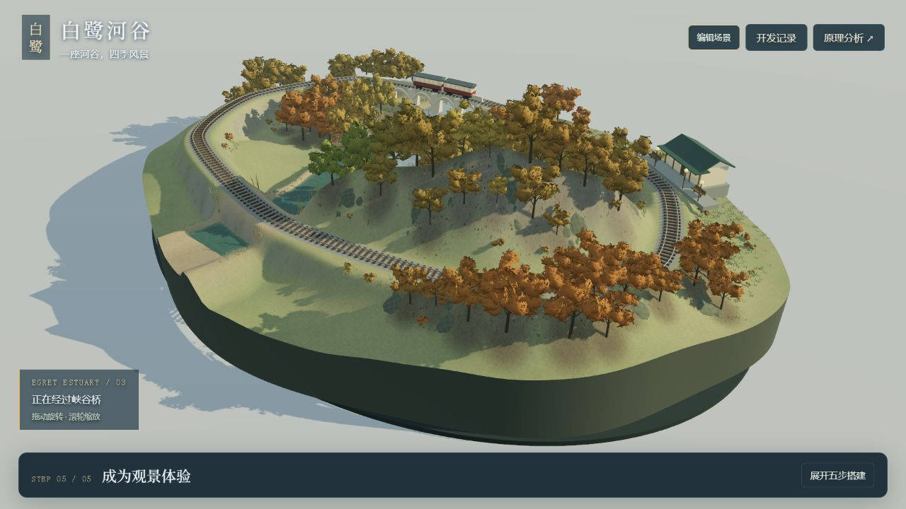

# 当前效果与执行规划（V24）

## V26 当前进展：水面与水下都有动物

V26 加入七条真实水下鱼：摆尾、转向、分层游动，冬季与夜间减速。平缓水面透出水下模型，鱼保留深度遮挡；厚水层、雨天和强反光降低可见度。 后续优先观察巡游路线的重复感、鱼体尺度和水下可见度，再考虑分群、停游与觅食；不把本轮算作完整生态系统。

## V25 当前决定：从静态细节转向动物活动

V25 新增林缘白鹭与缓水野鸭：飞行、扑翼、转向、贴水游动与尾迹，读取现有风力、风向、阵风、季节、昼夜和雨量。属于规则驱动的动物表现，尚无完整生态模拟。

下一步应优先观察现有动物的重复路径、扑翼节奏和入水接触，再决定是否增加落树、岸边觅食与脚蹼划水。鱼群、林间兽类、声音和生态关系仍是后续扩展，不计入本轮能力。

## 当前决定

已完成曲线站台、接地入口、车门踏步与站房多面细节，并增加“列车到站近看”。下一步先用这个入口检查实际体验收益；不再次把已有车门、站台、灯光列为待从零实现。

本轮仍可见：背侧较高挡墙的材质偏简单，原有河谷部分机位被前景树冠遮挡，冬夜雪面偏亮。先根据实际体验决定是否需要局部修正，不重复开发已存在的结构。

后续候选是车门开合与简化候车/上下车行为，前提是当前静态空间关系通过用户体验确认；人物模型、动物和天气行为仍未实施。完整室内、自由绘轨和真实流体也不在本轮范围。

[本轮开发记录](development-log.md) · [研究与变化](train-station-research.md)

---

以下为保留的历史判断。

# 当前效果与执行规划（V23）

## 当前决定 · V23 归档后

已完成列车与站房的三机位实景研究，具体证据和下一轮顺序见 [列车与站房](train-station-research.md)。下一步优先核对站台入口、车门与停车点的空间关系，再改善模型可见面；尚未实施模型修改。

暂停主动打磨水域；下一候选是检查列车进站与站房整体效果。人物、鱼群、白鹭、林鸟及其他动物，还有天气演变与行为联动，统一列入后期扩展，尚未实施。具体范围见 [归档与技术原理](archive.md)。本条覆盖下方历史规划的执行优先级。

2026-09-14。以当前实景与目标决定下一步，历史记录仅用于追溯。

- 本轮已交付：连续跌水局部岸线和坡肩调整、岩面层次，以及低起伏宽河高落差的水网格外缘修复。四季及其他水流模式有代表检查。
- 当前仍可见：上游较规整的水槽轮廓、岸坡大形体与下游较大片反射。局部岩面更清楚，不标记为完整自然感达标。
- 后续先评估这轮近景和全景实际收益，再选择一个可定位的问题；不自动重做已存在的水丝、草地、四季或存档。
- 中期验证河道或山体的最小布局编辑，配套空间约束与撤销；之后才选择具体地点验证参考重建。尚未实施。

[当前能力](capabilities.md) · [本轮记录](development-log.md#v23--河流跌口与岸坡的局部衔接)

---

以下为保留的历史规划，不代表当前待办。

# V17 基线之后：实景问题与继续路线

2026-09-14。在本地 Git 提交 `b670133` 完成后进行分析。先提交能力与源码基线，再独立打开本地场景查看三个机位；本次没有修改渲染算法。

[当前能力](capabilities.md) · [开发记录](development-log.md) · [图片来源](assets/README.md)

## 当前画面具体还差什么

观察条件：层峦溪谷、秋季推荐黄昏、连续跌水默认精调，1280×720。只检查这个组合，不推断其他季节存在相同问题，也不将本次观察当作与原作的严格画质对比。

| 编号 | 从画面看到的问题 | 已经实现的部分 | 后续修正候选与验收方式 |
| --- | --- | --- | --- |
| Q1 | 水池白沫包含较明显的独立圆点，跌水仍有整片帘面的观感 | 水流加减速、纵纹、白沫消散、实际落点都已存在 | 优先改变白沫轮廓、拉伸和成组分布，比较低/默认白沫两档；保持原落点、生命周期及零白沫水体可读性 |
| Q2 | 山后局部坡地大面积平滑、近似同色，与细碎树冠的细节尺度差异较大 | 连续坡脚、贴坡露岩和山后细节已经存在 | 定位具体坡段，比较宽尺度色调与露岩分区，先不增加物件数；保留地形连续与铁路净空 |
| Q3 | 全景树群出现较重复的团簇轮廓，局部密集树冠压缩了林间空间 | 分枝、叶簇、树型和季节叶量已经存在 | 先调整树高层级和组团留白，固定总树量比较轮廓；保留根部地形匹配和四季枝叶规则 |

Q1—Q3 是美术判断与待验证候选，不是已经确认的算法故障。单张截图中的倒影、遮挡不能直接证明岩石悬空或水体穿透，出现可疑点需要独立近景复核再立项。

## 下一步先建立作品保存与比较

目前 scene.mjs 将环境状态、共享材质参数、地形配置、各构图配置与各模式精调分开管理。createCompositionSettings 和 createWaterTuning 都使用内存对象；尚未提供跨刷新存档。只保存当前滑块会丢掉其他构图和模式的配置，也无法精确回到同一镜头。

建议下一轮交付一个可验证的最小工作流：**命名方案 → 保存 → 修改 → 恢复 → 导出文件 → 刷新后导入 → 同机位比较**。美术修正建立在这个工作流上，避免改完后无法准确恢复或比较。

| 步骤 | 具体实现范围 | 完成标准 |
| --- | --- | --- |
| 1. 配置统一 | 带 schemaVersion 的纯数据配置，包含全部构图地形/模式、各水流模式精调、季节、推荐光线开关、天气、风水、动态细节、镜头位置与目标、搭建阶段和观察状态 | 导出再导入后用户控制值一致；不序列化 Three.js 对象或 GPU 资源 |
| 2. 保存与恢复 | 命名本地方案，JSON 导入导出；校验版本、枚举、数值范围和必要字段 | 刷新后可恢复；非法文件被说明并拒绝，当前作品不被部分覆盖；存储失败有反馈 |
| 3. 安全应用 | 先校验完整配置，再按固定顺序应用；合并成一次地形重建，恢复 UI 与镜头，避免季节默认值覆盖手动设置 | 应用结果一致；原有模式隔离、铁路避让、暂停仍通过检查 |
| 4. 比较基线 | 保存一组基准方案与相同机位，可往返查看；第一版使用先后切换 | 一次往返不改变方案；明确动态帧不同，不能称为像素级回归 |

精确到同一帧的比较还需要控制动画时间、水流累计相位、列车位置及环境过渡完成状态；仅保存“暂停”开关不够。建议将它列为第二阶段，首轮先保证创作参数与镜头可复现。双画布同时渲染也留到性能预算确认之后。

## 然后按证据修画面

1. 先处理 Q1 白沫形状，因为局部、可对比，能直接利用当前水流近景；本轮不再重复重做已完成的水石布局或落点逻辑。
2. 再分别验证 Q2 坡地色调与 Q3 树群轮廓，每次只改变一类因素；若同机位对照没有明确收益，就保留基线。
3. 每个候选改动通过后，沿用四季、三水流及夜景/雨景的代表检查；连续切换多次检查资源释放，再决定是否扩大到更多构图。

通过标准是用户可以看出具体改善、原有行为保持一致、有可恢复方案和真实证据；不能以物件数量增加或滑块更多作为完成标准。

## 更后面的产品扩展

山体位置、河道与铁路控制点编辑属于新的布局创作能力，需要先定义轨道坡度、河床连续、建筑支撑及植被禁入区等空间约束。现实地点复刻进一步需要参考资料、尺度/方位标定和精度目标。它们值得探索，但不应在保存与恢复尚未成立时混入同一轮改动。

以上路线未实施。本次提交后分析只产出问题清单与实施顺序，未新增保存、比较或空间编辑功能。

## V18 进度补充

已按此路线实现命名方案、本地保存/恢复、JSON 导入导出和同机位基准比较，49 项检查通过。画面问题 Q1—Q3 尚未改动；下一轮可使用方案保存固定配置，再聚焦 Q1 白沫轮廓。当前比较不保存历史渲染源码或动画相位，美术算法改动仍需独立 Git 基线与截图对照。

## V19 进度补充与下一轮顺序

Q1 中独立圆片白沫已改为破碎薄片，落点成组、沿流向扩散；保留既有落点、生命周期和模式参数。对照见开发记录 V19。跌水整片帘面感与简化分流仍是独立的后续问题，不能据此称整个水体已完成。

下一轮优先 Q2：选取“山后坡地”里一块大面积同色坡面，在固定机位与现有树量下调整土色、草地和露岩的宽尺度分区；验证四季、推荐光线、坡体连续及铁路净空。通过后再做 Q3 树高层级和林间留白。避免同时改坡地、树群和水流，才能判断每项调整的实际收益。

## V20 进度补充

Q2 已先完成宽尺度草土与露岩材质分区，并对比三种构图的基础网格，确认位置、法线和索引与 V19 一致；四季仍使用原有颜色与覆雪逻辑。不是重新添加山后物件或改变坡脚几何。

下一候选为 Q3：固定总树量和地形，先比较树高层级、组团轮廓与林间留白；不同时修改水流或坡地材质。仍需先保存当前基线，再以真实对照决定是否保留。跌水整片帘面感作为独立水体问题，留在后续清单中。

## 2026-09-14 · V21 后的决策依据

以当前画面和最终目标决定下一步，不因历史清单中尚有条目就重复调整。V21 已制作跌水与岸坡衔接样件：错落跌口可见，光滑岸坡与整片水帘感仍未消除。先比较本轮前后实景，判断形态方向是否有价值，再决定保留、回退或针对具体轮廓继续改动。不自动启动树群疏密、整场换绿或白沫增量。

若转向现实地点创作，应先指定一个参考地点，确定山、水、铁路、桥站的空间关系，再据此选择布局编辑能力；当前不虚构一个地点作为还原目标。

## 2026-09-14 · V22 当前效果调整

遵循“基于现在优化”的要求，本轮直接细化现有水丝与入潭冲击，未回退形态或采用早期画面为目标。当前同机位的细水丝与落点更清楚；岩石规则排列、实际分流通道和岸坡形态仍是独立限制，不因材质改善而标记完成。后续仍应依据当前画面中具体问题决定改动。
