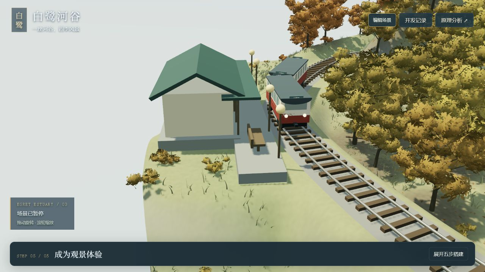
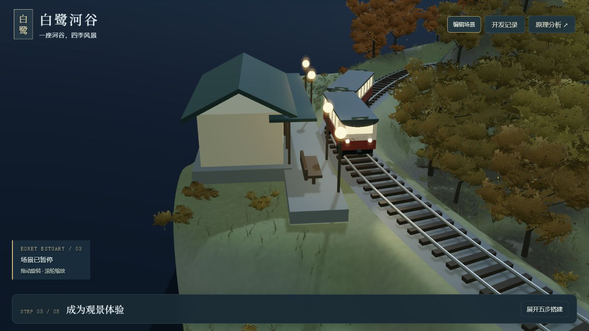
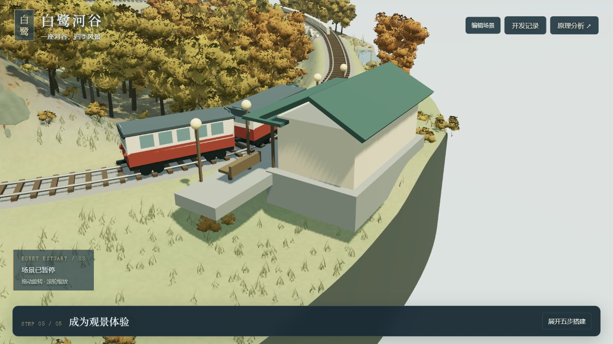

# 列车与站房：从当前实景确定下一步

2026-09-14 · V23 归档之后的研究，场景运行模块未修改。

[研究总览](README.md) · [固定版本与技术原理](archive.md) · [开发记录](development-log.md)

## 本次观察

在本地实际场景中选择“层峦溪谷 / 秋 / 连续跌水 / 白鹭河站”，以 1280×720 检查白天、夜间及手动旋转侧面。列车运行到站台附近后暂停，再切换光线保持车位。本轮不把单一构图的结果推断为全部四季、地形或机位均已验收。

## 从画面看到的差距

| 实景依据 | 已有能力 | 下一步要解决的具体问题 |
| --- | --- | --- |
| 白天机位中端墙占据主体，基本是整块浅色面 | 已有站房、坡屋顶、面向站台的门窗与雨棚 | 补齐端墙与背立面的尺度线索：墙基、檐口、少量结构或开口，避免只有一个方向完整 |
| 侧面机位中平台像厚板伸向草坡，未看到明确的上下站台入口 | 已有基础、平台、长椅、灯具 | 先核实台阶、入口与地面的连接；根据高度关系补支撑或整地，让人能合理进出。截图本身不足以证明所有地形都会悬空 |
| 列车侧面以等间距窗块为主，缺乏清晰的上下车位置 | 已有双节车、车轮、转向架、车钩、车灯、制动与停站 | 明确车门、踏步、驾驶端与车厢连接的视觉层级；门位需先与停车点、站台长度对齐 |
| 夜景能看见灯具亮起、车窗变亮，但窗内缺乏空间层次 | 已有自发光材质和真实灯光 | 评估窗框、内部暗面与发光强弱；先使近景能读出空间，不先加入复杂室内和人物 |
| 默认车站机位正对端墙，站名与站台侧立面不易看到 | 已有自由旋转、站房机位和跟车镜头 | 模型改善后比较一个能同时看清车门、站牌、站台入口的机位，避免靠镜头隐藏其他面的缺口 |

## 技术上如何驱动

- `scene-train.mjs` 用箱体、圆柱和材质组合出车身、窗、车轮等。沿轨道曲线按路程取点：前后点决定车体方向，转向架分别沿弯道旋转，车轮转角由路程 / 半径确定。
- `scene-service.mjs` 负责行驶、进站减速、停留与再出发。它是规则运行系统，不是完整车辆动力学。本次不重复开发已有停车功能。
- `scene-landscape.mjs` 以车站处轨道的位置与切线建立局部坐标，再摆放站房、平台、雨棚与灯具。扩建时应继续使用这个坐标，避免只在默认地形上摆对。
- `scene.mjs` 将季节、昼夜、暂停、速度与镜头状态传给各模块。模型细节应沿用现有夜间权重和场景重建流程。

## 下一轮：完成一个可信的列车到站场景

1. **先连接空间。** 核对停车点、两节车门位、平台长度、轨道净空与入口接地，给车、人和房建立共同尺度。先解决可用关系，再添加细节。
2. **再完善可见面。** 补车门与踏步，改善站房端墙、背立面、檐口和墙基；维持当前微缩风格。使用同机位前后对比判断收益。
3. **最后匹配光线和镜头。** 调整窗内层次、站台灯与夜间车灯的关系，再选择能讲清“到站”的机位。

建议验收：三种构图各检查到站、停留、出站；四季在白天与夜间检查新材质；默认与低/高起伏检查入口接地、屋顶树木遮挡、车门与站台关系。执行后才记录通过，当前为计划。

人物、鱼群、水鸟、森林动物以及天气行为仍属于后期方向。本轮只补导航、描述和实景研究证据，没有新增上述模型或声称完成画质优化。
