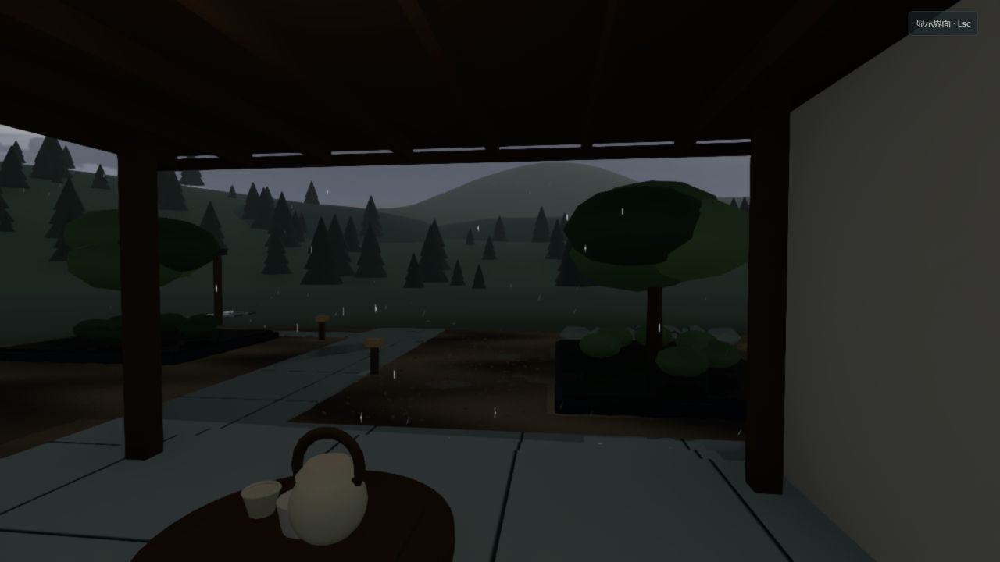
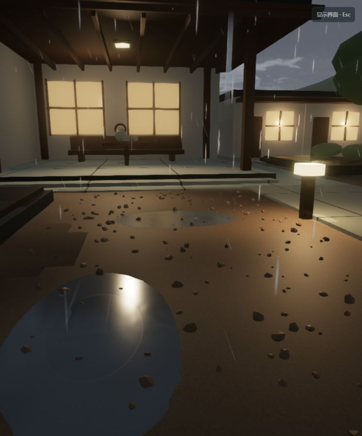
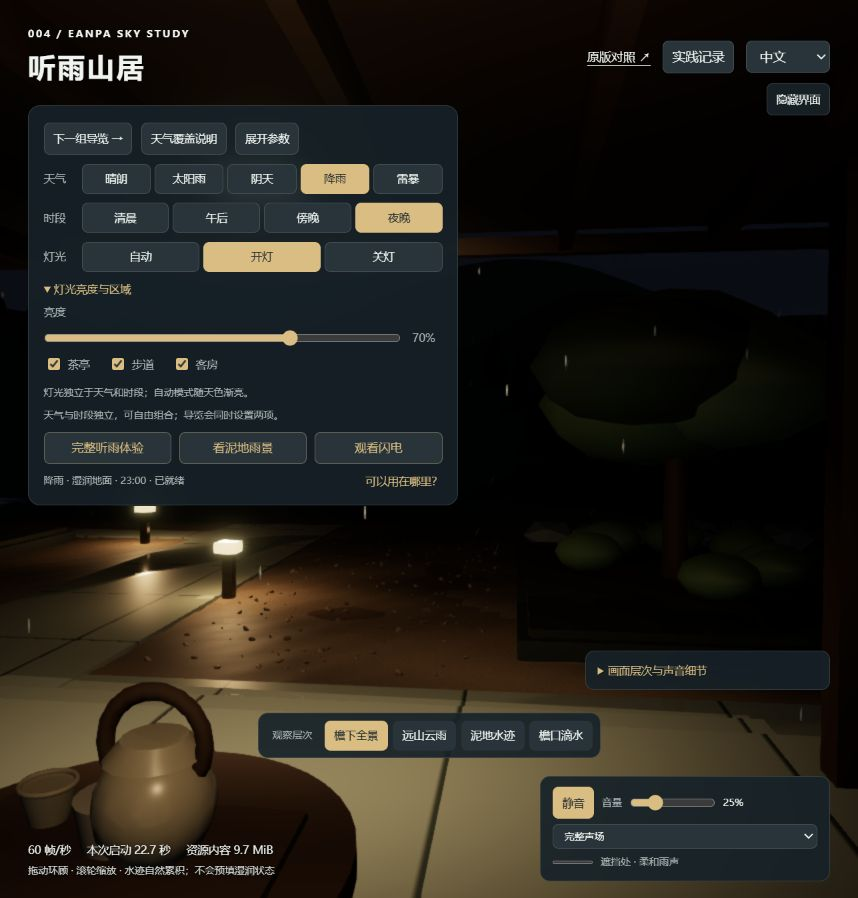
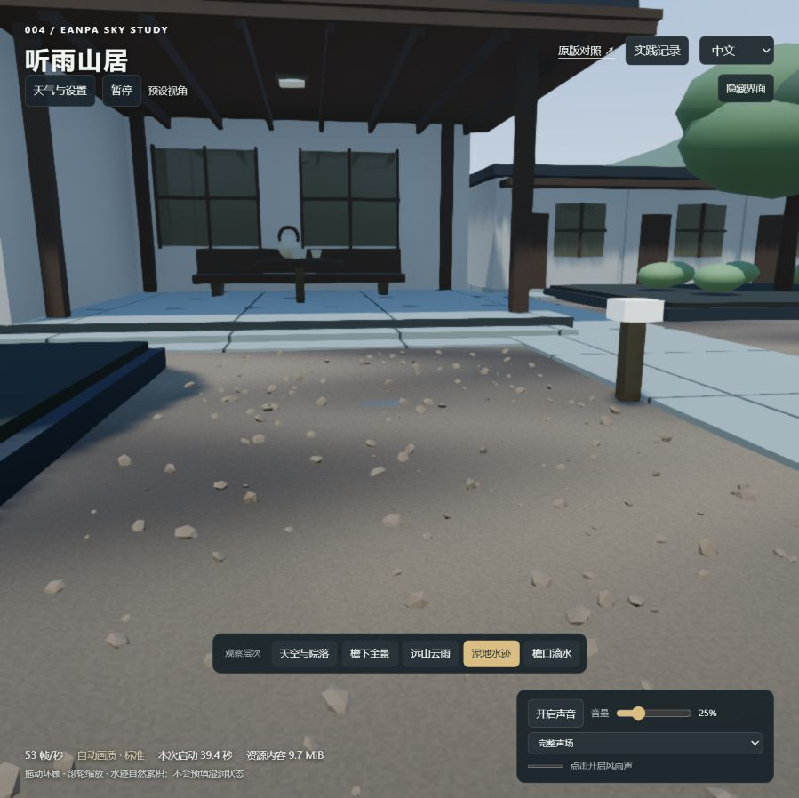

# 004 · Eanpa Sky / 听雨山居

**我们的理解：核心价值是实时天空与天气，以及它们对光线、地面和声音的共同影响。** 上游的沙漠世界是能力展示载体；我们提取引擎能力，搭建独立山居民宿，观察同一场景从晴雨、昼夜到积雪融化的变化。

当前已满足阶段研究与效果演示需求，研究已总结，后续按具体用途扩展。

[在线研究摘要](https://yydshly.github.io/0913_codex_project/004-eanpa-sky/) · [体验我们的天气场景](https://yydshly.github.io/0913_codex_project/004-eanpa-sky/lab/)

[返回总索引](../../README.md#项目索引) · [运行与操作](app/README.md) · [实践过程归档](practice-history.md) · [后期扩展](next-steps.md) · [实际验证](notes.md)

| 项目 | 内容 |
| --- | --- |
| 上游 | [SkyeShark/Eanpa-Sky](https://github.com/SkyeShark/Eanpa-Sky) |
| 研究日期 | 2026-09-14 |
| 固定版本 | v0.2.1 · `a197d3dc42577e9b870b471a39d6b1710c5b5633` |
| 技术基础 | Three.js r186、WebGPU、TSL 与上游渲染器补丁 |
| 许可证 | 引擎代码 MIT；Three.js MIT；素材分别署名与授权，见下文 |
| 阶段状态 | 已总结；现有演示够用，保留后续优化备忘 |
| 发布状态 | GitHub Pages 已发布；研究页、实际截图、实时院落与声音链路已复核 |

## 我们的实际效果

*2026-09-14，第 17 轮本地演示实景。主图来自我们的院落，不是上游宣传图。*

| 檐下听雨 | 地面水波 |
| --- | --- |
|  |  |

| 夜雨与分区灯光 | 融雪后保留水迹 |
| --- | --- |
|  |  |

*截图来自不同迭代、机位，不作为同机位对照；静态图片不能展示运动与声音。详细来源见 [截图记录](assets/README.md)。*

## 能力、原理与我们的扩展

| 层次 | 已有能力 | 实现理解 |
| --- | --- | --- |
| 上游天空与天气 | 体积云、云影、昼夜、日月星空、8 种天气预设、雨与雷电 | 沿视线采样云密度，时间与天气共同驱动天空和照明 |
| 上游表面响应 | 遮雨、降雨接触、湿润与反射 | 捕获附近表面，累积湿润历史并改变材质外观 |
| 我们的场景适配 | 程序化山居、远山、泥地、浅洼水波、檐口滴水、独立灯光 | 场景模型与材质分区、局部二维波动场、简化接触和光照 |
| 我们的冬季扩展 | 雪花、远近景积雪、冰雹碰撞、融雪补入泥土与浅洼 | 批量粒子、分析表面碰撞、共享积雪覆盖和归一化融水分配 |
| 我们的体验层 | 中文为主、中英切换、四站导览、声音、观察记录与导出 | 天气、时间、灯光独立；导览明确组合状态，声音跟随雨量、遮挡及闪电事件 |

不是单靠本地图片或录音播放效果。素材提供月面、星图、粒子形状和自然录音，实时计算决定云、降水、接触、表面变化与声音响应。下载量、首次着色器准备、持续 GPU 开销是不同问题，详见 [资源与原理](resource-analysis.md)、[能力提取](extraction.md) 和 [天气覆盖](weather-coverage.md)。

## 对我们的价值与使用场景

- **建筑、民宿与园林：**用同一场景对比晴雨、昼夜、檐下体验和地面材质。真实落地需要实际模型及重新适配遮雨、碰撞与材质。
- **游戏与叙事：**把天气、声音、光线作为氛围和事件输入；角色行为、任务与导航另行实现。
- **展厅与环境背景：**连续编排雨起雨停、积雪融化；正式使用需离线准备、设备恢复和长期运行验证。
- **可复用技术：**沉淀环境状态、声音事件和场景适配关系。当前不是通用 SDK；白鹭河谷使用 WebGL，不能直接复制本项目的 WebGPU / TSL 渲染实现。

详细接入条件见 [扩展场景与路线](extension-roadmap.md)。

## 当前边界与后期扩展

现有演示已够用，暂时收尾。未来优先：加载和稳定性 → 屋顶融水与地面联动 → 晨雾、雨雪混合 → 声音与局部光线精修。真实数据、人物行走、结冰、跨项目封装按用途再决定，完整描述见 [后续优化备忘](next-steps.md)。

这是视觉与声音研究原型，没有完整水文、气象预测或实际民宿业务。最近本机启动约 30–40 秒；轻量预览不等于实时天气准备完成。第 25 轮 40 项检查通过，定向浏览器观察约 13 分 43 秒（含暂停），不等于小时级、多设备或正式人工听感验收。首次缩放后约 6.16 MiB 的渲染器资源估算增量尚未定位，重复缩放未继续增长；估算不等于实际显存。见 [实测记录](snowmelt-and-stability.md)。

## 运行与发布

本地在仓库根目录执行 `python projects/004-eanpa-sky/app/serve.py --prefetch-code`，访问本机 `http://127.0.0.1:8044/lab/`。原版对照位于本地根入口。

GitHub Pages 发布采用静态研究页加实时院落；构建按固定清单与 Git blob 校验，仅提取 42 个必要上游运行文件（约 9.58 MiB）。原版大型世界链接上游，未复制完整上游仓库。详见 [构建与验证说明](publishing.md)。

## 来源与许可

- [上游引擎与 MIT 许可](https://github.com/SkyeShark/Eanpa-Sky/blob/a197d3dc42577e9b870b471a39d6b1710c5b5633/LICENSE)。
- [Three.js MIT 与上游补丁](https://github.com/SkyeShark/Eanpa-Sky/blob/a197d3dc42577e9b870b471a39d6b1710c5b5633/vendor/three/EANPA_PATCHES.md)。
- 月面与星图按 [上游署名](https://github.com/SkyeShark/Eanpa-Sky/blob/a197d3dc42577e9b870b471a39d6b1710c5b5633/README.md) 分别来自 NASA CGI Moon Kit 与 Tycho；不能将素材整体视作 MIT。
- 自然雨雷来自 WuxiaScrub 的 CC0 录音，处理和验证见 [声音来源](assets/audio/README.md)。在线院落不使用上游授权不同的鸟鸣录音。
- 雪、冰雹、近处水波和声音等为宿主扩展；不得把研究扩展全部归因于上游原生能力。
