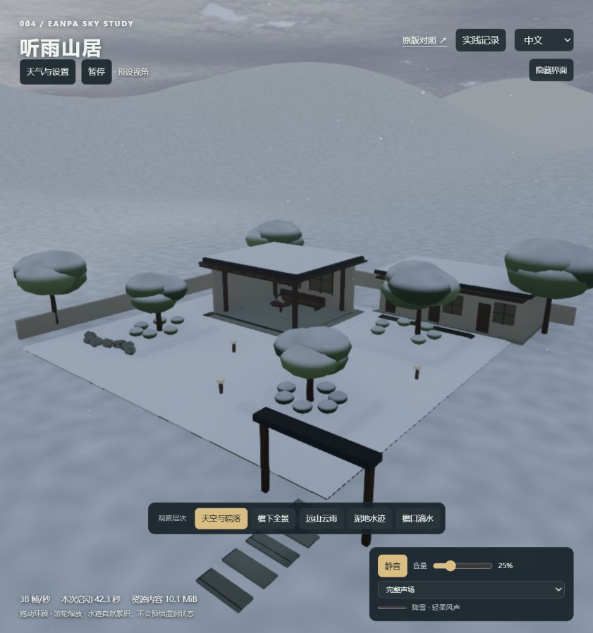
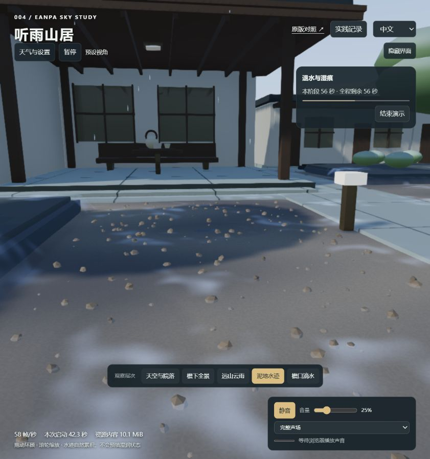

# 第 22 轮：单设备验收

日期：2026-09-14。对象为本机内置浏览器中的 `/lab/`，上游 Eanpa v0.2.1 / `a197d3dc42577e9b870b471a39d6b1710c5b5633`，代码 MIT。本轮增加诊断计时，不新增天气效果。

## 结论

单设备功能验收通过，可用于内部研究与方案演示；性能有保留，尚不作为正式上线验收通过。优先处理启动编译和雪景稳帧。

## 验收范围

检查现有天气、时间和灯光独立控制、声音路由、暂停/恢复、连续切换、自动演示及数分钟交互运行。执行当前 11 份测试文件，共 29 项通过。当前仅覆盖这台设备与此浏览器，不能替代多设备兼容、人工听感或数小时耐久测试。

## 启动分段

本次从导航到就绪 42.628 秒；原有页面指标从模块依赖就绪后起算，为 42.315 秒。已有本地资源缓存；未清缓存，也不是冷网络下载基准。

| 阶段 | 本次耗时 |
| :--- | ---: |
| 导航到模块依赖就绪 | 0.313 秒 |
| 资源索引 | 0.084 秒 |
| WebGPU 初始化 | 0.405 秒 |
| 庭院与宿主效果创建 | 0.159 秒 |
| 天空创建与资源准备 | 0.659 秒 |
| 天气资源准备 | 0.079 秒 |
| 材质包装 | 0.001 秒 |
| 初次天空环境烘焙 | 0.666 秒 |
| 反射管线设置 | 0.030 秒 |
| 云渲染编译 | 4.813 秒 |
| 反射与材质编译 | 28.757 秒 |
| 首次管线渲染 | 4.235 秒 |
| 三帧预热及 GPU 完成等待 | 2.425 秒 |

这是顺序阶段的墙钟计时，含每段内必要准备，不是独立 GPU 内核耗时。主要等待发生在编译与首次执行，不能据此断言某一张纹理或资源下载过大。建议后续单独评估延迟启用反射、分层预热和精简材质变体；本轮未把这些优化宣称为已实现。

## 运行指标口径

记录最多 300 个近期帧提交耗时，提供中位数、95 分位数、累计均值及超过 100 毫秒次数。耗时包含异步帧提交期间的墙钟等待，不等同于 GPU 执行时间、屏幕刷新率或内存泄漏判定。暂停、隐藏页面和记录弹窗期间不继续发起帧。

## 已核验路径

- 晴天与阴天：保持 06:30，晴天稳定后的降雨量为零；未记录运行错误。
- 檐下雨声：听者遮挡为 1，雨声增益 0.230、屋顶声 0.095、风声为 0（仅雨声模式），输出 RMS 非零。
- 夜间雷暴：23:00 时三组自动灯均为 0.7；独立关灯后衰减到接近零。天气和时段未被灯光操作改变。
- 闪电与雷声：记录到 local impact，距离 45 米、延迟 0.13 秒，雷声排程与实际播放计数均为 1。这验证事件链，未保存闪电瞬间截图，也不等于人工听感验收。

- 降雪：雪强度 1、积雪进度 0.832、可见雪片 1732；雨、屋顶、树叶和冰雹声床为 0，保留风声。
- 冰雹：残雪场景中碰撞归为 snow，冰雹持续下落并回收，远处声床增益 0.132，未记录运行错误。

## 性能结论需保留条件

启动后的初次近期样本：提交耗时中位 12.9 毫秒、95 分位 19.2 毫秒。雪景窗口则为中位 32.4 毫秒、95 分位 42.3 毫秒，300 帧采样；期间累计只有 2 次提交超过 100 毫秒，但不能由此承诺稳定 60 帧。天气、视角、捕获截图和系统负载都可能影响该值，未做隔离的 A/B 基准，尚不能把雪景压力精确归因到 CPU 粒子、体积云或反射中的某一项。

建议把下一轮目标限定为启动编译和雪景稳帧；功能验收通过也不代表性能、兼容性和长期运行已经验收通过。

- 暂停保持：两次报告帧数均为 14710，声音 blocked=true；连续选择雷暴→降雪→冰雹后恢复播放，并以最后选择的冰雹稳定下来。
- 分层隔离：冰雹场景选“仅雨声”，全部声道增益为 0；没有混入冰雹声床。

## 未覆盖项

- 尚未在其他 GPU、浏览器、移动设备或低配置设备实测。
- 尚未连续运行数小时，也没有采集显存/内存曲线；不能宣称没有内存泄漏。
- 尚未完成真实扬声器或耳机的人工听感、音量舒适度验收。
- 水文、融雪排水和任意模型碰撞仍是既有原型边界，功能测试通过不改变这些限制。

## 持续交互与最终状态

定向交互验收约 8 分 14 秒；本次页面累计记录 23,077 次帧提交，累计平均耗时 17.55 毫秒、超过 100 毫秒 2 次。最后 300 帧的中位耗时 14.7 毫秒、95 分位 32.2 毫秒。累计计数包含正式交互窗口开始前的短暂运行，不应拿来直接推算屏幕平均帧率。

自动流程从模拟时间 373.5559 秒开始，在 483.56 秒记录 complete，sequence 归 null；雨停后水量为 0.255，所有冰雹活动粒子为零。各采集快照 errors=[]。这是数分钟的运行观察，未覆盖数小时耐久或所有操作组合。

结束后恢复中文、06:30、降雨、自动灯和关闭声音，使用檐下预设机位；没有恢复验收前手动移动的精确相机坐标。

[原始状态与计时](assets/91-acceptance-results.json)

