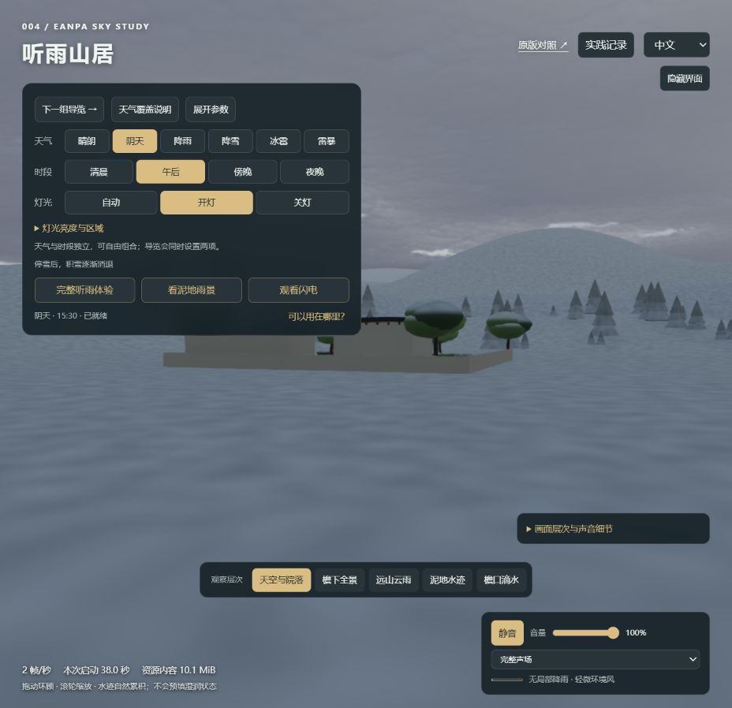
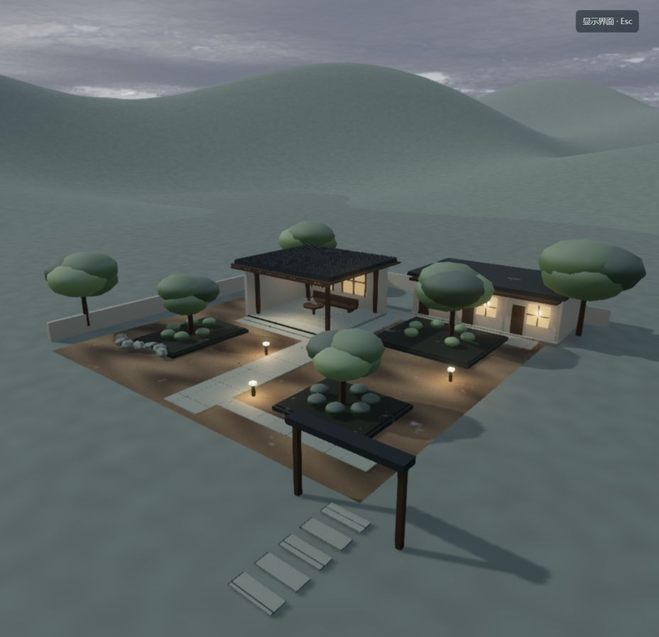
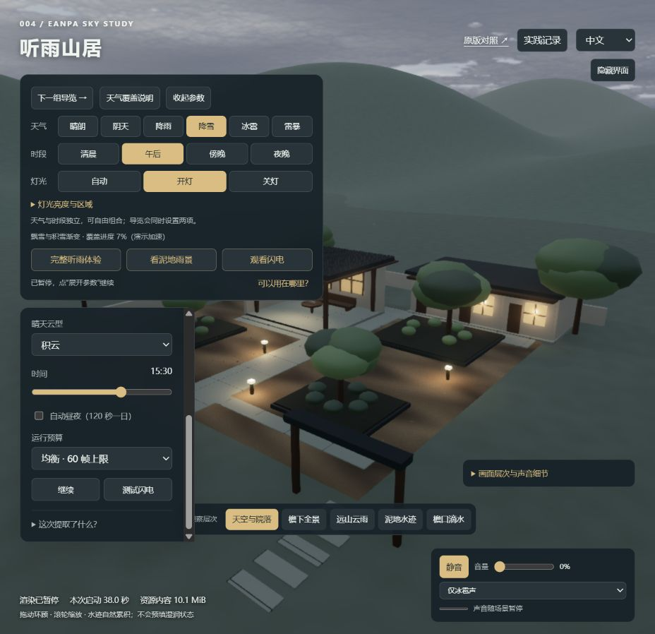

# 当前演示问题排查（第 18 轮）

日期：2026-09-14；对象：本地 `/lab/` 与当前宿主源码。上游仍为 Eanpa Sky v0.2.1 / `a197d3dc42577e9b870b471a39d6b1710c5b5633`，代码 MIT。

后续：已实施第 19 轮修复，见 [修复内容与边界](fixes-2026-09-14.md)。下文保留修复前的原始证据。

## 结论

当前可以演示天气类型，但表面碰撞、声音距离、积雪覆盖与交互状态还没有形成一致的场景响应。发现一项可重复的碰撞逻辑缺陷、两项明确的交互/声场体验问题，以及若干已知的原型限制。优先修复这些一致性问题，再增加新天气。

本轮进行了实际浏览器观察、状态对照、源码检查与函数级复现；没有修改演示实现。截图均为本轮新采集，原始报告见 `assets/74-audit-runtime.json`，代码探针见 `assets/75-audit-code-probes.json`。

## 观察步骤与截图

### 1. 当前阴天入口：可运行，但控制面板遮挡主体

进入时为阴天、15:30、开灯、完整声场、音量 100%；有上一轮留下的残雪。画面可运行，天气和时间分别有入口，这是已有的有效设计。控制面板占据左上较大区域，正好盖住庭院主体；小字和多组相似入口增加识别负担。

### 2. 全景观察冰雹：画面运行，近景敲击声覆盖不足

点击“天空与院落”回到预设全景，再选择冰雹和仅冰雹声。冰雹在远处不易辨认。两次报告的碰撞总数从 38,685 增至 54,315，实际音效事件计数始终为 0。测试临时将总音量降至零以避免突然响声；结论依据的是音效事件计数，代码中的总音量只影响主输出增益，不阻止该计数。

### 3. 暂停后选降雪：选中状态已变，应用仍在等待

展开参数 → 暂停 → 点击降雪。两次报告帧数均为 30,342，界面 weather 已为 snow，但 snow.intensity 为 0、hail.intensity 仍为 1。过渡提示停在 12 秒，画面保持暂停前状态。界面虽然提示已暂停，却没有明确说明天气改动还在排队；参数面板已经展开时仍提示“点展开参数继续”。

## 需要优先处理的问题

| 优先级 | 问题与证据 | 原因 | 建议 |
| --- | --- | --- | --- |
| 高 | 冰雹从屋檐侧面进入会被抬到屋顶。函数复现中 0.05 秒内，y 从 1 米变成 5.17 米 | `hailSurfaceAt` 只按 x/z 返回最高屋顶；`stepHail` 只判断当前高度低于表面，随即吸附到表面，没有判断是否从上方穿过 | 保存上一位置，对运动线段做碰撞/表面穿越判断；区别屋顶顶面、侧面和屋檐下方。增加侧入屋檐、边缘下落测试 |
| 高 | 全景有冰雹碰撞却没有敲击声，见步骤 2 | `nearDetailGain` 在 18 米外归零；全景相机为 (24,14,29)，名义地面落点范围到相机的最近距离约 22.56 米，另有声音小于阈值即丢弃的逻辑 | 将近处独立敲击与远处连续环境声分开；保持合理衰减，并提示观察者位置。不能仅增加总音量 |
| 中 | 暂停后天气选择与画面不同步，见步骤 3 | 控件立即改 `state.weather`，实际修改进入 `pending`；暂停时渲染循环直接返回，队列不执行 | 区分目标天气和已应用天气；暂停时仍应用设置并渲染一帧，或明确禁用/提示等待。恢复按钮放在主界面，合并过期的天气切换请求 |
| 中 | 相机移动后预设按钮仍保持选中，观察记录只写预设名 | OrbitControls 的 start 事件只取消镜头动画，没有将 view 改为自由视角；报告没有实际相机坐标 | 人工拖动后标为“自由视角”，记录相机位置与观察目标，避免把“同预设名称”当作“同机位” |
| 中 | 控件影响观察，见步骤 1、3 | 固定定位的主面板、参数面板和底部工具条叠加；多个导览/参数/天气入口并存；部分说明字号约 10–11px | 主区保留天气、时间、声音与暂停；详细参数集中收起，避免遮住主要景物。触控尺寸、键盘顺序与窄屏重排另行验证 |

碰撞复现是函数级确定性证据，并未在自然运行画面中捕获瞬移瞬间。距离估算使用名义落点范围，未把风偏作为严格边界；浏览器中声音事件为零是本轮直接观察到的结果。

## 原型限制：不能和已验证的逻辑缺陷混为一谈

**积雪还不是完整的表面模拟。** 树冠和远景使用朝上法线加噪声混色，庭院使用独立雪层网格；空中雪片只检查预定义屋顶和地面高度，不会和树冠、桌椅等任意几何精确碰撞。统一的 accumulation 数值也不包含温度、表面暴露度或实际水量。因此，视觉上积雪的树冠与粒子遮挡仍可能不一致，融雪也不会自动变成水洼里的水。源码确认，未把本轮截图当作精确穿叶测试。

**夜灯没有局部阴影。** 茶亭灯显式关闭投影，报告中的 shadowLights 为 0；雪片与冰雹还使用手工近似的昼夜/灯光亮度。它能表达氛围，但不能保证桌椅、柱子和墙体造成的真实遮光。本轮没有重新跑完整夜景，因此不声称已经观察到具体的穿墙光位置。应先确定灯光预算，再考虑一盏关键灯的阴影或局部接触遮挡。

**冰雹和雪共用阴天天空。** 目前二者都映射到 overcast，差异主要来自附加粒子、地面和声音。独立云底、云厚、能见度及阵风变化还没有做成一组完整的天气特征。对“天气与天空是核心价值”的定位而言，这比继续增加按钮更值得投入。

## 性能与验证边界

- 本轮报告中的 `errors` 为空，没有发现新的启动/渲染异常；这不代表所有组合都没有问题。
- 初始界面一度显示 2 FPS，后续报告为 55 FPS，其他观察又有变化。无法从这些瞬时读数认定持续性能退化、GPU 瓶颈或内存泄漏。
- 页面显示启动 38.0 秒，这是当前页面已有启动记录；本轮没有重新冷启动做受控测量。
- 10.1 MiB 是已加载资源内容量，不是显存或进程内存。现在缺少每个渲染阶段的耗时、峰值显存、平均/低分位帧率与长时间运行数据。
- 重新执行现有 `hail-weather.test.mjs`：4 项全部通过。它覆盖竖直落地与反弹、步进一致性、表面分类和声音分层，没有覆盖这次发现的侧入屋檐、远机位声场和暂停控件链路。
- 未进行人工听感验收、完整屏幕阅读器检查、触屏设备或多分辨率可访问性认证；截图只能支持可见布局与可读性风险。

## 建议的修复顺序

1. 修正冰雹表面穿越判断，补侧入屋檐的回归测试。
2. 补全景/近景两层天气声场，分别验证碰撞计数、音效事件与实际听感。
3. 明确暂停、目标天气、已应用天气和自由机位状态。
4. 将雨雪冰雹使用的高度、材质、遮挡和积雪状态逐步统一，再完善天空特征与材质分区。
5. 建立性能基线后再调画质预算，避免靠一次 FPS 数字判断优化成效。

## 源码定位

- `app/lab/hail-weather.js`：5 行最高屋顶查询；21–22 行碰撞判定与位置吸附；45 行以统一残雪阈值覆盖材质类别。
- `app/lab/rain-experience.js`：12 行 18 米音效衰减范围。
- `app/lab/soundscape.js`：53–58 行限流、距离过滤和事件计数。
- `app/lab/main.js`：124 行 pending 执行；164 行立即更新天气并排队；183 行暂停直接返回；121 行手动操控仅取消镜头动画。
- `app/lab/snow-weather.js`：6 行雪/冰雹映射阴天；8–18 行固定表面；57 行全局积雪进度；63 行雪片高度判定。
- `app/lab/snow-coating.js`：4–8 行朝向、噪声与颜色/粗糙度混合。
- `app/lab/courtyard.js`：71 行茶亭灯关闭阴影。

结束时恢复阴天、午后、开灯、完整声场及原有 100% 音量；相机回到预设全景。实现源码未修复，以上事项仍待处理。
