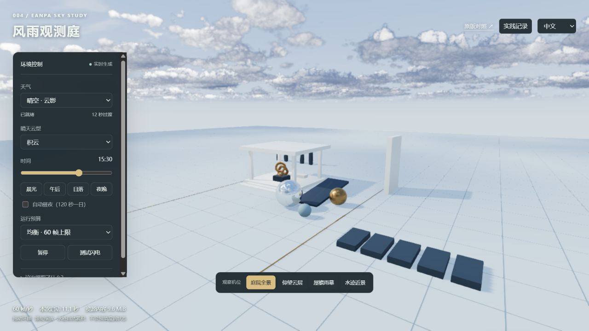
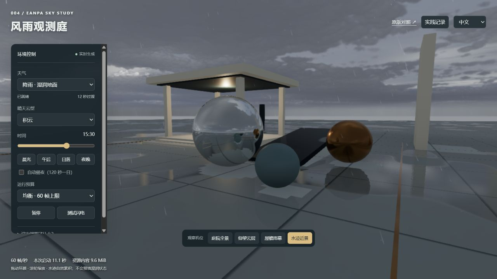
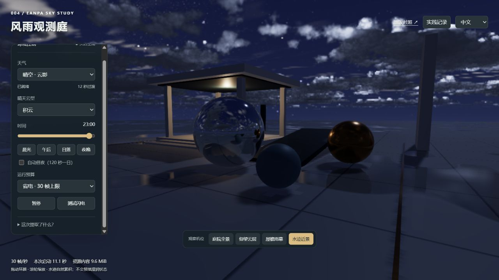

# 能力提取实践 · 听雨小院

2026-09-14 最新迭代：改为完整园林小院，声音已替换为自然录音并读取局部雨量与遮挡。以下首轮及初版声音部分保留历史经过；当前实现见 [扩展路线](extension-roadmap.md)、[声音来源](assets/audio/README.md) 和 [验证记录](notes.md)。

2026-09-14；上游 [SkyeShark/Eanpa-Sky](https://github.com/SkyeShark/Eanpa-Sky)，v0.2.1，commit `a197d3dc42577e9b870b471a39d6b1710c5b5633`。引擎代码 MIT，素材按上游分别授权。

## 实现了什么

以独立程序化庭院承载真实天气引擎，几何体包括屋顶、柱子、阶梯、斜台与三种材质球。体积云、天空光照、云影、雨表面捕获、湿润历史和反射继续由固定版本模块实时计算。保留月球、星图和少量天气贴图；效果并非完全无素材，也不是视频播放。

| 能力 | 提取方式 | 观察入口 |
| :--- | :--- | :--- |
| 昼夜与体积云 | `makeWeatherSky` + 时间和云型控制 | 时间滑块、晨光/午后/日落/夜晚、仰望云层 |
| 云影 | 共享云影捕获与场景材质包装 | 庭院全景 |
| 降雨与遮挡 | 屋顶等真实几何参与雨向深度/法线捕获 | 降雨、屋檐雨幕 |
| 湿润与反射 | GPU 累积历史、材质响应、原生反射管线 | 水迹近景、雨后晴天 |
| 雷暴 | 上游天气状态与本地落雷测试 | 雷暴、测试闪电 |

参考上游 `qa/sky-fixture.mjs` 的独立宿主接入方式，新建 UI 和庭院；没有复制测试夹具中的湿润预填。加载→准备天气→编译云和反射→首帧→串行更新天气、雨表面、云影、云与反射。异步通道串行执行；尺寸和预算修改排入下一帧。

## 减掉哪些开销

不加载沙漠地形、植被、角色、神庙模型、多层地表 KTX2 阵列和科幻世界资源。地砖纹理由世界坐标公式生成，庭院由基本几何体组成。

| 设置 | 上游 Balanced | 庭院均衡 | 庭院省电 |
| :--- | ---: | ---: | ---: |
| 雨粒子 | 10,000 | 5,000 | 5,000 |
| 水花 | 700 | 350 | 350 |
| 雨表面捕获边长 | 768 | 512 | 512 |
| 云影边长 | 384 | 256 | 256 |
| 云渲染分辨率除数 | 2 | 2 | 3 |
| 环境遮蔽 | 开 | 开 | 关 |
| 本地帧率上限 | 上游调度 | 60 | 30 |
| 天气过渡 | 45 秒 | 12 秒 | 12 秒 |

省电档仍采用实时体积云，不是上游 Performance 的缓存云模式。降低分辨率会损失细节，关闭环境遮蔽会减弱接触区域的立体感；缩短过渡是演示节奏调整。页面隐藏、手动暂停或打开记录弹窗时停止持续提交渲染帧。

## 实测证据

本机浏览器默认视口 1280 × 720，使用此前已下载的固定资源缓存。首轮启动 11.09 秒；41 个已统计资源合计 10,065,616 字节（9.60 MiB）。导出的路径列表只有 5 张月球/星图/天气素材，其余为引擎、渲染器和页面模块；没有上述大型素材目录。

记录来源：[浏览器导出的观察会话](assets/14-lab-session.json)。这些是按文件路径统计的资源内容字节，未计 HTTP 头等开销，不代表下载流量或内存。与原版 401.5 MiB 累计缓存的统计范围不同，不据此宣称性能提升比例。

- 首帧、晴天积云、降雨后地面反光、雨停后夜景湿润保留已实际观察。
- 切换屋檐机位；露天区域可见雨丝，屋檐下前景有遮挡，未做所有风向/斜雨的定量遮雨测试。
- 均衡读取约 58–60 帧，省电约 30 帧；仅本次观察，不构成基准或移动端保证。
- 中文→英文→中文后天气、时间、预算保持；暂停期间完成帧数保持 6695。
- 实践记录弹窗和 JSON 下载已验证，下载文件已读取，错误列表为空。

## 下一步价值与边界

已有可以复用的“小宿主接天气”实现，可用于建筑外观、景观、材质展示及天气交互原型。接入白鹭河谷仍需统一 Three.js 版本、材质系统、坐标尺度和渲染循环，不能仅粘贴控件。

仍需 WebGPU、上游补丁渲染器和首次着色器编译；没有消除体积云采样成本。未测显存峰值、各通道 GPU 时间、冷网络启动、移动端和长期稳定性。没有真实气象预测、径流排水或流体体积模拟。原版展示的环世界、护盾世界、角色和音频不在本提取入口中。

## 2026-09-14 · 声音联动

初版（已被本次自然录音版本替换）独立实现 `app/lab/soundscape.js`，由 Web Audio 合成声音，没有下载音频素材，也没有复用授权不明的上游录音。开启时生成可循环噪声缓冲，经过不同滤波与包络形成低频风声、左右独立时间偏移的雨声、雨打屋顶的颗粒感及雷声。

- 雨声读取引擎 `rainK`，风声读取 `windVec`，与真实天气过渡同步；增益和滤波平滑变化。
- 根据相机坐标判断是否在当前庭院屋顶下，在边缘一米范围渐变；手动移动视角也生效。这是当前屋顶的简化声学区域，不是任意建筑自动声线追踪。
- 读取实际 `diagnostics.lightning.lastStrike`，按事件 ID 去重。以场景单位约等于米为假设，雷声延迟为距离 / 343，越远越弱、越低沉；左右方向按相机朝向计算。最多排队 8 次。
- 默认需点击“开启声音”，音量 35%，可静音和拖动音量；未开启时不创建音频上下文。暂停、记录弹窗、页面隐藏时暂停上下文并取消待播雷声，避免恢复后播放过期声音；离开页面释放资源。
- 这是合成氛围音效，没有鸟鸣、昆虫或脚步录音；没有做完整建筑混响与衍射。雷声和雨声由独立声音模块扩展，上游引擎缓存不变。

位置边界、屋顶上方、延迟、方向及远距离衰减的自动检查：`node projects/004-eanpa-sky/app/lab/soundscape.test.mjs`。

## 2026-09-14 · 用途演示优化

新增“建筑雨景、落日景观、雨中材质”三个配置，默认收起参数面板，在画面上保留观察提示与天气状态；新增“可以用在哪里？”入口，说明五类用途及落地边界。三个配置共享示意庭院，不代表新建了三个完整业务场景。详见 [使用场景](use-cases.md)。

机位采用约 1.1 秒平滑过渡，手动拖动可中断；屋檐机位前移，减少柱子对主要观察方向的遮挡。选择一键配置会恢复演示并关闭自动昼夜；手動修改天气、云型或时间后切回自由观察。没有新增音频素材或重置湿润历史。
