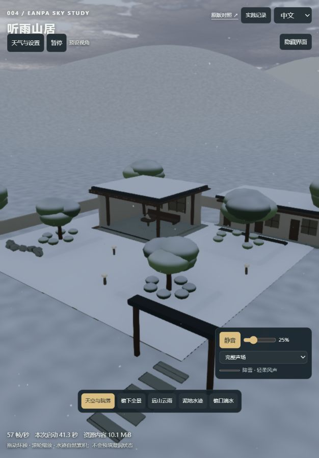

# 第 19 轮：碰撞、声音与交互修复

日期：2026-09-14。对应 [第 18 轮排查](audit-2026-09-14.md)。基于 Eanpa Sky v0.2.1 / `a197d3dc42577e9b870b471a39d6b1710c5b5633`，上游代码 MIT；本轮只修改宿主演示，没有修改上游缓存。

## 修复内容

| 问题 | 原因 | 本轮处理 |
| :--- | :--- | :--- |
| 冰雹从侧面进入屋檐下，突然跳到屋顶 | 原判断仅比较当前位置与最高表面，没有判断是否从上方穿过表面 | 小时间步保留前一位置，按下落路径和接触点检测，只接受上方到下方的穿越；屋檐下可继续落到下层地面 |
| 全景冰雹没有对应声音 | 单次近景声在 18 米外衰减为零 | 保留近处定位敲击，新增由碰撞能量驱动、随距离衰减的远处整体声场；仅雨声和仅风声不会混入冰雹 |
| 暂停选天气后控件变了，画面没变 | 天气操作排队等待渲染，但暂停停止了队列执行 | 暂停按钮常驻；暂停时调整场景参数自动继续播放，界面明确提示；连续天气/时间操作合并待执行请求 |
| 拖动镜头后仍标为预设全景 | 仅取消镜头动画，没有更新视角状态 | 手动改变机位标为“自由视角”，取消预设选中；观察记录包含实际位置和朝向目标 |
| 控制面板遮挡主体 | 多组操作常驻画面，暂停入口隐藏在参数里 | 设置默认收起，可随时展开；相机与声音保留，顶部提供独立暂停按钮 |
| 树冠有雪色但粒子穿过 | 雪花只查建筑和地面高度 | 建筑、台阶、路径、树冠统一表面查询；庭院六棵树以跟随现有树冠布局和摆动的椭球近似拦截雪花及冰雹 |
| 切换天气后少数冰雹长期残留 | 移动树冠或增厚雪面可能让粒子错过离散表面，原生命周期只等待正常落地结束 | 追加越界、无效位置和最长 8 秒的单粒子回收；正常反弹仍由材质控制 |

## 操作方式

打开本地 `/lab/`，点击“天气与设置”后切换冰雹或降雪。选择“天空与院落”看整体，选择“檐下全景”或“泥地水迹”对比近处。声音需点击开启，默认 25%；“仅冰雹声”便于检查远近层次。暂停后选择天气会继续播放；手动拖动镜头后可从工具栏看到“自由视角”。实践记录可查看当前层状态和实际机位。

## 实现边界

- 屋顶、台阶和地面依赖当前院落的已定义布局；树冠是椭球近似，不是任意模型的逐三角形碰撞，也未增加枝条、灌木和远处林带的完整碰撞。
- 积雪仍为加速的视觉覆盖。树冠和山体主要改变材质，没有细枝堆雪、温度、融雪排水或风吹雪求解。
- 远处冰雹使用合成的整体敲击纹理，由真实碰撞事件控制强度；不逐一定位远处每个冰粒，未增加外部音频素材。声音路由和输出检查不等于人工听感验收。
- 没有新增 GPU 纹理或局部阴影贴图；共享表面查询仍有 CPU 运算，不能宣称零成本。本轮不构成受控性能基准。

## 验证

函数测试覆盖屋檐侧入不抬升、正常屋顶碰撞、树冠与下层地面、有限路径边界、远处声音距离范围及异常粒子回收。浏览器证据和最终结果记录在 [验证记录](notes.md) 第 19 轮。

最终相关测试 14 项通过，浏览器报告未记录运行错误。全景冰雹远处声音有非零输出；暂停切雪后帧数继续增长，天气和时间保持独立，所有残留冰雹归零。记录见 [原始状态](assets/78-fix-checks.json)。

