# 004 · Eanpa Sky：逐轮实践归档

本页保留发布前的逐轮说明与历史状态；最新摘要、效果与发布入口以 [项目首页](README.md) 为准。

固定版本运行 Eanpa Sky 原版，并提取天气能力搭建独立的“听雨小院”：程序化庭院复用体积云、昼夜、云影、降雨、湿润与反射。两个入口均支持中英切换与实践记录；尚未移植到白鹭河谷。

| 项目 | 内容 |
| :--- | :--- |
| 固定编号 | 004 |
| 原始仓库 | https://github.com/SkyeShark/Eanpa-Sky |
| 作者 | SkyeShark |
| 发现渠道 | 用户提供的 GitHub 仓库 |
| 研究版本 | v0.2.1 · `a197d3dc42577e9b870b471a39d6b1710c5b5633` |
| 研究日期 | 2026-09-14 |
| 许可证 | 代码 MIT；素材分别授权，见下文 |
| 技术栈 | Three.js r186、本地渲染器补丁、WebGPU、TSL |
| 进度 | 已复现；三种天空切换、昼夜、降雨与风暴已观察 |
| 本地演示 | 服务启动后访问 http://127.0.0.1:8044/ |
| 在线演示 | 本研究尚未部署；[上游官方演示](https://skyeshark.github.io/Eanpa-Sky/) |

[返回总索引](../../README.md#项目索引) · [运行与操作](app/README.md) · [资源开销与实现原理](resource-analysis.md) · [验证记录](notes.md) · [截图来源](assets/README.md)

## 当前阶段与后续备忘

现有版本已满足天气与天空能力研究及山居民宿效果演示的阶段需求，暂时收尾。后续可优化加载与稳定性、屋顶融水和地面联动，并按需补充晨雾、雨雪混合、声音与光线细节；这些仍是待办设想。范围、优先级与验证边界统一记录在 [当前结论与后续优化](next-steps.md)。

## 融雪联动与运行检查

第 25 轮让积雪消退补入泥土与浅洼，新增 135 秒日间融雪导览；运行事件与资源趋势设定容量上限。40 项检查通过，实际持续运行范围见 [专项记录](snowmelt-and-stability.md)。

## 启动预览与自动画质

第 24 轮提供轻量院落示意、真实五阶段准备进度、带冷却与恢复门槛的自动画质，以及可记忆的手动均衡/省电模式。35 项检查通过；完整范围见 [实现与验证](startup-and-adaptive-quality.md)。

## 启动与降雪优化

第 23 轮减少哑光表面的反射编译与雪花重复碰撞计算，31 项检查通过；两次启动约 29.2 / 36.3 秒。详见 [实测对照与画质取舍](performance-2026-09-14.md)。

## 单设备验收

29 项测试通过，增加启动分段与运行耗时诊断；主要启动等待在编译阶段，雪景稳帧仍需优化。详见 [验收范围、数据与保留项](acceptance-2026-09-14.md)。

## 水岸与演示进度

水洼随地形退缩并留下湿痕，雾化接入引擎过渡进度；自动演示提供常驻阶段与倒计时。见 [实现与操作](shoreline-and-progress.md)。

## 天空与雨停对比

新增“看天空光线”和“演示雨起 → 雨停”，泥土含水与浅洼水量分别保留；加强不同天气的散射光与远山雾化差异，声音增加材质变体和距离滤波。见 [实现、操作与边界](weather-continuity.md)。

## 本轮一致性修复

已修复冰雹侧入屋檐的错误碰撞、全景冰雹声场缺失、暂停切换不生效和自由机位记录失真。设置默认收起，暂停按钮常驻；树冠补充近似粒子拦截。见 [修复说明与验证](fixes-2026-09-14.md)。

## 完整听雨体验

当前默认进入檐下听雨：远处三层山林与天气雾化、中景院落雨幕、近处粗糙泥土与浅洼、檐口水滴和落点声音共同呈现。四个观察机位、隐藏界面、远景/滴水开关和近处声音调节可用于逐项对比。点击“完整听雨体验”恢复雨景并保留当前时段。天气与时段已分行独立控制，可组合夜雨或清晨雷暴；导览明确标注为组合预设。新增独立灯光开关、自动模式、亮度与茶亭 / 步道 / 客房分区控制，近处水滴响应灯光。院前新增集中的雨丝、落地水花和渐淡涟漪，浅洼随降雨蓄水、停雨后缓慢退水。

实现与边界见 [远景、近景与声音](sensory-experience.md)。声音以自然雨雷为基础，近处落点是合成短音，未增加外部录音下载。


## 降雨与地面反馈

院前集中雨丝落地后产生水花；石面与水面的扩散圈逐渐变淡，三处浅洼从零蓄水并在雨停后缓慢减少，现已使用二维波动场让涟漪传播、叠加和衰减；右侧提供“滴一滴，看涟漪”与波动开关。可用“泥地水迹”机位查看，属于当前院落的局部视觉近似。新增飞溅已改为毫米级软边薄片，避免厘米级球体的弹珠感，详见 [原因与算法选型](splash-algorithms.md)。


## 夜雨与灯光

灯光行可选自动、开灯、关灯；展开“灯光亮度与区域”可调整亮度并分别控制茶亭、步道、客房。设置独立于天气和时间。当前局部照明为视觉近似，未增加局部灯光阴影或精确室内光照计算。


## 雨与闪电的直接入口

首页新增“看泥地雨景”和“观看闪电”。前者切到降雨与低机位，比较泥地湿色、浅洼积水和石径水花；后者切到雷暴，在过渡后调用上游落雷事件。雷暴已就绪时可再次点击重放事件。普通降雨不会自动产生雷电，夜晚本身也不代表下雨。

院前由大片铺地改为泥地与窄石径；泥地采用浅起伏与局部积水遮罩，仍是视觉近似，没有完整径流和真实泥浆模拟；最新迭代已加入局部檐口滴水。保持 5,000 雨粒子、350 水花，将雨域半径从默认 45 米缩为 28 米，使近景分布更密，远处覆盖会相应减少。

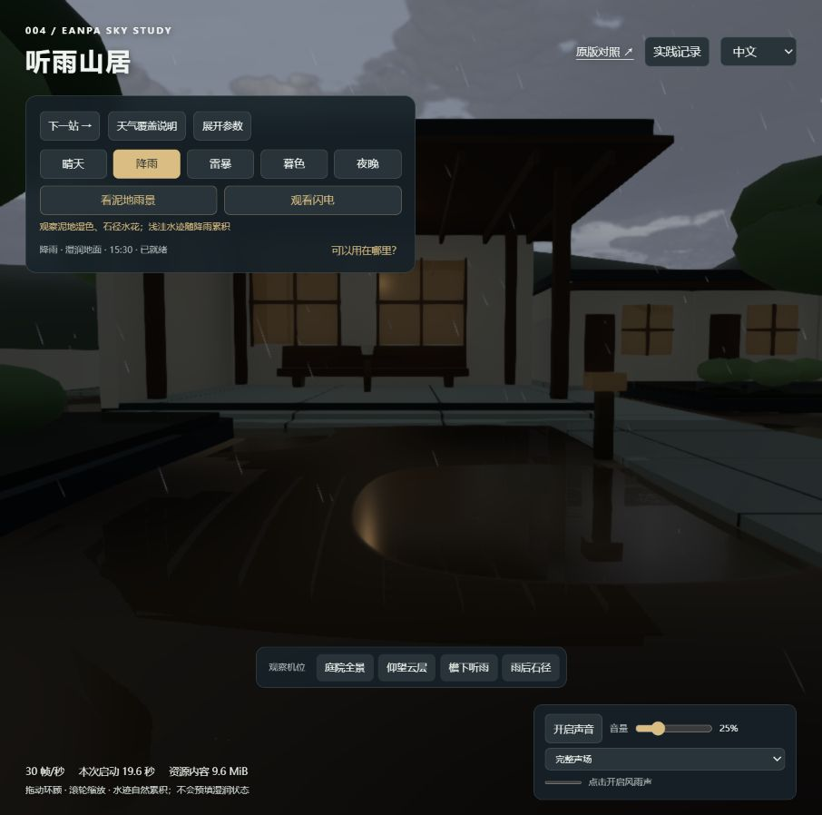

## 当前应用：听雨山居

[打开民宿体验](http://127.0.0.1:8044/lab/)（本地服务运行时可用）。入口门架、花园、茶亭与三间客房组成四站路线：抵达庭院 → 花园散步 → 檐下品茶 → 夜间归房。每站实际切换镜头、天气与时间，天气适配按钮可进入茶亭或查看归途。虚构民宿原型，未接入真实预订。

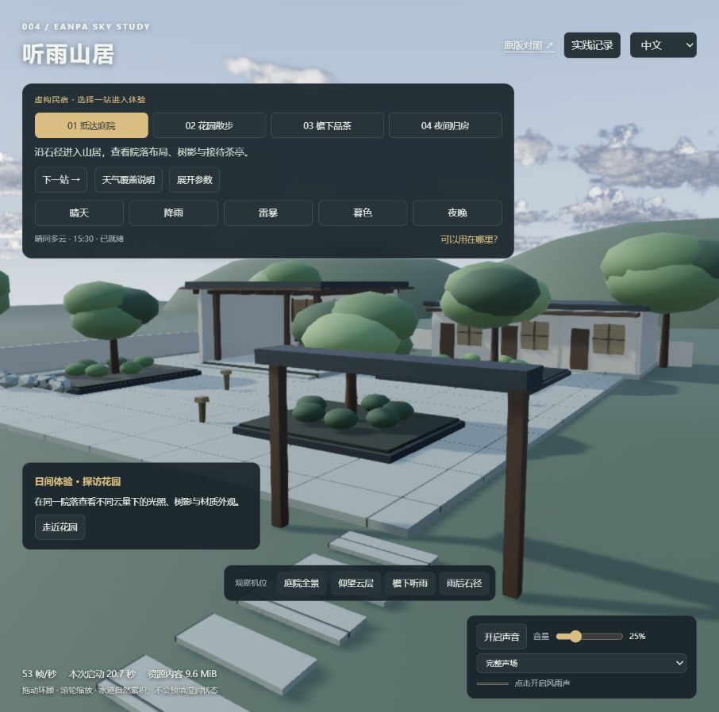

“展开参数 → 天气”现已补齐固定版本 8 种天气预设；暮色、夜晚单列为时间维度。缺失天气、接入范围及应用过程见 [天气覆盖与民宿应用](weather-coverage.md)。

## 中文界面与实践入口

**同机位天气适配：**新增有屋檐、石径、花园与夜灯的完整小院，上方可切换晴天、降雨、雷暴、暮色、夜晚，保持当前机位。树冠随风轻摆，院灯随天色亮起。详细接入方案见 [可扩展场景与路线](extension-roadmap.md)。

**观察主题：**“建筑雨景、落日景观、雨中材质”自动设置天气、时间与观察机位；参数默认收起，画面上保留观察说明。点击“可以用在哪里？”查看五类应用及接入边界，详见 [使用场景](use-cases.md)。

**声音联动已加入：**右下角“开启声音”播放风雨声，进入屋檐下会改变声音，闪电后按距离延迟播放雷声。支持音量、静音；暂停与打开记录时声音一起暂停。新版采用自然雨声、自然雷声和轻量合成风声；首次开启加载约 0.4 MiB。声音读取 GPU 局部雨量与遮挡，支持分层检查；默认音量 25%。[声音来源与处理](assets/audio/README.md)。

新增独立演示：[听雨小院](http://127.0.0.1:8044/lab/)（需启动本地服务）。四个机位用于观察云层、屋檐雨幕与地面水迹，提供均衡/省电档、暂停、自动昼夜及 JSON 观察记录导出。原版顶部也有入口。

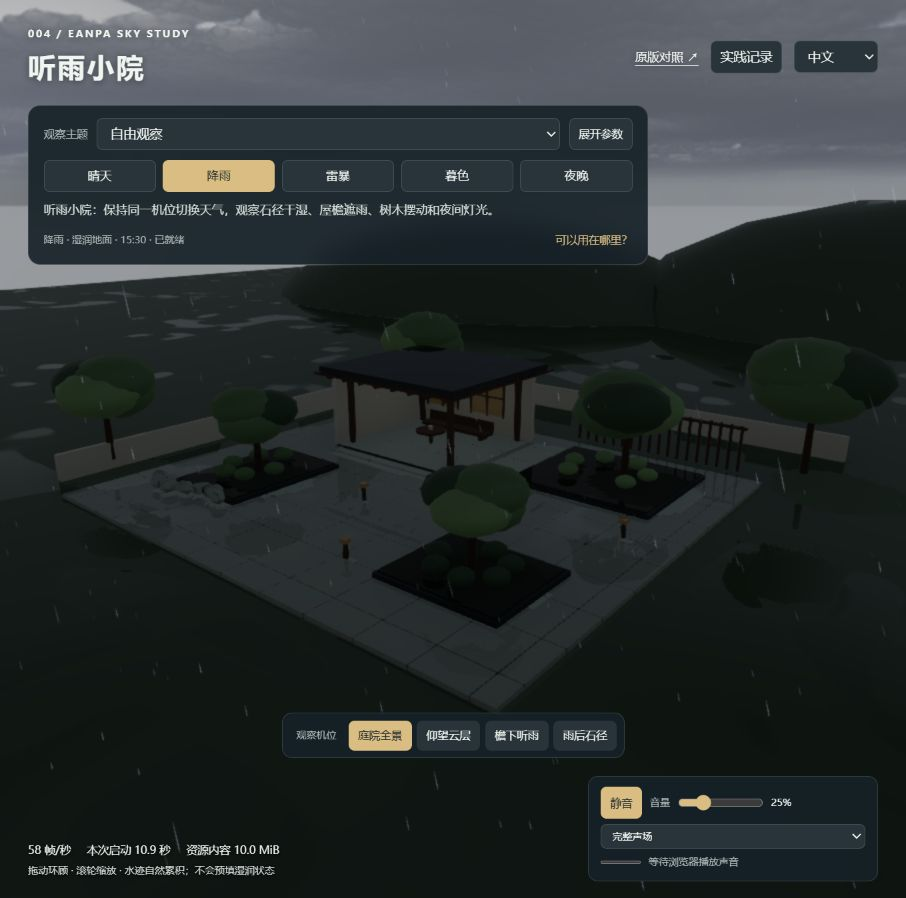

首轮实测加载 41 个已统计资源，内容合计约 9.6 MiB；本地缓存已预热时，启动约 11.1 秒。这不是网络传输量、显存或受控性能对比。提取方式与边界见 [能力实践](extraction.md)。

页面上方选择“中文 / English”切换语言，偏好保存在本机；切换语言保持天空、天气、时间与画质参数。点击“实践与原理”打开记录，包含资源实测、效果原理、操作过程和截图；关闭后返回当前场景。也可访问本地独立记录页 http://127.0.0.1:8044/practice/ 。

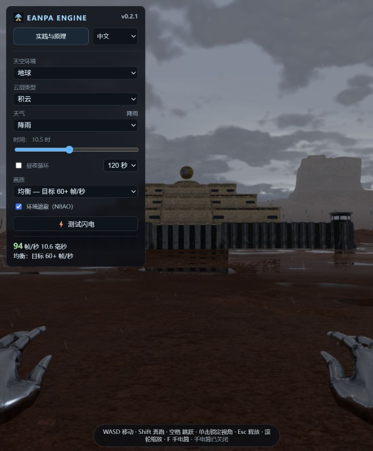

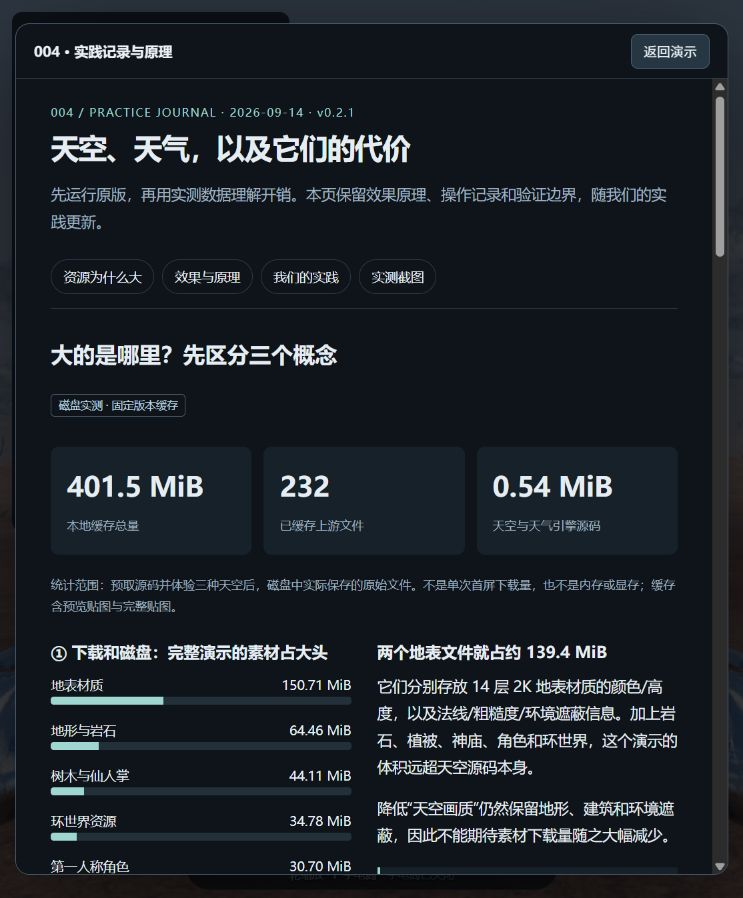

## 先体验哪些能力

| 顺序 | 原版控制项 | 观察重点 |
| :--- | :--- | :--- |
| 1 | Earth + Cumulus + None | 云团体积、边缘透光、云与建筑的空间关系 |
| 2 | Time of day | 正午、日落和夜间的天空、光照、星月变化 |
| 3 | Cloud Type | Clear Sky / Cumulus / Stratus / High Cirrus 的区别 |
| 4 | Weather → Rain | 等待约 45 秒的过渡，观察降雨、表面变湿与雨后保留的水迹 |
| 5 | Weather → Storm / Dark Storm | 厚云、暗化和闪电；可用 test lightning strike 触发测试 |
| 6 | Skybox → Orbital / Halo | 环世界与遮光效果；切换需要重新准备着色器 |
| 7 | Skybox → Earth 5129323011 CE (Red Giant) | 红巨星、护盾与破碎月球环境 |
| 8 | Quality | 比较实时体积云与 Performance 缓存云的画面和开销 |

上表是体验路径；具体完成了哪些实测，以 notes.md 为准。界面的 FPS target 是上游目标，不能当作本机测试结果。

## 本地运行

在研究仓库根目录执行：

```powershell
python projects/004-eanpa-sky/app/serve.py --prefetch-code
```

浏览器访问 http://127.0.0.1:8044/ 。需要支持 WebGPU 的浏览器与显卡；首次需要联网下载资源。运行服务仅绑定本机，不发布到公网。详细说明见 [app/README.md](app/README.md)。

## 本轮实现范围

- 从研究模板创建独立子项目。
- 用固定 commit 的文件清单运行上游场景和渲染模块；中文入口追加独立界面脚本和样式，原始缓存不变。
- 增加中英文切换、实践记录弹窗和独立记录页；`/original/` 保留未汉化对照。
- 本地服务按请求下载，并以文件大小及 Git blob SHA-1 校验内容；缓存命中后可复用。
- 不将完整上游仓库、嵌套 `.git` 或大体积运行缓存提交到研究仓库。
- 新增 `app/lab/` 独立庭院与控制层，复用固定上游天气模块；降低雨粒子与表面捕获预算，不使用预填湿润数据。
- 截图和实际观察独立记录；原版与提取版分别保留。

## 图片与验证

以下 01—07 为第一轮固定版本原版实测截图，保留英文界面；本轮中文适配截图见上方 08—09。没有重新绘制或生成效果画面。

| 原版 Earth 积云 | 降雨与地面水迹 |
| :--- | :--- |
| 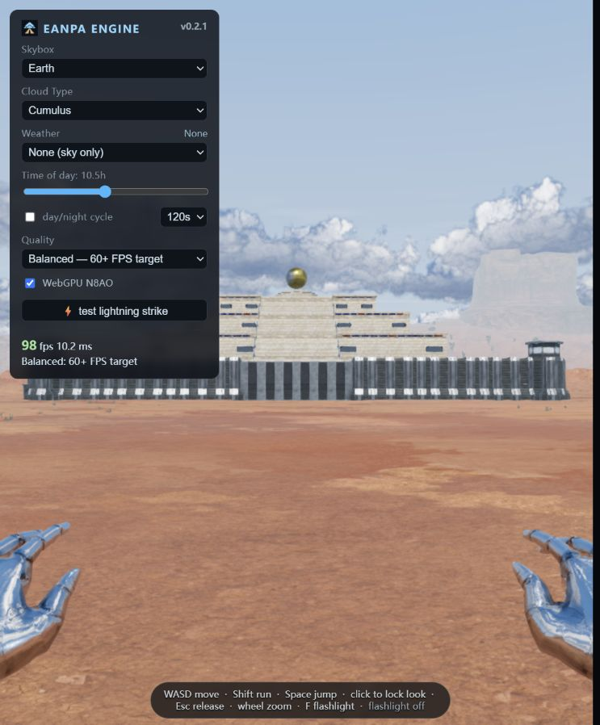 | 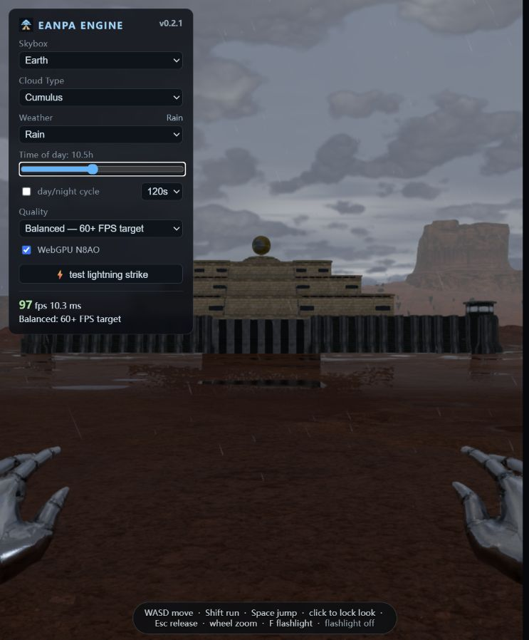 |

| 暮色 18.5h | 夜间 24h |
| :--- | :--- |
| 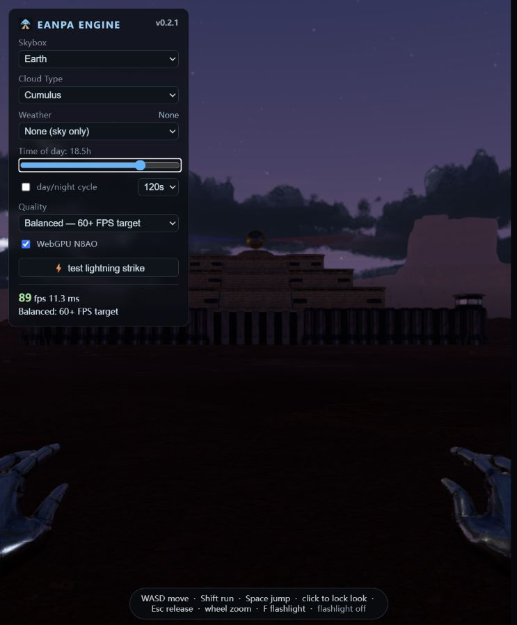 | 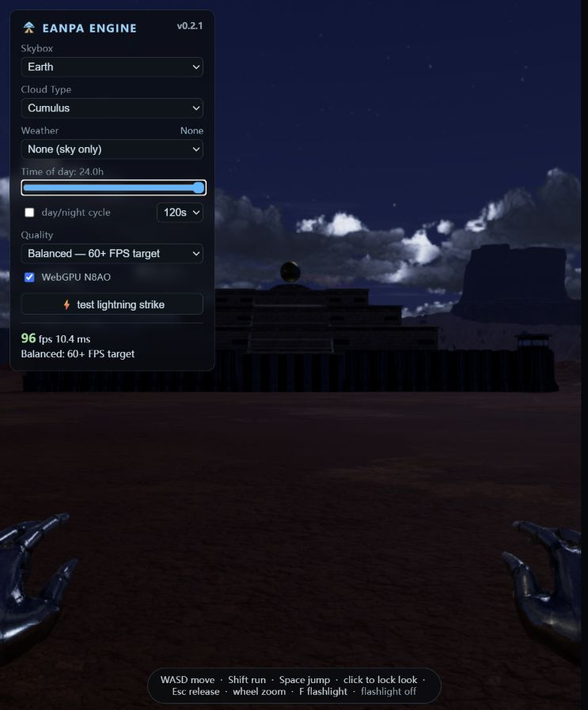 |

| Orbital / Halo 环世界 | Shieldworld 科幻天空 |
| :--- | :--- |
| 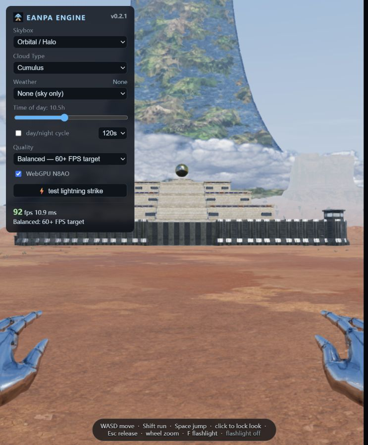 | 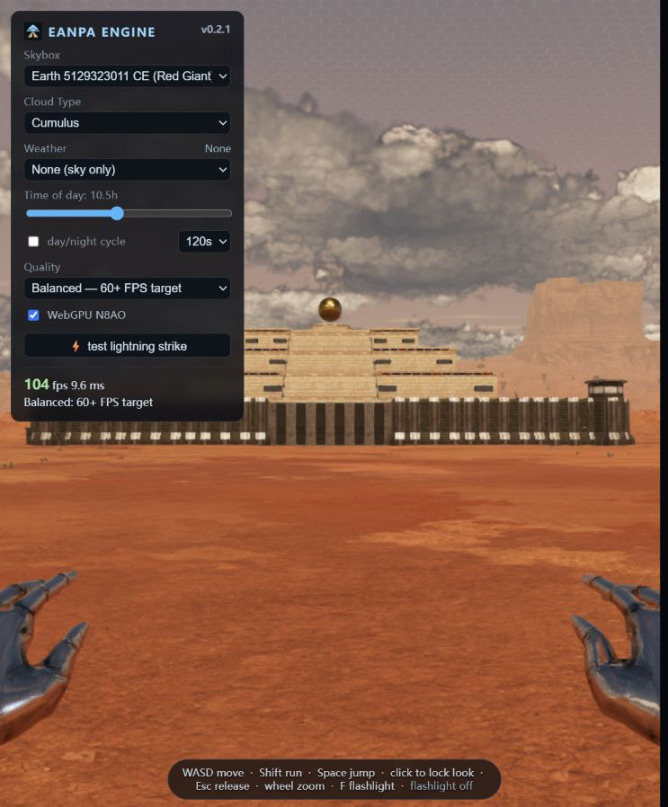 |

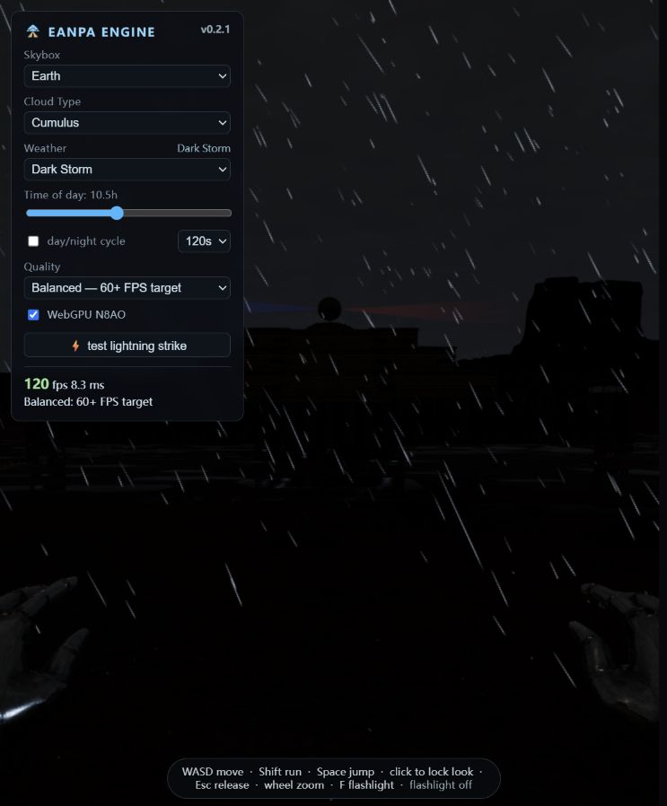

已确认原版启动、三种天空切换、时间滑块、Rain 与 Dark Storm 过渡。原版闪电测试按钮有排队反馈；尚未捕获闪电瞬间。默认方向的 Shieldworld 截图展示护盾纹理与环境光，未包含红巨星圆盘和破碎月球。完整验证边界见 [notes.md](notes.md)。

## 价值与边界

适合研究天气如何同时影响云、日照、阴影、降雨与地面材质。后续可评估向白鹭河谷移植局部技术，但当前 WebGL 场景不能直接接入这套 WebGPU/TSL 实现。

上游指出完整默认演示首次传输约 345 MB、着色器准备可能耗时数十秒；本地按需缓存不是渲染性能优化，也没有缩减场景。表面水是材质近似，不模拟径流、排水或真实积水体积。

## 来源与许可

- [上游源码与 MIT 许可](https://github.com/SkyeShark/Eanpa-Sky/blob/a197d3dc42577e9b870b471a39d6b1710c5b5633/LICENSE)。
- [素材与音频许可](https://github.com/SkyeShark/Eanpa-Sky/blob/a197d3dc42577e9b870b471a39d6b1710c5b5633/assets/audio/README.md)：四段鸟鸣是 CC BY-NC-SA，部分生成音频的分发条款待确认，不能将素材整体视作 MIT。
- [Three.js 本地补丁](https://github.com/SkyeShark/Eanpa-Sky/blob/a197d3dc42577e9b870b471a39d6b1710c5b5633/vendor/three/EANPA_PATCHES.md)。
- [接入与画质取舍](https://github.com/SkyeShark/Eanpa-Sky/blob/a197d3dc42577e9b870b471a39d6b1710c5b5633/docs/SKY_SYSTEM_INTEGRATION.md)、[降雨原理](https://github.com/SkyeShark/Eanpa-Sky/blob/a197d3dc42577e9b870b471a39d6b1710c5b5633/engine/RAIN.md)、[已知限制](https://github.com/SkyeShark/Eanpa-Sky/blob/a197d3dc42577e9b870b471a39d6b1710c5b5633/KNOWN_ISSUES.md)。

## 晴阴雨雪对照（第 16 轮）

“天空与院落”提供同时观察天空、屋顶和庭院的机位；常用天气按钮依次为晴朗、阴天、降雨、降雪、雷暴，保持时段与灯光。新增慢落飘雪、屋顶与露天地面渐变积雪、檐下遮挡和轻柔风声。雪为宿主扩展，不计入上游原生 8 种预设。详见 [降雪实践与扩展边界](snow-weather.md)。

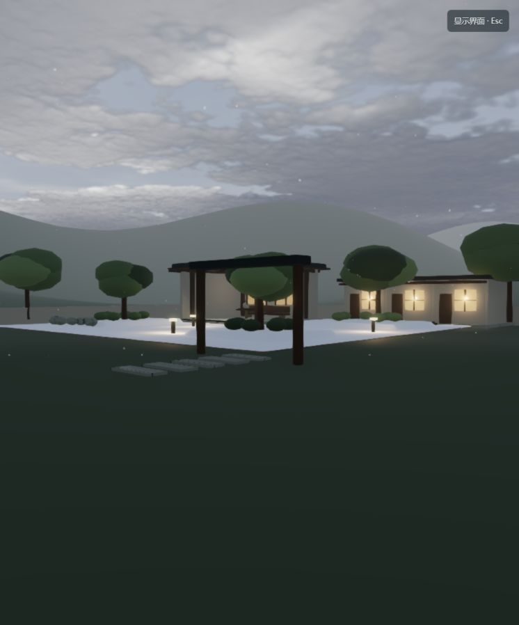

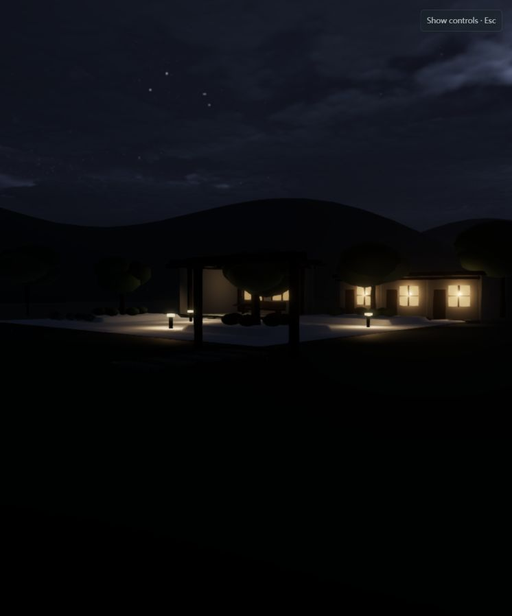

## 第 17 轮：冰雹与整片雪景

新增冰雹的快速落下、材质碰撞、衰减反弹与独立敲击声；树冠、林带、草地和山体上表面共享积雪进度。无新增素材下载，雪景复用现有几何。入口与边界见 [冰雹与连续雪景](hail-and-landscape-snow.md)。


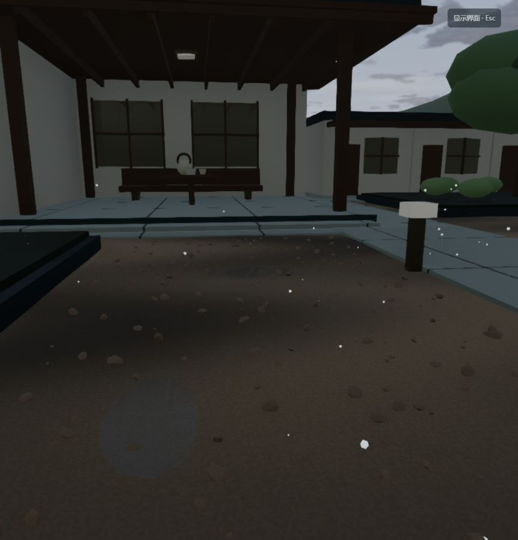

## 当前问题排查（第 18 轮）

[问题分析与本轮截图](audit-2026-09-14.md)：确认冰雹侧向碰撞缺陷，复现全景声场覆盖不足与暂停切换的体验问题；区分积雪、灯光和性能监测的现有限制。此轮为排查，修复尚未执行。
