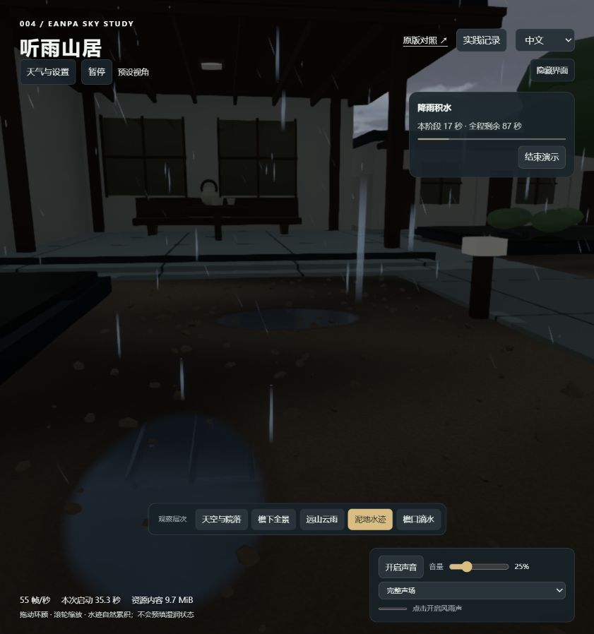
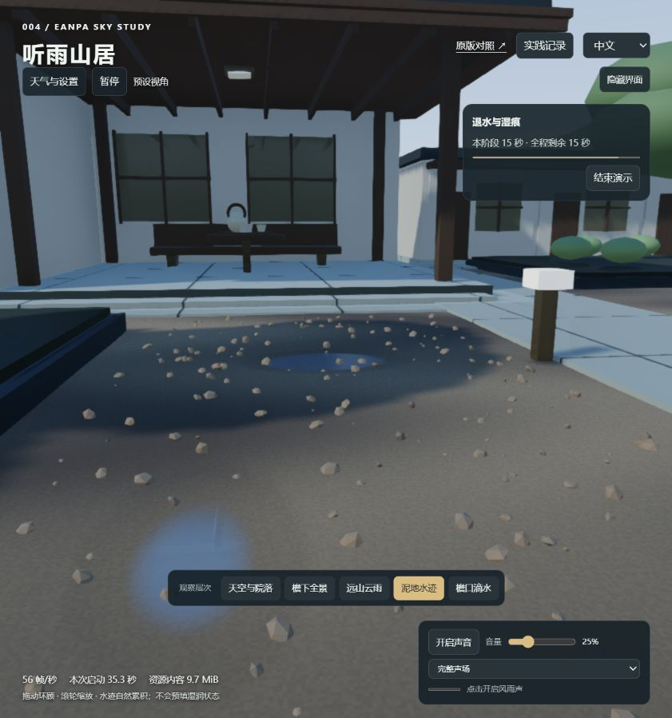

# 第 21 轮：水岸、天气过渡与演示进度

日期：2026-09-14。Eanpa Sky v0.2.1 / `a197d3dc42577e9b870b471a39d6b1710c5b5633`，上游代码 MIT；改动位于宿主，未修改上游缓存。

## 水洼

水位与实际泥地高程相比较，只有水位高于地面的区域显示水面；岸边以毫米级深度渐隐。水位从低洼处升起，退水后轮廓收缩，不再只缩小整个椭圆的透明度。网格增加静态地面高度属性，沿用既有水波网格，没有增加 GPU 纹理。

雨滴和冰雹接触查询使用同一水位与岸边深度定义，露出的岸边重新归为泥土。靠岸波幅衰减，过浅处的“滴一滴”入口不会制造不可见水波。泥土保留较慢消退的历史水位痕迹，形成水退之后的暗色湿边。

目前仍限定于三个预定义浅洼，没有任意地形连通域、水量守恒或径流求解。显示面积是网格上的软覆盖估计，不是实测水域面积。

## 过渡

雾密度与云量因子跟随引擎天气过渡的 easedProgress，光线、云层、降雨继续由原引擎驱动，不额外改写其降雨时序。快速切换时保存当前雾化值作为新起点。雪与冰雹等共用同一个引擎天空、没有新引擎过渡的情况，使用 12 秒后备过渡；保留独立时间和照明设置。

## 演示

“演示雨起 → 雨停”保留原有 110 秒流程：0–12 秒云层聚拢、12–40 秒降雨积水、40–52 秒雨停放晴、52–110 秒退水与湿痕。阶段是演示时间安排，不表示从已下雨的场景启动时会重置天气或水量。

右侧进度卡显示当前阶段、本阶段剩余秒数、全程剩余秒数和进度条；收起设置后依然可见。暂停冻结倒计时，结束按钮停止自动切换并保留当前天气和水分。中英文均可用。隐藏界面时进度卡也隐藏。

验证见 [本轮记录](notes.md) 第 21 轮。

## 实际对照

三处采样覆盖比例由 [0.408, 0.3388, 0.3792] 降到 [0.2247, 0.0795, 0.1666]。暂停前后帧数和倒计时保持一致；最终自动放晴确认采用引擎过渡时钟。24 项相关测试通过。见 [原始状态](assets/88-shore-checks.json)。
