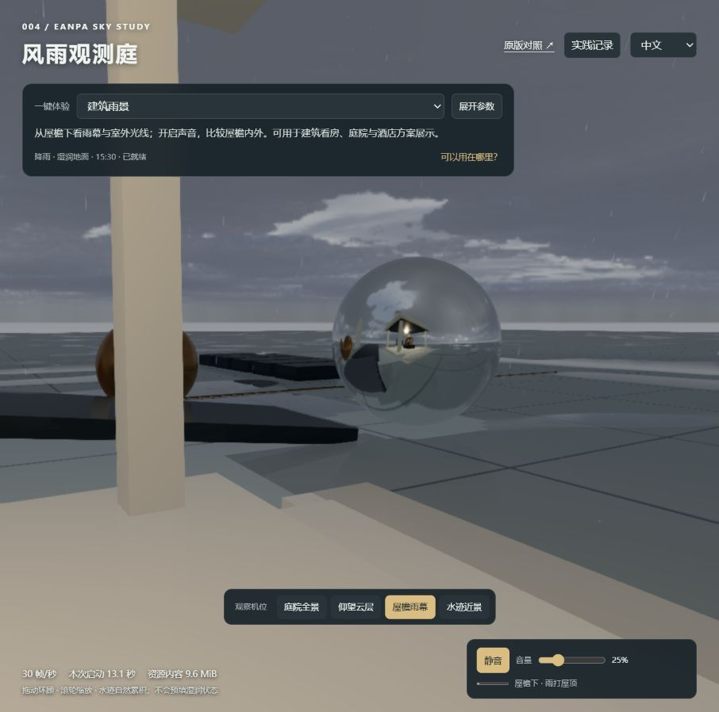
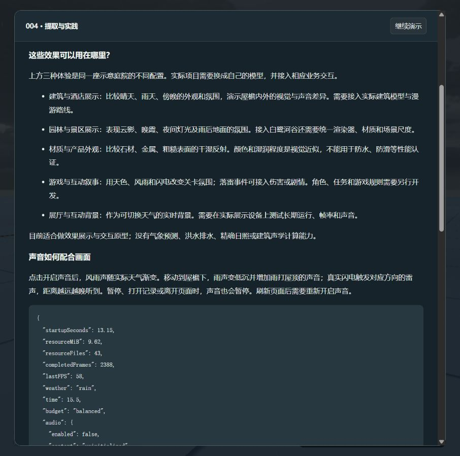

# 效果能用在哪里

2026-09-14，依据本研究固定版本 Eanpa v0.2.1 的实际接入和源码核查整理。以下是能力应用分析，不代表这些完整业务系统已经完成。

这套能力适合给已有的三维场景增加天空、光照、天气、湿润反射与声音，重点是外观、氛围和互动体验。它不会自动生成建筑、地形或完整游戏。

| 场景 | 可以实现的体验 | 当前如何观察 | 落地还需补充 |
| :--- | :--- | :--- | :--- |
| 建筑看房、酒店、庭院方案 | 晴雨与昼夜切换，建筑受光、屋檐雨幕、室内外声音差异 | 一键“建筑雨景”，比较屋檐与露天机位 | 实际建筑模型、玻璃等材质、尺度与漫游路线；复杂建筑需重做声音区域 |
| 景区、园林与景观方案 | 云影、晚霞、夜间灯光、雨后反光，呈现不同天气的氛围 | 一键“落日景观”，再观察云层 | 地形、植被、水体和灯光；移植到白鹭河谷要统一渲染器、材质和更新循环 |
| 材质与产品外观展示 | 对比石材、金属和粗糙表面在干湿、明暗条件下的外观 | 一键“雨中材质”，等待自然变湿 | 实际产品模型、材质标定、摄影条件匹配；不能认证防水、防滑等物理性能 |
| 游戏、互动叙事 | 天气改变关卡氛围，闪电事件触发剧情或伤害 | 原版天气切换、当前测试闪电和雷声事件 | 角色、玩法、任务、碰撞、存档；本库只提供环境及相关事件 |
| 展厅、互动背景 | 实时切换天气与声音，作为三维背景或装置的一部分 | 当前天气与声音控制 | 展示屏适配、设备性能与长期稳定性测试，按设备准备降级方案 |

## 本轮新增的演示方式

三种一键配置仍使用同一座示意庭院，没有伪装成三个已完成的客户项目。选择配置后，会设置天气、时间、机位，关闭自动昼夜并恢复演示；天气仍经过 12 秒过渡，地面水迹仍自然累积。手动更改天气或时间后，回到“自由观察”，避免用途标签与参数不一致。

控制面板默认收起，通过“展开参数”调整详细设置；天气和时间摘要保持可见。机位切换采用约 1.1 秒平滑过渡，手动拖动会中断过渡，系统偏好减少动画时直接切换。

“可以用在哪里？”直接打开用途说明，记录弹窗继续暂停画面与声音。用户操作与选择的场景配置写入可导出的会话记录。

## 对当前研究仓库的价值

已经验证了“简单宿主场景 + 固定天气模块 + 独立声音层”的接入方式。可以在此基础上接入自己的模型，制作可交互的天气展示原型。白鹭河谷的接入尚未完成，当前演示用于提前确认效果与集成接口。

不适合据此做真实天气预测、洪水与排水计算、精确日照分析或建筑声学评估。所用参数包含视觉近似与美术设定；当前也没有新增雨雪结冰等未实现能力。

[本地运行与操作](app/README.md) · [提取实现与验证](extraction.md) · [项目总览](README.md)

## 最新场景与深入接入

演示入口已升级为“听雨小院”，五种天气/时间保持同机位比较；新增自然声音与局部遮挡联动。各应用还需补充的模型、材质、交互、测试，以及接入 003 的渲染器差异，见 [可扩展场景与路线](extension-roadmap.md)。
