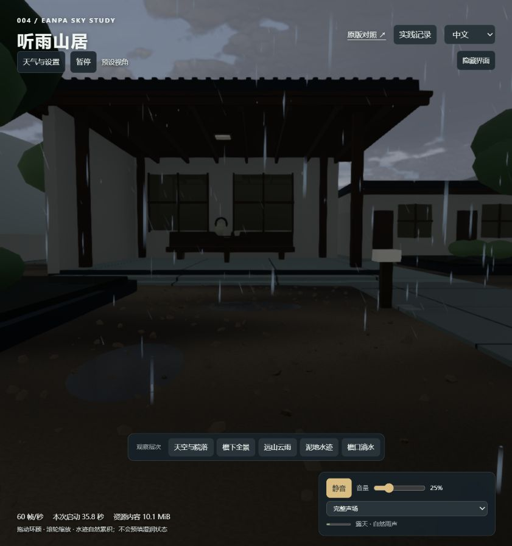
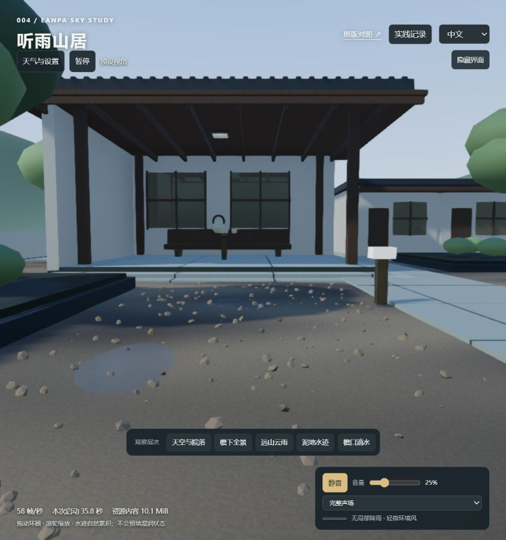

# 第 20 轮：天空、雨停地面与声音连续性

日期：2026-09-14；基于 Eanpa Sky v0.2.1 / `a197d3dc42577e9b870b471a39d6b1710c5b5633`，代码 MIT。本轮仅修改宿主，未改上游缓存。

## 查看方式

在本地 `/lab/` 点击“天气与设置”：

- **看天空光线**：转向天空，不改变天气、时段和灯光。保持机位切换晴朗、阴天、雷暴，对比云层、光照与远山能见度；时段仍独立可调。
- **演示雨起 → 雨停**：保持当前时段，转到泥地机位，40 秒降雨后自动放晴，再观察 70 秒退水；包含引擎 12 秒天气过渡。暂停也暂停流程；点击停止或手动切换天气退出。重复演示保留当前水量，不预填、不清零。
- **含水状态**：设置区显示泥土含水和浅洼水量。雨停不代表立即干燥；水面波纹逐渐衰减，水位退去后湿土继续保留。
- **声音**：开启声音后，以“仅细节声”比较屋檐、石面与泥地，或选择“仅冰雹声”对比远近声音。

## 实现

天空继续由上游体积云、太阳位置、云影和天气过渡驱动。宿主为阴天、降雨、雷暴调整直接光、散射光和云辐亮度配比，保留原有太阳时序；按天气用四秒时间常数平滑调整场景雾密度。雾色仍使用引擎随时间变化的天空光色，避免夜晚出现发亮的白色远山。

泥土含水与浅洼水量采用两个连续状态。降雨时先湿土再积水，雨停后水量先退、土壤后干；白天太阳、云量和风影响干燥速度。含水量直接控制泥土的暗色和粗糙度，避免与上游湿润效果重复叠加。水面保留既有波动场。院前降雨和蓄水改用场景总雨量，不再因相机进入屋檐而减小；听者声场仍使用相机局部雨量。

每种接触材质生成六组短音变体，连续触发避开相同变体，以噪声为主、短衰减共振为辅；距离越远高频越弱。屋顶滴答间隔改为不均匀抽样；远处冰雹声床延长到 19 秒。保留音量渐变、分层隔离与并发上限，不额外下载素材。

## 边界

含水百分比是加速视觉状态，不是实际土壤含水率；没有水量守恒、径流、温度、融雪排水或蒸发物理求解。云层生成仍来自上游，当前调整不是新增气象模拟器。声音已做波形与路由验证，人工听感仍需结合实际设备确认。没有新增 GPU 纹理或阴影贴图；音色变体和声床会增加少量音频缓冲内存。

实际验证与截图见 [验证记录](notes.md) 第 20 轮。

## 画面对照

验证结果：18 项相关测试通过；雨停时浅洼水量从 0.639 下降到 0.333，泥土仍保留 0.613；暂停时状态保持，完整流程自动结束。原始报告见 [本轮状态记录](assets/84-continuity-checks.json)。
