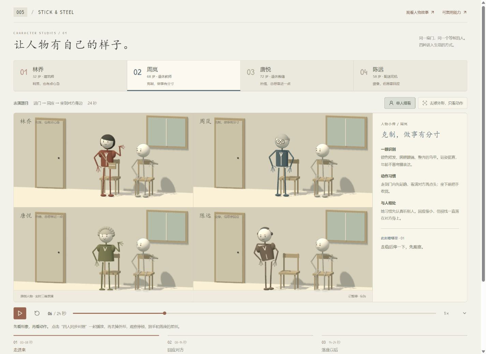
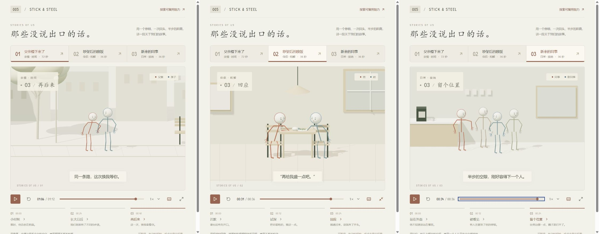

# 005 · Stick & Steel｜人物动画与交互底座研究

*效果引导图：2026-09-14 本地实时三维表演截图。点击图片直接观看在线人物表演；研究导览与互动演示已发布至 GitHub Pages。*

**这个库的意义，是把简化人物、动作表演、生活场景、声音与物理交互积累为可重复使用的创作材料。** 当前以研究原型验证两条路线：按剧本与时间轴制作叙事视频；按玩家操作与事件制作游戏效果和交互展示。它还不是可直接安装的通用动画库、完整游戏引擎或自动视频创作工具。

**当前已完成：**四种人物刻画、三个 MiniMax 配音生活故事、六组物理能力演示，以及中文训练和机器人对战。**后续重点：**先打通“故事到 MP4”的完整制作流程，再把经过验证的流程沉淀为可由 Codex 等代理调用的创作 Skill。

[在线效果导览](https://yydshly.github.io/0913_codex_project/005-stick-steel/) · [人物演示](https://yydshly.github.io/0913_codex_project/005-stick-steel/demo/?view=characters) · [配音故事](https://yydshly.github.io/0913_codex_project/005-stick-steel/demo/?view=stories) · [物理演示](https://yydshly.github.io/0913_codex_project/005-stick-steel/demo/?view=capabilities)

[当前能力总览](capabilities.md) · [后续开发与 Skill 路线](next-steps.md) · [启动与操作](app/README.md) · [验证记录](notes.md) · [来源与改动](source-and-changes.md) · [返回总索引](../../README.md#项目索引)

## 从效果进入

### 1. 人物刻画：同一件事，四种表演

引导图展示林乔、周岚、唐悦和陈远，演出同一段 24 秒的“进门、回应、落座”。通过发型、衣服、站姿、步速、视线与停顿区分人物；支持四人同步对照，移除外形后单独观察动作。两位老年女性具有不同习惯，不把年龄或性别写成统一动作。

[查看人物刻画与操作说明](characters.md) · 本地路由：`?view=characters#zhou`

### 2. 叙事方向：三个生活故事

*三个故事的历史实际截图；配音在后续迭代中加入，截图本身不代表声音。*

《父亲慢下来了》72 秒、《吵架后的晚饭》36 秒、《新来的同事》36 秒。以牵手、递菜、回头和让出位置表达关系，提供章节、字幕、拖动、暂停与倍速；已生成 20 句 MiniMax 旁白与对白。当前人物刻画页单独采用无声表演。

[查看故事及分段说明](stories.md) · [配音与验证](minimax-audio.md) · 本地路由：`?view=stories#father`

### 3. 交互方向：六组物理能力

以实际接触和物理状态展示关节姿态、受力恢复、接球释放、武器握持碰撞、悬边攀爬、镜头观察。另保留中文训练与机器人对战，可用于研究玩法和反馈。

[查看物理能力与操作说明](reusable-capabilities.md) · 默认路由：`?view=capabilities` · 完整对战：`?view=duel`

## 扩展方向与当前边界

| 路线 | 可扩展作品 | 当前基础 | 尚需开发 |
| :--- | :--- | :--- | :--- |
| 视频创作 | 人物系列、家庭短剧、角色介绍、剧情片头、情境教学 | 固定人物配置、预设动作、生活场景、故事时间轴、字幕、配音 | 统一故事数据、分镜与画幅、固定帧率渲染、音画合成、MP4 导出与成片检查 |
| 游戏与交互展示 | 角色操作、物理效果、玩法教学、互动剧情、小型游戏原型 | 输入控制、接触反馈、物体握持、攀爬、现有训练与对战 | 拆分规则与场景依赖、通用交互事件、适合新玩法的关卡与反馈 |
| 创作 Skill | 用自然语言驱动可重复的制作与修改流程 | 现有示例、制作经验、配音脚本与检查记录 | 在完整成片流程验证后，整理输入输出、模板、脚本、失败处理及验收规范；尚未创建 Skill |

新故事仍需编写或编排；新人物尚未统一接入三个既有故事。没有文字自动生成完整动画、服装物理、口型同步、视频文件导出、联机或完整游戏编辑器。叙事表演是确定性编排，不能当作物理模拟涌现出的剧情。

## 后续开发顺序

1. **整理通用接口与内容数据。** 将人物、动作、场景、镜头和对白从单个示例中分离，使同一角色能出演不同故事。
2. **制作第一支可交付视频。** 完成横竖画幅、分镜、MiniMax 配音、字幕、固定帧率与 MP4 合成；用第二个不同故事检验复用。
3. **沉淀创作 Skill。** 由 Codex 理解需求并执行流程，Skill 保存制作方法与检查标准，底层程序负责可重复的渲染和导出；交付视频及可再次修改的故事工程。
4. **继续交互分支。** 根据具体展示需求提取操作和事件接口，验证新玩法；复用共同人物资产，分别管理视频时间轴与游戏状态。

具体交付物和验收条件见 [后续开发与 Skill 路线](next-steps.md)。本次完成归档，不把路线图列为已开发功能。

## 来源、运行与验证

| 项目 | 记录 |
| :--- | :--- |
| 上游网页 | [Genex · Stick & Steel](https://genex.games/stick-steel) |
| 上游仓库 | [Rabneba/stick-steel](https://github.com/Rabneba/stick-steel) |
| 固定提交 | `4c8e1d05a1ec47db93b687a81a82878727308b20` |
| 研究日期 | 2026-09-14 |
| 复用范围 | 选择性提取上游关节、物理、手部及对战模块；人物造型、生活故事、中文说明和配音接入为本项目新增 |
| 许可证 | 上游代码 MIT，Patrick Hand 字体 OFL；第三方生成模型/声音的单独分发条款待核实；本仓库原创内容尚未指定统一开源许可证 |
| 应用位置 | `app/client/`，React、Three.js、Rapier、Vite、TypeScript；独立管理依赖 |
| 本地运行 | 按 [运行说明](app/README.md) 启动后访问 http://127.0.0.1:8055/；开发预览仅监听本机 |
| 在线发布 | [GitHub Pages 研究导览](https://yydshly.github.io/0913_codex_project/005-stick-steel/)；main 推送自动构建，见[发布记录](../../docs/deployment.md#005--人物动画与交互研究发布适配) |
| 已有验证 | 44 项人物/物理/故事测试、5 项音轨测试；类型检查和生产构建通过，执行轮次见 [验证记录](notes.md) |
| 未验证范围 | 长期性能、手机实机、完整教学逐关人工通关、观众角色辨识率与独立音质评分；仍有大分包和 Rapier 初始化弃用提示 |

播放已生成的本地素材不需要 API Key；重新生成 MiniMax 配音需要本地凭据与相应服务额度，密钥不进入浏览器或版本库。没有复制完整上游仓库或嵌套 `.git`。

[MIT 原文](app/client/THIRD_PARTY_LICENSES/Stick-Steel-MIT.txt) · [字体 OFL](app/client/public/fonts/OFL.txt) · [上游素材说明](app/client/public/assets/README.md) · [效果图索引](assets/README.md) · [视觉检查](design-qa.md)
