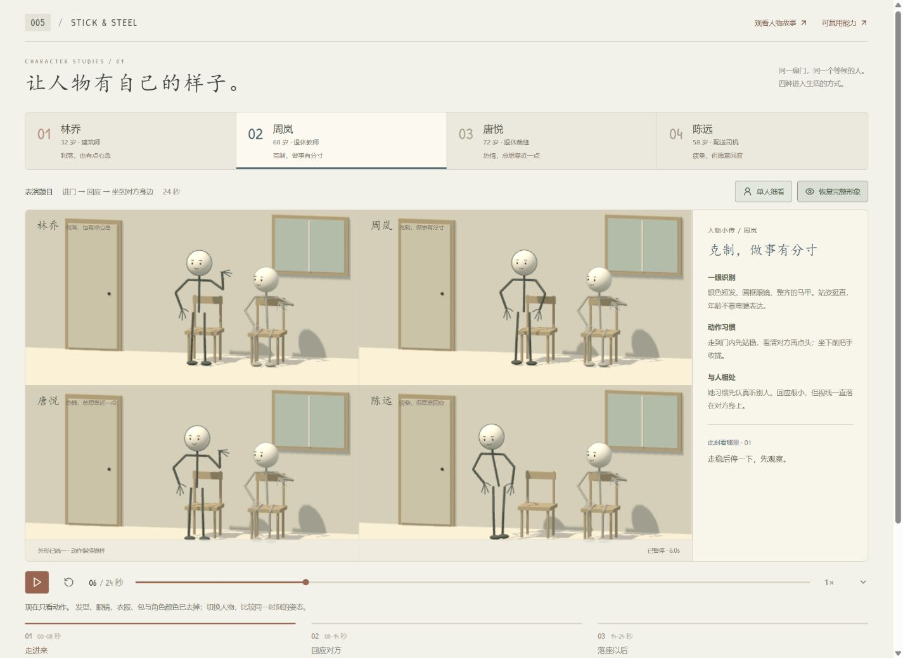
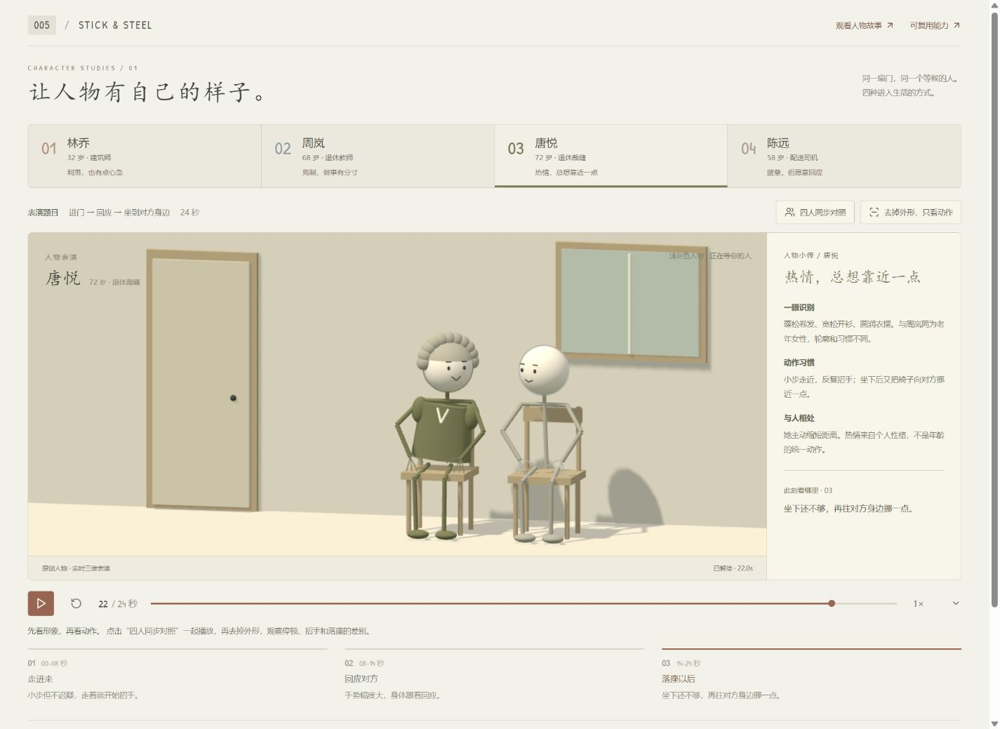

# 人物刻画：让人物有自己的样子

2026-09-14 新增实际演示。启动本项目服务后进入 `?view=characters#zhou`，也可从故事页右上角进入。尚未部署。

不是四张人物卡片，而是四位角色在同一间屋里表演同一件事：**进门 → 回应正在等候的人 → 坐到对方身边**。每轮 24 秒，动作按预设时间编排，可以暂停、慢放和任意跳转。

## 四个具体的人

| 角色 | 外形线索 | 动作习惯 | 可以延续的故事 |
| :--- | :--- | :--- | :--- |
| 林乔，32 岁建筑师 | 短发、短外套、斜挎包 | 快步进入，抬手早于转头，利落落座 | 忙碌后的重逢、伴侣节奏差异 |
| 周岚，68 岁退休教师 | 银色短发、圆框眼镜、马甲 | 端正站姿，先观察、小幅点头，双手收拢后平稳落座 | 退休后建立关系、学着对成年孩子放手 |
| 唐悦，72 岁退休裁缝 | 卷发、宽松开衫、较圆的衣摆 | 小步走近、反复招手，落座后连椅子一起挪近 | 邻里交往、热情与边界 |
| 陈远，58 岁配送司机 | 后移的发际线、夹克、略宽的肩 | 起步迟、垂头停顿，缓慢落座后抬头靠向对方 | 一天结束后的陪伴、不善言辞的关心 |

他们是虚构人物，性格不是对年龄、性别或职业的概括。周岚和唐悦同为老年女性，却有不同的轮廓、动作幅度和待人方式；避免把女性统一画成长发裙装，把老人统一画成驼背拄杖。

## 怎么看

1. 先选一个人物，播放完整表演；右侧/下方的“一眼识别、动作习惯、与人相处”说明造型和动作的用意。
2. 点击“四人同步对照”。四个画面共用同一时间轴，比较同一时刻的差别；手机窄屏纵向排列四个画面。
3. 点击“去掉外形，只看动作”。移除发型、眼镜、衣服、包，统一肩宽与角色颜色，保留原有动作。该操作不重置时间。
4. 点击三个观察段落，直接停在 3 / 10 / 21.5 秒。拖动时间轴或选择 0.5× / 1× / 1.5×。

## 可复用的能力

- **外形配置**：发型、头发与衣服配色、肩宽、衣摆、眼镜、包，组合成固定角色。
- **动作配置**：进入时间、步幅、摆臂节奏、回应先后、视线、点头、坐下过程和坐后距离。
- **确定性时间轴**：同一角色、同一秒得到同一姿态，支持对照、跳转与后续分镜编排。
- **表演与形象分离**：去掉外形仍可检查动作；后续可将同一个人物配置带入多个故事。

本页是无声人物表演实验，已有三个故事的 MiniMax 配音保持可用。没有为本页新增配音或冒用系统语音。角色尚未替换到已有三个故事中，也没有自动生成角色、自由服装编辑、服装物理或口型同步。

## 来源与验证

关节 IK 与手部几何来自既有研究固定版本的 MIT 模块：上游 [Rabneba/stick-steel](https://github.com/Rabneba/stick-steel)，提交 `4c8e1d05a1ec47db93b687a81a82878727308b20`。新增人物造型、屋内场景、四套动作、对照播放器与说明由本项目编写，并非上游现成功能。

44 项人物、故事与物理测试通过（本次新增 3 项人物测试），覆盖跳转可重复、动作连续、落座前到位、移动椅子时人物跟随、人物节奏差异。浏览器实际检查四人切换、同步对照、外形隐藏/恢复、播放暂停、时间轴、章节与自动结束；详情见 [验证记录](notes.md) 和 [视觉检查](design-qa.md)。

[返回项目](README.md) · [人物故事](stories.md) · [配音说明](minimax-audio.md)
