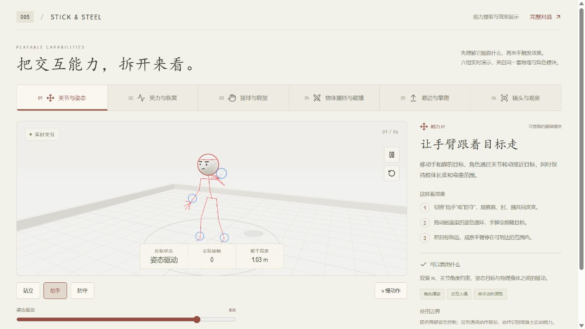
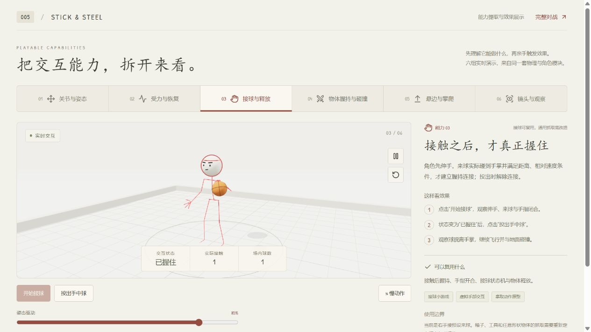
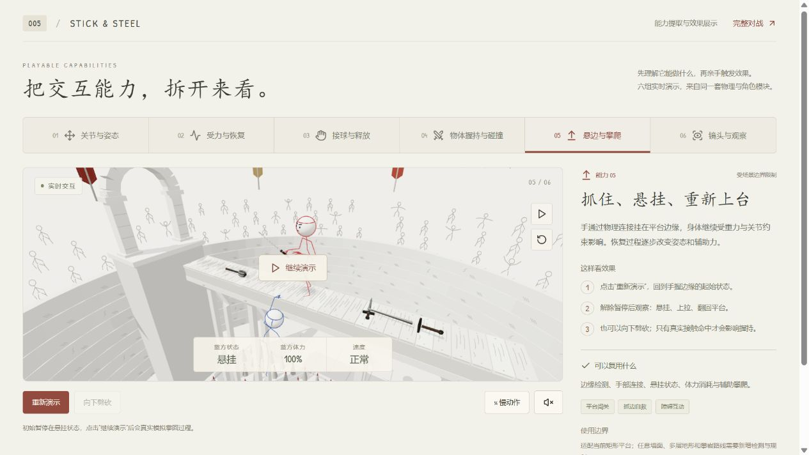

# 005 · 可复用能力与效果展示

这套项目最有价值的是“目标动作 → 物理关节 → 实际接触 → 状态变化”的交互链。可以复用底层关节、碰撞与握持机制；对战规则、血量与场景限制需要按用途拆分。

研究日期：2026-09-14。来源：[Rabneba/stick-steel](https://github.com/Rabneba/stick-steel)，固定提交 `4c8e1d05a1ec47db93b687a81a82878727308b20`，代码 MIT。详情见 [来源与改动](source-and-changes.md)。

## 亲手查看效果

按 [运行说明](app/README.md) 启动后打开 [本地能力展示](http://127.0.0.1:8055/)。默认显示六组独立演示，每组同时提供操作方法、实时状态、复用说明和边界。完整对战保留在页面右上角。

| 能力 | 可以复用什么 | 现场如何看效果 | 可扩展方向与边界 |
| :--- | :--- | :--- | :--- |
| [01 关节与姿态](http://127.0.0.1:8055/#pose) | 双骨 IK、关节角度限制、目标姿态驱动 | 切换抬手、防守；拖动蓝色圆环，让肩肘腕共同追随目标 | 交互人偶、角色摆姿、伸手动作；没有通用动作规划 |
| [02 受力与恢复](http://127.0.0.1:8055/#impact) | 刚体碰撞、关节传力、受限力矩、辅助平衡 | 投球撞击手臂或躯干；调整速度和控制强度；释放身体后恢复 | 互动展项、击倒玩法、受击反馈；属于游戏模型，不提供人体或工程计算 |
| [03 接球与释放](http://127.0.0.1:8055/#catch) | 接触条件判断、临时握持连接、手指开合、释放状态机 | 开始接球，等待“已握住”，再投出；观察球脱手后运动 | 接球小游戏、虚拟手部交互；任意工具与箱子还需定义握点和碰撞体 |
| [04 物体握持与碰撞](http://127.0.0.1:8055/#weapon) | 独立物体质量、握点连接、挥动碰撞、接触拾取 | 更换剑或锤；靠近、横斩、放下、按住拾取 | 道具和工具交互；需要拆除血量、伤害和对战依赖 |
| [05 悬边与攀爬](http://127.0.0.1:8055/#ledge) | 边缘检测、手部连接、悬挂体力与辅助恢复 | 初始暂停在抓边状态；继续演示，看身体攀回平台 | 平台闯关、抓边自救；目前适配矩形平台，复杂地形要扩展检测 |
| [06 镜头与观察](http://127.0.0.1:8055/#camera) | 环视、缩放、固定时间步、暂停、慢动作和碰撞标记 | 落球后减速、暂停，再拖动改变观察角度 | 互动说明与物理调试；无录像、倒放或时间回溯 |

这些是运行在浏览器中的真实模拟。统计取自当前物理状态，没有预设成功数字。接球、碰撞与攀爬结果受到状态和操作影响，均可重置再观察。

## 实际截图

| 姿态目标 | 接触后握住 | 悬挂在边缘 |
| :--- | :--- | :--- |
|  |  |  |

## 复用层次

- **基础模块**：`lib/rig/ik.ts`、`anatomy.ts`、`hand.ts` 与 `physics.ts` 组成可独立演示的关节人偶、姿态与接球系统，仍依赖 Three.js 和 Rapier。
- **场景能力**：`lib/duel/physics.ts` 中的武器、拾取、抓边与攀爬可提取，但需要解除格斗规则和场地坐标的耦合。
- **展示组合**：`lib/rig/scene.ts` 与 `src/Capabilities.jsx` 将模拟接到镜头、控件、状态和说明。OrbitControls 本身是 Three.js 通用组件，复用价值在项目的组合方式。

本轮完成能力说明与独立演示。上表扩展方向尚未实现为行业应用，也未接入真实设备或外部业务数据。

[研究主页](README.md) · [运行与操作](app/README.md) · [验证记录](notes.md)
