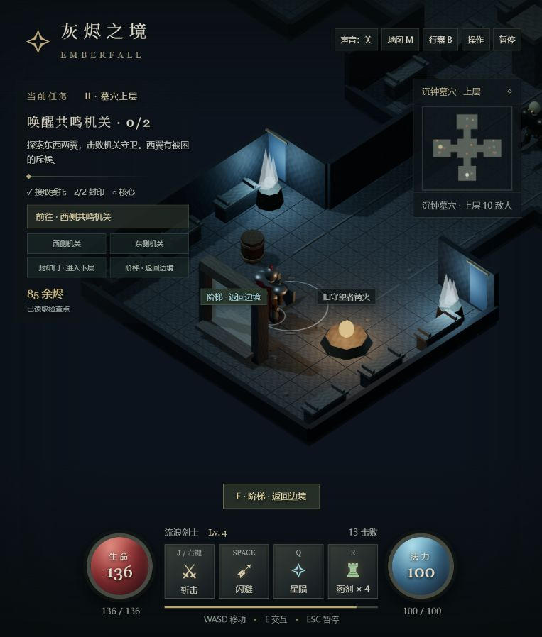
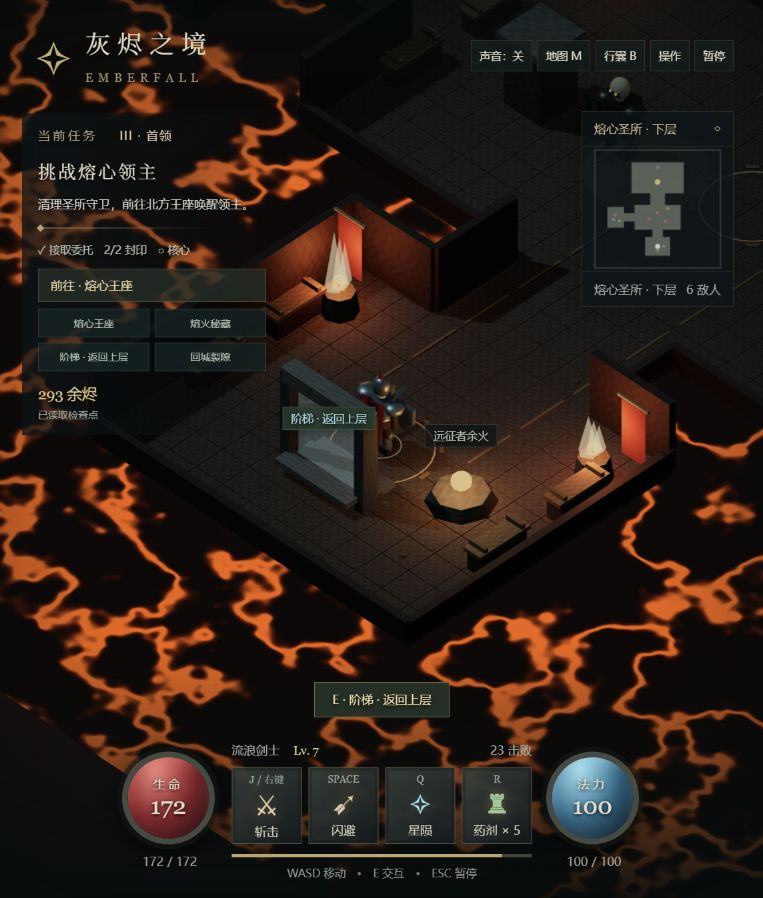
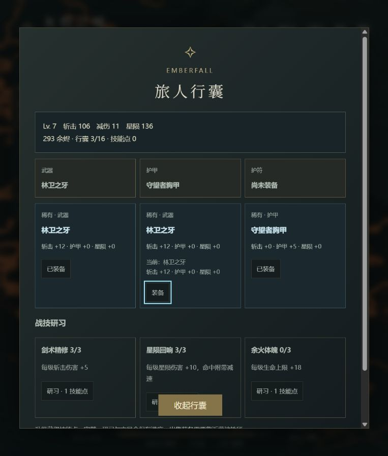

# 006 · 游戏效果、交互与教学体验 / Emberfall 研究

从用户提供的暗黑风格 ARPG 画面出发，我们制作了可玩的游戏场景，进而研究情绪价值、实时交互与物理教学体验。当前保留 ARPG 3.0.0、三维工坊与杠杆实验室 0.1 三种实践；后续以真实使用反馈决定扩展方向。研究更新于 2026-09-14。

[在线试玩 ARPG](https://yydshly.github.io/0913_codex_project/006-emberfall-arpg/) · [在线研究导览](https://yydshly.github.io/0913_codex_project/006-emberfall-arpg/research/) · [完整研究总览](research-summary.md) · [研究网页本地运行](app/README.md#研究汇总网页) · [参考网页清单](research-links.json) · [逐轮验证](notes.md)

## 三图引导：从效果参考到我们的理解

| ① 原来的效果 | ② 我们实现的效果 | ③ 物理驱动的体验 |
| :--- | :--- | :--- |
|  |  |  |
| 用户截图，提供审美方向；原作 URL、技术、版本及许可待核实。 | 本地实际游戏画面：场景接入移动、战斗、任务、成长与保存。 | Godot 实际渲染：直接改变条件，观察、慢放并比较结果。 |

我们的理解从“怎样做出游戏画面”推进到“怎样让场景值得探索、让操作产生感受与理解”。以情绪价值为主要驱动，交互价值作为参考；游戏、互动展示与物理教学均可继续应用这些认识。杠杆实验台是当前具体实践，教学效果和可复用范围仍待验证。三图展示不同研究阶段，不作同场景画质对比。

先读 [研究总览](research-summary.md) 了解取舍，再看 [旧游戏与实际规则](game-design.md) 或 [当前物理实验台](physics-lab.md)；需要操作时进入 [游戏指南](app/README.md) 或 [实验台指南](app/lever-lab/README.md)。

## 当前方向：看得见的物理 · 杠杆实验室

用户确认改为直接操作的二维实验台。已实现拖动质量与支点、受力与轨迹显示、暂停／单步／慢放、回放和 A/B 并排对比；Godot 原生 Windows 便携样件已生成。见 [当前产品与真实画面](physics-lab.md) 和 [启动与操作](app/lever-lab/README.md)。

此前制作过 Godot 三维工坊样件，其 38 项自动检查通过；用户仍希望摆脱任务型游戏组织，因此当前不继续扩展工坊。原 ARPG、教学冒险脚本及概念分镜保留为探索记录。下面 3.0 内容是旧原型，测试结果不自动适用于实验台。

## 旧 ARPG 可玩内容

- 余火边境：营地接任务、铁匠整备，自选顺序探索朽木林地与沉石采场。
- 沉钟墓穴上层：独立房间和走廊，东西翼机关、守卫、被困斥候、宝箱与可破坏木桶。
- 熔心圣所下层：另一套布局、熔火陷阱、秘藏支路、两阶段领主战和回城裂隙。
- 16 格行囊，武器／护甲／护符三槽，8 种装备模板、稀有度、属性比较、穿戴和铁匠出售。
- 升级技能点与三条战技研习；原有斩击、闪避、星陨、药剂、金币强化继续有效。
- 区域切换保留清理和掉落进度。回城交付核心后可继续整备，保留等级装备开启更高难度远征。
- 本地检查点、死亡重试、旧版存档迁移、复制文字备份与导入恢复。

## 从原型到完整游戏

当前已打通任务、战斗、成长与保存流程，仍缺少完整游戏需要的空间层次、探索取舍、世界反馈和美术完成度。四款产品的官方资料对标与探索脉络已归入 [研究记录](exploration-and-benchmarks.md)。

此前提出 5–8 分钟的营地—商道—哨站样段及 30–45 分钟首章，作为 [原路线记录](roadmap.md) 保留。当前执行顺序以 [研究总览的下一步](research-summary.md#8-下一步如何驱动) 和 [物理实验台](physics-lab.md) 为准。

## 定制设计包 · 0.1

本轮形成“余火商道”样段的具体设计，尚未接入游戏：

- [产品任务书](product-brief.md)：定位、首份交付、范围和待定条件。
- [样段布局图与说明](sample-layout.md)：双路线、建筑内部、连续高差、隐藏补给与解锁回营路线。
- [验收清单](acceptance.md)：25 项基线、通路、战斗、世界状态、表现与成长检查，均未冒记为通过。

上述为原路线，后续已转向 Godot 物理实验台；不启动旧 S0/S1 开发。旧 ARPG 保持 3.0.0。

## 实际画面

2026-09-14 内置浏览器实际截图。地下城截图使用正常自动游玩产生的检查点，经游戏存档恢复入口载入，非真人从头通关的证据。

## 验证与边界

20 项规则测试、完整自动游玩模拟和静态构建通过。模拟使用正常移动、攻击、闪避和资源规则，完成 30 次击败、救援、首领与回城；约 107 秒为理想输入的模拟时间，不代表真人时长或难度已平衡。

浏览器实测包括区域画面、墓穴与边境往返、刷新读档、装备切换及存档校验。仍是单人可玩原型，未实现联机、随机地图、多职业、长篇剧情或云存档；真人完整通关、真实触控设备和持续帧率待验证。浏览器 ARPG 与研究导览已通过 GitHub Pages 发布；Godot 物理实验台仍为本地 Windows 样件。

## 参考与来源

Three.js 上游：[mrdoob/three.js](https://github.com/mrdoob/three.js)，本地包版本 0.180.0，MIT 许可证见 [THREE-LICENSE.txt](app/vendor/THREE-LICENSE.txt)，上游完整 commit 待核实。仅保留必要模块，没有复制完整上游仓库或嵌套 Git。原创应用尚未指定独立开源许可证。

旧版营地与商店截图保留在 assets 中作为迭代记录。
