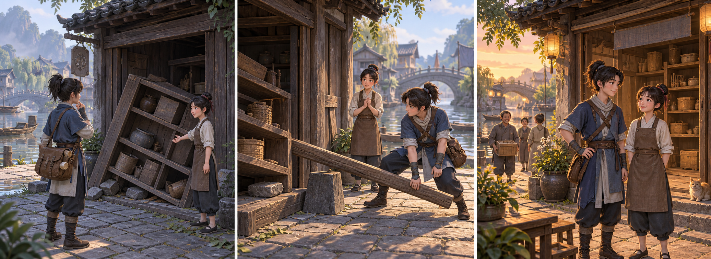

# 时空修复师 · 教学冒险方向 0.1

> 当前状态（2026-09-14）：用户已确认改为二维物理可视化实验台，样件已实现。当前交付与验证见 [杠杆实验室](physics-lab.md)；本文的旧方向保留为探索记录。

2026-09-14 · 用户已同意尝试产品方向；本文件为设计交付，不是已实现游戏或教学效果报告。

[项目首页](README.md) · [首关脚本](first-lesson.md) · [情绪设计原则](emotional-design.md) · [原技术候选](technical-directions.md)

## 产品承诺

玩家进入一个需要帮助的地方，通过观察、实验和修复，理解一条规律，让人物的生活发生可见变化。希望玩家结束时感到：“我想明白了，也帮上忙了。”

情绪价值优先，交互帮助表达，教学内容保证正确并有独立验证。首轮主体验为好奇、胜任和归属；场景与人物提供学习动机。

## 已确认与工作假设

| 项目 | 状态 |
| :--- | :--- |
| 情绪价值为主要驱动，交互价值为参考 | 用户明确要求 |
| 教学相关方向，历史、物理为举例 | 用户明确提出 |
| 尝试“时空修复师”教学冒险方向 | 用户回复“确定尝试”；不是对所有细节逐项确认 |
| 受众 | 暂按 10–14 岁、可独立阅读短句的学习者设计；待校准，未宣称匹配具体年级课程 |
| 第一关教学主线 | 物理中的杠杆；历史先提供生活情境，不并行教授多个学科 |
| 背景 | 架空的前工业手工艺小镇；人物、事件、建筑组合均属原创虚构，尚未选定历史时期 |
| 美术 | 温暖、有细节和生活气息的风格化场景；概念图用于讨论，未证明目标设备能实现 |
| 形式 | 单人短篇冒险；最终引擎、平台、输入方式、预算与商业模式未定 |

## 首关：让工坊重新开门

学徒正在等待一批修复材料，却被倒下的储物架挡住了工坊入口。玩家检查木梁与支点，预测调整后的结果，在可恢复的虚拟实验中抬起障碍。工坊重新营业，学徒把两人共同完成的修复记在门边。

主线是“理解杠杆并帮助学徒”，不要求战斗、等级或背包管理。目标体验约 8–12 分钟，仅为设计预算；不得用强制等待凑时长。完整节点、分支与物理规则见 [首关脚本](first-lesson.md)。

## 概念分镜

内置 image_gen 生成并已目视检查，表现好奇、尝试和归属的情绪顺序。图为架空场景概念，杠杆与载荷接触细节不足以作教学示意，正式样件必须以首关物理规则校验。不是历史复原、游戏截图或现成三维模型。[完整生成提示词与记录](assets/09-learning-storyboard-prompt.md)。

## 三项要分别验证的价值

| 层面 | 希望发生什么 | 首轮证据 | 不能代替它的证据 |
| :--- | :--- | :--- | :--- |
| 情绪 | 玩家愿意尝试，成功后感到胜任，注意到人物与场景回应 | 具体时刻的行为观察与玩家原话互相印证 | 点击多、通关快或观看概念图 |
| 交互 | 玩家知道能动什么、如何观察和重试 | 不依赖主持人代操作完成一次预测—实验—调整 | 按钮存在或程序无报错 |
| 学习 | 能解释支点与两侧距离的作用，在改变布局后应用 | 首次预测、变式操作、原因说明和提示使用记录 | 猜中、照提示摆放或反复试出正确格子 |

## 内容边界与扩展逻辑

第一关只验证一个核心概念。历史情境只用明确标注的虚构内容；后续若采用真实时期，应选一个具体地点与时期，为器物、生产方式、事件分别记录可靠来源、争议和改编。架空故事不能算历史学习成果。

首关验证后，可沿“帮助一个人 → 恢复一个公共空间 → 发现下一处问题”的结构扩展。每章另选一个知识点，保留因果、解释和迁移验证；不能通过重复同一摆放题假装进阶。电学、水利或真实历史章节均尚未设计、核实或承诺实现。

## 下一次制作的明确范围

先做可验证的杠杆交互样件，再接上出发与返回的场景反馈。候选制作体系须能表现位置变化、受力方向、载荷抬升、重试与持久的世界变化；新路线尚未选择，不恢复原 Three.js ARPG 扩建。

所需资产最小清单：一个可开合的工坊立面与小院、两个角色、木梁、支点、储物架、限位与支撑部件；观察、施力和庆祝关键动作；环境音、装置反馈与开门声音。需另核实授权和兼容性；不把生成的概念图当作可直接导入的 3D 资产。

首轮试验完成后再决定是否采购更大场景包、增加自由漫游和正式历史内容。

## 交付状态

- 已完成：产品方向、首关脚本、可手动推演的分支、物理判定样例、学习与情绪观察计划。
- 未完成：新游戏实现、引擎实测、资产采购、真人试玩、教师评审、课程对齐和发布。
- 旧 3.0.0 ARPG 原型仅保留为探索记录，其测试结论不适用于新产品。
