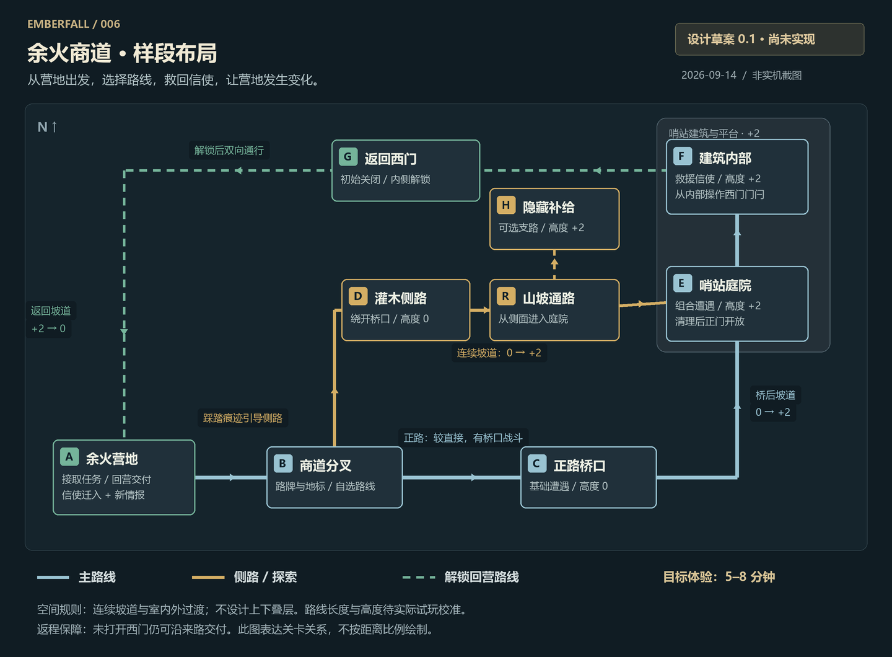

# 006 · 余火商道样段布局

> 当前产品原则（2026-09-14）：以情绪价值为主要驱动、交互价值为辅助参考。后续执行顺序见 [情绪价值驱动方案](emotional-design.md)；下文既有方案与技术候选保留作研究依据，未自动恢复开发。

> 路线状态更新（2026-09-14）：用户要求更换技术方向。本文保留为原方案记录，开发暂不按此自动推进；替代路线见 [技术方向比较](technical-directions.md)。

设计版本 0.1 · 2026-09-14 · 状态：待实现。图为原创关卡设计示意，不是游戏截图，线路不按距离比例绘制。

[产品任务书](product-brief.md) · [验收清单](acceptance.md) · [阶段路线](roadmap.md)

## 位置与用途

图上从下向上表示向北推进。高度为相对营地地面的设计值；建议上层为 +2 个世界单位，坡道连续过渡，无同一平面坐标叠两层的通路。宽度和距离必须经实际操作调整。

| ID | 地点与相对高度 | 玩家行为 | 设计约束 |
| :--- | :--- | :--- | :--- |
| A | 余火营地，0 | 与守夜人接取商道委托；完成后找到归来的信使 | 固定出发点、服务区、信使落点；任务前后可同机位对照 |
| B | 商道分叉，0 | 看见哨站地标，选择正路或侧路 | 用路牌、车辙和火光区分道路；两路均可折返 |
| C | 正路桥口，0 | 经过第一组基础遭遇，再沿坡道抵达庭院 | 正路较直接；两名近战守卫为初始候选，数量与强度待试玩调整 |
| D | 灌木侧路，0 | 绕过桥口，抵达山坡入口 | 路线较长，入口可由踩踏痕迹辨认；不要求跳跃或攀爬 |
| R | 山坡通路，0 → +2 | 从侧面进入庭院，途中可能发现藏匿补给的线索 | 角色、导航和相机同步地面高度；不能隔着落差交互或攻击 |
| H | 废弃补给点，+2 | 离开通路短距离搜索，取得一次性补给 | 非主线前置条件；满包时物品保留；未发现不阻止通关 |
| E | 哨站庭院，+2 | 清理组合遭遇，打开建筑正门 | 初始候选为一名耐打近战与两名弓手，双方均在可到达的平台；不能靠不可达点无风险攻击 |
| F | 哨站内部，+2 | 找到信使，完成救援；从内侧打开西门 | 同高度室内外过渡；屋顶按镜头遮挡处理；外侧不能提前打开捷径 |
| G | 返回西门与外侧山道，+2 → 0 | 解锁后沿山道回营 | 路线与主路形成回环；落差通过坡道过渡；解锁改变实体门、导航和地图 |

所有位置是布局关系。实现时新增独立样段定义，先验证通路和高度；不能把现有三地图的边界与存档直接解释为新布局。

## 两条进入路线与返回路线

- 正路：A → B → C → E。桥口战斗先介绍基础预警与闪避；桥后坡道把玩家带到哨站平台。
- 侧路：A → B → D → R → E。绕过桥口遭遇，走更长路线；H 是可选支路。侧路的风险先来自庭院侧入口可能暴露于弓手视线，不额外堆设第三场必打战斗。
- 建筑与救援：E 清理后开放 F 正门。F 内信使获救，玩家在内侧操作 G 门闩。
- 返回：F → G → A。G 解锁后双向可走；即使玩家没开 G，也能沿来路回营完成交付，避免将可选捷径变成通关死锁。

每次远征中的敌人、唯一补给和解锁状态在折返后保留。重开样段使用明确的新档入口；原 3.0 进度保持可恢复。最终独立存档或版本迁移方式在 S1 实现前落实。

## 场景怎样帮助玩家理解

| 位置 | 引导线索 | 不能依赖的唯一手段 |
| :--- | :--- | :--- |
| A 出口 | 哨站钟楼剪影、商道委托说明 | 屏幕上的自动寻路按钮 |
| B 分叉 | 正路车辙、断续路牌；侧路脚印与坡道轮廓 | 颜色差异或细小文字 |
| R → H | 残破布条、打开的运货箱等近距离线索 | 小地图直接标注全部秘密 |
| E → F | 建筑门、救援呼救声的候选提示、窗内灯光 | 一直悬浮的人物名称 |
| F → G | 门闩与通向营地的视线；首次解锁提示 | 只修改“捷径已解锁”文字 |

保留可选任务追踪与声音关闭后的可用性。声音是辅助，不设为唯一任务线索。

## 状态与保存设计

| 状态 | 触发条件 | 实际世界变化 | 唯一性与保存 |
| :--- | :--- | :--- | :--- |
| 委托已接 | A 的任务对话 | B 路牌与目标指向哨站 | 只接受一次；记检查点 |
| 庭院已清理 | E 的本组敌人全部击败 | F 正门可进入，庭院恢复平静 | 折返不重生本组敌人 |
| 信使已救援 | F 内交互且满足庭院前置 | F 信使消失；A 信使出现；目标改为回营交付 | 迁移视为即时状态变化，本阶段不做护送 AI；保存后一致恢复 |
| 捷径已开放 | 从 F 内侧操作门闩 | G 门打开，碰撞与导航更新，地图显示返回连接 | 再次操作不重复发奖励；开放状态持久保存 |
| 补给已领取 | H 的一次性箱子 | 箱体与剩余地面掉落正确显示 | 领取和拾取分开处理，满包不吞奖励 |
| 委托已交付 | A 与信使交互，且已救援 | 新情报条目可查看，奖励到账，进入整备状态 | 情报、奖励与结算状态一起保存，重复交互不重复给付 |

本阶段新情报只需可查看，并说明下一次远征方向；不增加新商店系统。回城后的 NPC 变化必须在外观和交互上体现。

## 技术与开发交接

优先建立同一份区域数据：地面及高度、可走区域、坡道连接、实体障碍、门状态、交互点、敌人组和相机遮挡对象。高度参与角色贴地、敌人移动、攻击判定与交互距离。每个主要节点固定一个复测机位。

开发顺序：先完成 S0 基线记录 → 用简化几何实现 A/B/C/D/R/E/F/G 的连通性 → 接入高度和遮挡 → 测两条去路与回路 → 再接 S2 遭遇和 S3 状态。H 的奖励与 S4 美术精修随后接入。

此设计优先验证空间选择。若试玩证明两条路线没有可解释的区别，先调整道路、视线与遭遇，而不是增加地图面积。
