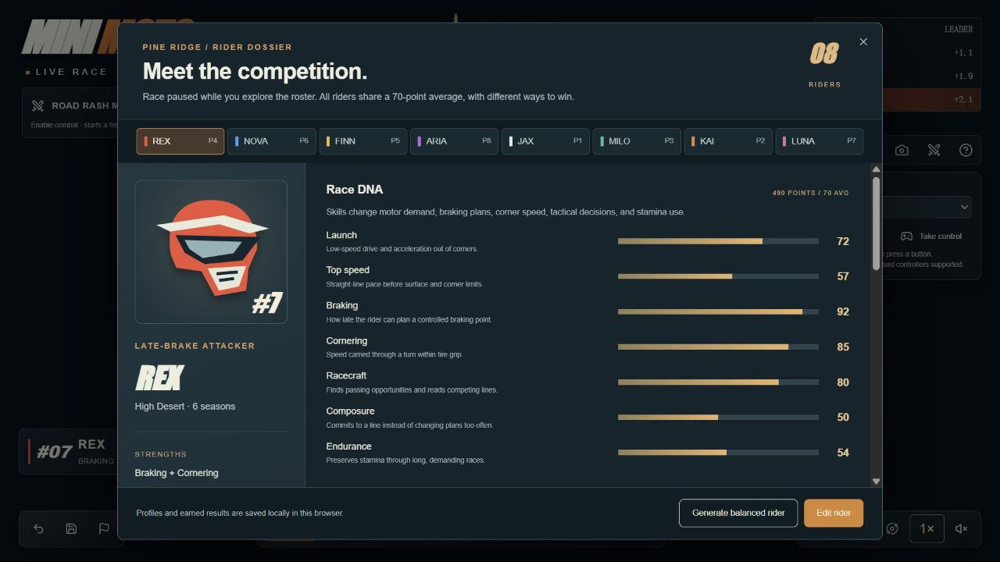

# 007 · Mini Moto — Pine Ridge Park

已找到用户截图对应的原作：Christopher J. DiMarco 发布的浏览器 3D 迷你越野摩托公园。可以观看自主比赛、切换头盔镜头、接管驾驶，并管理车手和编辑赛道。**这是赛车类游戏的参考，核心是场景构建和赛车手能力构建；公开源码及许可证待核实。** 研究已总结，独立实践与最终结论见 [010](../010-mini-moto-comparison/README.md)，后续按项目需求开发。

| 项目 | 内容 |
| :--- | :--- |
| 固定编号 | 007 |
| 原始网页 | [Mini Moto — Pine Ridge Park](https://mini-moto-park.chipchaunceytheonlyone.chatgpt.site/) |
| 作者 | Christopher J. DiMarco / [@chrisjdimarco](https://x.com/chrisjdimarco) |
| 原始发布 | [作者 X 原帖](https://x.com/chrisjdimarco/status/2098919328368197682) |
| 原始仓库 | 待核实；本次未定位到公开源码仓库 |
| 上游许可证 | 待核实；可访问网页不等于开源授权 |
| 研究日期 | 2026-09-14 |
| 研究版本 | commit/tag 待核实；线上构建指纹见笔记 |
| 技术栈 | 发布脚本确认 React、Three.js、Rapier/WASM、Web Audio；具体版本待核实 |
| 进度 | 已总结（来源追踪、网页体验与发布脚本研究；未本地复现） |
| 本仓库演示 | 尚未部署；上方链接为作者原版 |

[返回总索引](../../README.md#项目索引) · [技术与验证记录](notes.md) · [图片来源](assets/README.md) · [实践状态](app/README.md)

## 与截图的对应关系

作者原帖直接链接到该游戏，MINIMOTO 标识、蓝灰天空、土路、轮胎护栏、排名和头盔镜头均与用户截图对应。当前线上版本还有炮塔、UFO 等内容，不能把现在的所有功能归为截图发布时已经存在。

*2026-09-14 作者线上演示的实测截图，非独立重建。用户原始图片见 [01-user-reference.png](assets/01-user-reference.png)。*

## 功能核对

| 能力 | 本次证据 | 验证范围 |
| :--- | :--- | :--- |
| 自主比赛 | 计时、圈数、排名和车手状态持续变化 | 已观察，未跑完整场结算 |
| 头盔镜头与全景 | 点击后画面和视角名称改变 | 已验证 |
| 手动驾驶 | 接管后显示 YOU ARE RIDING，Escape 交回 AI | 仅验证接管/交回，未评价完整手感 |
| 车手管理 | 八名车手、七项能力、490 总点数/70 平均值、车辆方案 | 面板已查看，未做能力效果对照 |
| 赛道编辑 | Sculpt、Dirt、Mud、Gravel、Jump、Loop 入口；脚本存在编辑记录和重建逻辑 | 未实际改造赛道 |
| 本地保存 | 脚本将公园编辑和车手档案写入 localStorage | 未验证刷新恢复 |
| 战斗、手柄、声音 | 页面说明与作者技术串，部分发布脚本 | 未完整验证 |

## 值得参考什么

1. **地形变化影响行为。** 脚本把路面抓地力纳入驾驶计算。对“白鹭河谷”的启发是让道路坡度、路面和路线变化影响车辆速度与姿态。独立实现时，首先检查碰撞地面与可见地面一致。
2. **同一场景提供不同观看方式。** 全景适合观察布局，头盔/跟随镜头用于体验速度和坡度。可以借鉴到景观巡游；自动精彩镜头的选镜质量本次未验证。
3. **用固定总点数形成个体差异。** 七项能力互有取舍，适合参考为 NPC 行为参数设计。是否改善比赛多样性仍需对照测试。
4. **界面与模拟分开。** 页面动态加载 MotoEngine，引擎负责世界、输入、保存与状态发布。后续原型可分开维护界面、固定步长模拟及渲染。
5. **把运动状态转为视觉反馈。** 作者说明用轮胎接触、悬挂和重力跳跃，辅以姿态、尘土与轮迹。可参考这种表现方法，但不据此宣称物理精度已经验证。

## 后续实践建议

基础实践已在 010 完成，保留本项目作来源与原作体验档案。后续按实际项目选择场景、驾驶和比赛能力，不继续为扩展演示而深入。

本次完成查找与参考整理，未创建游戏应用。上游许可未确认，不将其发布包、模型和贴图直接作为本仓库可复用素材。

## 来源与归因

- [作者发布原帖](https://x.com/chrisjdimarco/status/2098919328368197682)：原版入口与开发自述。
- [作者物理说明](https://x.com/chrisjdimarco/status/2098921501311271117)：固定步长、轮胎接触、悬挂与辅助驾驶。
- [作者 AI 与视觉反馈说明](https://x.com/chrisjdimarco/status/2098921510937202862)：行驶决策与姿态反馈。
- [原版游戏](https://mini-moto-park.chipchaunceytheonlyone.chatgpt.site/)：实际画面、操作说明及公开发布脚本。

作者自述使用 Astra Medium/High，已耗用周限额的 70%；这不能等同于该游戏的独立成本，也不能证明单次提示完成。没有证据证明本摩托项目使用 Dream Loop，不作此归因。图片权利归原作者/相关权利人，具体许可待核实。
