# 008 · 山地巡游实验室

以“山地公园观光车试行”为使用情境，独立构建松岚湖 3D 场景，分五层解释道路、车辆、天气、镜头和素材如何协作。场景为虚构，交互由真实几何和持续运动计算驱动，不是嵌入视频。

| 项目 | 内容 |
| :--- | :--- |
| 固定编号 | 008 |
| 研究日期 | 2026-09-14 |
| 参考原作 | [Mini Moto — Pine Ridge Park](https://mini-moto-park.chipchaunceytheonlyone.chatgpt.site/) / Christopher J. DiMarco |
| 来源原帖 | [作者发布](https://x.com/chrisjdimarco/status/2098919328368197682) |
| 上游源码、许可、commit/tag | 待核实；原作核对见 [007](../007-mini-moto-park/README.md) |
| 本地实现 | 独立编写，无原作源码或模型移植；本研究第三版：逐层搭建与车辆通行保护 |
| 技术栈 | Three.js r185、原生 ES Modules、Canvas 图表与简化运动模型 |
| 第三方许可 | Three.js / OrbitControls：MIT；两组 Poly Haven 纹理：CC0 |
| 进度 | 已实现；模型、构建与页面状态接口验证通过，未做全面视觉/交互验收 |
| 在线演示 | 尚未部署 |

[返回总索引](../../README.md#项目索引) · [运行与操作](app/README.md) · [验证记录](notes.md) · [素材来源](assets/README.md)

## 一次构建，两处复用

[打开复用演示](app/reuse-lab.html)：同一个 `reuse-core.mjs` 生成组件接收两种场景输入，输出环湖闭合道路与山地开放道路。两边共享材质配方定义，并按道路实际尺度铺图；宽度改变后重新生成道路与植物避让，右侧路线可以替换，移动标记使用更新后的道路采样。

当前已把树木与山地开放为直接操作：树木大小 0.5～2 倍、植树候选点 0～600、分散/成片分布；山丘高度系数 0～3、主山丘横向位置 -8～8 m。实际树木数量经过道路与湖区排除后确定，避让计入树冠大小。

新增 `generateTerrain` 与 `scatterTrees`，同样由两个场景共用。改变地形会更新道路高程、树根高度与移动标记；改变树林参数会复用简化树形和布置规则。自然细节开启时，树木使用分枝结构与松枝图集；关闭时才显示圆柱/锥形示意。山地仍为程序高度场，没有树种生长、侵蚀或测绘数据。保存格式升级到版本 2，自动为版本 1 存档补上新增参数。


早期简化示意留档：[树木山地调整前](assets/nature-before.png) · [树木山地调整后](assets/nature-after.png)

原有换配方、加宽道路和替换路线收纳在“道路与材质的已有演示”中。当前方案可保存到浏览器、恢复及导出配置。配方包括现成贴图标识、颜色、粗糙度、法线强度和纹理尺度；没有新增贴图生成算法。本模块雨后只改变外观，不包含抓地与车辆物理。

这次沉淀的是可独立使用的纯计算生成器、配方定义和参数验证/存档格式，并在两个限定场景中实际调用。原山地巡游主场景仍使用原运动模型，尚未迁移到此组件；不宣称支持任意道路、交叉口或桥隧。

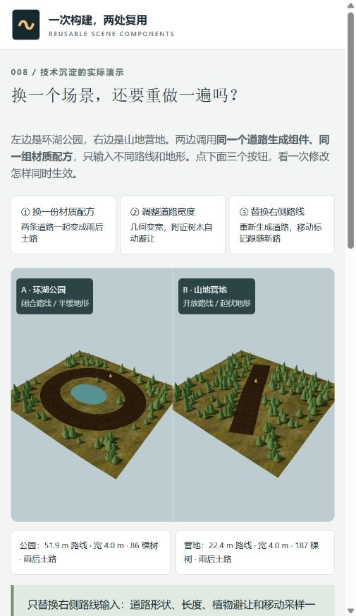

[修改前截图](assets/reuse-before.png) · [修改后截图](assets/reuse-after.png)

## 地表材质拆解模块

新增 [地表材质拆解](app/surface-lab.html)，入口同时位于主场景顶部与素材档案。独立小块地面以同步双视图展示：几何底板、无光照颜色、光照、法线、粗糙度、真实草叶六步。左侧默认前一步，可锁定为当前配置；之后右侧的素材与参数修改不影响锁定参考。

可切换泥土/草岩，独立开关颜色、光照、法线、粗糙度和草叶，并调节重复次数、法线强度、粗糙度、太阳方向、真实几何起伏与草叶数量。支持低视角看轮廓、俯看、线框、阴影和草叶摆动。指标同时显示底板顶点数、额外草叶三角形与实际参与的贴图。

本页能操作的方案：现成贴图的材质组合，以及公式改变几何顶点/实例化草叶。后续方案单独说明程序纹理、道路与草地混合、从照片制作配套素材、按远近调整细节。未把这些后续方案标为已实现；没有导入位移图或新增车辆物理。本模块不修改主场景驾驶状态。

## 直接看场景怎样搭建

点击页面顶部“看场景如何一步步搭建”，进入六个累计步骤：山地网格 → 道路 → 建筑 → 植物与岩石 → 车辆 → 表面与运行。前五步暂停，最后一步开启巡游。各步说明具体几何构成和数据来源，并提供地形、道路、建筑、自然物、车辆、表面贴图和光照的独立显示开关。

地形与场景模型由代码构建；下载的素材是两组地表各三张贴图。显示开关用于观察构成，不删除道路和通行规则。第五层下半部仍可调法线、粗糙度、阴影、线框并拆开车辆。

场景下方新增“到建筑旁检查”“演示前车急停”“让前车继续行驶”和保护范围显示。金框表示建筑占地，青圈表示车辆的保守平面包围范围；范围用于解释约束，不代表真实车辆外壳。前车急停后，后车会停住；人工接管持续加速也不能越过前车。当前沿单车道路辅助，保留 9 m 路程间隔，完整超车/撞击响应未实现。

建筑生成后还检查实际网格顶点是否超出占地。跟随镜头靠近建筑时会抬高，避免镜头进入建筑内部造成穿模观感。

## 五层操作

| 层次 | 真实使用情境 | 操作 | 可观察结果 |
| :--- | :--- | :--- | :--- |
| 01 场景与巡游 | 规划环湖观光线路 | 巡游上限、均衡/爬坡/舒适策略、镜头 | 速度随前方弯道与当前坡度改变，两辆车沿路线行驶 |
| 02 道路与运动 | 为观景台增加坡道 | 试验段 -2～4 米高程、定位、撤销、保存/恢复 | 地表与车辆使用同一高程；上坡影响速度和姿态 |
| 03 雨天与抓地 | 判断雨后运行方式 | 湿润程度、干燥/雨后/持续降雨、双车制动 | 颜色与高光变化、雨丝与粒子反馈；同初速两辆车停在不同位置 |
| 04 镜头与接管 | 自动讲解与自主体验之间切换 | 全景、跟随、乘客、接管/交回，键盘和按住按钮 | 输入源改变，保留道路辅助与姿态平衡 |
| 05 素材与表现 | 理解画面是怎样做出来的 | 完整、白模、线框、只有颜色、表面方向；法线/粗糙度/重复/阴影/动态；拆车 | 分别观察几何、表面、受光、部件与动态贡献 |

每层同时提供任务提示、操作、实时变化解释、因果链和实现原理。页面下方显示道路剖面、当前坡度、抓地系数及示例制动距离。素材档案单独解释模型文件与贴图、原作与独立素材的边界。

## 实际价值与扩展场景

当前价值是把“改参数 → 场景变化 → 对照记录”连起来，用于方案沟通、交互教学与原型验证。并非只参考画面角度，也不是已经接入真实景区的运营系统。

页面新增三个可操作任务入口，自动设置场景参数、定位观察，并计算当前方案相对默认方案的最大上坡、最低目标车速、同初速制动和各自巡游上限制动。对照可导出 JSON，包含参数、结果、计算时间和模型假设；参数变化后旧结果失效，需要重新计算。

| 任务入口 | 当前能做 | 继续扩展所需 |
| :--- | :--- | :--- |
| 景区线路讲解 | 舒适策略、路线巡游、全景与乘客视角 | 真实地形、站点、讲解、路线选择与无障碍交互 |
| 雨后运行演示 | 雨后 + 18 km/h、抓地与外观联动、同速制动对照 | 实测抓地、载荷、反应时间、车辆标定、评分回放 |
| 坡道改造讨论 | 局部抬高 3 m、爬坡策略、前后指标对照 | 测绘数据、道路/排水工程约束、多方案与批注 |
| 实时园区运营（尚未实现） | 可以复用三维显示与状态联动 | 实时定位、传感器、时间同步、告警、权限、数据后台 |

例如本页抬高 3 m 后，路线最大上坡由约 9.55% 变成 19.01%。这说明模型对道路编辑有响应，不表示现实中这条坡道合规或可通行。

## 通行范围修复

原巡游站与观景台占地和道路重叠，导致穿模，属于第一版实现缺陷。第二版将两者移到路外；建筑位置和包含台阶/屋檐的保守占地由同一份数据提供。构建场景前检查整圈通行范围，涵盖 ±1.7 m 横向输入与车辆俯仰/侧倾的保守包围范围。

运行时检查前后位置之间的移动路径，自动与手动输入共用遇建筑停车保护；不模拟撞击、反弹或变形。随机岩石也按自身尺寸避开道路。第三版增加手动/自动共用的前车通行保护；完整刚体撞击响应、自由超车与行人碰撞仍未实现。

## 素材与效果

- 道路：Poly Haven **Brown Mud Dry** 的颜色、OpenGL 法线、粗糙度贴图，作者 Rob Tuytel。
- 山地：Poly Haven **Aerial Grass Rock** 的同三类贴图。
- 车辆、松树、岩石、巡游站、观景台、风车：本项目独立构建几何；树与草、岩石使用实例化。
- 动态：轮转、姿态阻尼、风车、雨丝、扬尘/水花提示；没有完整流体模拟。
- 湖面：半透明材质和动态亮点；未实现平面反射或水流求解。

六张 1K JPEG 合计 4,783,758 字节，约 4.56 MiB。图片不等于显存，素材档案解释了纹理存储的粗估方式。全部文件已保存于本项目，运行时无 CDN 依赖。

原山地巡游主场景截图待补充；本轮复用演示截图见上方。`reference-mini-moto.png` 是 007 保留的原作研究截图，页面明确注明其来源，不能当成本实现画面。

## 运行与验证

```powershell
cd projects/008-terrain-motion-lab/app
node serve.mjs
```

打开终端输出的本地地址，默认 `http://127.0.0.1:4318/app/`。本次已启动并验证 HTTP 200，该地址是本地预览，不是已部署的网站。

```powershell
node --test model.test.mjs
node build.mjs
node check.mjs
```

详细结果和发现的问题见 [notes.md](notes.md)。当前会话没有可调用的 Sites 发布接口，保留本地预览和静态构建；没有提交、推送或部署。

## 适用范围

适用于路线巡游、交互教学、场景展示与玩法原型。车辆沿道路受辅助约束，不具备自由离路驾驶、完整刚体碰撞、实车悬挂、跳跃或实车标定。制动对照使用水平路面模型，不含反应时间；不作为交通安全或工程预测依据。

这是对技术场景的独立实践，不是对 Mini Moto 画面或玩法的完整复刻，也未向 003/004 项目移植代码。


## 2026-09-14：自然环境的可信表现

用户目标已从组件联动的教学示意，调整为土地、道路和树木在形态、尺度与观感上接近自然环境。`app/reuse-lab.html` 保留原参数，默认显示单个大场景，并加入道路近景、双场景对照及自然细节开关。

- 植被：独立生成三种松树分枝几何，使用 Poly Haven Pine Tree 01 的树皮、松枝与透明遮罩贴图，默认约 4～7 米树高；按树冠范围避开道路，按树干间距筛选候选点。没有导入上游完整松树模型。
- 地表：多尺度小起伏；按道路距离混合泥土与草地贴图和法线，边界加入不规则扰动；加入细草、石块、轮迹色差、远山与雾。道路轮迹只影响外观。
- 观察：点击“走到路上”，视点距路径采样面 1.7 米；拖动和缩放检查细节，关闭“自然细节”对照简化树形、硬边道路。视角和细节开关属于查看方式，不写入导出的场景参数。
- 产品用途：用于园区、营地、户外路线的可调整预览，复用素材尺度、分布、路肩混合、接地和光照方法。当前没有统计制作工时，也不能据此作工程验收。
- 进一步方案：具体地点高程和路线测量、同机位参考照片、扫描树木/岩石、按距离分配模型细节。当前仍无真实地点数据、生态生长、侵蚀、水流、完整车辆物理或照片级效果。

素材来源：[Pine Tree 01](https://polyhaven.com/a/pine_tree_01)，[CC0 许可](https://polyhaven.com/license)，核实日期 2026-09-14；资产 commit/tag 未提供，记为待核实。4 张纹理保留原文件并验证 MD5，详见 `assets/vegetation-manifest.json`。完整 glTF 的 binary 在查询时为 948,849,556 字节，本实现没有下载该模型。


## 2026-09-14：自驾、露营与日出的实际场景

[场景页面](app/outdoor.html) 将同一环境组织成四个章节：自驾进山、松林露营、清晨登山、山顶看日出。车辆到营地入口停止，人物沿独立步道登顶，太阳、天空、雾与营灯随章节变化。可选章节、播放/暂停、拖动进度、自由观察、查看全景和切换光照。

沿用 `reuse-core.mjs` 的地形/道路/树林布置，以及 `nature-render.mjs` 的松枝图集、实例化树木、土草混合、草石和远山。新增 `outdoor-core.mjs` 定义营位整平、步道与行程；`outdoor.mjs` 增加简化帐篷、桌椅、营灯、车辆、步行人物和动态天空，没有新增图片或外部模型依赖。

这是 28 米车道、22 米步道的紧凑体验模型，压缩了空间与昼夜；不能当作真实营地、道路设计或日出时间预测。实际用途是展示环境能力怎样组成营地介绍和户外活动预览。车辆是路径播放，不支持自由驾驶，人物没有完整物理或导航系统。

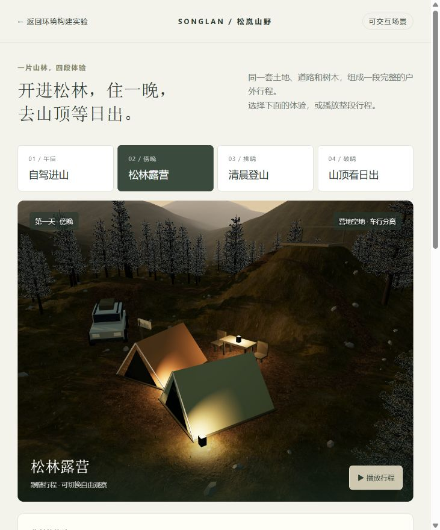


### 连续体验优化（2026-09-14）

人物现在从停车处进入营地，休息后走向步道，再连续登顶；车辆在路线末端减速，停车后轮胎停止转动，短暂开门后关闭。行程末段镜头从人物缓缓转向远山；步道拐角作圆滑处理，光照在章节边界连续变化，夜间以明确的“一夜山野”过场表示时间压缩。

画面内新增行程拖动条、当前动作提示及路线小地图。营地细节包括有弧度的帐篷布面、缝边、拉绳、地钉、门垫、靴子、背包、茶具与步道标记；车辆增加倒角。`outdoor-details.mjs` 单独管理这些道具，未增加下载素材或外部依赖。

当前仍为程序模型：没有完整人体骨骼、精细车辆内饰、帐篷布料模拟或自由行走碰撞。夜间是时间过场，不是连续模拟真实一夜。

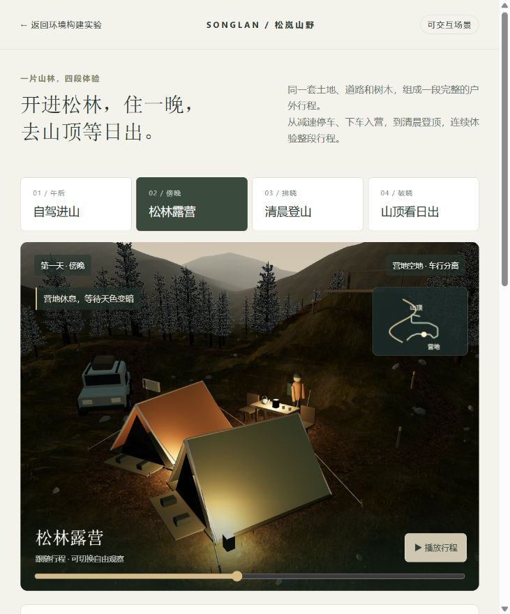


### 整个山谷的植被扩展（2026-09-14）

植被扩展至 224 × 224 米，覆盖营地之外的四周山坡；当前默认布局共 1,915 棵松树，数量随布局与取景净空变化。场地地形为 240 × 240 米。入口下方提供“拉远查看整个山谷”，观察完整环境。

- `forest-core.mjs` 共用远山高度函数，按实际地面三角形插值定位树根。按疏密斑块和坡度筛选，保留营地、道路、步道空地；重复生成结果一致。
- `forest-render.mjs` 把三种既有详细松树在启动时渲染为透明外观纹理，远处使用这些轻量外观，近处切换为原来的真实分枝几何。没有下载新的树图或生成静态背景。
- 树林分成 196 个区块；38/44 米阈值避免在同一距离反复切换。实例化、视锥剔除与距离分级降低绘制开销。远景不绘制逐针叶阴影；分级切换可能仍有可见变化。
- 新增植被在观景台前留出狭窄视线空隙，让扩林后的日出仍可从山脊与树冠之间看到。
- 本次是本地场景范围扩展，尚未发布到公网，不代表地形来自实测或植被生态已校准。

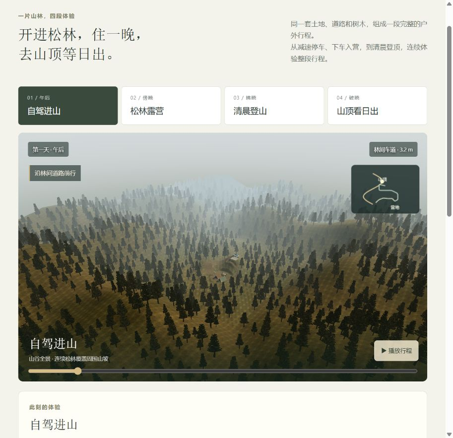

### 树形与地表细节优化（2026-09-14）

松树增加可重复生成的宽窄、高矮与四种针叶色调，近远景共用同一份树木参数。营地树冠宽度不超过原有避让范围。远景纹理由详细模型生成；本轮已改为保存原色，由当前场景光照提供明暗，避免重复叠加固定受光。

`landscape-surface.mjs` 为近地与远山统一加入大尺度草土色斑、坡面色调和树冠下的近似遮蔽。微观细节继续来自原有素材，不增加下载。白天远景调整为偏冷的空气色，黄昏与日出保留暖色。树下遮蔽为静态近似，远景仍为平面树形，不等同完整光照或实景重建。

### 动线、角色与照明对应（2026-09-14）

旧版车道经过观景台附近，形成开车先到山顶、再步行返回山顶的错误空间关系。新版车道约 36.3 米，沿西侧谷底进入山脚停车处；营地保持低处，独立折返步道约 46.4 米，爬升 11 米到东北侧山脊。车道距离观景台至少约 29.1 米，车道与登山步道中心线至少相隔约 10.6 米。

点击“动线总览”，可查看停车、营地、山脊标签及金色车道、青色步道。总览标线是说明用的覆盖层。切换章节恢复对应时段光照。

- 天空太阳与定向光共用 `solarDirection`，避免看见的太阳与地面投影方向不一致；太阳沉入地平线后停止直射光。营灯逐渐点亮，清晨行走开启头灯。
- `outdoor-actors.mjs` 根据四轮位置的地面高度控制车身俯仰和侧倾，前轮随弯道转向，车轮按行驶距离转动，减速阶段亮刹车灯。
- 人物改为大腿、小腿、鞋与手臂分段运动，脚部依据局部地面高度落点，登山杖随步态变化。仍为程序化角色；不是完整人体动作捕捉或车辆动力学模拟。

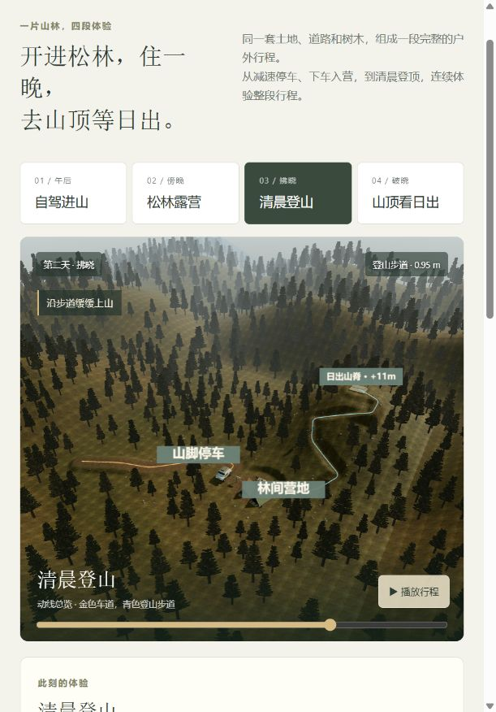

### 可观看的日出过程（2026-09-14）

修正镜头不能向上看的限制，取景点位于观景台前缘；观景方向保留树冠视线空隙。点击“山顶看日出”会从日出前自动播放约 24 秒，依次展示红霞、日轮升起、晨光铺开。画面内三个阶段按钮可定格比较；终点的“重看日出”只重播日出段。

天空加入朝向太阳的暖色渐变、薄云与光晕，日轮从地平线以下开始上升，亮度和地面直射光同步变化。仍为压缩时间的艺术化日出演示，未模拟真实日期、经纬度或物理大气散射。

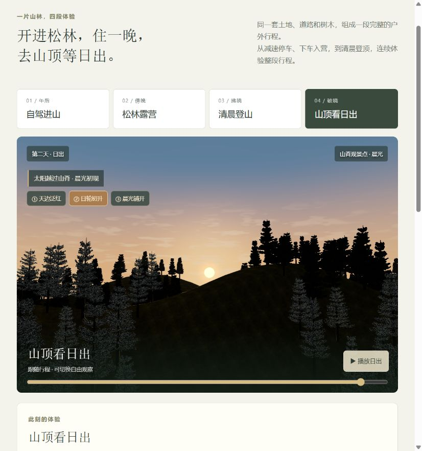

### 时间与地面树影联动（2026-09-14）

画面显示“演示时间”，时钟、太阳高度、方位、天空和灯光共同读取同一时间表。环境光照支持固定为 06:10、12:30、18:05，在同一个视角比较长短与方向不同的地面树影。夜间关闭太阳投影，营灯和头灯仍可产生局部阴影。这里的时间是虚构场景的演示设定，不是给定经纬度、日期的天文计算。

原先远景树不投影；现在远树用固定于世界方向的交叉树形轮廓参与阴影，近树使用详细枝叶模型。阴影覆盖扩大至山谷范围，设备允许时使用 4096 阴影贴图。转动观察镜头不会改变远树的投影轮廓方向。地表的静态树下暗部只表示近似环境遮蔽，与随时间变化的太阳投影分开。

远景阴影仍为轮廓近似，低角度、超出场地边界的阴影和有限贴图精度均有显示限制。

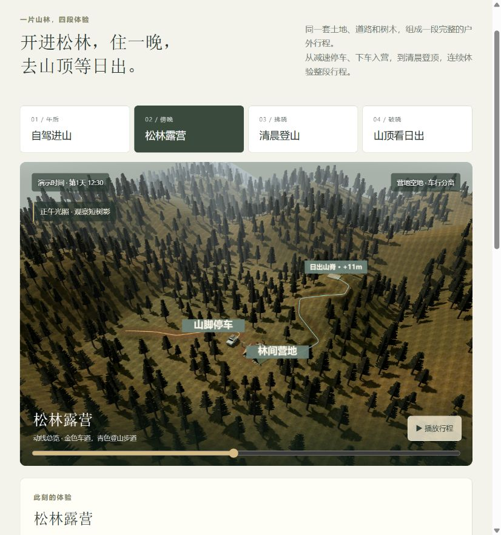

### 山路、落脚与林间明暗优化（2026-09-14）

画面下方新增“近看这一片山林”：**看山路衔接**定位到正午步道；**看落脚动作**从登山途中开始播放；**看晨光层次**定格日出后段。三处均可暂停、旋转与缩放。

- 山坡先用沿步道分布的高度约束形成连续过渡，再处理窄步道中心；保留原有营地、停车点和 11 m 爬升。路肩布置确定性的零散碎石，避免整齐包边。
- 人物以行走距离生成左右脚的世界坐标落点。支撑阶段脚掌固定，摆动阶段抬脚；鞋底随坡面倾斜，身体、手臂随步态移动。进度反向拖动可复现相同姿态。
- 远树图集只保存原色，修正双面卡片法线翻转带来的异常暗部；天空补光、地面反射色与雾随光照变化，减弱静态树下暗色的重复叠加。

可沉淀的是**路径约束下的地形整形、可回放的接地步态、近远植被一致受光**。它们可继续用于营地展示和其他步行路线。角色仍是简化程序模型，远树仍是卡片；本轮不等同实景扫描、完整骨骼动画或物理大气散射。

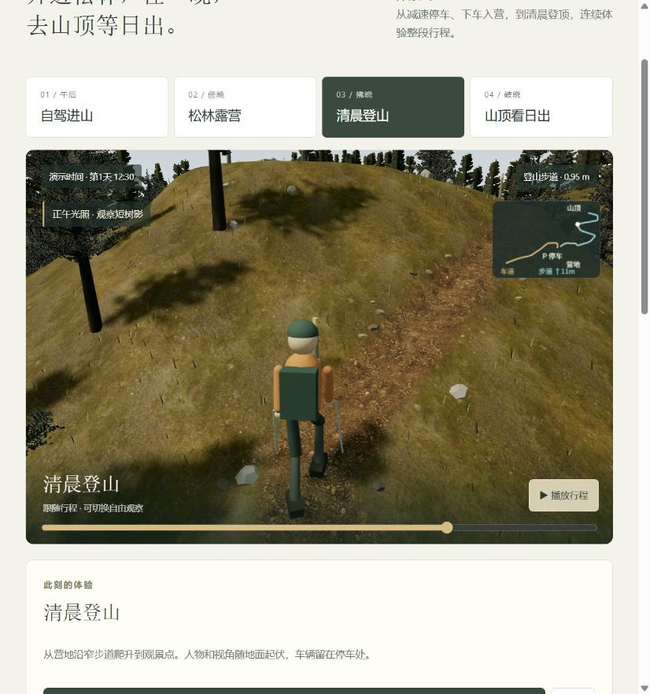

### 日出观看朝向修正（2026-09-14）

人物原先沿用步道末段朝向，与晨光水平朝向相差约 92.84°。现在登顶站稳后在约 2.88 秒内转向太阳，双脚同步调整，头部随太阳高度轻微抬起。默认镜头从人物后侧同时展示角色、栏杆与日出；“人物视角”从眼部位置沿当前朝向观看，转身阶段也随人物转动。太阳、人物目标朝向和日出镜头使用相同的太阳方向来源。

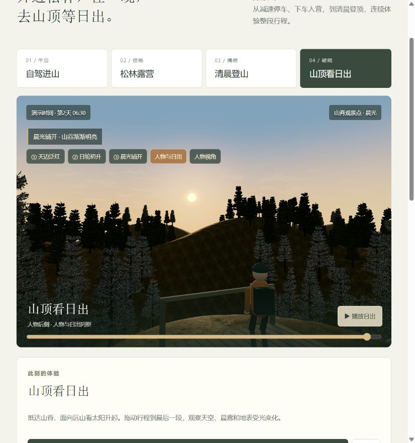

### 可编辑的布局工作台（2026-09-14）

在户外演示顶部点击“打开布局工作台”。选择“原始松林 / 远山营地 / 低坡营地”，或拖动平面图中的营地、山顶圆点。也可用六个滑杆调整营地和山顶位置、爬升、车道弯曲偏移。预览虚线保留当前路线，实线表示待生成路线；点击“生成并查看”才更新三维场景。

生成会同步调整道路终点、入营路线、登山路线、山坡与平整营位、帐篷桌椅和路标、树木避让、车辆停放、人物运动及日出取景。营地镜头位于预留空地，山顶后侧镜头也预留树冠净空；重建时释放旧物件与独立纹理，保留共用素材。

| 当前模板 | 车道 | 步道 | 爬升 | 松树 |
| --- | ---: | ---: | ---: | ---: |
| 原始松林 | 36.3 m | 46.4 m | 11 m | 1,915 |
| 远山营地 | 34.8 m | 50.8 m | 13 m | 1,922 |
| 低坡营地 | 39.6 m | 44.1 m | 8 m | 1,930 |

“保存当前方案”只保存已经生成的三维场景；刷新后点击“恢复已存方案”。也可下载 JSON 并导入为预览，核对后再生成。“还原初始场景”不会删除本机存档。

这里沉淀的是 **配置 → 空间规则 → 地形与资源生成 → 可回放体验**。同一套素材可产生不同布置，免去逐个搬动模型及手动重接路线。本轮验证的是有边界的户外模板：营地、山顶和路线只能在允许范围内变形，尚未接入真实地形、任意道路绘制、自动寻路或工程规划约束。旧截图中的树数反映当时版本。

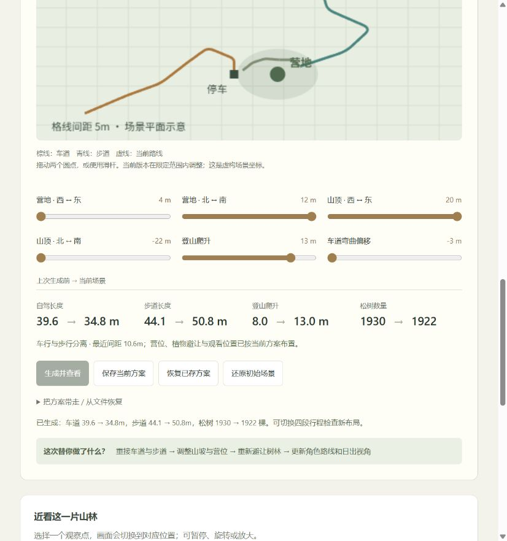

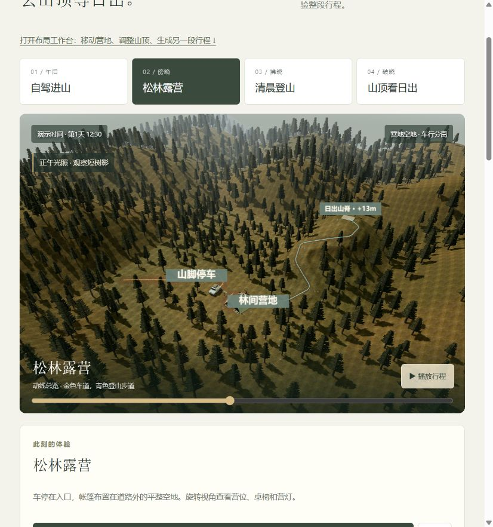


### 自然环境组合与逐步效果档案（2026-09-14）

布局工作台新增“自然环境”：林间公路、草甸营地、岩石山脊，可与三种布局独立组合。新增草丛、灌木、石块和坡面岩石材质，原有车道、营位、人物行程继续复用。页面顶部可打开实际效果档案；每轮保留前后截图、复现方案与剩余问题。

[逐步效果记录](effect-log.md) · [本轮源码与参数清单](assets/effect-record-manifest.json)


