# 自然环境效果记录

> 记录起点：2026-09-14。本文件记录本轮真实实现；此前工作见 [研究笔记](notes.md)。每轮追加独立编号，保留旧图与失败原因，避免只留下“已优化”的结论。

## 本轮结论

已把环境组合从布局坐标中分离：同一组车道、营地、步道和山顶位置，可生成林间公路、草甸营地、岩石山脊三种环境。新增草丛、灌木叶片、岩石实体与坡面岩石材质混合。属于可控环境原型，尚未达到实景复刻质量。

## 01 · 基线留档

- 问题：旧版主要依赖草土平面纹理和少量碎石，林下空白较多。
- 原始已应用布局为低坡营地；另有用户未生成草稿，已保存并在验证结束后恢复到预览。未覆盖本机已保存方案。
- [完整起始状态](assets/effect-baseline-state.json) 包含已应用方案和未生成草稿。截图另外固定为 47% 行程、跟随镜头、12:30 正午。

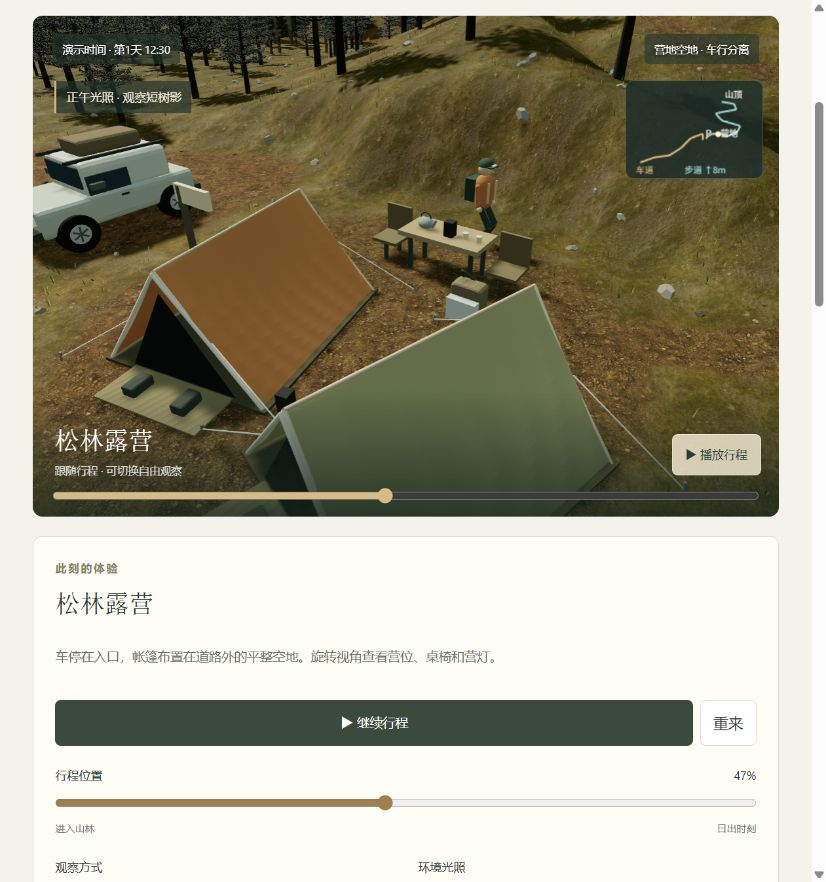

## 02 · 补齐自然层次

- 地表：保留草土/道路混合，新增 Rock 2 的颜色、OpenGL 法线、粗糙度；露岩依据坡度与连续斑块变化。颜色、法线与粗糙度使用同一混合权重，车道不被岩面覆盖。
- 草丛：弯曲、变窄的三维草叶，形成不同高度的草簇；灌木由带叶脉起伏的叶片组成。当前没有植物风动画。
- 岩石：不规则几何加真实纹理；小石为主，少量大石。石块中心服从地形高度，通行净空按半径预留。
- 范围：细节在行程附近较密，稀疏草丛、灌木与岩石延伸至约 216 × 216 m；松树林仍覆盖约 224 × 224 m。不是整个区域等密铺满。
- 调整记录：首次岩石着色器使用了保留字，浏览器报编译错误，已修复；松林坡面一度过白，随后调低该环境露岩比例。

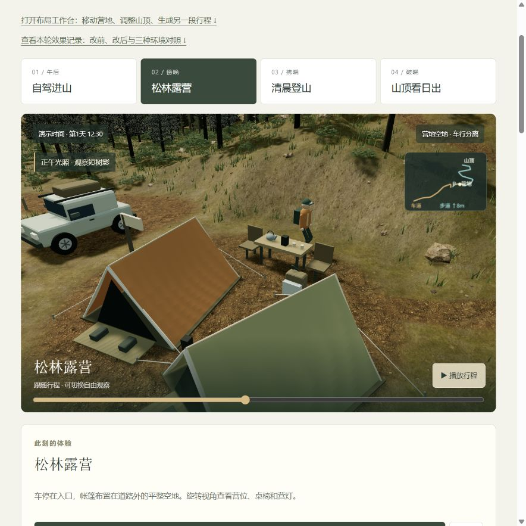

## 03 · 三种组合的复用验证

固定条件：低坡布局（营地 x=10,z=8；山顶 x=12,z=-16；爬升 8m；车道偏移 3m），行程 47%，跟随镜头，12:30 正午。车道长度约 39.6m、步道约 44.1m。三种环境保持相同路线和角色位置。基线录制时窗口较窄，图片不用于逐像素回归。

| 环境 | 松树 | 草丛 | 灌木 | 岩石 | 可恢复方案 |
| --- | ---: | ---: | ---: | ---: | --- |
| 林间公路 | 1930 | 9455 | 1112 | 606 | [下载](assets/effect-forest-recipe.json) |
| 草甸营地 | 1000 | 14458 | 510 | 334 | [下载](assets/effect-meadow-recipe.json) |
| 岩石山脊 | 393 | 2081 | 517 | 2516 | [下载](assets/effect-alpine-recipe.json) |

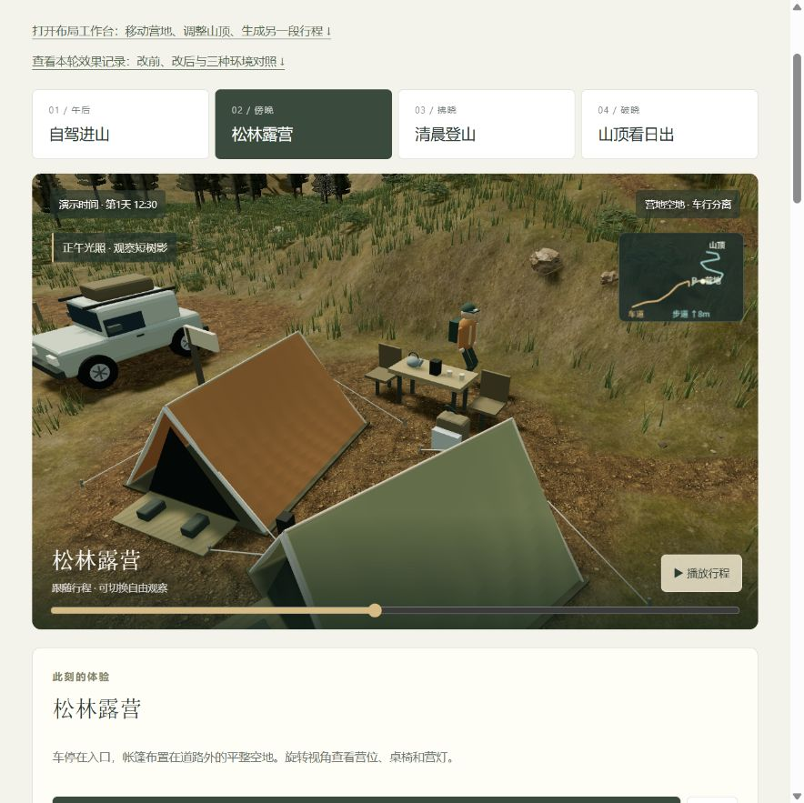

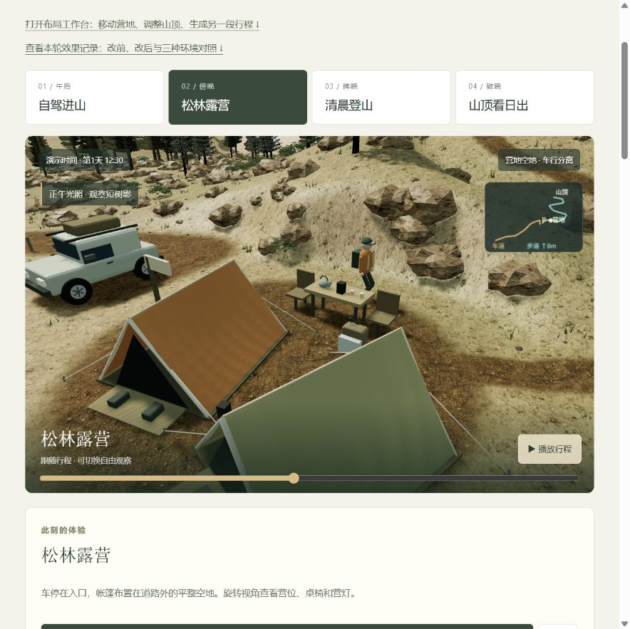

岩地初稿把过多石块做成较大尺寸，产生堆石感。保留 [初稿画面](assets/effect-03-alpine-initial.png) 与 [当时参数](assets/effect-03-alpine-initial.json)，本轮改为偏向小石的尺寸分布。仍有重复石形，尚未构成完整的地质侵蚀模型。

## 04 · 远景与晨光检查

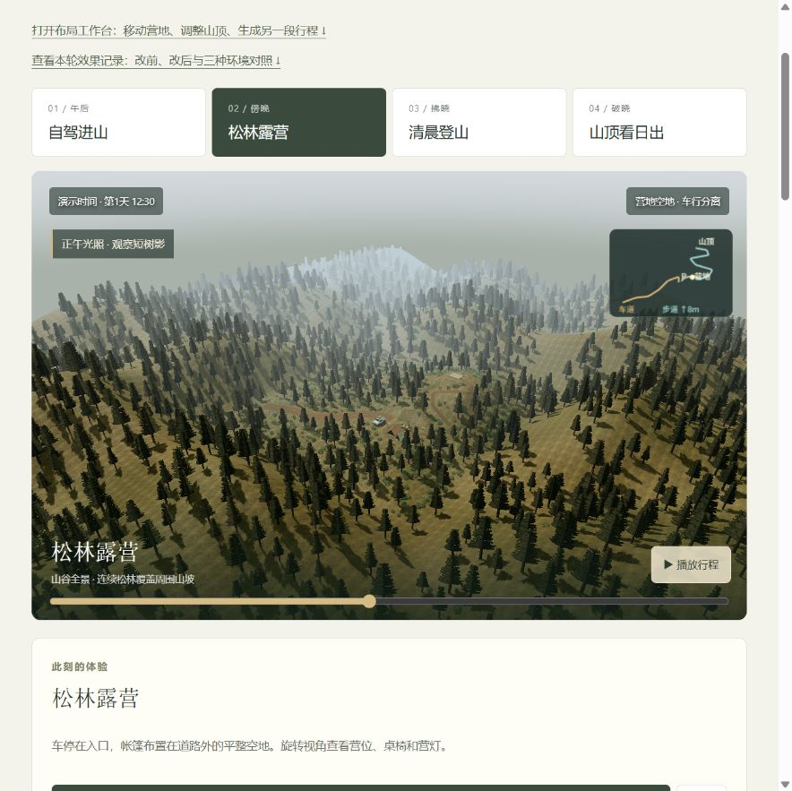

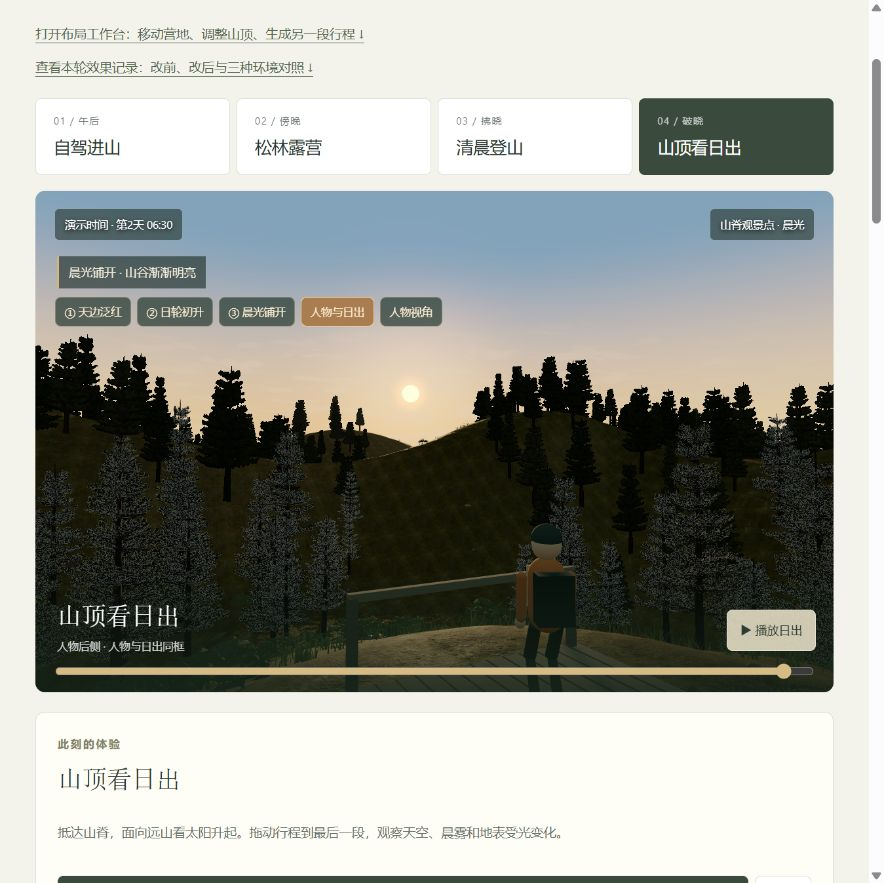

- 已实看：森林延伸至周边山坡；日出时太阳可见，人物朝向沿用已修正的观看方向；新增实体参与现有光照。
- 图中仍可见：远景树的深色轮廓与近景针叶亮点存在差异；远坡有重复/网格感；草丛与底图色彩融合还不充分。
- 未宣称通过：照片级真实感、真实天文时刻、真实地点重建、目标移动设备性能。

## 05 · 验证与可追溯文件

- `npm test`：55/55 通过，含环境切换保持路线、确定性恢复、植物/石块通行净空、远区域存在地被、v1→v2 存档兼容。
- `npm run build`：5 个页面、19 个应用模块构建成功。`npm run check`：102 个本地引用、9 张地表及 4 张植被纹理校验通过，纹理共 9.27 MiB。
- 页面实际操作：选择草甸预览 → 点击生成 → 三维内容与数量更新；随后通过页面工具切换另外两种环境并留图。
- 连续切换后的取样：195～197 个几何资源、24 个纹理资源；可见状态均 ready=true、renderError=null。仅为本轮快照，不是长期内存或性能基准。
- 截图旁 JSON 保存真实页面状态；[记录清单](assets/effect-record-manifest.json) 保存本轮源码 SHA-256 与截图索引。文件方案格式为 version 2，仍读取旧 version 1；本机保存键不变。
- 原始素材：[Poly Haven Rock 2](https://polyhaven.com/a/rock_2)，Rob Tuytel，CC0，官方标注宽度 1.5m。2026-09-14 下载 1K JPEG 三通道，从官方 API 取得 URL/MD5 并核对下载文件；上游 commit/tag 不适用于该资产，发布版本号待核实。见 [贴图清单](assets/texture-manifest.json)。

## 下一轮：先改善真实感，再扩大编辑能力

| 顺序 | 要解决的问题 | 验收方式 | 状态 |
| --- | --- | --- | --- |
| 06 | 近远树冠颜色、轮廓与针叶闪点不统一 | 同树形、同机位、正午/晨光截图，检查切换边界 | 待实现 |
| 07 | 草底图和草丛脱节、岩石重复 | 近地面截图；加入植物簇形与石形变化，检查路肩过渡 | 待实现 |
| 08 | 大面积场景成本和稳定性 | 指定目标设备，记录连续运行、帧率与资源变化 | 待验收 |
| 09 | 从固定模板走向区域编辑 | 绘制植被区、摆放设施，检验路线/营位避让与恢复 | 待实现 |

后续每一步沿用：**问题 → 改前截图与参数 → 实际改动 → 同条件改后截图 → 验证结果 → 剩余问题**。涉及视觉退步时保留调试截图，并说明修正原因。

## 06 · 保存可运行 V001，再扩展树冠与地被（2026-09-14）

本轮顺序：捕获当前已生成方案 → 固定可复现日出镜头 → 封存 V001 → 独立运行验证 → 修改开发版 → 同机位检查 → 封存 V002。此前只有图片的阶段仍然只是图片记录，没有虚构为可运行版本。

- **V001**：103 个文件，14,792,477 字节。完整代码、Three.js、本地素材、文档和回放状态。使用额外端口 4388 的独立服务确认 ready=true、97% 行程、低坡营地、跟随镜头、自动晨光。
- **V002**：110 个文件，15,102,194 字节。同一场景和观察条件，保存本轮修改后的实现。正式入口读取本版本目录下的代码与素材。
- 开发版新建 [历史版本页面](app/versions.html)，可打开 V001、V002 和最新效果的同条件入口；[快照规则和清单](snapshots/README.md) 记录后续流程。

### 实际修改与取舍

1. 针叶细片的法线改为较连续的冠体方向，减少一片片平面受光带来的亮暗碎点。
2. 原始针叶颜色图透明区域为黑色。运行时在裁取的枝叶区域补边后生成缩小纹理，遮罩及原始素材文件保持不变，以减轻过滤产生的暗边。
3. 针叶采用高粗糙度、较弱镜面高光并做受控的颜色校准。一次仅换漫反射模型的尝试使正午树冠过暗，未采用；恢复标准材质并在正午/晨光下检查。
4. 近远叶冠继续投射地面树影，但暂不接收其他对象的阴影；树干仍接收阴影。这样避免稀疏叶片和交叉远景投影模型产生过强自遮挡，属于渲染近似，**不代表解决了物理透光或完整树冠阴影**。
5. 草叶略微变矮、变窄，色调向草土底图靠拢；保留原有分布、通行净空、路线与人物动作。

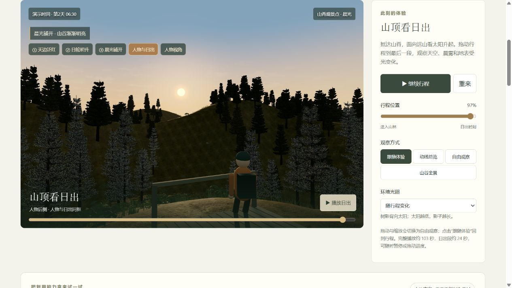

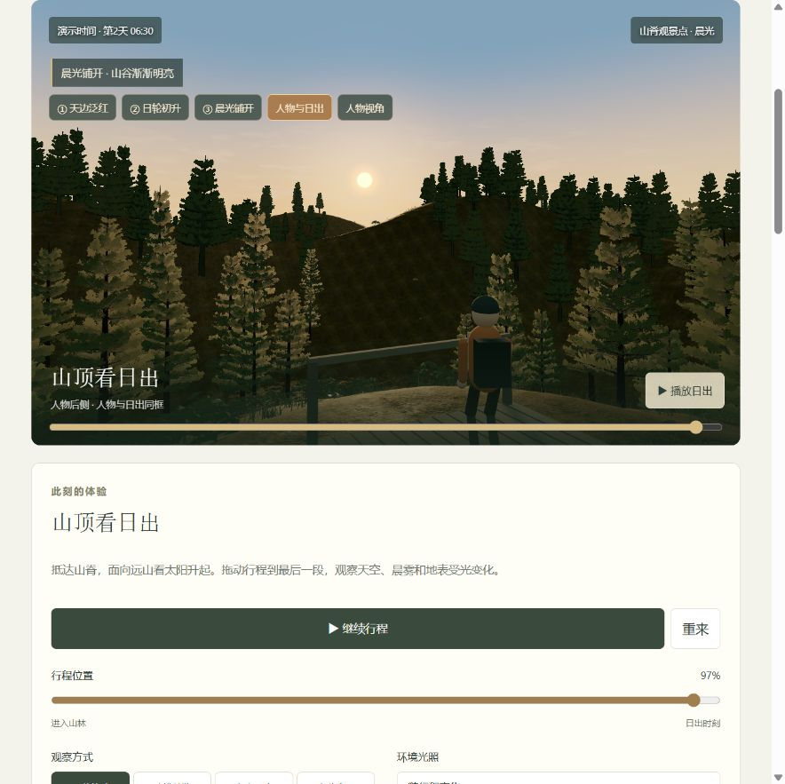

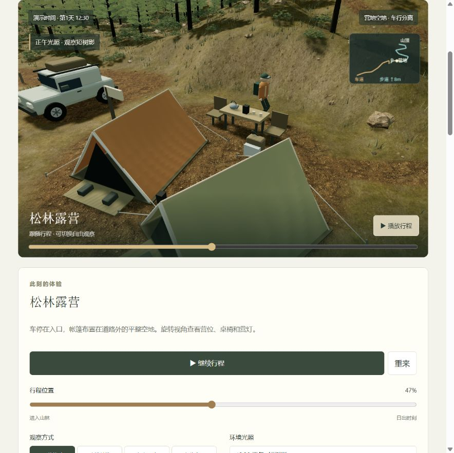

### 验证与剩余问题

- 自动测试 57/57 通过，新增禁止覆盖历史目录、内容改动与额外文件检测；既有路线/人物/环境规则检查继续通过。
- V001、V002 浏览器入口均 ready=true、renderError=null，初始布局、97% 回放及跟随镜头匹配；V001 封存后再次按全部文件 SHA-256 验证未变。
- 本轮减少了针叶碎亮点，远树不再全部压成黑色，草丛与地面色调更接近。仍可见近远树冠色差、规律层叠的树形、草丛稀疏和远坡重复感，后续仍需用模型/材质改进解决。
- 原来未生成的布局草稿与自由观察位置另存 assets/snapshot-v001-state.json；历史版本默认采用固定日出镜头。未记录自由镜头目标点的旧状态，不声称能完整复原该任意视角。
- 本轮没有发布、推送或提交 Git；快照是本地固定文件。V001/V002 不做后续修补，有问题应另建新版本并解释。

最终构建验证：6 个页面、20 个应用模块；120 个本地引用、9 张地表及 4 张植被贴图校验通过。V001/V002 全量校验再次通过；V002 从 88% 实际播放至 100%。两份归档与开发版入口已在浏览器验证。

## 08 · 从环境资源到营地扩建评审（2026-09-14）

本轮将同一套地表、松树、树影和帐篷资源用于一个经营决策：既有两个营位，扩建到四个还是六个？固定场地及 341 棵树，新增营位和支路驱动模型、距离计算与建议。

- A：6 营位 / 最近边界 2.6 m / 新增预留面积 144 m² / 步道总长 91.6 m。
- B：4 营位 / 最近边界 9.6 m / 新增预留面积 72 m² / 步道总长 73.6 m。
- 两案平均搬运 39.6 m、最远 46.6 m，未虚构距离改善。

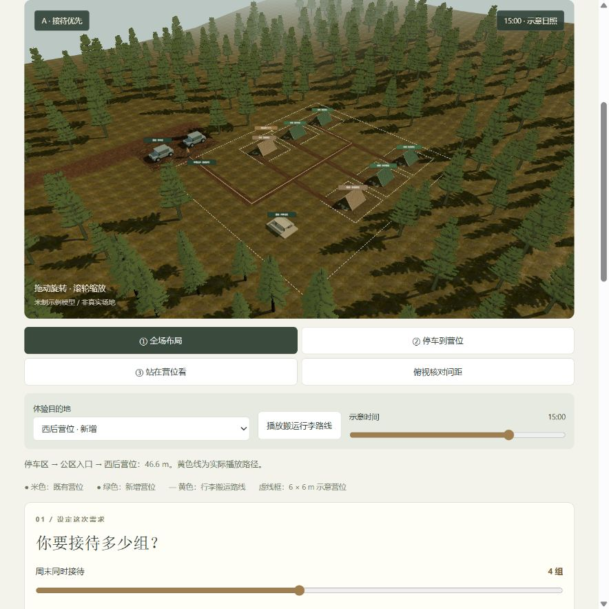

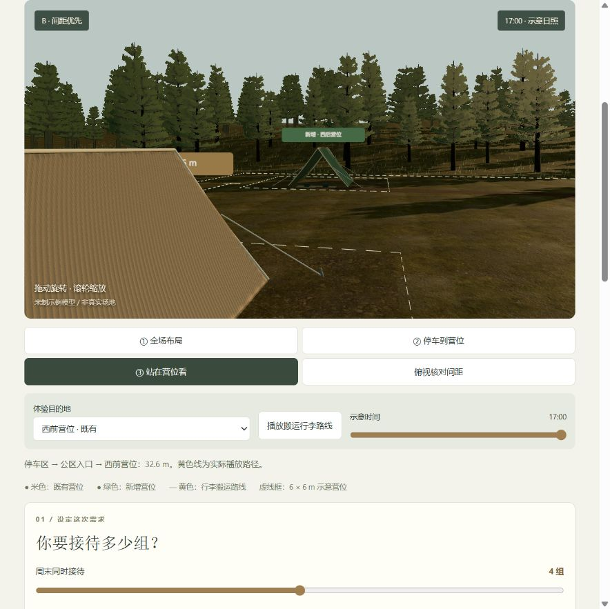

[案例边界及复现步骤](use-case-camp.md) · [实际生成的评审单](assets/camp-review-example.md)

验证：62/62 自动测试通过，包含三种评审结果、既有营位和树木不变、共享支路去重、所有人物路线避开帐篷含拉绳边界、存档校验与重新计算。构建 7 页面 / 22 应用模块；134 个本地引用及 13 张纹理校验通过。浏览器实看两案切换、俯视和营位镜头、15/17 时光照、行走到终点、保存后切换再恢复；渲染状态 ready=true/error=null。

导出：页面完整预览与内容已核对并留档。内置浏览器未回传下载完成事件，不把文件落入系统下载目录记为已验证；预览可直接复制。

局限：示例场地，规则只覆盖容量与间距；没有工程成本、停车容量、排水、真实太阳历或经营成效验证。树形重复、地表重复纹理及车辆模型仍是后续质量项。
