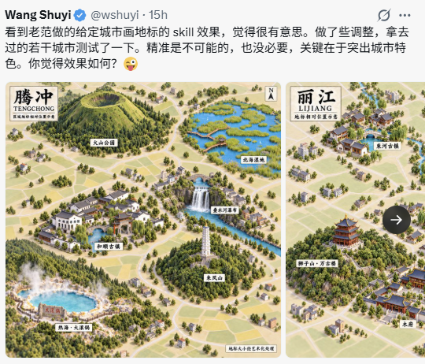
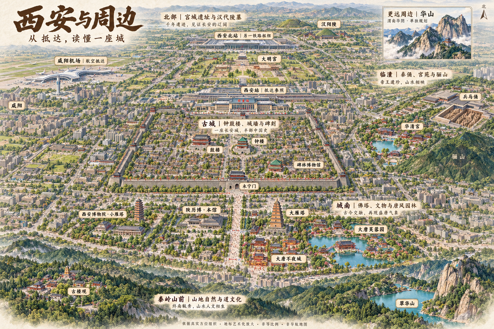

# 视觉对照与验收

> 内容优先校正（2026-09-14）：用户指出城市探索意义和当地生活内容不足。本文件保留为视觉实验记录；暂停依据原清单继续微调，先完成[西安内容补充研究](../../../xian-content-inventory.md)。画风改善不代表内容验收通过。

本规范来自西安试点反馈，版本 0.1.1，2026-09-14。图片位于本研究项目 assets/，分发 Skill 时需保留引用图片或改成用户提供的实际文件路径。无图片时仍可按以下文字规范工作，但不声称已查看参考。

## 正向参考：原始腾冲 / 丽江截图

角色：画风和阅读层级参考，不作为西安地理资料。原截图右侧有裁切，不能推断未显示部分。

应提取：可识别的景点体量、较高俯视角、清晰独立的景观单元、克制的普通建筑、景点间的绿地空隙、短小地标牌。不要照搬腾冲的火山、湿地或丽江建筑到西安。

## 纠偏样本：用户上传的西安宏观结果

角色：问题分析材料；默认不作为下一轮生成的风格参考。它已扩展景区覆盖，不能称作毫无价值；问题在于画法偏离微缩图鉴。

观察到的差异：连续城市楼群占据大量视觉空间；有明显地平线和纵深透视；钟鼓楼与普通建筑区分不够突出；近郊与城墙之间缺少足够的视觉间隔；片区说明和额外文案争夺注意力。建筑真实形态和全部地理关系尚未逐项验收。

对应修订：保持城市与主要片区覆盖，改变普通建筑密度、俯视角、地标相对体量、区域留白和图内文字长度。不要通过堆叠更多景点来修复画风。

## 必须单独检查

1. 是否有真实可打开的生成图片？提示词交付模式不要求本轮出图，但必须标为未验证。
2. 关键地点名称是否正确，车站身份是否混淆，核心地点是否遗漏或重复？
3. 相对方位、城墙内外和远郊分隔是否符合本次核对资料？透视会影响屏幕坐标，不能仅凭一对像素断言，但方向读不清本身是需要修订的问题。
4. 小字号标签是否可读，是否出现错字、额外虚构文案或导航信息？

关键关系出错时不以画面精美抵消。能修订的图标为“待修订”，不能直接作为准确旅游图发布。

## 视觉观察表

每项记录“符合 / 部分符合 / 不符合”并写一条画面证据，不凭总体漂亮程度打分。

| 观察项 | 应能看到的证据 |
| --- | --- |
| 重心 | 缩小到普通阅读尺寸仍先看到核心与抵达点 |
| 地标识别 | 主要建筑和景观具有独立轮廓，不淹没在住宅楼中 |
| 区域分隔 | 城区与外围景区之间有间隔，远地不会被读成相邻街区 |
| 俯视一致性 | 北部景点仍可辨认，地平线和纵深不支配构图 |
| 背景克制 | 普通建筑衬托景点；绿地与留白形成阅读节奏 |
| 文字层级 | 地名优先，介绍精简，不遮挡关键地标 |

## 西安下一轮对照

使用原始腾冲 / 丽江截图作为风格参考，使用 xian-v2-prompt.md 生成一张候选图。参考图的裁切与低分辨率需记录，不虚称提供了高清原稿。

保留 V1 与 V2 原始文件、实际工具信息及提示词；逐项写观察证据。可用“先找到抵达点、指出临潼方向、分清城南与远郊”做初访者阅读验证，但只有真实读者参与后才能报告理解效果改善。

当前状态：用户已上传第二张宏观样本，画风明显改善；[V2 验收与局部修订稿](xian-v2-review.md)记录逐项证据。实际外部生成参数待核实，技能输出稳定性尚未验证。
