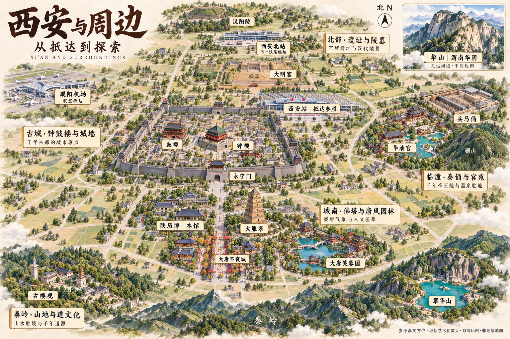

# 西安第二张宏观样本：验收与局部修订

> 内容优先校正（2026-09-14）：用户指出城市探索意义和当地生活内容不足。本文件保留为视觉实验记录；暂停依据原清单继续微调，先完成[西安内容补充研究](../../../xian-content-inventory.md)。画风改善不代表内容验收通过。

记录日期：2026-09-14。用户在收到 V2 提示词后上传本图；按接收顺序记为 V2 样本，不声称已确认外部工具实际使用了完整 V2 提示词。具体模型、实际输入参考图与生成参数待核实。

## 结论

相较上一张用户全景图，本图明显趋近精选地标微缩图鉴。可作为下一轮局部修订的底图，不能直接当作已通过地理与文字验收的最终成品。观察是本次视觉审阅结果，不代表用户已经认可，也不证明技能可稳定复现。

| 项目 | 本次观察 | 画面证据 |
| --- | --- | --- |
| 重心 | 符合 | 古城与西安站共同占据中部，先于普通建筑被识别 |
| 地标识别 | 符合 | 钟鼓楼、大雁塔与站房均有明显轮廓，不再淹没在连续楼群中 |
| 区域分隔 | 部分符合 | 临潼、机场、山前景观之间已有田野绿地；临潼与中心城区仍主要表现为横向并列 |
| 俯视一致性 | 符合 | 主图没有连续地平线，北部站房、遗址与陵墓仍可辨认；华山独立插图保留山景视角 |
| 背景克制 | 符合 | 楼海显著减少，普通建筑变为散布点缀；道路仍形成较密的装饰网格 |
| 文字层级 | 部分符合 | 地名牌清楚，但区域说明牌偏大，并出现生成稿未要求的额外文案 |

“符合”仅针对本表观察项，不等于所有真实建筑细节正确。

## 地理与文字检查

- 已能读出：鼓楼在钟楼西侧、永宁门在南缘，西安站在北墙外偏东北；大明宫在站北，西安北站与汉阳陵更北；机场在西北，城南片区在城墙之外，华山为独立插图。
- 优先修订临潼：在北上阅读下，华清宫的景观落点接近钟楼同一水平带，容易读成正东；应让临潼整片更清楚地处于城区东北偏东。兵马俑仍在华清宫东北，骊山仍应在华清宫南侧。依据为同次研究的实际地点坐标，见 [地理研究](../../../xian-atlas.md)。这里只指出可读性问题，不以像素差宣布整幅图坐标精确或失真比例。
- 西安站标签可辨认，但站房屋顶红色小字在当前图中无法可靠辨读；下次仅保留正确“西安站”三字，避免与地名牌不一致。
- 如“千年古都的城市原点”等额外说明并非 V2 指定文字；下次收紧为地名和指定短介绍。不是说这些词都错误，而是会改变预设信息层级。
- 翠华山的尖峰和水色较夸张；是否符合该景区的真实地貌未专项核验，不能仅因精美就通过形态检查。大明宫具体建筑、各站房外形等也未作逐一照片核对。

## 下一轮局部修订提示词

上传本张 V2 图片作为修改底图，附上以下指令。无需先重新生成全图。

请在这张西安微缩旅游图鉴上做局部修订，保留现有高俯视角、疏朗绿地、主要地标体量、纸面质感、古城主体与华山独立插图，不重新铺满普通住宅，也不增加景点。

1. 调整临潼片区的位置：将华清宫、骊山与兵马俑作为一个有内部关系的景观组，整体向右上方安排，使它清楚位于钟楼与西安站的东北偏东方向，与中心城区保留绿地间隔。组内兵马俑在华清宫东北，骊山在华清宫南侧。华山插图不变；空间不足时减少附近装饰性房屋与树木，不挤到华山插图中。
2. 收小五块片区介绍牌，只保留“古城·钟鼓楼与城墙”“城南·佛塔与唐风园林”“临潼·秦俑与宫苑”“北部·遗址与陵墓”“秦岭·山地与道文化”。删除各牌下新增的诗句和宣传性说明，不改变主要地名。
3. 西安站屋顶红色站名必须准确写为“西安站”，与“西安站｜抵达参照”标签一致。禁止伪字或混用西安北站。

其余位置、风格、色彩与景点保持。输出为修订后的完整横向图片。保留北箭头、非等比例和非导航说明，不添加路线或时间信息。

## 验证边界

以上局部修改稿尚未生成或验证。下一轮优先比较临潼方位、文字收敛和风格是否保留；地貌与建筑真实性仍需要资料和图像对照，不以一次修订声称完全完成。
