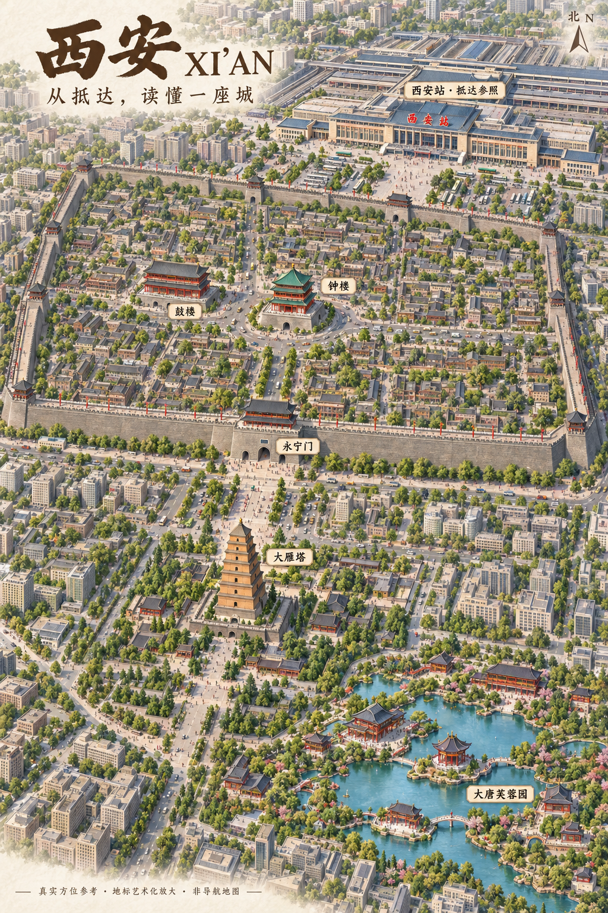

# 西安微缩插画：展示目标修正

日期：2026-09-14。用户明确指出：需要原始参考图那样的微缩城市插画效果，并以真实地理关系作必要参考。上一轮的坐标关系图仅是内部校验材料，不能作为最终视觉交付。

## 最终展示要求

用户进一步要求：直接使用当前内置生图能力，并以核心标志作为理解参照，例如火车站。本轮选西安站作抵达参照、钟楼作城区参照；保持西安站在城墙北侧、钟楼东北方向，靠视觉强调建立阅读重心，不随意移动其地理位置。西安北站在周边图另列。可复用的产品原则是先确定“用户从哪里抵达”和“城区以什么识别方向”，再围绕这些参照组织景点。

- 主体必须是可辨认的微缩建筑、城市场景与景观，不用散点图、线框或文字卡片替代。
- 保留钟鼓楼的东西关系、城墙内外关系，以及博物馆、雁塔与芙蓉园的南部位置。
- 城区主图与临潼独立放大图配合；机场、北站与临潼在周边图中解释方向，不能被挤成城内邻居。
- 图标、建筑与景区可以艺术化放大；图件不能被称为逐像素精确地图。道路和绿化等背景与真实可通行路线分开解释。
- 默认页以大幅插画、查看细节和保存原图为主；13 个点位的坐标关系图移动到 geography.html 作辅助依据。

## 本轮生图说明

采用内置 imagegen，不使用 CLI 或外部 API。第一轮传入原始参考截图作为风格参考、现有关系图作为位置依据；请求因网络错误失败，没有返回图片。第二轮改为纯文字的新图生成，保留建筑与位置要求。

[第一轮提示词](assets/xian-illustration-prompt.txt) · [第二轮提示词](assets/xian-illustration-prompt-v2.txt) · [地理数据与来源](xian-research.md)

第三轮继续调用内置 imagegen，已加入车站作为核心参照的要求：[实际提示词](assets/xian-illustration-prompt-v3-station.txt)。该轮仍因 images/generations 请求网络错误失败，未返回图片。

第四轮继续使用内置能力，精简为竖版核心城区插画：西安站、钟楼、鼓楼、永宁门、大雁塔、大唐芙蓉园六处，保持关键方位，先突出抵达参照与实际视觉效果。[实际提示词](assets/xian-illustration-prompt-v4-core.txt)。该轮直接等待内置工具返回，仍因 images/generations 请求网络错误失败，未返回图片。

建筑补充依据：[西安地方志大雁塔条目](https://xadfz.xa.gov.cn/xadq/rwxa/1802954373708996609.html)用于七层塔形说明；[钟楼条目](https://xadfz.xa.gov.cn/xadq/rwxa/1794984167304376322.html)用于中心交汇位置；[西安城墙介绍](https://qjxq.xa.gov.cn/zjqj/gyqj/tsqj/5df21c5565cbd81235fc1efa.html)用于城墙、城楼与环城公园特征。未抄录或使用历史文章中的运营信息。

## 验收

需直接检查生成图的地标形态、中文名称、地点相对方位和画面效果。提示词提出约束，不等于模型已满足；先验收实际输出，再发布为默认展示。原地理模块的测试不证明生成图精度。

此前生成状态：累计四轮内置 imagegen 均因服务网络错误失败，未返回图片。第一轮失败端点为 images/edits，其余为 images/generations；未改用 CLI/API。随后用户上传西安插画，已原样保存并接入，不将它混记为前述失败请求的成功返回。

## 用户图片接入

上传文件为 codex-clipboard-38a25cea-ff49-488a-99fb-8028d284cf4e.png，1024 × 1536，3823863 字节。原文件与项目保存文件 SHA256 一致，未裁切、重绘或重生成。[来源元数据](assets/xian-illustration-source.json)。具体生成工具、模型与授权待核实。

默认 index.html 已采用展示页，配合 illustration.css 和 illustration.mjs 提供全图/细节、原图下载及六个地点来源。geography.html 保留独立坐标校验页。illustrated.html 保留同内容源稿，构建入口为 index.html。

从用户图可见，西安站位于画面上方并显著放大，钟鼓楼在城墙内，永宁门在城墙南缘，雁塔和芙蓉园在城外；这符合以核心标志组织视觉阅读的方向。六处中文名称可辨认，图片并未包含此前设想的博物馆、机场、北站或临潼插图，界面说明已据实调整。

方位可读性仍待校核：指北针接近竖直，景观采用透视，大雁塔视觉上位于钟楼左下方，容易被理解为西南；但不能仅凭图像横坐标断定透视场景的地理位置。已在页面说明大雁塔实际在钟楼东南方向，提供独立坐标依据。城墙范围、道路、建筑比例与景区内部布局未经逐项核验，当前定位为视觉样稿，不作地理准确性验收通过的结论。

已完成构建、文件引用、控件与语法检查、原图尺寸和哈希检查、本地 HTTP 检查；未进行浏览器交互、下载落盘或移动端实测。未部署。
