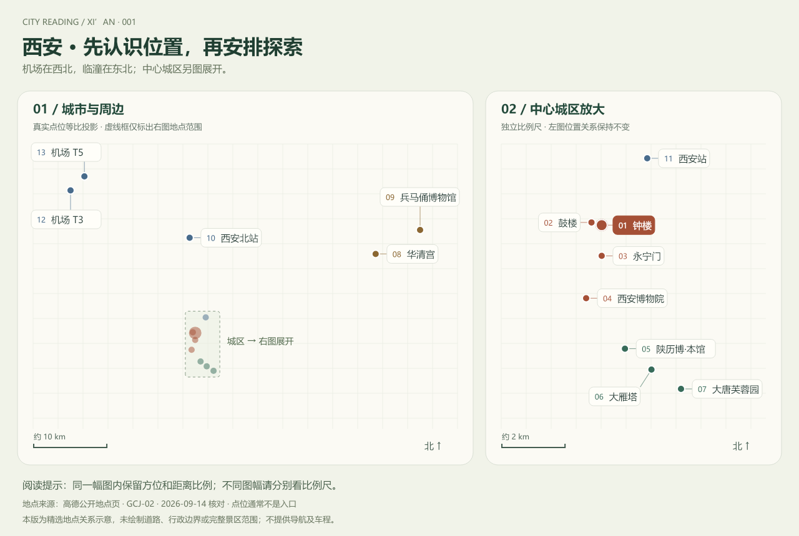

# 西安试点：以真实地点建立旅游空间认识

研究日期：2026-09-14。依据用户要求，首个地理测试城市确定为西安。已完成 13 个公开地点坐标核对、关系图及交互页面；未做实地测量、导航接入、插画叠加或新人实验。

后续更新：已将[用户提供的西安插画](xian-illustration.md)作为默认视觉样稿；本页关系图移至 geography.html 作辅助依据。上传图尚未与坐标逐点绑定，不能以此把地理准确性记为通过。

[项目概览](README.md) · [扩展研究](extension-research.md) · [运行说明](app/README.md) · [地点数据](data/xian-places.json) · [验证记录](notes.md)

## 本轮交付

*与网页共用的 SVG 渲染函数输出，1280 × 860 PNG，非浏览器截图。浅色方格是绘图纸背景，不是路网；细线是标签引线。*

[概览 SVG](assets/xian-overview.svg) · [城区展开 PNG](assets/xian-center.png) · [城区展开 SVG](assets/xian-center.svg)

本地默认入口现为用户提供的西安插画展示，地理依据移至 geography.html，原腾冲与丽江插画编辑保留在 studio.html。地理页支持四种范围、选择地点查看依据、比较参考点直线距离、导出 SVG 图件及 JSON 地点档案。

## 产品目标与验收口径

帮助第一次来西安的人区分中心城区、雁塔一带、临潼景区与抵达枢纽，理解大方向和远近尺度，知道哪些地点需要进一步查询交通。当前分组是阅读主题，不是行政区划、完整景区边界或已验证的游览线路。

地理要求：

- 每个地点必须有名称、坐标、坐标系、来源、核对日期和点位含义；缺失坐标不生成位置。
- 同幅图内采用统一比例和北向；不能为美观挪动地点。不同图幅分别提供比例尺。
- 放大建筑和移动标签属于视觉操作。标签通过引线连接固定坐标，不能将新位置解释为实际地点。
- 城区与远郊分层展开，避免把临潼景点与中心城区画成相邻街区。
- 入口、道路、车程、预约等必须另有依据；不能由生成模型或直线距离推断。

用户价值仍待测试。可沿用扩展研究中的新人对照实验，任务重点为“机场在哪个方向”“兵马俑与城内景点是否同一距离尺度”“两座火车站是否相同地点”。不得把本轮程序检查当成实际理解效果或旅游可行性验证。

## 地点数据与来源

来源页面按“纬度，经度”显示，本项目按明确的 lon / lat 字段保存。下表为抄录核对的 13 个参考点；数字小数位数不表示实测精度。全部日期为 2026-09-14，来源页面无 commit/tag，可重复查阅但内容可能变化。

| 地点 | 经度 E | 纬度 N | 原始地点页 | 点位含义 |
| :--- | ---: | ---: | :--- | :--- |
| 西安钟楼 | 108.947030 | 34.259430 | [B001D09TAA](https://ditu.amap.com/place/B001D09TAA) | 地标参考点 |
| 西安鼓楼 | 108.943512 | 34.260206 | [B001D07CMS](https://ditu.amap.com/place/B001D07CMS) | 地标参考点 |
| 西安城墙（永宁门） | 108.947029 | 34.250660 | [B0FFHNKLSK](https://ditu.amap.com/place/B0FFHNKLSK) | 城门地点，不保证当日入口开放 |
| 西安博物院 | 108.941673 | 34.238589 | [B001D06AOS](https://ditu.amap.com/place/B001D06AOS) | 院区参考点，非入口 |
| 陕西历史博物馆（本馆） | 108.955044 | 34.224199 | [B001D03PEX](https://ditu.amap.com/place/B001D03PEX) | 本馆参考点，非秦汉馆 |
| 大雁塔 | 108.964176 | 34.218229 | [B001D023F0](https://ditu.amap.com/place/B001D023F0) | 塔体，非同名地铁站 |
| 大唐芙蓉园 | 108.974360 | 34.212717 | [B001D092BB](https://ditu.amap.com/place/B001D092BB) | 园区参考点，非入口 |
| 华清宫 | 109.215759 | 34.356728 | [B001D006F1](https://ditu.amap.com/place/B001D006F1) | 景区参考点，非入口 |
| 秦始皇兵马俑博物馆 | 109.281960 | 34.386214 | [B0FFGXMLTU](https://ditu.amap.com/place/B0FFGXMLTU) | 馆区参考点，非帝陵全部园区 |
| 西安北站 | 108.938757 | 34.376660 | [B001D09TZP](https://ditu.amap.com/place/B001D09TZP) | 铁路站参考点，非地铁站 |
| 西安站 | 108.962723 | 34.278498 | [B001D08UZ3](https://ditu.amap.com/place/B001D08UZ3) | 铁路站参考点，非地铁站 |
| 西安咸阳国际机场 T3 | 108.761401 | 34.435045 | [B038E0OI0C](https://ditu.amap.com/place/B038E0OI0C) | 航站楼参考点，非到达口 |
| 西安咸阳国际机场 T5 | 108.782060 | 34.452254 | [B0IUJUK824](https://ditu.amap.com/place/B0IUJUK824) | 航站楼参考点，非到达口 |

高德官方说明其采用 GCJ-02，与 WGS-84 存在偏移。本版全部取自同一高德地点来源，按高德坐标使用；未将 GPS 数据直接混入。[高德坐标说明](https://lbs.amap.com/api/javascript-api-v2/guide/abc/basetype)

另用机构官网交叉核对地点身份：[陕西历史博物馆参观指南](https://www.sxhm.com/guide.html)分别列本馆与秦汉馆；[秦始皇帝陵博物院](https://www.bmy.com.cn/index.htm)列临潼地址。未用旧文章中的票价、开放时间或公交信息填充产品。

坐标来自公开地点页，而非实地测量或已经接入的地图 API。许可状态：地点数据再分发及商业使用待核实；公开可读不意味着开放许可。本项目未复制第三方底图瓦片或完整站点。

## 计算与绘制方式

每幅图分别用地点纬度平均值进行局部等距圆柱近似：经度差乘以该纬度的余弦与地球半径，纬度差乘以地球半径；两个方向共用一个缩放系数。中心城区视图与整体图使用各自的范围和比例尺。该方法满足本次城市尺度示意，不属于测绘精度承诺。

地点位置直接来自投影。标签自动挑选空位，避让其他名称、地点和标签引线；用户不能拖动真实地理锚点。整体图中的虚线框仅包围右侧展开的地点集合，不代表城墙或行政边界。

远近比较使用 Haversine 球面近似，输入均为上述同源参考坐标，结果取 0.1 km。该数值用于识别数量级；不能解释为路线长度、可步行距离或耗时，也没有默认画连接两个地点的路线。

已自动检查同图内东西南北一致、位置不越框，以及所有地点对的投影距离与球面近似距离偏差小于 0.3%。这是实现自检，不证明来源坐标精度，不是导航误差测试。

## 下一步怎样叠加插画

1. 先补充有依据的城墙轮廓、关键水系或骨干交通线，记录原数据来源与坐标系；保留少量最有助于新人理解的地物。
2. 为钟楼、大雁塔等分别制作独立插画素材。程序控制其地理锚点，明确图标不是建筑占地比例。模型仅负责外观。
3. 允许局部视觉放大，但通过地理参考点和引线保持可追溯。整张受控生成图只作为对照，检查是否移动地标、编造道路或改变相邻关系。
4. 验证地点真实入口后再接入算路；注明交通方式与查询时间。没有线路结果时不显示分钟数。

现有腾冲、丽江整图无法通过修改标签变成西安地图。本版优先完成可核对的地理结构，尚未生成西安地标插画。

## 未完成项

完整道路与城墙、水系、行政边界、景区真实入口、实时交通、营业预约、用户理解实验与商业授权核实均未完成。图中也没有覆盖西安的全部景点。本轮未部署、未提交或推送仓库。

## 2026-09-14 宏观范围扩展

当前默认入口为西安与周边在线地图，20 个地点档案；城区插画移至 app/city.html。支持三个范围、片区筛选、五个抵达或中心参照，以及地点介绍、方位和直线距离。Leaflet 与坐标转换库已本地化，底图仍需联网。详见 [宏观地图记录](xian-atlas.md)。此前 13 点地理校验页和图件保持原有范围。
