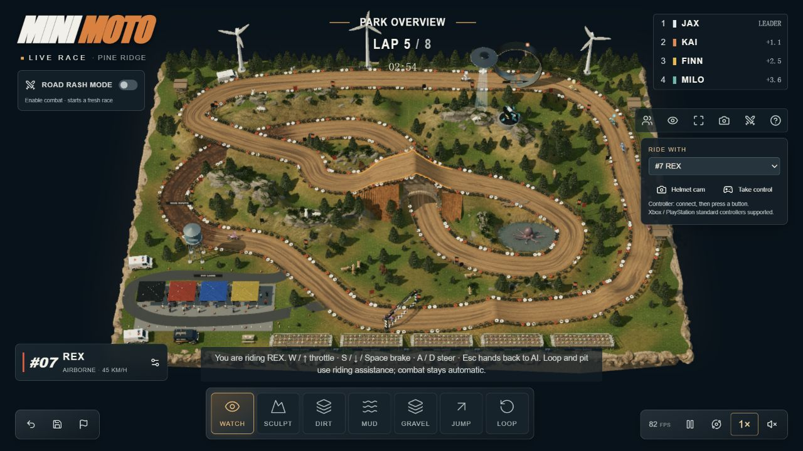

# 010 · Mini Moto 赛车游戏参考与实践总结

**定位：这是一个赛车类游戏的参考研究，具体是越野摩托竞速。核心参考价值是场景构建和赛车手能力构建。** 前者让赛道、地形、路面与环境组成可玩的空间；后者把摩托与骑手的呈现、驾驶操作、能力参数及反馈组织起来。研究阶段已总结，后续按具体项目需求开发。

*2026-09-14 作者原版游戏实测截图，原样复制自 007 来源档案；不是我们的重建效果。图片权利归相关权利人，许可待核实。*

[研究结论与对比](comparison.md) · [实现逻辑](implementation.md) · [运行与操作](app/README.md) · [证据与验证](notes.md) · [图片来源](assets/README.md) · [返回总索引](../../README.md#项目索引)

## 我们的理解与结论

| 核心 | 参考内容 | 对开发的意义 |
| :--- | :--- | :--- |
| 场景构建 | 赛道布局、地形起伏、路面、护栏、环境物件、材质光影和镜头 | 场景提供可辨认的行驶路线；弯道、坡道和路面差异进一步形成操作与路线选择 |
| 赛车手能力构建 | 摩托与骑手主体、加速制动、转向抓地、能力取舍、自主驾驶、姿态与声音反馈 | 把角色外观、参数和实际行为连接起来；能力应影响驾驶结果，而不只是面板数值 |
| 竞赛玩法 | 检查点、圈数、排名、计时、失误与重赛 | 让场景和驾驶系统形成可以重复挑战的体验 |

**复杂效果分两类：已有系统可以持续打磨，缺少的能力需要单独建设。** 光影、材质和镜头可以优化；悬挂、腾空落地、碰撞、对手争线等需要相应机制。物件更多并不自动带来可玩性，应检验它是否改变路线、刹车点、操作或风险收益。

**当前研究可以收尾，不继续为扩建演示而深入。** 后续若做场景展示，投入地形、素材、光影和镜头；若做交互体验，投入驾驶选择和反馈；若做正式赛车游戏，再建设车辆物理、对手、赛道内容及性能。现有代码是原型起点，尚不是成熟的赛车框架，也未证明独有算法或开发效率优势。

## 原作与我们的实现

| 对象 | 已有证据或实现 | 边界 |
| :--- | :--- | :--- |
| 原作 Mini Moto | 007 观察了比赛、全景/头盔镜头、接管和车手面板；公开脚本包含赛道编辑、物理世界及车手配置 | 车手七项能力面板已查看，但未做效果对照；完整物理精度和全部功能未验收 |
| 010 公园演示 | 独立三维赛道、四车三圈、抬坡、路面/湿润、控弯能力、镜头、接管、声音与单圈对照 | 道路约束的简化运动；车手能力只验证有限参数，未复现原作完整能力系统 |
| 010 发卡弯练习 | 自由转向、油门制动、内外线抓地、草地减速、护栏、六道检查点、罚时和成绩记录 | 平面运动模型；没有完整刚体、悬挂、跳跃或持久化存档 |

原作公开源码仓库、许可证与 commit/tag 均待核实。比较依据是发布网页、公开脚本和本地实践，不能称为源工程级对比，也没有直接移植原作模型、贴图或发布包。007 保留来源档案，010 保留对比与独立演示；编号不变。

## 实际验证得到什么

自由驾驶练习用同一运动模型运行两种示范策略：

| 策略 | 用时 | 行驶距离 | 泥地停留 | 碰撞 |
| :--- | ---: | ---: | ---: | ---: |
| 内线 | 15.63 秒 | 105.8 米 | 6.6 秒 | 0 |
| 外线 | 14.21 秒 | 123.7 米 | 0 秒 | 0 |

内线更短但抓地较低，需要降低弯速；外线更长却更快。这验证了**场景属性可以影响驾驶选择和成绩**，不代表最优路线、真实车辆精度或原作成绩。两条示范已在网页完成六个检查点；键盘接管、暂停、救援和重置已检查。用户试驾发现左右映射反向后已修复，并补充跟随视角方向回归测试。

原比赛 9 项与自由驾驶 8 项模型测试通过；浏览器未完成全功能、完整手动完赛、声音听感、真机触控或性能验收。验证记录见 [notes.md](notes.md)。

## 查看与运行

在 app/ 执行 node serve.mjs，按服务输出访问本机地址：

- 公园比赛与网页研究：http://127.0.0.1:4320/app/ 。
- 发卡弯练习：http://127.0.0.1:4320/app/ride.html 。W 加速、A/D 转向、空格制动、R 救援、P 暂停。

本机地址不是公开演示；GitHub 源码提交与网页部署状态分别记录。本项目自行管理依赖和构建，详见 [运行说明](app/README.md)。

## 来源与版本

| 项目 | 内容 |
| :--- | :--- |
| 固定编号 | 010；007 为同一原作的来源档案 |
| 原作 | [Mini Moto — Pine Ridge Park](https://mini-moto-park.chipchaunceytheonlyone.chatgpt.site/) |
| 作者 / 原帖 | Christopher J. DiMarco / [X 发布记录](https://x.com/chrisjdimarco/status/2098919328368197682) |
| 研究日期 | 2026-09-14 |
| 上游仓库 / 许可证 / commit/tag | 均待核实 |
| 已记录发布版本 | bde6c866-0151-4432-bb13-5203da23eb80；构建指纹见笔记 |
| 研究状态 | 已总结；后续按项目需求开发 |
| 技术证据 | 原作发布脚本：React、Three.js、Rapier/WASM、Web Audio；本实践：Three.js r185 与独立简化模型 |
| 本实践素材 | 自写几何主体、MIT Three.js、已归档的 CC0 Poly Haven 纹理；许可与哈希见 assets/ |

用户转述截图保留作来源附件。图中文字属于来源陈述，不是执行指令；“音轨编辑”、完整天气系统、模型名称及开发耗时等宣传说法未作为已证实工程结论。
