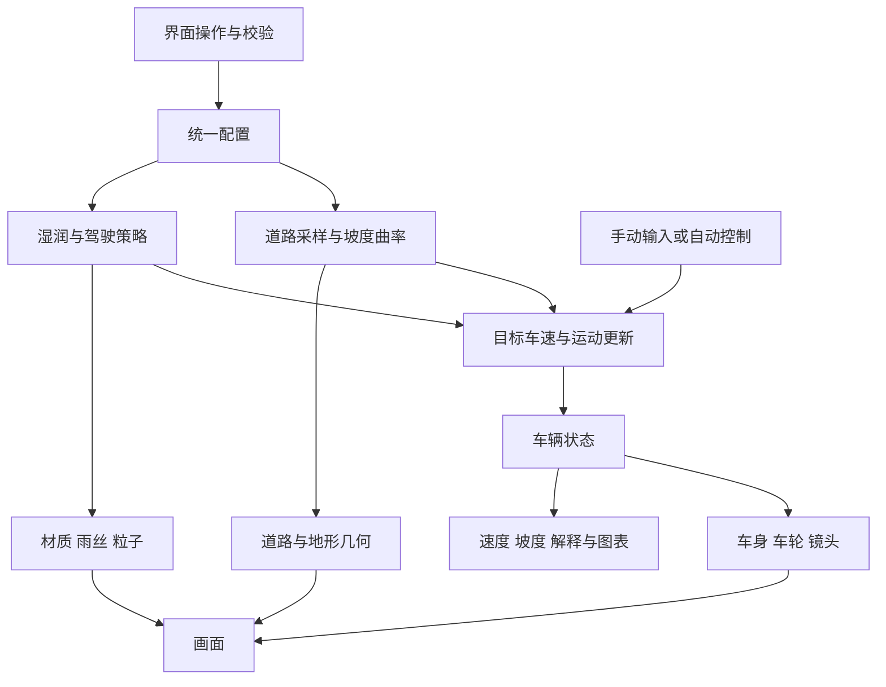

# 实现逻辑与后续次序

分别说明原作已确认的执行链、008 的实际计算及实现次序。首轮建议保留于下文；末尾追加 010 网页的实际实现。**010 是独立简化模型，不是原作源码还原。**

> 最终决定：研究阶段已总结，以下实现链与早期次序供具体项目按需参考，不作为继续扩建演示的任务清单。核心仍是场景构建与赛车手能力构建。

## 原作已确认的执行链

1. 页面动态加载独立引擎块并创建 MotoEngine；可确认界面与引擎入口分离，不能据此还原完整源工程。
2. 加载车辆、松树、设施 GLB 和地形/土路贴图；初始化 Rapier 世界，设置 1/120 秒物理步长。
3. 赛道记录编辑操作，改变路面或几何。rebuildWorld 清理旧环境及道路/地面碰撞体，以新几何重建显示对象和三角网格碰撞体。
4. surface → grip → gripAt 提供局部抓地，包括路面差异及磨损修正；前方曲率、抓地和邻车状态参与驾驶决策。
5. 世界步进后更新排名；累计路程用于计圈和圈时；第 8 圈记录完赛，所有车手完成后暂停比赛。
6. 公园编辑和车手档案分别保存；引擎另有音频、镜头和视觉反馈，全部状态映射仍需进一步研究。

依据为固定指纹的[线上引擎脚本](https://mini-moto-park.chipchaunceytheonlyone.chatgpt.site/_next/static/chunks/engine-Ci7MRUyi.js)。本轮未对所有编辑、悬挂或完赛逻辑做浏览器验收。120 Hz 物理设置不等于稳定 120 FPS。

## 008 的实际数据流

以下图示只描述 008：

### 道路：用路程统一几何与车辆

createTrack（工作区参考：../008-terrain-motion-lab/app/model.mjs，未随本次提交收录） 采样 480 段闭合路线，建立平面累计路程表。车辆保存沿路距离 s，用二分查找和插值取位置，通过前后采样求切线、坡度与曲率。路内横移沿路线法向施加。

抬坡是围绕归一化路程 0.17 的平滑局部隆起；道路、车辆和附近地面使用同一高程数据。抬高 3 米后，车辆会按新高度行驶。这里的 s 是平面路程参数，不能将其解释为严格三维弧长动力学。

参考意义：先统一道路坐标与高程来源，再做编辑器，避免可见道路与运动轨迹分离。

### 运动：前方道路限制目标速度

limits（工作区参考：../008-terrain-motion-lab/app/model.mjs，未随本次提交收录） 每 2 米采样前方 0～22 米曲率，从巡游上限、弯道上限和坡道上限取最小值。

弯道上限近似为 `sqrt(μ × 9.81 × 策略系数 / 曲率)`；坡道上限随正坡度降低，并受动力策略影响。湿润从 0 到 1 时，示例抓地系数从 0.82 降到 0.32。这些是 008 教学参数，不是原作参数或实测轮胎数据。

stepVehicle 把速度误差转换为油门/制动，合并驱动力、制动力、阻力与坡度项，再积分速度和路程。跟车约束进一步降低目标速度；人工模式替换油门、制动和横移输入，保留道路辅助。

### 天气：视觉和行为读取同一个参数

wet 同时传给模型抓地和applyMaterial（工作区参考：../008-terrain-motion-lab/app/scene.mjs，未随本次提交收录）：路面变暗、粗糙度变化、灯光减弱、雨丝增加；车后粒子从尘土色切换到水花提示。

改变一个值会同时得到行为差异和视觉解释。材质高光本身不产生制动力，也不是场景镜面反射；制动来自模型中的独立计算。

### 更新：模拟、渲染和界面分开

frame（工作区参考：../008-terrain-motion-lab/app/app.mjs，未随本次提交收录） 用累积时间按 1/60 秒更新车辆，画面按浏览器动画帧渲染，界面约每 0.15 秒刷新。单帧时间截断为 0.08 秒，后台不持续执行相同模拟；长时间挂起后不会完整补算现实时间。

车身俯仰和侧倾用弹簧阻尼追随坡度、加速度及曲率，属于简化姿态表现。跟随镜头指数平滑地追踪车辆和前方路线；暂停运动时仍能调整观察角度。

### 存档：保存可重建的配置

encodeSnapshot / decodeSnapshot（工作区参考：../008-terrain-motion-lab/app/model.mjs，未随本次提交收录） 保存版本号、抬坡、湿润、速度上限和策略，校验后才恢复。保存的是实验方案，不是完整动态比赛进度。

后续复杂编辑器宜保存赛道定义、操作记录及版本，从同一数据重建几何和运动约束；比赛即时状态另存。

## 后续实现次序

以下为首轮建议范围。当前已落地的子集见末尾“010 网页实际实现”，不将全部阶段标为完成。

| 阶段 | 具体交付 | 验收条件 |
| :--- | :--- | :--- |
| 1 · 最小闭环 | 闭合土路、两辆车、全景/跟随、局部抬坡 | 相同起点抬坡前后运动确实变化；接地一致；撤销恢复原值 |
| 2 · 最小比赛 | 起跑、圈数、排名、结算、重赛、少量能力参数、接管/交回 | 完成整场；重赛清空旧成绩；倒退过线、重生或编辑不误增圈数 |
| 3 · 车辆接触 | 明确许可的物理库、轮胎接触、悬挂、平衡辅助、单个跳台 | 跨坡、起跳、落地稳定；碰撞和几何同步；编辑不将车辆留在地下 |
| 4 · 视听反馈 | 独立或明确许可的资产；速度/负载声音、粒子、镜头阻尼 | 用户操作后启动声音；暂停/静音正常；不同设备实测帧时间与加载量 |
| 5 · 方案存档 | 版本化赛道、车手、比赛存档与撤销/重做 | 载入恢复同一布局；坏数据不覆盖当前状态；迁移规则清楚 |

景区巡游可以继续使用 008 的简化模型，重点做道路、镜头和方案表达；接近原作的摩托比赛则需要补上刚体接触、悬挂和比赛模块，两者开发量及验收标准不同。

首轮未对原作做同初始条件的圈时、抓地、悬挂或性能对照；后续网页轮次的本地验证见[笔记](notes.md)。

## 010 网页实际实现

新增 app/ 中的独立应用，四名车手完成三圈比赛；研究内容直接在场景下方阅读。没有复用 008 的模型或场景文件，通用库与 CC0 纹理有明确来源。

1. **道路与几何**：23 个控制点形成闭合样条，920 段采样建立平面路程表。道路、轮胎护栏、试验旗帜和车辆位置共享路程坐标；高程在约 23.5% 路程的试验段平滑抬升。周边地形与道路高度衔接。三维几何包括两轮摩托、骑手、松林、岩石、维修棚、起跑门与池塘。
2. **驾驶决策**：前视 16 米求弯道曲率，前视 10 米求最大正坡度；巡航、弯道和坡道上限取最小值。坡道上限为巡航上限 / (1 + 5 × 前方正坡度)，系数为明确标注的演示设定，另外以重力坡度项作用于实际加速度。
3. **路面与湿润**：试验段土路、泥地、碎石分别设置基础抓地；全场湿润乘以统一衰减。相同湿润控制材质粗糙度、颜色、光照、雨丝和粒子。路面类型修改限定于试验段。
4. **比赛**：固定 1/60 秒步长，3 秒倒计时后运行；累计路程跨过一圈长度时插值记录过线时刻；按进度或完成时间排序，全员三圈后结算。参数变化重新起跑，避免混用条件。手动输入只替换黄色车手，仍限制在路内；没有动态车辆避让或碰撞。
5. **单圈对照**：相同黄色车手与起点，固定步长跑完默认及当前条件的一圈；不含倒计时。没有用预写数字替代计算。模型算例：默认 60.33 秒、抬坡 3 米 61.55 秒、85% 湿润加泥地 77.60 秒。
6. **镜头与音频**：全景使用 OrbitControls，跟随/骑手根据选中车手和前方路线阻尼追踪，试验坡是固定近看机位。Web Audio 振荡器经滤波和增益形成引擎声，由用户点击开启，频率与音量响应车速和油门；暂停和失焦时静音处理。
7. **结构演示**：完整材质、白模和网格共用同一套几何；下面用实际纹理解释颜色、法线和粗糙度。白模不改变比赛计算。

仍未实现：自由赛道绘制、刚体摩托碰撞、完整悬挂、跳跃、复杂超车、七项能力点数、车手存档和撤销/重做。模型与资源检查不替代浏览器交互、声音及真机触控验收。

## 发卡弯驾驶练习的进一步尝试

ride.html 单独验证“主体驾驶与路线选择”，保留原来的沿路比赛。赛道由入弯直线、半径 16 米的半圆发卡弯和出弯直线组成，土路半宽 6 米，内侧部分为低抓地泥地，路外先是草地缓冲，再是连续护栏。

车辆保存 x/z、车头方向、速度方向、速度、转向响应与倾角。转向随速度改变车头角速度，速度方向转动受抓地和制动共同限制；二者偏差表达侧滑。油门、阻力和制动力共同决定速度。车轮位置没有被投影回赛道，最近赛道采样仅用于识别路面、边界和进度。越过外围护栏时解决穿入并削减速度、追加罚时。

六道检查点按顺序检测正向跨线，最后一道才完成计时，避免抄近道直接进终点。返回检查点不增加通过数量，并追加 3 秒；全程无跳跃或完整刚体模拟。内外线示范通过前视目标计算转向、油门与刹车，仍送入同一个 stepRide；本地模型两种示范均无碰撞完赛。
