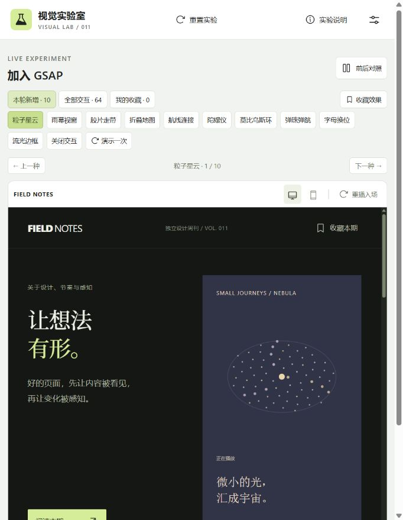
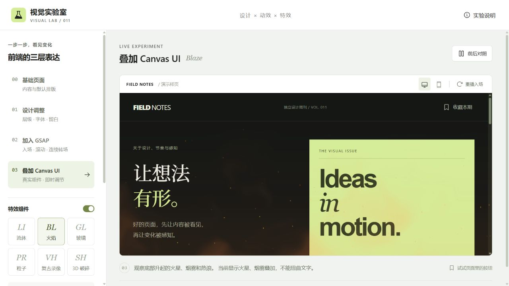
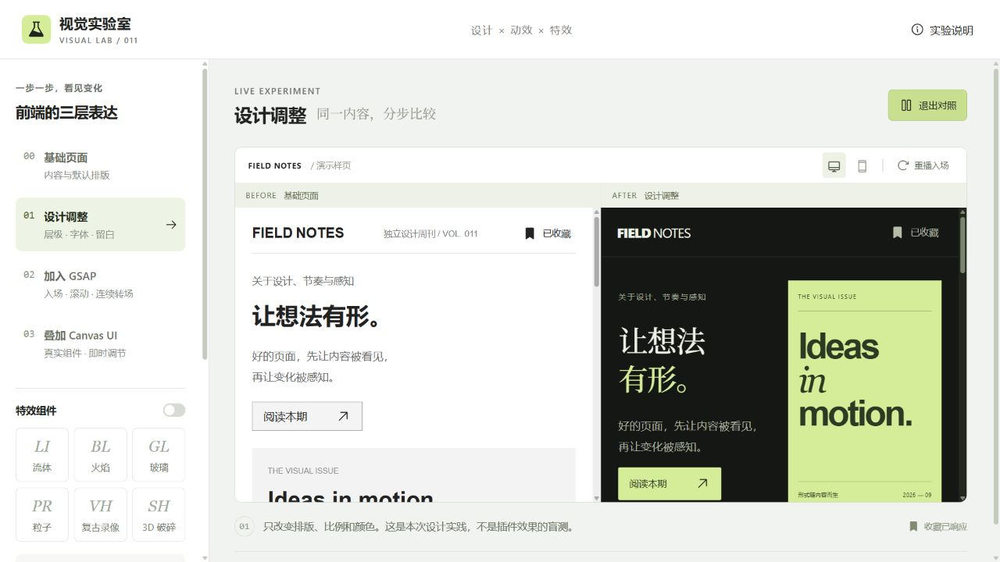
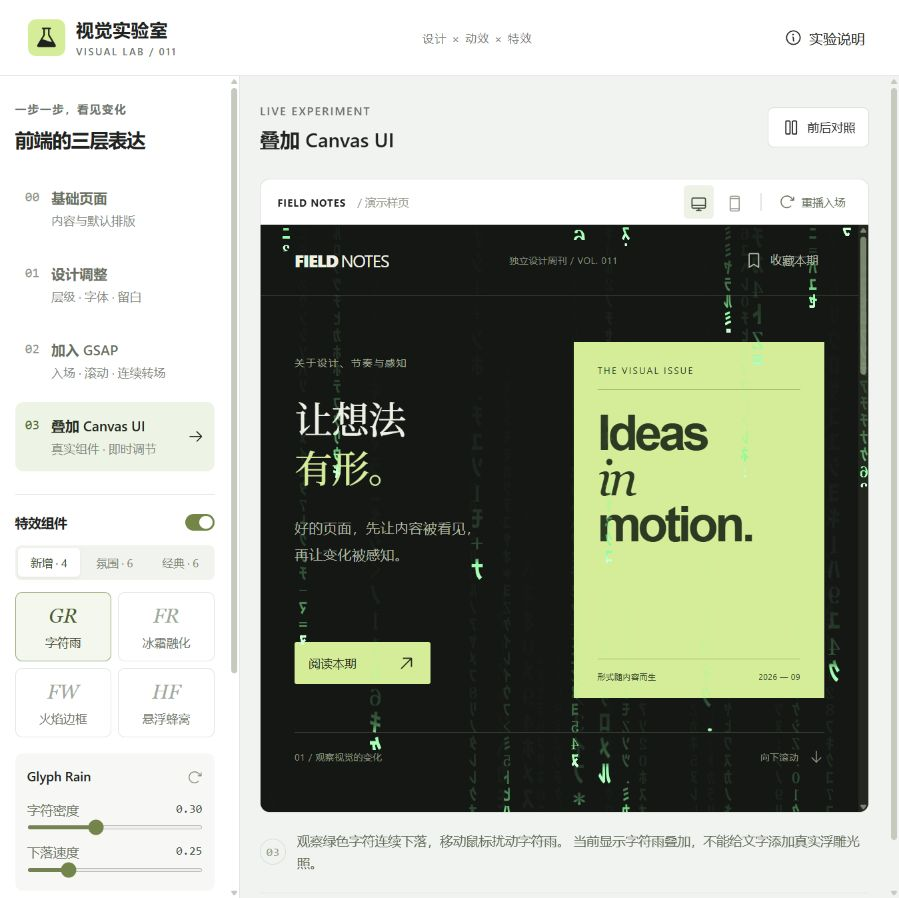
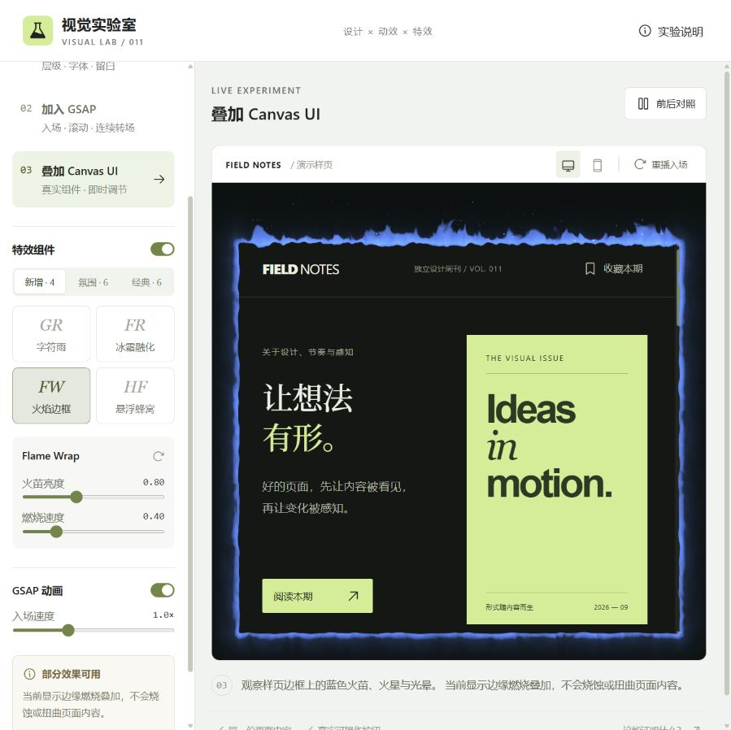
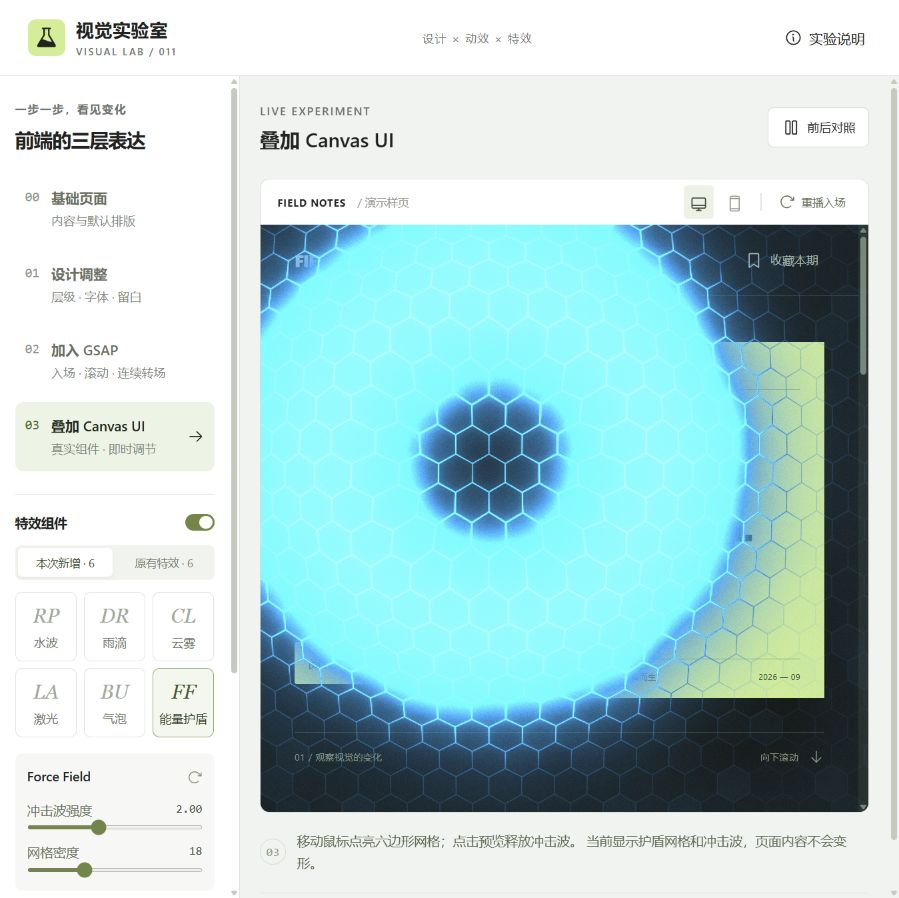
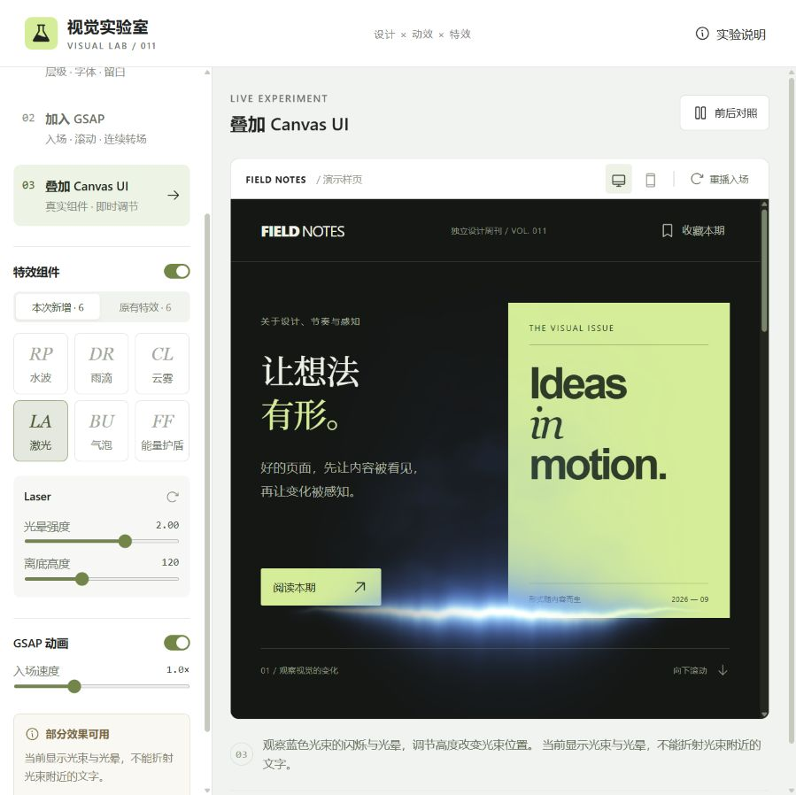

# 011 · 前端视觉实验室

围绕实际产品网页，归纳四种优化方式：**内容与结构、视觉设计、动效编排、场景特效**。Product Design帮助设计探索，GSAP编排变化，Canvas UI提供局部实时效果；工具提供能力，产品需求决定怎样使用。完整保留64项自编交互、16个原版组件与V4.3作品场景。

[理解摘要](understanding.md) · [发布范围与结果](publishing.md) · [返回总索引](../../README.md#项目索引) · [运行与操作](app/README.md) · [研究与验证](notes.md) · [视觉检查](design-qa.md)

| 项目 | 内容 |
| :--- | :--- |
| 固定编号 | 011 |
| 原始来源 | 用户提供的工具推荐文案；原帖 URL 待核实 |
| 研究对象 | OpenAI Product Design、GSAP、David Haz / Canvas UI |
| 研究日期 | 2026-09-14 |
| 最近更新 | 2026-09-15 |
| 研究版本 | Product Design 本地插件 0.1.55；GSAP npm 3.15.0；Canvas UI commit `44de3787b77d78477a7c03a4c81a7d5ea317cdbc` |
| 上游许可 | Product Design：Proprietary；GSAP：Standard no charge license；Canvas UI：MIT + Commons Clause，非纯 MIT |
| 技术栈 | React 19.2、Vite 6.4.2、GSAP 3.15.0、Canvas UI React / WebGL 组件 |
| 进度 | 已完成本地效果实验，完整 HTML 变形受浏览器支持限制 |
| 在线演示 | [摘要与看图体验](https://yydshly.github.io/0913_codex_project/011-frontend-visual-lab/research.html) · [完整实验室](https://yydshly.github.io/0913_codex_project/011-frontend-visual-lab/) · [实际作品页](https://yydshly.github.io/0913_codex_project/011-frontend-visual-lab/?view=portfolio) |

## 六十四种 GSAP 交互

当前默认打开“加入 GSAP”阶段。预览上方默认显示本轮新增的 10 项，可切换“全部交互 · 64”或“我的收藏”，并提供上一种、下一种和“演示一次”；原有 **16 种 Canvas UI + 64 种 GSAP 交互**分别保留，不混算组件数量。

| 交互 | 体验方式 | 实现 |
| :--- | :--- | :--- |
| 粒子星云 | 点击 / 键盘重播聚拢、旋转与舒展 | 72 个 SVG 光点与分组旋转 |
| 雨幕视窗 | 点击 / 键盘重播雨线 | 20 条线段错峰下落并裁切在窗口内 |
| 胶片走带 | 点击 / 键盘切换三帧 | 纵向图形轨道与循环归位 |
| 折叠地图 | 点击 / 键盘展开与折叠 | 三段 DOM 地图绕 Y 轴旋转 |
| 航线连接 | 点击 / 键盘重播连线 | 三条路径描边与终点错峰点亮 |
| 陀螺仪 | 点击 / 键盘重播立体旋转 | 三层 DOM 圆环绕不同轴转动 |
| 莫比乌斯环 | 点击 / 键盘重播曲面旋转 | 48 片 SVG 曲面，按深度排序 |
| 弹珠弹跳 | 点击 / 键盘重播 | 三阶预设落点与反弹时间线 |
| 字母换位 | 点击 / 键盘交换 O、R | 字母分路绕行，FORM / FROM 切换 |
| 流光边框 | 点击 / 键盘重播两圈边框光 | GSAP 驱动 conic-gradient 角度 |
| 极光丝带 | 点击 / 键盘重播有限光带运动 | 六条 SVG 渐变路径插值 |
| 蜂巢拼合 | 点击 / 键盘拼合或散开 | 十九片六边形错峰位移与缩放 |
| 火花迸发 | 点击 / 键盘重播 | 二十八个 SVG 光点径向运动与淡出 |
| 液滴融合 | 点击 / 键盘融合与分离 | SVG 模糊与透明度阈值滤镜 |
| 齿轮咬合 | 点击 / 键盘重播四秒旋转 | 两组齿轮图形反向旋转，非机械仿真 |
| 折纸飞行 | 点击 / 键盘重播路径飞行 | MotionPathPlugin 位移与自动转向 |
| 镜头光圈 | 点击 / 键盘开合遮光叶片 | 八片图形旋转与位移，非光学仿真 |
| 弧形菜单 | 加号开合，选择三个真实按钮 | DOM 弧形排列与选择状态 |
| 花瓣绽放 | 点击 / 键盘展开与收拢 | 十二片 SVG 花瓣错峰缩放 |
| 牛顿摆 | 点击 / 键盘重播并等待停止 | 两端摆球预设交替摆动，非物理仿真 |
| 沙漏计时 | 点击 / 键盘重播四秒流沙 | 两个沙堆缩放与流沙虚线偏移 |
| 弹簧振子 | 点击 / 键盘拉伸与回弹 | 弹簧缩放、配重位移与弹性缓动 |
| 波浪旗帜 | 点击 / 键盘播放有限波浪 | 24 条色带错峰起伏 |
| 日食对齐 | 点击 / 键盘移动月影 | 圆形位移与光环透明度，非天文计算 |
| 景深对焦 | 点击 / 键盘循环三个焦点 | 图层模糊、缩放与透明度 |
| 滚动诗句 | 点击 / 键盘切换三行短句 | 遮罩窗口内的纵向文字轨道 |
| 立体书本 | 点击 / 键盘开合书封 | CSS 3D 与 GSAP rotationY |
| 等距阶梯 | 点击 / 键盘抬升或放平 | 七级等距 SVG 台阶错峰位移 |
| 扫描成像 | 点击 / 键盘重播揭示过程 | 裁切区域与扫描线同步移动 |
| 罗盘转向 | 点击 / 键盘循环四个方向 | SVG 指针旋转与回弹，不读取传感器 |
| 翻页日历 | 点击 / Enter / 空格循环 14、15、16 日 | GSAP 驱动纸页沿顶部翻转，日期仅为演示 |
| 雷达扫描 | 点击 / Enter / 空格扫描一周 | GSAP 旋转光束并按角度依次点亮四个标记 |
| 拉链开幕 | 点击 / Enter / 空格打开或合上帷幕 | GSAP 错峰向两侧移动十二排遮挡色带 |
| 点阵标牌 | 点击 / Enter / 空格循环 HI、GO、OK | GSAP 错峰改变 77 个点的颜色、透明度与缩放 |
| 纸带扭转 | 点击 / Enter / 空格扭转或摊平纸带 | GSAP 驱动 18 段 DOM 色带的 3D 旋转与位移 |
| 彗星巡航 | 点击 / Enter / 空格重播光点与拖尾 | GSAP MotionPathPlugin 驱动 14 个 SVG 光点，结束后淡出 |
| 线稿描绘 | 点击 / Enter / 空格重绘六组线条 | GSAP 驱动 SVG 描边偏移与底色 |
| 透视长廊 | 点击向纵深推进，结束后回起点 | GSAP z 位移与 CSS perspective |
| 万花镜 | 点击 / Enter / 空格切换三种对称图案 | GSAP 多层旋转、缩放与填色 |
| 形状变奏 | 点击 / Enter / 空格循环圆形、星芒与方形 | GSAP 插值 SVG 多边形顶点和颜色 |
| 轨道星系 | 点击播放三条轨道的六秒巡游 | GSAP 多层 SVG 旋转时间线 |
| 手风琴画廊 | 点击 / 键盘展开风景、建筑或色彩内容 | GSAP flex-grow 展开与文字入场 |
| 昼夜切换 | 点击 / Enter / 空格切换白昼与星夜 | GSAP 联动天空、山丘、日月与星光 |
| 立体方块 | 点击 / Enter / 空格循环四个章节 | GSAP rotationY + CSS 3D 六面方块 |
| 声波律动 | 点击播放有限时长的音柱动画 | GSAP 预设节奏，仅视觉，无音频采集或播放 |
| 弹性网格 | 移动鼠标推开色块，离开弹回；点击自动演示 | GSAP quickTo 与弹性缓动 |
| 折扇展开 | 点击 / Enter / 空格开合七张色卡 | GSAP 错峰旋转 |
| 像素拼图 | 点击散开 36 块图形，再次点击重组 | GSAP 图块位移、旋转、缩放 |
| 擦除对比 | 拖动滑杆，方向键微调，Home / End 查看两端 | GSAP 裁切变量与原生 range 控件 |
| 同心波纹 | 点击位置释放五圈波纹，Enter / 空格从中心触发 | GSAP 错峰缩放与透明度时间线 |
| 环形文字 | 点击 / Enter / 空格，内外文字反向旋转 | GSAP 驱动 SVG textPath 与花形旋转 |
| 聚光探索 | 鼠标 / 方向键移动光束，点击自动巡游 | GSAP CSS 变量与圆形裁切 |
| 立体折页 | 点击 / Enter / 空格开合纸页 | GSAP 驱动两扇 DOM 纸页的 3D 旋转 |
| 数字翻牌 | 点击 / Enter / 空格循环 011、128、360 | GSAP 错峰翻转数字卡片 |
| 百叶切换 | 点击 / Enter / 空格切换两种封面 | GSAP 错峰色带遮罩时间线 |
| 路径巡游 | 点击封面或演示一次，箭头绕行一周 | GSAP MotionPathPlugin，沿路径自动转向 |
| 层叠轮播 | 点击 / Enter / 空格循环三张卡片 | GSAP 出场、换层、入场时间线 |
| 拖拽回弹 | 按住封面拖动，松开后弹回；方向键可推动 | GSAP Draggable + 弹性回位 |
| 弹性按压 | 按住压扁，松开回弹；可演示一次 | GSAP 缩放与弹性缓动 |
| 圆形揭幕 | 点击展开橙色画面，再次点击收回 | GSAP 驱动 CSS 圆形裁切 |
| 磁吸按钮 | 移入“阅读本期”，文字与箭头跟随；点击仍可阅读 | GSAP quickTo，按钮点击区域保持固定 |
| 卡片倾斜 | 在绿色封面上移动鼠标；点击/Enter 可演示 | GSAP 旋转真实 HTML 卡片 |
| 文字解码 | 移入或点击封面，随机字符恢复成英文原文 | GSAP ScrambleTextPlugin |
| 点击翻牌 | 点击/Enter/空格切换正反面 | GSAP rotationY + CSS 3D 双面卡片 |

这六十四项无需 WebGL 或 html-in-canvas。选择交互会进入 GSAP 阶段；随后可再选择 Canvas UI 叠加观察。总动画开关、关闭交互、系统减少动态效果均可停止对应交互。触屏设备可用点击或“演示一次”，磁吸的鼠标跟随需要指针设备。

[ScrambleText 官方文档](https://gsap.com/docs/v3/Plugins/ScrambleTextPlugin/) · [quickTo 官方文档](https://gsap.com/docs/v3/GSAP/gsap.quickTo()/)。本项目自行编写交互逻辑，使用已安装的 GSAP 3.15.0，不属于 Canvas UI 原版组件。新增拖拽使用 [Draggable 官方插件](https://gsap.com/docs/v3/Plugins/Draggable/)，版本随现有 GSAP 固定。

## 直接看效果

*2026-09-14 本地浏览器实际截图。当前浏览器只能展示部分 Canvas UI 叠加效果；不是官网截图，也不是 ImageGen 生成图。*

1. **基础页面**：普通字号与常规排列，保留全部内容和按钮。
2. **设计调整**：同样内容改为双栏、中文衬线标题和文字封面；点击“前后对照”并排比较。
3. **加入 GSAP**：观察错峰入场，点击“阅读本期”，再在预览内滚动。固定区段依次展示三个段落，顶部显示滚动进度。
4. **叠加 Canvas UI**：从“新增 / 氛围 / 经典”三组选取 16 种组件；本次增加字符雨、冰霜融化、火焰边框和悬浮蜂窝；调整对应参数，独立开关特效和动画。点击收藏验证交互反馈。

这是一组人为设计的示例，不是对模型或插件做的随机、盲测或质量评分。基础版没有伪造错误、删减内容或禁用按钮。

## 十六种特效的真实边界

| 组件 | 有完整 html-in-canvas 能力 | 本次本地浏览器 |
| :--- | :--- | :--- |
| Liquid | 流体扭曲真实页面内容 | 彩色流体叠加，文字不变形 |
| Blaze | 火星、烟雾与热浪扭曲 | 火星、烟雾叠加，文字不变形 |
| Glass | 镜片折射页面 | 镜片高光，页面不折射 |
| Particle Reveal | 页面颗粒化并在鼠标附近还原 | 不启动该特效，保留普通页面 |
| VHS | 录像色散、波动与噪点 | 扫描线、噪点叠加，不能完整变形 |
| Shatter | 页面碎片抬升、翻转和折射 | 不启动该特效，保留普通页面 |
| Ripple（新增） | 水波折射页面内容 | 点击水波与自动涟漪高光 |
| Droplets（新增） | 雨水折射与模糊页面 | 滑落雨滴叠加 |
| Clouds（新增） | 云层、折射与雾化 | 漂移云雾叠加 |
| Laser（新增） | 光束、热扰动与折射 | 蓝色光束与光晕，可调整高度 |
| Bubble（新增） | 气泡折射与色散 | 跟随鼠标的气泡高光与彩边 |
| Force Field（新增） | 护盾与冲击波影响页面 | 六边形网格、悬停亮光和点击冲击波 |
| Glyph Rain | 字符雨与页面浮雕光照 | 绿色字符下落与鼠标扰动 |
| Frost | 冰霜折射、模糊与融化 | 霜层覆盖、鼠标融化与重新结霜 |
| Flame Wrap | 边缘火焰、烧蚀与热扭曲 | 蓝色火苗、火星和边缘光晕 |
| Hex Float | 页面映射在悬浮六边形上 | 蜂窝起伏高光与边缘，页面内容不分块 |

完整能力列基于上游文档与源码，**不表示十六种完整效果均已在本地验证**。官网使用绑定其域名的 Origin Trial，本地页面不能继承。展示页检测 WebGL2 与 html-in-canvas，并提供当前所选组件的[官方完整体验入口](https://canvasui.dev/playground)。未修改浏览器 flags，也未借用官网 token。

## 新增效果实拍

进入 Canvas UI 后选择字符雨，“新增 · 4”可切换本轮四种效果。冰霜可通过鼠标融开；火焰边框周围预留了空间；蜂窝尺寸和起伏可调。上一轮六种效果位于“氛围 · 6”，最初六种位于“经典 · 6”。

上一轮增加的能量护盾：移动鼠标点亮网格，点击页面触发蓝色冲击波。切到水波会自动出现涟漪；气泡需要移动鼠标。每种提供两个参数与重置按钮。

这组截图展示本地降级模式。雨滴和水波在缺少页面折射时会显得更像叠加图层，不能据此宣称已还原官网完整质感。

## 可以得出的结论

- GSAP 的入场和滚动编排可以实际接入项目，控制节奏，但节奏好坏仍由实现决定。
- Canvas UI 的组件能力真实存在，可复制进应用再调参；浏览器支持决定完整效果是否出现。
- Product Design 是设计工作流插件，本项目参考其上下文整理、视觉参照和检查方法。它不是网页运行时依赖，无法像 GSAP 那样用一个开关启停。
- 这三项不是三款同类插件，也不是 Astra 专属组合；本实验不证明“必装”“消除 AI 味”或特定模型的质量优势。

## 实现与来源

应用源码在 `app/`，研究截图在 `assets/`；从仓库 `templates/project/` 建立研究结构，再使用 Product Design web prototype 模板建立应用。只提取十六个组件及相对依赖，共 33 个 TypeScript 文件 440498 字节；组件按选中项加载，没有复制完整上游仓库或嵌套 `.git`。

- [Product Design 官方介绍](https://openai.com/business/plugins/product-design/)：本地插件清单另确认版本、作者及许可；未复制插件源码。
- [GSAP ScrollTrigger 文档](https://gsap.com/docs/v3/Plugins/ScrollTrigger/) · [GSAP 许可](https://gsap.com/standard-license)：安装版本记录在 lockfile。
- [Canvas UI 仓库固定版本](https://github.com/DavidHDev/canvas-ui/tree/44de3787b77d78477a7c03a4c81a7d5ea317cdbc) · [安装与兼容性](https://canvasui.dev/docs/installation)。
- [Canvas UI 原许可](app/src/vendor/LICENSE-Canvas-UI.md) · [源码 URL 与 SHA-256](app/src/vendor/sources.json)。组件源码保持原样，适配逻辑写在应用层。

Phosphor 图标通过 npm 使用；中文衬线字体可从 Google Fonts 加载，网络不可用时回退本机宋体。页面没有图片下载依赖；封面为实际可读的排版文字。

本轮补充：左侧可按中英文名称或关键词搜索全部 80 项效果；顶部“重置实验”恢复初始阶段、效果参数、速度、样页临时收藏和预览方式，保留交互效果收藏。路径运动参考 [MotionPath 官方文档](https://gsap.com/docs/v3/Plugins/MotionPathPlugin/)，版本随 GSAP 3.15.0 固定。

新增浏览方式：可按“本轮新增 / 全部交互 / 我的收藏”筛选 GSAP 交互；上一种、下一种只在当前列表内循环。交互收藏保存在当前浏览器本地，刷新和重置实验均保留；通过“取消收藏当前效果”移除。样页中的“收藏本期”仍只是临时按钮演示，两者互不影响。

## 实际产品场景 · 项目手记

在实验室顶部点击“实际场景”，浏览由本仓库 6 个项目和真实截图组成的个人作品集。可切换精选、分类搜索、打开详情与收藏；动效开关用于对照。详见 [实际场景与能力对应](product-scenario.md)。此页使用 GSAP 和 CSS，清单只在本次页面保留，未部署。

## 作品页 V2 · 2026-09-15

直接优化现有个人作品页：标题遮罩、六片百叶揭幕、进入视野再显现、鼠标倾斜和阅读进度；增加重播首屏。已保存 V1 源码与前后截图，参数、观察步骤及验证见 [作品页优化记录](portfolio-iterations.md)。本轮构建通过，浏览器 error / warn 为空；手机无横向溢出。未新增依赖或部署。

## 作品页 V3 整体视觉优化 · 2026-09-15

重整为暖白与深绿的作品展览：宽幅首屏、缩略图精选导航、主次双栏作品、能力标签、创作方法和响应式图文详情。V2 源码已存档，前后图和实际验证见 [作品页迭代记录](portfolio-iterations.md)。最终构建、筛选收藏、无动效操作和宽窄布局检查通过；未部署。

## Product Design 视觉探索 · 2026-09-15

已生成三张独立设计概念，等待选择后落地。概念图、显示顺序、真实参考和 Canvas UI 接入核查见 [设计探索记录](product-design-options.md)。效果库已接入原版组件，作品页目前仍未接入；生成图不是运行截图。

## 作品页 V4 · 2026-09-15

已按用户选中的 Product Design 第二张深色方案完成页面，并实际接入 Canvas UI 原版 Clouds 云雾。开关、精选切换、收藏筛选、详情和手机布局已验证；构建通过，未部署。首屏封面标注为 AI 视觉演绎，缩略图与详情保留真实截图。见 [V4 迭代记录](portfolio-iterations.md) 与 [设计检查](design-qa.md)。

## V4.1 · 2026-09-15

听雨山居雪景已接入原版 Canvas UI Frost：鼠标经过融开、离开后重新凝结，独立冰霜开关与云雾互不影响。构建、开关、融化恢复、手机布局与离屏卸载验证通过；未部署。详情见 [作品页迭代记录](portfolio-iterations.md)。

## V4.2 · 详情图片连续转场 · 2026-09-15

已将作品卡片与详情图片连贯衔接，说明随后渐显；关闭返回来源，恢复阅读位置和焦点。保留 Product Design 深绿方案与原版 Clouds / Frost；本轮新增的是自编 GSAP 交互。构建、桌面展开返回、中途 Esc、手机尺寸与滚动、移除来源收藏、关闭动效均完成实际检查。未部署。截图、问题修复与验证边界见 [V4.2 记录](portfolio-v42-validation.md)。

## V4.3 · 场景手记 · 2026-09-15

听雨山居详情已增加晴空、檐下雨景和庭院雪景切换，章节说明与观察重点同步，雪景可融霜，主要入口进入既有实时山居。素材均为真实截图，明确不同机位与阶段；沿用选定深绿设计。桌面、手机、键盘、收藏返回、无动效模式及快速切换检查通过，构建成功，未部署。来源、前后截图和修复见 [V4.3 验证记录](portfolio-v43-validation.md)。

