# 作品页优化记录

## V2 · 把研究技巧应用到当前网页

日期：2026-09-15。目标页面为原有 `?view=portfolio`，本轮不是新增效果库或独立产品。用户希望直接观察同一张网页优化后的效果，并持续记录。

### 本轮改动

| 位置 | V1 | V2 | 如何观察 | 参数与边界 |
| --- | --- | --- | --- | --- |
| 首屏标题 | 整块淡入上移 | 两行文字从遮罩内揭示 | 点击“重播首屏” | 每行 0.95 秒，错开 0.17 秒；标题有完整辅助阅读名称 |
| 精选封面 | 图片淡入和轻缩放 | 六片百叶依次收起，真实截图显露 | 切换 01 / 02 / 03 | 每片 0.85 秒，错开 0.075 秒；没有替换项目截图内容 |
| 精选说明 | 整块上移 | 标题、简介和入口分批跟进 | 切换精选 | 每项 0.6 秒，错开 0.07 秒 |
| 作品列表 | 列表更新时全部播放，包括屏幕外元素 | 卡片进入视野后才显现 | 点击探索作品，再向下滚动 | 可见比例阈值 8%，上移 38px，0.7 秒；每次列表变化重新观察，键盘聚焦也触发显示 |
| 作品图片 | 悬停缩放 | 增加随鼠标位置变化的立体倾斜 | 在卡片图片内移动鼠标 | 水平最大 5°、垂直最大 4°，850px 透视，0.35 秒跟随；离开复位，不响应触屏拖动 |
| 页面顶部 | 无进度提示 | 细线跟随阅读位置延长 | 向下滚动 | 基于实际文档长度；内容高度变化时重新计算 |

继续保留顶部动效开关，关闭后所有卡片静态可见、倾斜及揭幕样式复位，重播按钮禁用。系统减少动态效果偏好沿用既有监听；本轮没有切换系统设置实测。

本轮直接使用既有 GSAP 3.15.0 和 CSS，应用的是遮罩揭示、百叶、滚动触发和倾斜技巧，没有把 64 个样本组件直接堆进作品页，也没有调用 Canvas UI。既有组件许可与上游信息见原项目研究档案；本地改动未提交，无新增上游 commit/tag。

### 前后画面

| V1 · 本轮开始前 | V2 · 揭幕过程中的一帧 |
| --- | --- |
|  | 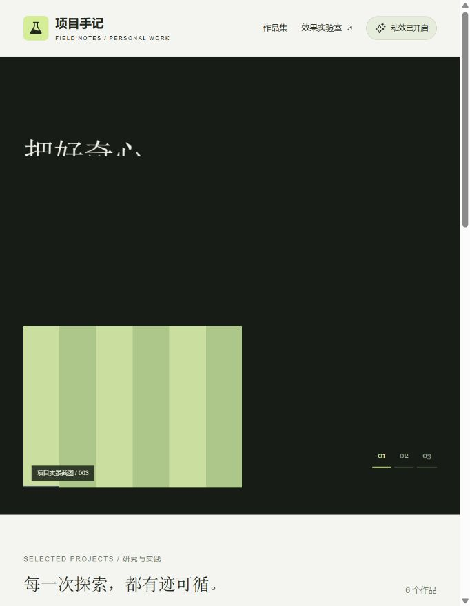 |

静态截图只证明某个时刻的画面，不能代替实际动画过程。进入网页点击“重播首屏”，可以重复观察完整变化。

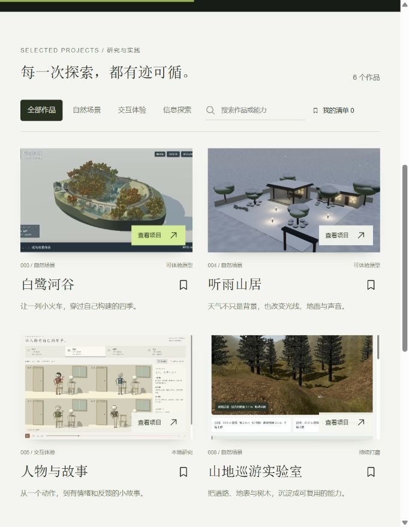

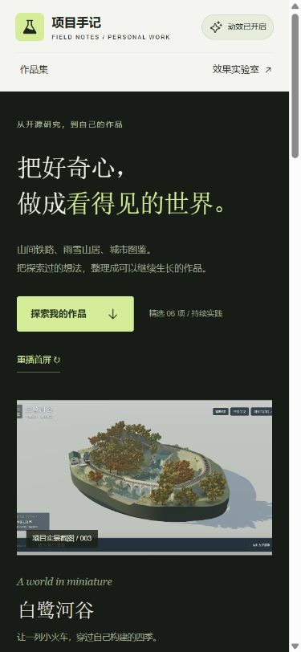

### 验证记录

- 首屏结束后两行标题变换归零；六片百叶均为 `scaleY(0)`，不遮挡内容。修正了标题子元素样式继承导致整段变绿的问题。
- 浏览到作品区时，前四张卡片 opacity 为 1，屏幕下方两张为 0；阅读进度约 48%。这是本次观察的特定位置，不是固定进度。
- 鼠标产生了卡片旋转变换；后续将连续指针动画改为每张卡片复用两条 `quickTo`，避免每次移动新建一条动画。离开、关闭动效或列表变化会清理旧动画和监听器。
- 快速切换听雨山居、人物与故事、白鹭河谷后，最终文字与图片对应，百叶正常收起。
- 自然场景筛选显示 3 项；无匹配查询为空结果，恢复后显示 6 项；Enter 可打开详情，Esc 可关闭并恢复触发按钮焦点。
- 关闭动效后，六张卡片 computed opacity 均为 1、transform 均为 none；顶部进度复位为 0。
- 390px 视口设置下，文档 clientWidth / scrollWidth 为 375 / 375px，标题保持两行。测试后已取消视口覆盖。
- 最终浏览器 error / warn 返回空列表；最终构建成功。作品模块 22.57 kB（gzip 8.93 kB），作品样式 11.04 kB（gzip 3.14 kB）。没有新增依赖或部署。

### 存档与后续记录方式

V1 的三个作品页源文件已保存到 [archive/portfolio-v1](archive/portfolio-v1/README.md)。完整页面图片资源与依赖仍由当前 app 提供。当前 V2 动画实现独立在 `app/src/portfolio-motion.js`，原功能保留在 `portfolio.jsx`。

后续每轮沿用“位置 → 原有表现 → 应用技巧 → 参数 → 实际截图 → 验证与限制”的记录结构。当前验证只能说明表现和交互能运行，没有证明转化率、阅读效率或主观审美必然提升；由实际观察决定保留、减弱或替换。

## V3 · 整体作品展览设计 · 2026-09-15

用户要求直接按设计判断优化整页。本轮在现有产品与真实内容上重新安排静态构图，并保留 V2 的有效动效。没有声称这是客观最优或已证明业务指标提升。

| 方面 | V2 | V3 |
| --- | --- | --- |
| 首屏 | 深色背景上的标题与小图 | 暖白底、大衬线标题与完整宽幅场景展台 |
| 视觉层级 | 多处同等分量 | 主标题、场景、项目名、能力标签分出层次 |
| 精选导航 | 01 / 02 / 03 数字入口 | 真实缩略图、项目名和选中状态，宽窄布局自动调整 |
| 图像 | 固定小封面 | 首屏放大裁切、作品区更大展示；详情保留完整原图 |
| 作品区 | 均匀卡片 | 宽屏采用 7/5 与 5/7 交替双栏；中屏均等双栏、手机单栏 |
| 信息表达 | 简介 | 简介加两条真实能力标签，增加创作方法区 |
| 详情 | 上图下文 | 宽屏图文并列，窄屏回到上下布局；背景柔化、边界说明独立呈现 |
| 动效 | 逐行揭示、百叶、倾斜 | 保留并调整为新版比例、颜色和图像缩放，关闭后静态设计仍成立 |

### 同宽前后对照

| V2 | V3 |
| --- | --- |
| 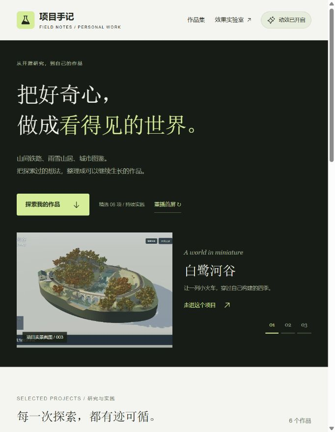 | 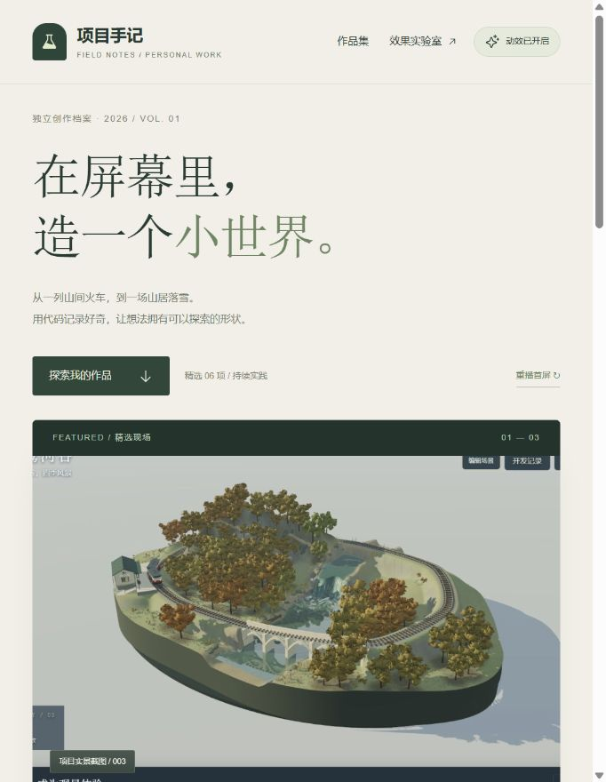 |

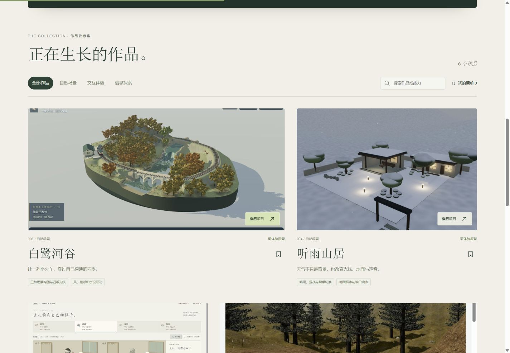

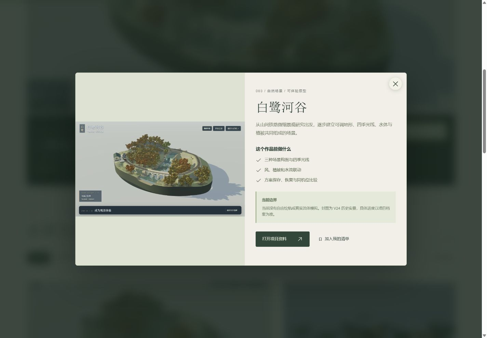

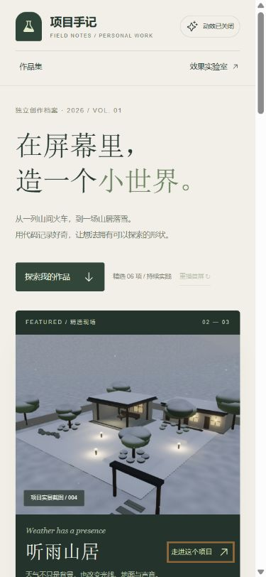

### 实际验证

- 最终构建通过：作品模块 23.62 kB（gzip 9.28 kB），作品样式 15.31 kB（gzip 4.14 kB）。没有新增依赖。
- 宽屏文档 clientWidth / scrollWidth 为 1425 / 1425px；手机为 375 / 375px。手机详情为 324 / 324px，没有横向溢出。
- 详情图片与正文在宽屏并列、手机上下排列；完整截图使用 contain 保留。首屏使用展示性裁切，主要是减少原截图边缘 UI 干扰，未修改源图片，个别截图仍含原应用控件。
- 收藏添加、单项清单（最大宽度 850px）、取消收藏后的空状态和恢复全部通过。信息探索分类为 1 项，无匹配查询为空，恢复后为 6 项。
- 关闭动效后，精选缩略图可切换到听雨山居，详情仍能打开；Esc 关闭后返回入口。图片加载检查未发现已完成加载的失败图片。
- 浏览器最终 error / warn 返回空列表。测试视口覆盖已调用 reset 撤销，网页保持打开。没有验证真实触屏手势、系统偏好切换或外部资料网站。
- V2 源码存档在 archive/portfolio-v2/；记录截图 88–94。所有画面来自本地浏览器，无 ImageGen 合成作品图。本轮未部署。

### 限制

图片仍是原项目已有截图，不是新拍摄素材或实时嵌入的 3D 场景，因此画面细腻程度受原始资产限制。当前使用 GSAP 和 CSS，包括 backdrop-filter 的背景柔化；没有实现真实折射、流体或新增 Canvas UI 原版效果。内容、来源与许可沿用 product-scenario.md，未增加新的上游版本或 commit/tag；本地改动未提交。

## V4 · Product Design 第二张方案落地与真实 Canvas UI · 2026-09-15

用户已明确选择第二张深色沉浸方案。视觉目标为 assets/97-product-design-immersive.png。当前作品页已改为 V4，V3 四份源码保存在 archive/portfolio-v3/，未新建路由或部署。

### 三层能力的实际分工

| 能力 | 实际变化 | 如何观察 |
| --- | --- | --- |
| Product Design | 根据选定效果图实现深绿背景、左侧大标题、右侧铁路场景、底部项目说明及横向缩略图导航 | 关闭所有动效，仍能看到静态构图变化 |
| GSAP | 标题逐行揭示、场景淡入、说明错峰跟进、滚动进入及卡片轻微倾斜 | 重播首屏、切换作品、滚动作品列表 |
| Canvas UI Clouds | 在首屏实际挂载固定上游原版组件，实时 WebGL 云雾与鼠标风场 | 点击“云雾已开启”关闭再打开，对照云层；不是背景图片里画好的雾 |

Clouds 参数：opacity 0.42、cover 0.08、density 1.9、speed 0.45、scale 1.25、quality 0.5、wind 0.65、windRadius 210、color [0.74,0.82,0.73]，refraction 与 fogBlur 均为 0。CSS mask 只用于让真实渲染的云层上缘渐隐，不用 CSS 绘制云雾资产。自然场景显示云雾，人物场景不叠加。没有接入 Frost 或 Droplets，避免把候选计划写成完成结果。

关闭云雾或全部动效、首屏离开视野时卸载组件，原版 destroy 清理渲染。后台状态也有卸载逻辑，但本轮没有切换真实后台状态实测。无 WebGL2 时保留静态画面；本轮没有在无 GPU 设备上测试。保留系统减少动态效果监听，未更改用户系统设置。

### 资产与真实性

- assets/99-product-immersive-cover.png 与 app/public/portfolio/immersive-cover.png 是同一张新生成封面，1804×872，1,779,887 bytes。参考选定方案和原始铁路截图；无文字、UI或预烘焙云雾。它是 AI 视觉演绎，页面明确标注，不当作真实运行截图。
- 三个缩略图、作品列表与项目详情仍使用既有真实截图。详情原图使用 contain，保留完整画面；铁路边界说明改为“详情图片为 V24 历史实景”。
- 图标沿用 Phosphor；中文展示字体沿用系统宋体系列，正文系统无衬线。没有新增字体或网络依赖。
- Clouds 未修改上游源码，固定 commit 44de3787b77d78477a7c03a4c81a7d5ea317cdbc、MIT + Commons Clause；来源 https://canvasui.dev/ 。GSAP 沿用 3.15.0。本地改动未提交，没有新的上游版本声明。

### 实际验证与限制

构建通过：作品 JS 25.84 kB（gzip 10.30）、CSS 25.44 kB（gzip 6.16）；Clouds 独立懒加载模块 15.11 kB（gzip 5.19）。没有新依赖，未执行部署检查或发布。

- 实际截图可见实时云层；开启时有 1 个输出 canvas 和 1 个隐藏源 canvas，关闭后数量为 0。支持当前浏览器的叠加表现，不声称 HTML 折射可用。
- 白鹭河谷、听雨山居切换时组件仍运行；切到人物与故事后 canvas 为 0，云雾按钮禁用。
- 关闭全部动效后 canvas 为 0，仍可浏览筛选和收藏。单项收藏为 1，移除后空清单，可恢复全部 6 项；自然分类为 3 项，未匹配关键词为 0。
- 原生详情打开，Esc 关闭并恢复到“走进这个项目”入口；手机详情图片仍指向 railway.jpg。
- 桌面文档 clientWidth / scrollWidth 为 1472 / 1472，手机为 375 / 375；手机详情为 324 / 324。手机返回桌面后的图片 transform 已恢复 none。
- 滚至作品区后首屏 data-active 为 false、canvas 数为 0。最终独立验证标签 error / warn 为空；用户原标签中曾留有编辑过程中缺文件引起的 Vite 热更新错误，刷新后正常，不能把旧日志说成未发生。
- 没有测试实体触屏、系统偏好实际切换、无 WebGL2 设备、长时功耗或外部资料链接。收藏仍仅保留在当前页面内存中。

### 图片记录

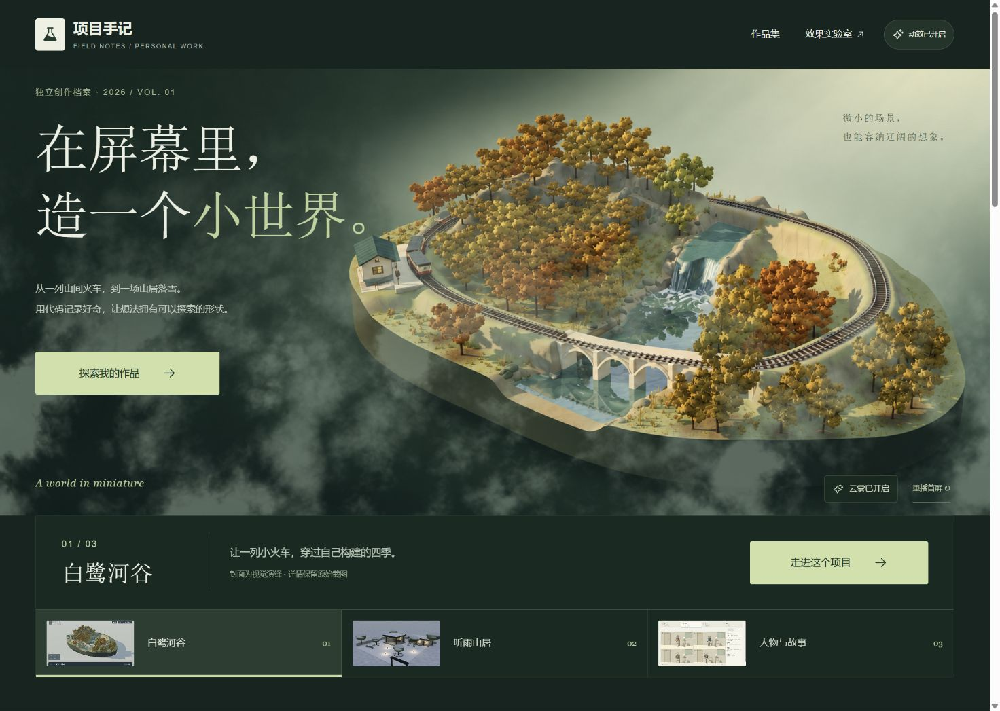

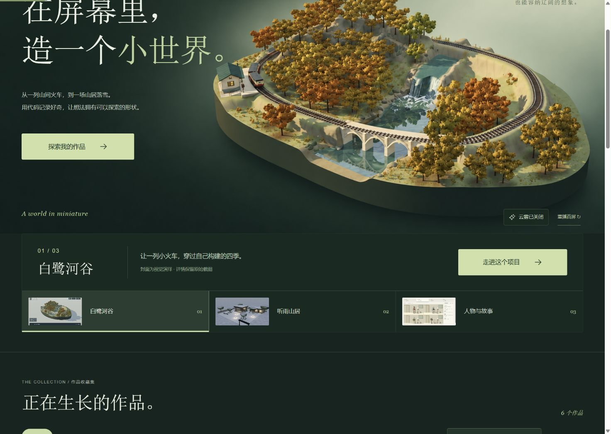

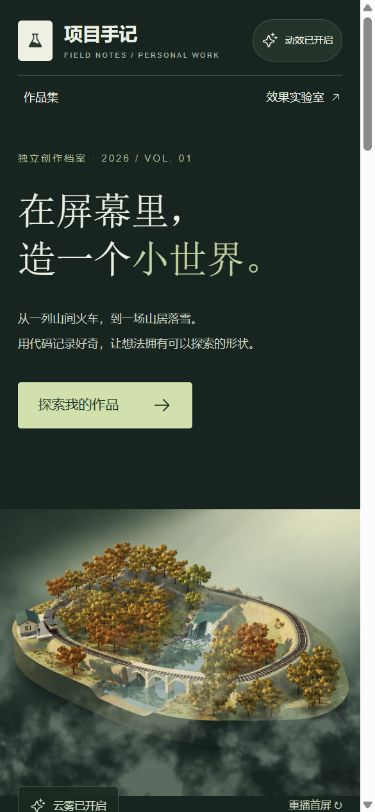

完整视觉问题、修复及对照见 design-qa.md。生成封面与真实截图的区别属于明确保留的产品说明；没有声称已证明审美或业务指标提升。

## V4.1 · 听雨山居真实冰霜交互 · 2026-09-15

用户确认将原版 Canvas UI Frost 用于听雨山居雪景。保留 V4 深色布局及真实 weather.jpg 截图；白鹭河谷继续 Clouds，听雨山居改用 Frost，人物作品不叠加。对应改动前源码保存在 archive/portfolio-v4/，没有新依赖、生成图或部署。

### 使用与实现

点击精选“听雨山居”，在雪景上移动鼠标或按下，可融开霜层；离开后重新凝结。“冰霜已开启”可单独关闭，露出完整原始截图。云雾与冰霜的开关状态分别保存于当前页面；关闭全部动效后都停止渲染。

使用原版 React Frost，未修改 vendor 源码。固定上游仍为 44de3787b77d78477a7c03a4c81a7d5ea317cdbc，来源 https://canvasui.dev/，许可证 MIT + Commons Clause；本轮未重新查询上游版本。参数：frost 0.08、strength 0.75、opacity 0.66、meltRadius 0.24、meltStrength 0.95、refreeze 1.2、introDuration 1.5、shimmer 0.08、quality 0.5、tintStrength 0.35，refraction/haze 为 0。凝结速度受原版逐帧计算与设备帧率影响，不承诺固定秒数。

冰霜绘制在与照片同尺寸的覆盖层，桌面约 566×590，手机约 267×278；根据图片 861:898 比例和容器尺寸自动适配。标题、主要按钮、详情均在该覆盖层之外。冰霜是可融化的视觉叠加，不表示原项目增加了真实温度、结冰物理或 HTML 折射。

### 实际验证

- 开启时一个输出 canvas 与一个隐藏源 canvas；关闭冰霜后为 0。
- 鼠标拖过雪景后可见原霜层中的清晰区域，移开后纹路恢复；连续截图 115、116、117 记录相同滚动位置的凝霜、融化与恢复。
- 关闭冰霜后切白鹭河谷，云雾仍开启；切回听雨山居，冰霜仍关闭。两个开关独立。
- 关闭全局动效后画布为 0，仍可打开听雨山居详情；Esc 关闭后焦点恢复到入口。
- 手机 CSS 视口 390×844，文档 clientWidth / scrollWidth 为 375 / 375；桌面 1440×1000 下为 1425 / 1425。手机尺寸下使用鼠标按压验证融化，未验证实体触屏手势。
- 滚出首屏后 data-active 为 false、canvas 为 0；最终独立验证标签 error / warn 为空。
- 构建通过：作品 JS 26.99 kB（gzip 10.67）、CSS 26.57 kB（gzip 6.41）；Frost 独立懒加载 22.75 kB（gzip 7.47）。没有部署。
- 未测试无 WebGL2 设备、真实系统减少动态效果切换、后台切换或长时功耗；这些仍沿用既有回退逻辑。

### 画面与记录

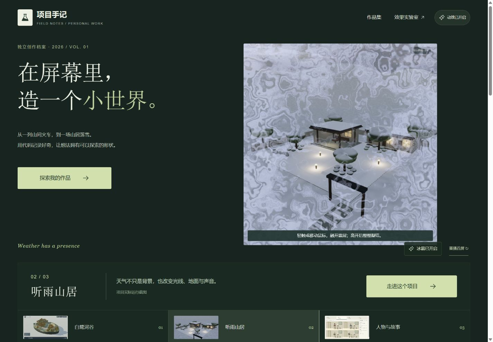

| 凝霜 | 鼠标融开 | 离开后恢复 |
| --- | --- | --- |
|  |  | 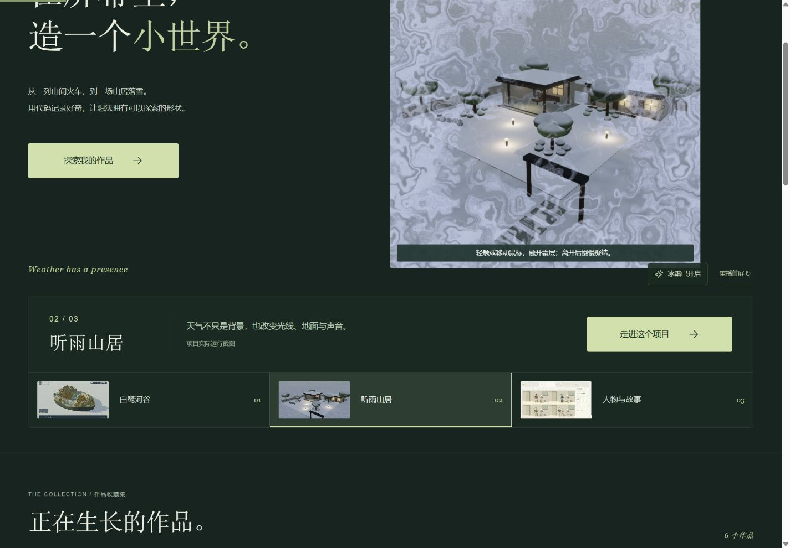 |

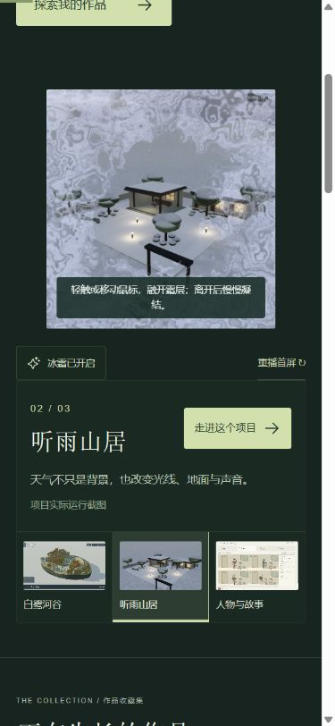

提示文案最初与浅色雪景对比不足，增加深底，并将提示限定在照片内部。最终边界与照片对齐、内容可读；没有扩大为新的效果控制台。

## V4.2 · 详情图片连续转场 · 2026-09-15

已将作品卡片与详情图片连贯衔接，说明随后渐显；关闭返回来源，恢复阅读位置和焦点。保留 Product Design 深绿方案与原版 Clouds / Frost；本轮新增的是自编 GSAP 交互。构建、桌面展开返回、中途 Esc、手机尺寸与滚动、移除来源收藏、关闭动效均完成实际检查。未部署。截图、问题修复与验证边界见 [V4.2 记录](portfolio-v42-validation.md)。

## V4.3 · 场景手记 · 2026-09-15

听雨山居详情已增加晴空、檐下雨景和庭院雪景切换，章节说明与观察重点同步，雪景可融霜，主要入口进入既有实时山居。素材均为真实截图，明确不同机位与阶段；沿用选定深绿设计。桌面、手机、键盘、收藏返回、无动效模式及快速切换检查通过，构建成功，未部署。来源、前后截图和修复见 [V4.3 验证记录](portfolio-v43-validation.md)。
