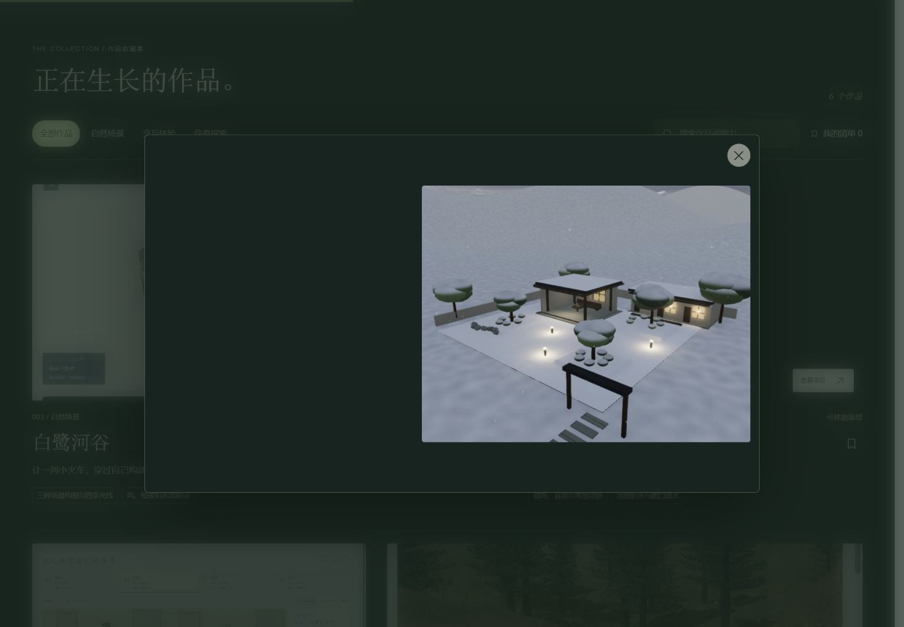
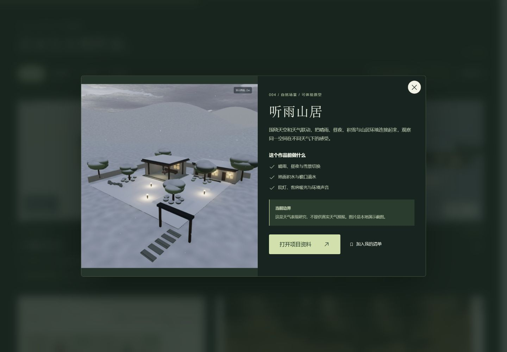
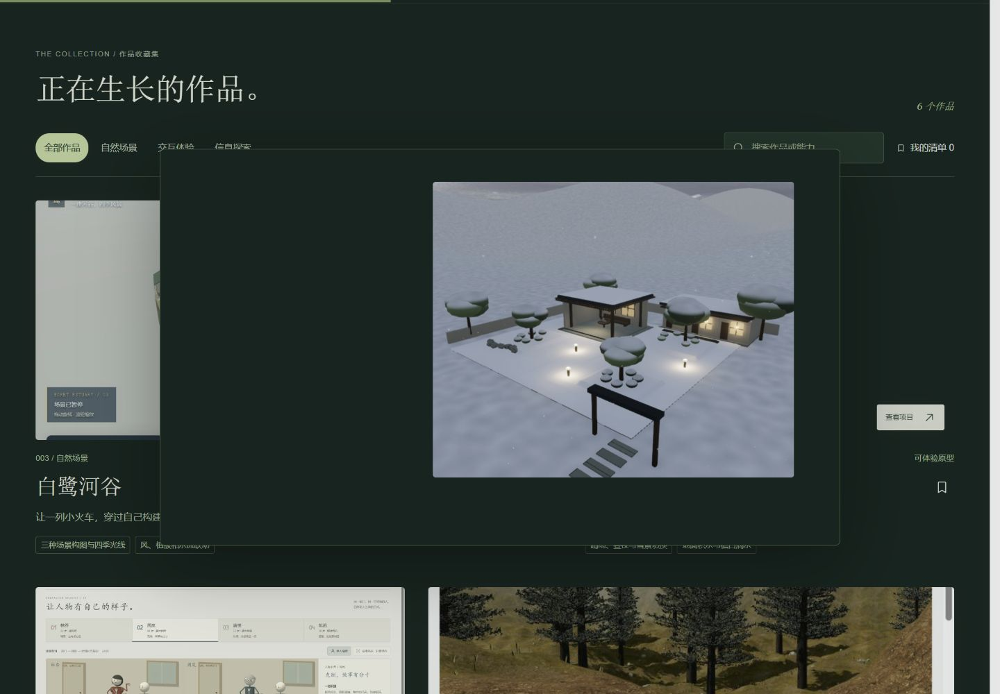
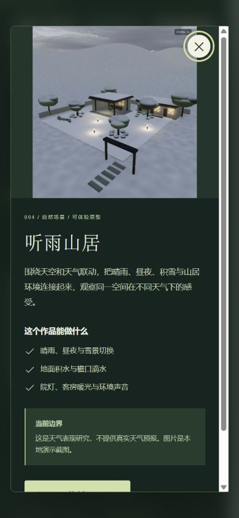

# V4.2 · 图片从作品卡片进入详情

研究日期：2026-09-15。基于用户确认继续的“打开详情—返回作品”交互，保留已选 Product Design 深绿方案。上一版局部源码见 [archive/portfolio-v4.1](archive/portfolio-v4.1/README.md)。

## 观察方式

在本地作品页点击“探索我的作品”，再点击“听雨山居”图片：图片从卡片位置展开到详情，说明随后渐显。按关闭按钮或 Esc，图片回到原卡片，焦点与阅读位置恢复。顶部关闭动效后可对照无动画流程。

## 技巧与作用

| 位置 | 行为 | 实现与目的 |
| --- | --- | --- |
| 卡片 → 详情 | 保持图片比例，裁切逐渐变为完整原图 | GSAP 插值位置、尺寸和裁切，帮助理解当前详情来自哪件作品 |
| 详情文字 | 图片先移动，说明稍后出现 | 图片 0.62 秒；文字从 0.38 秒开始渐显 0.35 秒 |
| 关闭详情 | 图片返回来源，背景逐渐恢复 | 返回 0.48 秒；锁定并恢复背景滚动，恢复键盘焦点 |
| 快速关闭与窗口变化 | 中途反向或直接收束动画 | 避免残影、隐藏图片与失效的尺寸目标 |

这属于自编 GSAP 交互，未新增 Canvas UI 组件。Clouds、Frost 沿用已验证接入；本轮没有重新核实上游。固定来源：[Canvas UI](https://canvasui.dev/)，commit 44de3787b77d78477a7c03a4c81a7d5ea317cdbc，MIT + Commons Clause；GSAP 沿用 3.15.0。本地变更未提交，无新增 tag。

飞行图片使用非交互的原生 manual popover，与原生 dialog 同处浏览器顶层；实际详情仍保留原生键盘焦点约束。不支持 popover、原图未加载或来源不可见时回退到渐显；关闭动效时直接切换。首屏铁路 AI 封面与详情截图不同，因此从对应真实缩略图衔接，避免把生成图当成项目实景。

## 本轮实际验证

- 桌面点击卡片时检测到 opening 和打开的飞行层；完成后为 open，飞行层数 0，真实详情图恢复可见。
- 关闭按钮与 Esc 均可关闭，恢复原入口焦点；一次稳定桌面检查打开后与返回时 scrollY 均为 1013.3333。测试工具点击卡片可能先将卡片滚入视野，因此不将工具自动滚动前的位置当作应用的打开位置。
- 入场未完成时立即 Esc，能反向关闭；结束无隐藏图片、无残留飞行层。
- 入场时从桌面切到手机尺寸，动画收束为完整详情；手机可滚动并关闭。390×844 CSS 视口下，锁定背景时文档 clientWidth / scrollWidth 为 390 / 390，详情为 339 / 339。锁定期间隐藏滚动条，所以宽度与上一轮未锁定页面的 375 不同。
- 仅查看收藏时，在详情内移出唯一收藏，再关闭：原卡片已不存在，安全渐隐，焦点回作品区标题，飞行层数 0，背景滚动恢复。
- 关闭全局动效后，打开立即为 open、飞行层 0，Esc 仍正常关闭。
- 实际截图发现文字位移造成临时滚动条，已去掉文字位移，保留错峰渐显。复查入场时详情 clientHeight / scrollHeight 均为 570，无该溢出。
- 最终独立验证标签 error / warn 为空；构建成功，作品 JS 31.30 kB（gzip 12.18），CSS 27.20 kB（gzip 6.54）。无新依赖、无部署。

未验证实体触屏、旧浏览器回退、系统减少动态设置切换、长时性能。窗口尺寸变化会结束当前转场；滚动位置记录为打开时的坐标，跨布局变化不承诺对应同一段内容。收藏仍仅保存在当前页面内存。

## 实际画面

旧详情布局参考 [V4 详情](assets/103-product-v4-detail.png)；静态图片无法单独证明动画流畅度，请以本地点击体验为准。

120 为点击前收藏集；121、123 为修复临时滚动条前的中间画面，保留为问题记录。截图为真实浏览器输出，未编辑、未合成。
