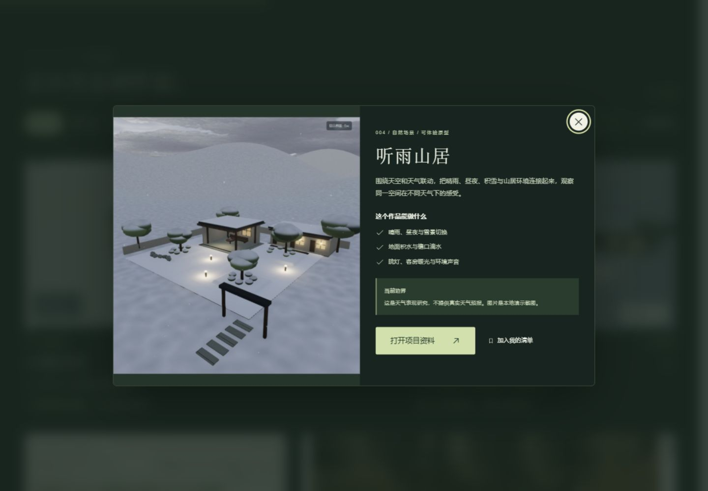
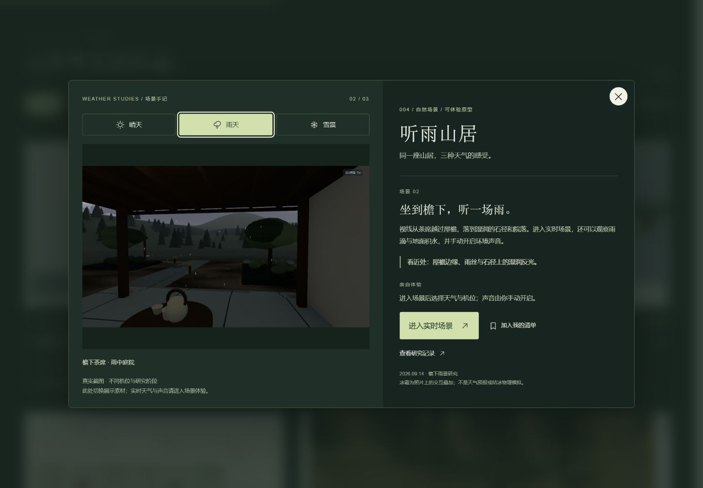
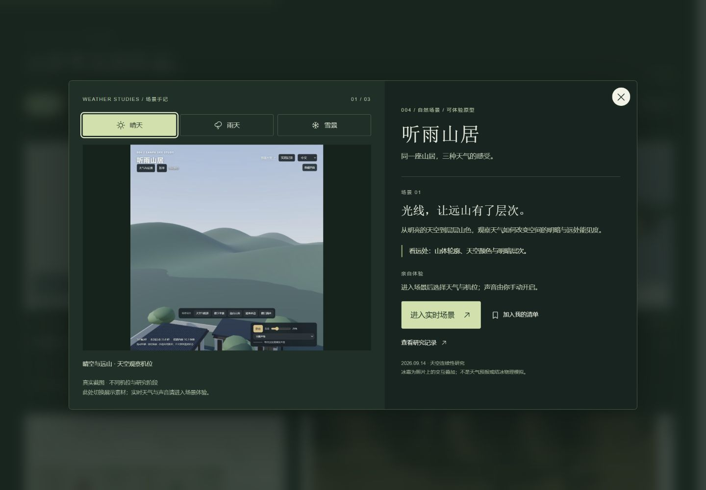
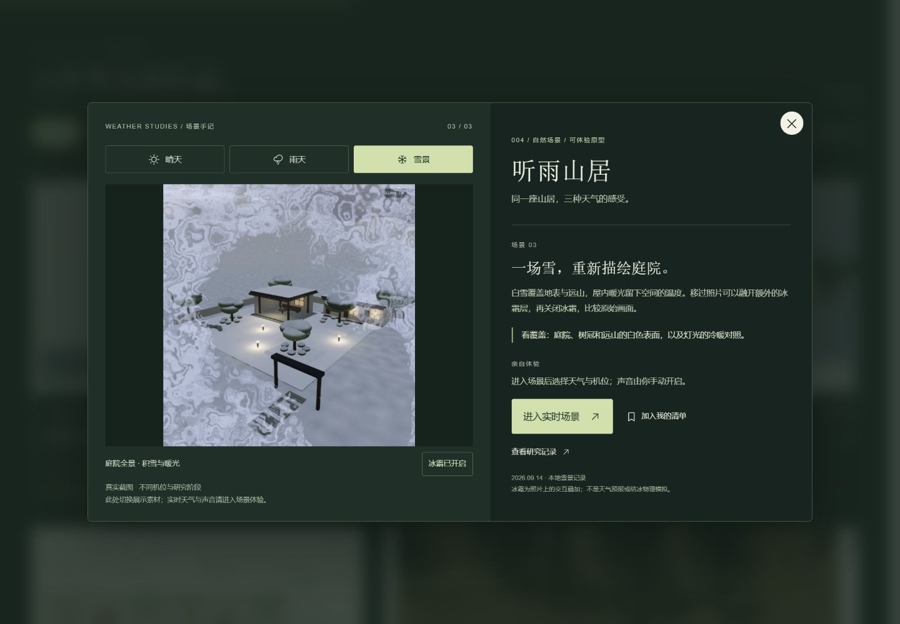
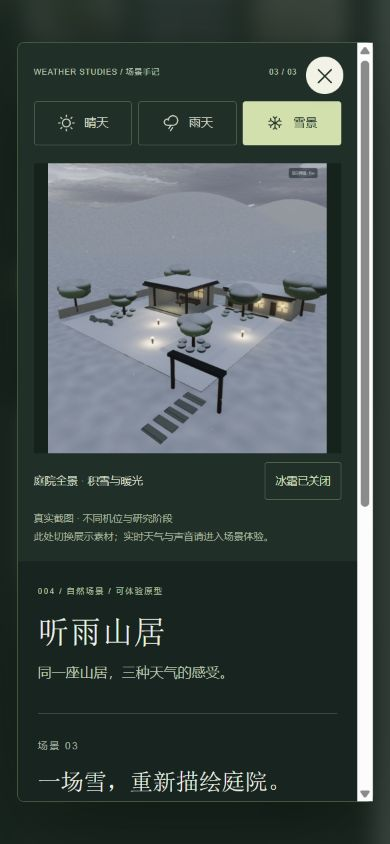

# V4.3 · 听雨山居场景手记

研究日期：2026-09-15。用户确认将项目详情改为真实素材切换、场景说明和体验入口。沿用选定 Product Design 深色方案，依据现有详情代码与 V4.2 截图扩展；没有生成新的视觉方案或资产。

## 实际变化

原先是一张截图和能力列表，现在左侧可选择晴天、雨天、雪景，右侧同步解释场景及观察重点；主要入口直接进入既有实时山居，研究资料作为次要入口，收藏仍可使用。三张素材来自不同机位与研究阶段，页面明确说明；不是实时天气切换，也不是同机位对照实验。

GSAP 负责图片和说明渐显，Frost 只覆盖雪景照片。冰霜可单独关闭，关闭全局动效后照片、切换、收藏和链接仍可用。初始雪景与作品卡片使用同一原图，保留 V4.2 图片展开；切成晴天或雨天后关闭改为渐隐，避免把不同照片强行变成卡片雪景。

## 来源与许可

| 展示素材 | 本地来源 | 使用方式 |
| --- | --- | --- |
| 晴空远山 | 004/assets/81-continuity-clear-sky.jpg | 原文件复制为 app/public/portfolio/weather-clear.jpg，保留截图中的原界面 |
| 檐下雨景 | 004/assets/35-rain-porch-full.jpg | 原文件复制为 app/public/portfolio/weather-rain.jpg，完整比例展示 |
| 庭院雪景 | app/public/portfolio/weather.jpg | 沿用 V4.2 真实雪景，不新增替代图 |

两份新增复制图片 SHA-256 与原文件一致，未裁切、重绘或合成。来源详见 [004 图片记录](../004-eanpa-sky/assets/README.md) 与 [许可](../004-eanpa-sky/README.md)。固定上游 Eanpa-Sky commit a197d3dc42577e9b870b471a39d6b1710c5b5633（v0.2.1），代码 MIT，其他素材分别授权。Canvas UI 仍为 commit 44de3787b77d78477a7c03a4c81a7d5ea317cdbc、MIT + Commons Clause，使用原版 Frost；GSAP 沿用 3.15.0。没有更新上游或新增本地提交/tag。

## 实际验证与修复

- 三个标签可点击，图片文件与章节说明对应；左右方向键与 End 切换和焦点跟随已检查。晴天和雨天在图库内 canvas 为 0；雪景开启为 2（含隐藏源画布），关闭冰霜后为 0。鼠标拖动融霜截图见 131。
- 手机 390×844 CSS 视口下，锁定详情时文档 clientWidth / scrollWidth 为390/390，详情339/339；图片、文案、入口无水平溢出，向下滚动后可收藏并按 Esc 返回原入口。
- 关闭全局动效后快速依次切换晴、雨、雪，图片透明度为1，详情状态open，图库canvas为0，冰霜开关禁用。
- 发现并修复动画清理时使用已经清空的图片ref导致 GSAP target null 警告：改为捕获具体元素清理。最终新建的独立验证页 error/warn 为空；前一检查标签仍保留修复前警告。
- 发现并修复入场未结束时切换场景，旧雪景飞行层未及时移除的问题。现在标签交互先结束入场，再切换图片；复查立即切雨时状态open、飞行层0，随后关闭状态closing、飞行层0，最终焦点恢复到“查看听雨山居”。
- 在浏览器打开既有线上 /004-eanpa-sky/lab/，观察到真实场景完成启动，页面显示本次启动39.9秒、天气设置和机位入口。没有开启声音或重新测试天气矩阵；该时间不是性能承诺。
- 最终构建成功：作品 JS 49.19 kB（gzip17.28），CSS30.99 kB（gzip7.28）。没有新依赖或部署。

视觉检查将127旧详情与128新详情放在同一次比较输入中：保留宋体标题、深绿底与浅绿按钮；新增长图库和章节层次，完整保留照片比例。手机改为上下阅读顺序。雨景暗部为原截图内容，未人为提亮；晴天截图含原界面，按档案真实保留。不宣称所有画面为相同研究版本。

未测试实体触屏、旧浏览器、系统减少动态设置实际切换、弱网图片失败或长时性能；WebGL回退沿用已有实现。冰霜为视觉叠加，不代表真实结冰或HTML折射。

## 前后画面

