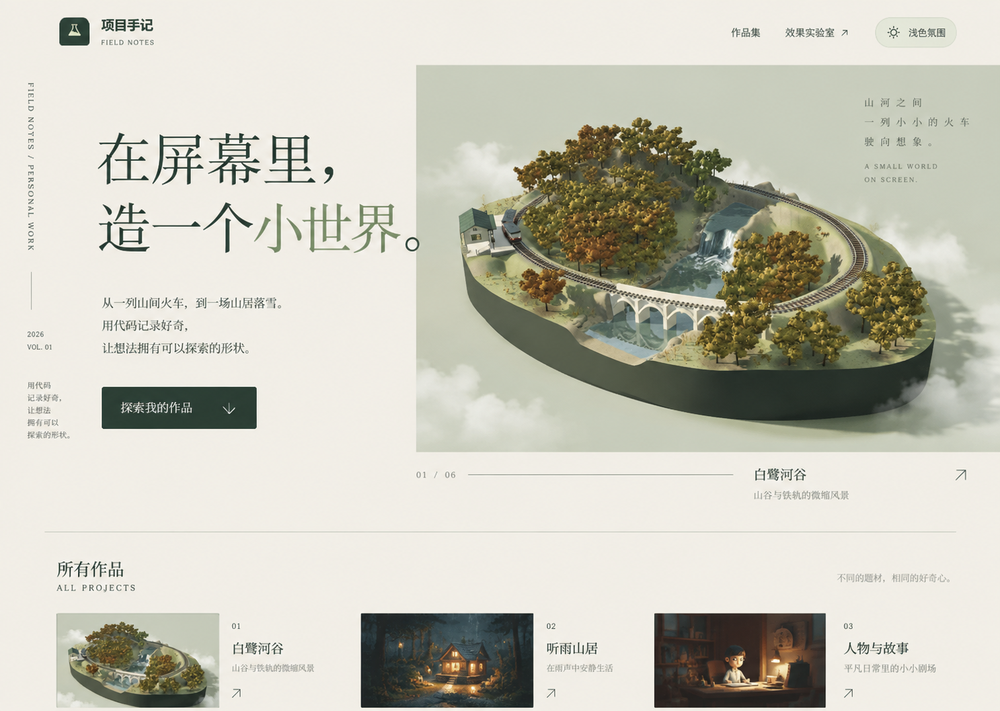
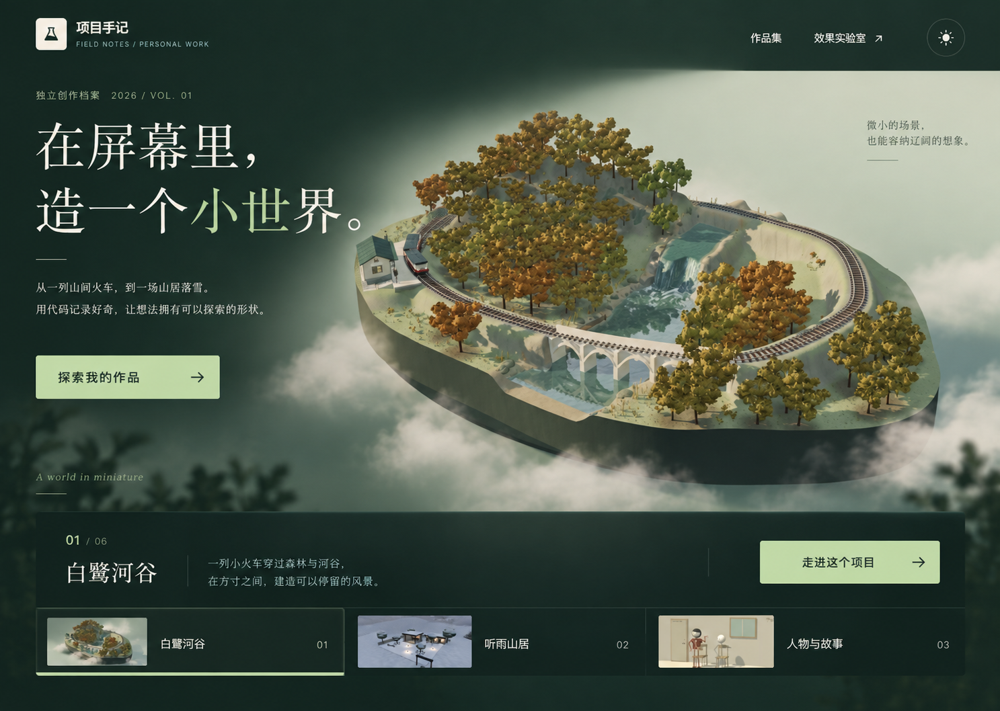
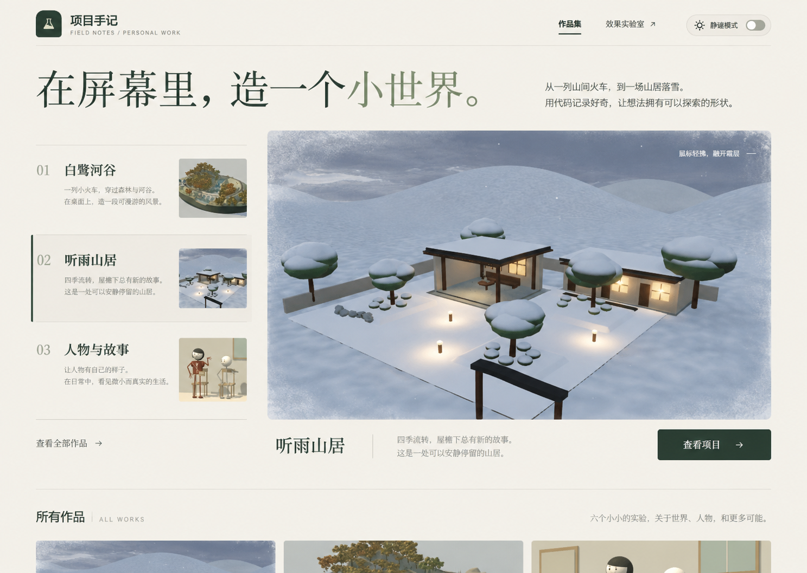

# Product Design 三套视觉探索

日期：2026-09-15。目标仍为现有个人作品页 `?view=portfolio`，不是新建产品。初次探索时生成三张方案。最新状态：用户已确认第二张，V4 已落地并接入 Canvas UI Clouds，详见 [迭代记录](portfolio-iterations.md)。未部署。

## 真实参考与生成过程

使用 Product Design 0.1.55 的 get-context、user-context preflight 和 ideate 流程。预检未发现保存的用户上下文；使用当前会话、现有源码、实际浏览器截图和项目资产。参考截图为 assets/95-product-design-reference.png 和既有 assets/89-product-v3-wide.png，均已实际查看并附到三个独立 ImageGen 请求中。设计提示尺寸 1440 × 1024，实际生成图尺寸以文件为准，不拉伸处理。

后两张同时附上真实听雨山居雪景及人物与故事截图。第一张的两个辅助缩略图由模型自行演绎，不能作为原项目实际画面。三张中的云雾、冰霜均是静态设计意向，不是浏览器运行证据。实现时应使用原项目素材，必要时修正生成图的文案与功能状态。

## 显示顺序与选择映射

以下编号按本会话中生成图片的实际显示顺序绑定，后续用户选择据此解析。

1. 编辑式作品档案 — `96-product-design-editorial.png`，原始生成文件 exec-c8085f9d-5f8e-4210-8005-84b787b02fc9.png。
2. 沉浸式自然展厅 — `97-product-design-immersive.png`，原始生成文件 exec-d75bcbd7-d383-43dd-b3e2-28c9f692a5ec.png。
3. 场景橱窗 — `98-product-design-showcase.png`，原始生成文件 exec-644d63c0-9653-4356-943a-8fdf457637a3.png。

## Canvas UI 核查与后续实现范围

- 效果库 lab.jsx 已导入并按当前选择挂载原版 Canvas UI 组件。实际浏览器显示“叠加 Canvas UI”“启用特效”和 Liquid 的“部分效果可用”；不能据此声称所有完整特效都可用。
- 作品页 portfolio.jsx 没有导入这些组件，效果说明明确写着未调用 Canvas UI；磨砂背景由 CSS backdrop-filter 实现。
- 已读取 Clouds、Frost、Droplets 的本地 React 包装源码，计划在用户选定布局后，将适合场景的原版组件作用于作品图片区域，保持按钮与文本可操作。云雾可考虑用于白鹭河谷，冰霜可考虑用于听雨山居雪景；雨滴仅在匹配雨景时使用。
- 沿用上游 commit 44de3787b77d78477a7c03a4c81a7d5ea317cdbc 和随源码保留的 MIT + Commons Clause，未更新上游。来源 https://canvasui.dev/；本轮只核对固定本地源码和当前页面，不声称重新核实最新官网兼容性。
- 未进行新集成，因此本轮没有新增构建或动态效果测试结果。后续需验证真实画面、开关、减少动态效果、WebGL 不可用时回退和详情操作。

所有生成原件保留在工具返回的 generated_images 目录，项目 assets 保存副本；生成图不改变原项目截图的来源和权利。
