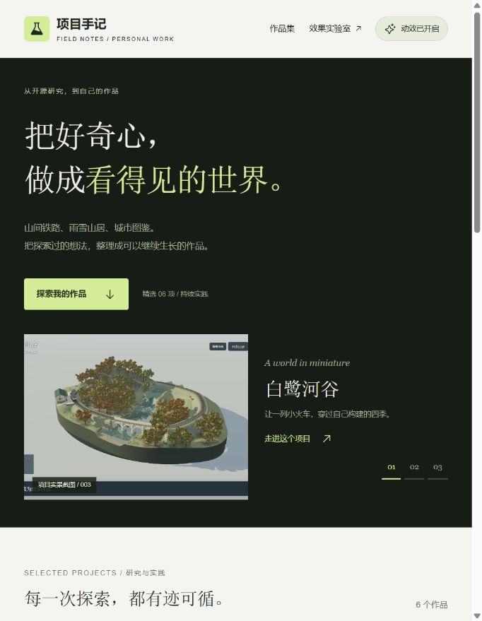
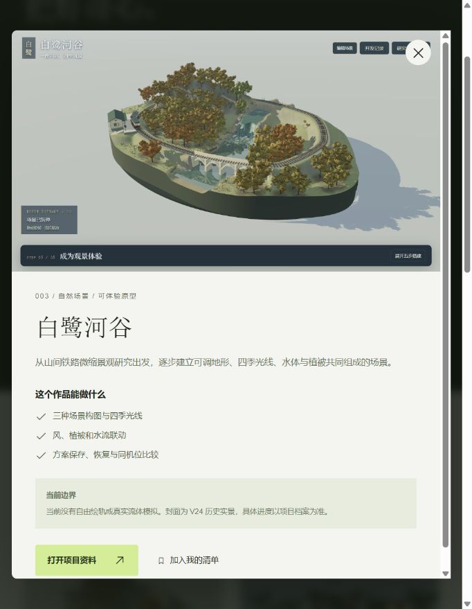
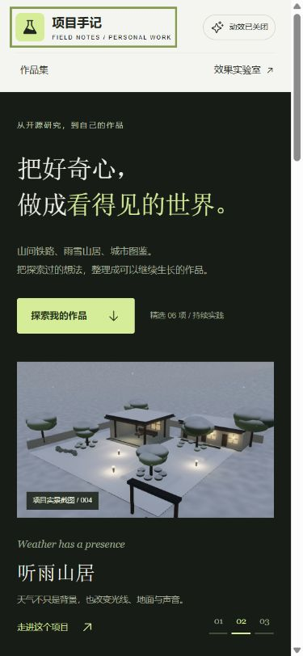

# 项目手记 · 实际产品场景

研究与实现日期：2026-09-15。源码位于本项目 `app/src/portfolio.jsx`、`portfolio-data.js` 和 `portfolio.css`。

在本地运行的视觉实验室点击顶部“实际场景”，或访问本地预览的 `?view=portfolio`。未部署，不提供新的公网演示地址。

## 这个场景解决什么问题

以本仓库中的项目研究作为真实内容，建立“浏览作品 → 筛选能力 → 查看详情 → 加入清单”的完整前端流程。不是新的研究子项目，也没有改写 003–010 的应用；它是 011 效果库的应用示范。

沿用实验室的深色、浅绿、衬线标题和轻量控件；按照已有代码样式扩展，而非从新的 ImageGen 方案复刻。使用 Product Design 的上下文梳理，未生成新图片。

## 技巧对应的实际目的

| 场景 | 表现方式 | 用途 |
| --- | --- | --- |
| 首屏阅读 | GSAP 分批入场 | 依次看到介绍和主要操作 |
| 精选项目切换 | 图片淡入、文字轻移 | 连接前后内容变化 |
| 作品筛选 | 卡片短距离错峰出现 | 提示结果集合发生变化 |
| 项目详情 | 原生模态框与轻微展开动画 | 在保留浏览位置的情况下阅读详情 |
| 收藏 | 书签选中状态、按钮文字和提示 | 明确操作结果，随后用清单筛选 |
| 图片探索 | 悬停轻微放大 | 告知图片可进入详情 |

顶部开关关闭所有本页动效后，筛选、详情、收藏仍可操作；实现也监听系统减少动态效果偏好。本页使用 GSAP 和 CSS，没有调用 Canvas UI 组件。原版 Canvas UI 仍保留在效果库中，不能把本页展示称为其能力证明。

## 内容与图片来源

内容读取各项目 README 的本地档案，状态为本轮整理快照，非实时同步。外部资料链接沿用仓库已记录地址，本轮未重新逐个验证线上服务。

| 内容 | 图片原始路径（相对 projects/） | 应用内副本 |
| --- | --- | --- |
| 白鹭河谷 | `003-mountain-railway-diorama/assets/scene-v24-overview.jpg` | `app/public/portfolio/railway.jpg` |
| 听雨山居 | `004-eanpa-sky/assets/67-snow-landscape.jpg` | `app/public/portfolio/weather.jpg` |
| 人物与故事 | `005-stick-steel/assets/24-character-comparison.png` | `app/public/portfolio/characters.png` |
| 山地巡游实验室 | `008-terrain-motion-lab/assets/natural-ground-view.png` | `app/public/portfolio/terrain.png` |
| 城景工坊 | `009-city-landmark-map/assets/demo/01-xian-demo.png` | `app/public/portfolio/city.png` |
| 前端视觉实验室 | `011-frontend-visual-lab/assets/71-gsap-nebula.png` | `app/public/portfolio/visual.png` |

图片为既有项目的实际浏览器截图，画面中的上游、用户图稿及项目资产保留原有权利与来源说明；不新增统一授权声明。GSAP 沿用 3.15.0，许可证与上游来源见本项目原有研究档案。此次本地改造没有新的上游 commit/tag；本地改动未提交。

## 交互边界

- 清单仅保留在本次页面状态中，刷新清空；不发送数据、不接入账号。
- 精选切换展示前三个项目，作品集展示六个项目。
- 图片是截图，页面未嵌入铁路、天气或人物的实时 3D 引擎；详情中的资料入口连接原项目。
- 各项目尚未完成的能力，在详情“当前边界”中明确说明。

## 实际验证

构建成功；浏览器验证精选切换、详情打开/关闭、Esc 和焦点回到触发按钮、添加/移除收藏、空清单、自然场景筛选、关键词组合搜索、空搜索恢复与关闭动效后的详情操作。修复空结果仍调用 GSAP 目标导致的警告。

中等宽度改为上下布局；手机宽度下测得文档 clientWidth / scrollWidth 为 375 / 375px，单列作品布局。修正首屏标题的孤字换行。测试没有覆盖实体触屏、系统偏好实际切换或外部网站内容。

## 作品页 V2 · 2026-09-15

直接优化现有个人作品页：标题遮罩、六片百叶揭幕、进入视野再显现、鼠标倾斜和阅读进度；增加重播首屏。已保存 V1 源码与前后截图，参数、观察步骤及验证见 [作品页优化记录](portfolio-iterations.md)。本轮构建通过，浏览器 error / warn 为空；手机无横向溢出。未新增依赖或部署。

## 作品页 V3 整体视觉优化 · 2026-09-15

重整为暖白与深绿的作品展览：宽幅首屏、缩略图精选导航、主次双栏作品、能力标签、创作方法和响应式图文详情。V2 源码已存档，前后图和实际验证见 [作品页迭代记录](portfolio-iterations.md)。最终构建、筛选收藏、无动效操作和宽窄布局检查通过；未部署。

## 作品页 V4 · 2026-09-15

已按用户选中的 Product Design 第二张深色方案完成页面，并实际接入 Canvas UI 原版 Clouds 云雾。开关、精选切换、收藏筛选、详情和手机布局已验证；构建通过，未部署。首屏封面标注为 AI 视觉演绎，缩略图与详情保留真实截图。见 [V4 迭代记录](portfolio-iterations.md) 与 [设计检查](design-qa.md)。

## V4.1 · 2026-09-15

听雨山居雪景已接入原版 Canvas UI Frost：鼠标经过融开、离开后重新凝结，独立冰霜开关与云雾互不影响。构建、开关、融化恢复、手机布局与离屏卸载验证通过；未部署。详情见 [作品页迭代记录](portfolio-iterations.md)。

## V4.2 · 详情图片连续转场 · 2026-09-15

已将作品卡片与详情图片连贯衔接，说明随后渐显；关闭返回来源，恢复阅读位置和焦点。保留 Product Design 深绿方案与原版 Clouds / Frost；本轮新增的是自编 GSAP 交互。构建、桌面展开返回、中途 Esc、手机尺寸与滚动、移除来源收藏、关闭动效均完成实际检查。未部署。截图、问题修复与验证边界见 [V4.2 记录](portfolio-v42-validation.md)。

## V4.3 · 场景手记 · 2026-09-15

听雨山居详情已增加晴空、檐下雨景和庭院雪景切换，章节说明与观察重点同步，雪景可融霜，主要入口进入既有实时山居。素材均为真实截图，明确不同机位与阶段；沿用选定深绿设计。桌面、手机、键盘、收藏返回、无动效模式及快速切换检查通过，构建成功，未部署。来源、前后截图和修复见 [V4.3 验证记录](portfolio-v43-validation.md)。
