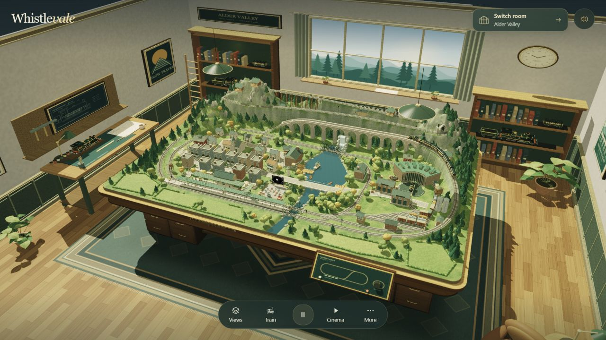
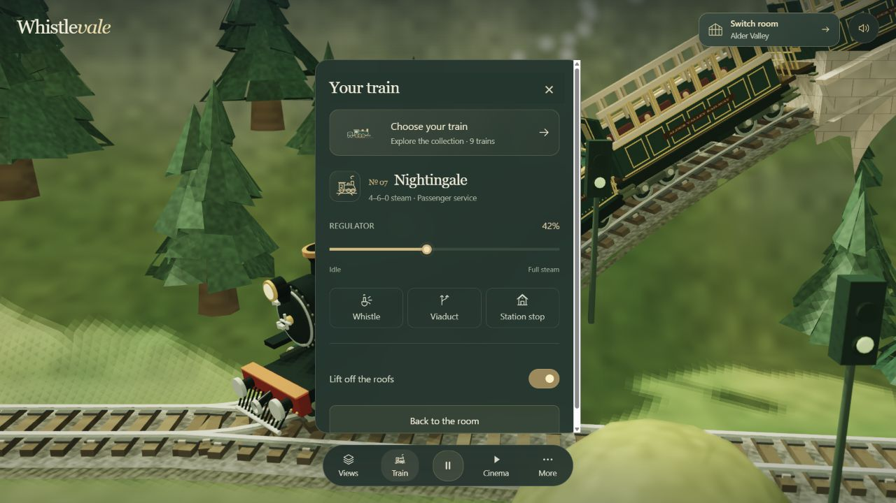
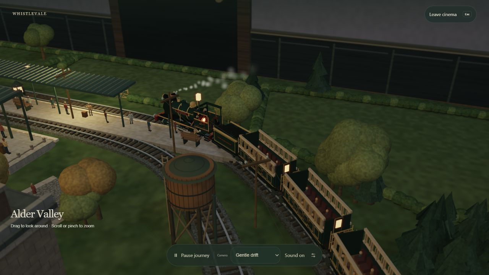
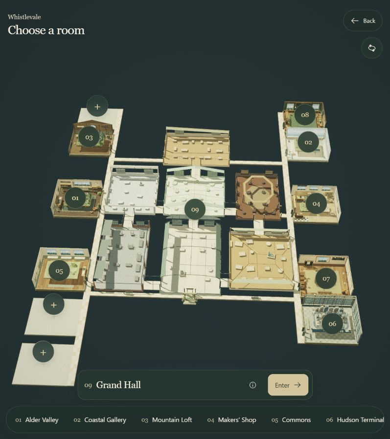
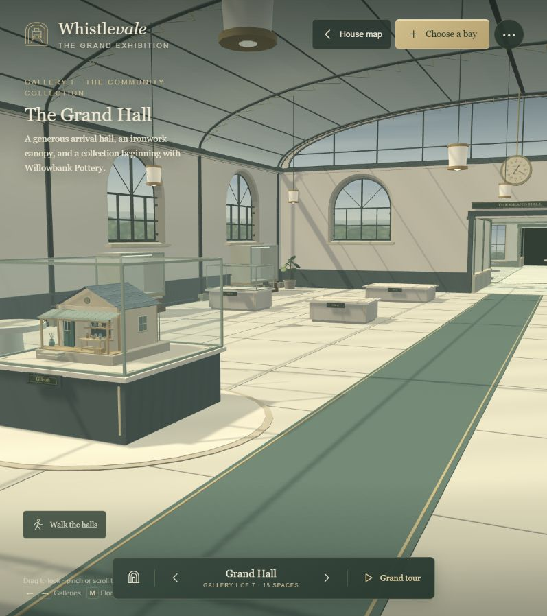

# 012 · Whistlevale 研究与我们的作品馆

**先看原库的效果和能力，再从 Alder Valley 一个场景进入，理解模型、运动、镜头、氛围和编辑如何组成完整体验。**

## 本轮理解与双图引导

展厅组织整体空间与参观路径，展台呈现单件作品的效果与能力；适合研究作品收藏、旅游与陌生地方介绍、产品和文化展示。通过精细化开关与同场景对照，理解模型、材料、光照的投入，以及 Three.js 与原生 WebGL 2 的选择。

**选型结论：以 Three.js 为默认，需要特殊外观时接入自定义着色器和后处理；直接使用 WebGL 2 适合学习底层、开发专用渲染器或处理经实测确认的限制。更底层不自动带来更精细的画面。**

| 原作：空间与展品 | 我们：精细效果与技术对照 |
| :--- | :--- |
| [](https://whistlevale.com/?room=valley) | [](https://yydshly.github.io/0913_codex_project/012-whistlevale/renderer-compare.html) |

*两图均为 2026-09-15 实际浏览器截图；左为作者原作，右为我们的独立教学模型。两图展示研究路径，不构成原作与本项目的公平画质比较。*

[完整理解摘要](understanding.md) · [在线双图导览](https://yydshly.github.io/0913_codex_project/012-whistlevale/research.html) · [实际技术对照与数据](renderer-comparison.md) · [发布记录](publishing.md)

## 当前实践：我们的作品馆

**技术选型实际对照：[Three.js 与原生 WebGL 2 同场景比较](renderer-comparison.md)。** [打开在线对照](https://yydshly.github.io/0913_codex_project/012-whistlevale/renderer-compare.html)：两套独立渲染器、五个精细看点；Three.js 内置材质和同算法自定义两种配置，附 GPU 像素差异检测。

**WebGL 2 实现实验：[同机位细节对照](webgl-detail-study.md) · [七步入门](webgl2-study.md)。** [打开在线实验](https://yydshly.github.io/0913_codex_project/012-whistlevale/webgl-lab.html)：默认比较基础版与精细版，分别开关结构、材料、柔影与补光；保留七个绘制阶段及中间结果观察。

**原生作品对照：[Alder Valley 与 Nightingale 的技术和细节拆解](native-alder-analysis.md)。** 用原作近景、揭顶、夜景及我们的车站实景，比较模型、材料、灯光、镜头与生活细节；区分实际优势和不同技术取舍。

**单展品样板已实现：[一座车站的日常](valley-exhibit.md)。** [在线参观](https://yydshly.github.io/0913_codex_project/012-whistlevale/valley.html)：完整主景、车站/拱桥/河岸三个看点、站房揭顶与春秋比较。作品馆的白鹭河谷入口已连接此样板。

**深入研究：[什么场景适合展厅，怎样做好具体展台](exhibit-research.md)。** 将作品收藏与陌生地方介绍分开判断，提出“地域总览 → 地点展品 → 细节体验”的方向；附 [当前展馆四步实测与问题截图](gallery-audit.md)。

依据后续沟通，新增一座独立三维展馆：**山水与天气、地形与运动、图鉴与界面**三个展区，展示六件已有成果。展台结合主题缩景、实际效果图和能力说明，可进入已发布作品并返回。

[打开在线展馆](https://yydshly.github.io/0913_codex_project/012-whistlevale/) · [整体布局与单台风格](gallery.md) · [启动与构建](app/README.md)。现已提交并部署，见 [发布验证记录](publishing.md)。以下图片与研究正文仍是 Whistlevale 原作参考，非新展馆截图。

[第一部分：原库效果与能力](#第一部分原库效果与能力) · [第二部分：从一个场景理解](#第二部分从-alder-valley-一个场景理解) · [逐步操作与原理](scene-guide.md) · [证据与源码](notes.md) · [返回总索引](../../README.md#项目索引)


*2026-09-15 作者线上原作实测截图，非本仓库重建或生成图。线上部署 commit 未公开确认；源码研究固定版本见下表。*

| 项目 | 内容 |
| :--- | :--- |
| 固定编号 | 012 |
| 原始仓库 | [nickfromlater/whistlevale](https://github.com/nickfromlater/whistlevale) |
| 作者 | nickfromlater 与贡献者；外接作品各有作者记录 |
| 发现渠道 | 用户提供 GitHub 仓库链接 |
| 研究日期 | 2026-09-15 |
| 源码版本 | [f3d769e8ea54d2f5a47d12f27773541b484c6302](https://github.com/nickfromlater/whistlevale/commit/f3d769e8ea54d2f5a47d12f27773541b484c6302)，提交时间 2026-09-13 |
| 许可证 | 主仓库 MIT；外接作品、依赖和可选录音分别核对 |
| 技术栈 | 原生 JavaScript、自定义 WebGL 2；部分外接展室使用随仓库提供的 Three.js |
| 状态 | 原作线上观察与源码研究完成；独立作品展馆、单展品与两组实验已上线；未复现上游全量应用 |
| 原作入口 | [作者在线展馆](https://whistlevale.com/) · [Alder Valley](https://whistlevale.com/?room=valley) |
| 本项目演示 | [在线独立作品馆](https://yydshly.github.io/0913_codex_project/012-whistlevale/)；[双图研究导览](https://yydshly.github.io/0913_codex_project/012-whistlevale/research.html)，见 [运行说明](app/README.md) |

## 第一部分：原库效果与能力

### 1. 一座有房间、有展品、有动静的微缩展馆

整体效果像在模型铁路收藏室中观看桌面沙盘：桌椅、书柜、窗景和照明建立尺度，村庄、湖泊、轨道和列车构成桌上的世界。列车持续行驶，用户可以靠近、暂停、揭顶观察，也可以交给自动镜头游览。

它包含可直接体验的应用、场景源码、编辑工具和贡献约定。原生场景强调手工微缩模型的精巧与温暖；画面不是实景测绘，也不能用作施工图。

### 2. 一眼看懂已有能力

| 能力 | 可以看见或操作的效果 | 当前验证与边界 |
| :--- | :--- | :--- |
| 场景展示 | 从房间整体看桌面沙盘，再近看列车、轨道、植被和隧道 | Alder Valley 全景、近景已观察 |
| 列车观察与控制 | 油门、路线、请求停站、暂停、揭顶，列车收藏入口 | 已验证近景、揭顶、暂停/继续；油门、路线和停站按钮已检查，未逐项运行验收 |
| 自动镜头 | Cinema 随列车游览，可退出回到普通操作 | 已进入夜间 Gentle drift 并退出；其他机位未逐项验证 |
| 氛围 | Afternoon、Lamplight、Night run、灯光亮度、景深、窗上雨景 | 已操作夜间与窗雨开关；不能据截图声称雨滴细节或全天气系统已验证 |
| 布局编辑 | 模型分类目录、3D/Plan、网格、吸附和 Shape track 入口 | 已进入编辑器、切换 Plan；未修改布局或验证任意轨道形状 |
| 保存与分享 | 导出布局 JSON、导入存档、导出可玩 HTML | 已检查菜单及源码；未执行下载和导入回环。外接展室完整模型不随便携 HTML 打包 |
| 展馆扩展 | 房间地图、固定展位、作者署名、按约定加入作品 | 地图与 Grand Hall 已观察；贡献需要源码修改与审核，不是多人实时在线编辑 |
| 外接作品 | 把其他作者的场景放进展室，对齐视角与操作 | Yamaai 已展示 Mountain Railway Diorama；接入需要项目专用适配层 |

**数量口径：**本次线上地图显示 9 个房间入口；列车收藏入口显示 9 trains。Grand Hall 文档中的 7 个展厅、112 个展位是另一层级，不等于 112 个已有作品。体验文档仍列出 8 种列车，数量以观察日期和来源为准。

### 3. 从模型近景看到操作能力



**看什么：**模型可以揭顶，车厢内有内容；列车与场景里的轨道保持关联。面板连接当前运行状态。截图中目录显示 9 列车。

**进入方式：**Train → Look at the locomotive → 再打开 Train → Lift off the roofs。

### 4. 同一场景可以切换观看方式



**看什么：**同一套沙盘改变光线、观察距离和镜头节奏，形成另一种体验。画面保留了前一步的揭顶状态；这不是单独制作的夜景视频。

**进入方式：**More → Atmosphere → Night run → 关闭面板 → Cinema。退出使用 Leave cinema 或 Esc。

### 5. 单个作品之外，还有展馆与展位



**看什么：**房间与作品有位置关系。注册信息连接名称、地图位置、介绍与进入操作。中心展厅还包含多个展品位置。



**看什么：**展馆明确区分空间和内容；空展位真实存在。贡献者按展位要求制作展品，审核后进入目录。

## 第二部分：从 Alder Valley 一个场景理解

**本次只用 Alder Valley 作为主线。** 它同时包含环境、运动主体、镜头、氛围和布局编辑，适合把完整链路看清楚。Yamaai 仅作为后续接入参考。

| 顺序 | 用户看到什么 | 操作入口 | 要理解什么 |
| :--- | :--- | :--- | :--- |
| 1 · 看整体 | 展室、沙盘、村庄、湖泊、高低轨道 | [打开 Alder Valley](https://whistlevale.com/?room=valley) | 尺度、布局与承托关系怎样建立可信空间 |
| 2 · 跟列车 | 车头前进、车厢转弯、车轮和烟汽 | Train → Look at the locomotive；暂停/继续 | 路径定义位置，运行状态驱动模型与反馈 |
| 3 · 换观看方式 | 近景、昼夜与自动游览 | More → Atmosphere；Cinema | 模型、光线、镜头可分别控制又能配合 |
| 4 · 看编辑器 | 俯视布局与模型目录 | More → Build your railway → Plan | 场景如何变成可编辑的数据 |
| 5 · 回到展馆 | 地图中的其他房间 | Run my railway → Switch room | 单场景怎样接入共同入口与管理规则 |

### 最重要的一条理解链

```text
模型与布局数据 → 生成场景几何
轨道曲线 + 速度 + 时间 → 计算列车的位置和朝向
用户选择的镜头 + 光线状态 → 决定如何观看
WebGL 渲染 → 输出当前画面
编辑器修改布局数据 → 重建或更新场景
```

沿轨道运动是路径驱动的视觉模拟，包含简化加减速与停站逻辑；不能据此评价为专业铁路物理模拟器。

**继续阅读：[以一个场景为入口：五站操作与原理](scene-guide.md)。** 每站说明“看什么 → 怎么操作 → 如何实现 → 能学走什么”。

## 对本仓库的意义与下一步

- **003 白鹭河谷：**可借鉴镜头、暂停、进入和退出的约定。Whistlevale 接入的是 Mountain Railway Diorama 上游原作，未接入本仓库 V38。
- **004 天气与 008 自然环境：**可研究如何分开场景状态和几何构建，让一个入口控制环境表现。当前尚未建立跨项目共用接口。
- **整个研究库：**可探索作品展馆，但应先验证一个场景的进入、操作与退出，再扩大范围。

初次收录完成原作展示与理解；后续已新增 [我们的作品馆](gallery.md)，采用独立展厅与单作品页面入口。上游布局修改的保存/导入回环、完整三维模型适配仍未实施。

## 来源与许可

实现定位和验证分级见 [notes.md](notes.md)；截图来源见 [assets/README.md](assets/README.md)。主仓库 MIT 原文保留于 [assets/UPSTREAM-LICENSE.txt](assets/UPSTREAM-LICENSE.txt)。外接项目和可选录音按各自许可处理。
