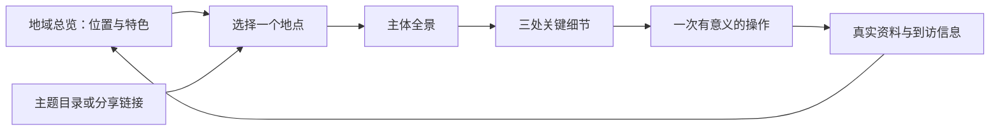

# 从作品展厅到地方体验：场景选择与单展台深入研究

**当前入口：**[在线体验](https://yydshly.github.io/0913_codex_project/012-whistlevale/research.html) · [理解摘要](understanding.md) · [发布验证](publishing.md)。下文保留阶段研究范围与历史记录。

[返回 012](README.md) · [当前作品馆](gallery.md) · [本轮实测与截图](gallery-audit.md)

研究日期：2026-09-15。研究对象为首次认识陌生地方的浏览者，以及希望展示场景作品的创作者。本文区分官方资料事实、当前页面观察和设计建议；建议尚未通过用户实验验证。

Whistlevale 源码沿用固定版本 `f3d769e8ea54d2f5a47d12f27773541b484c6302`，MIT；[上游仓库](https://github.com/nickfromlater/whistlevale)。本地 012 为未提交的独立实现，未部署；本轮只补充研究与审视记录。外部资料仅用于引用，没有下载或重新分发其模型、照片。

## 一、结论：展厅负责发现，展品负责理解

这种组织方式适合把多个值得观看的对象放在一起，让人发现、选择、比较，并深入其中一个对象。作品集、主题博物馆、地方文化、自然知识和目的地介绍均可使用。适用与否，取决于空间是否帮助理解内容。

对于旅游与陌生地方，最值得发展的结构是：**地域总览 → 具体地点 → 细节与体验 → 实际到访信息**。整个地区可以是一张可探索的地图或地域沙盘；每个地方可以有自己的小场景、照片、讲解和观察方式。实体展厅式的过道、墙壁和展柜是可选的包装。

当前阶段，优先投入具体展品的质量。精致的标准包括主体可信、构图清楚、局部值得看、互动有意义、解释准确、操作顺手。增加展柜数量无法替代这些工作。

## 二、先分清三种入口

| 入口 | 空间表示什么 | 适合的任务 | 主要成本与风险 |
| --- | --- | --- | --- |
| 主题展厅 | 策展关系：这些对象为什么放在一起 | 看作品、收藏、比较风格、主题学习 | 多一次寻找或移动；相邻不代表现实距离 |
| 地域地图 / 沙盘 | 地理关系：山、水、中心、抵达点和看点的位置 | 第一次认识城市、景区、校园或周边 | 要核实位置、方向和尺度；美化可能造成误读 |
| 真实空间全景导览 | 从某个拍摄点能看见什么，以及如何转到下一点 | 提前了解建筑、博物馆、住宿空间和现场环境 | 需要实地素材；拍摄点之间不等于连续可行走模型 |

Smithsonian 自然历史博物馆的虚拟参观同时提供房间导航、地图与藏品近看，并在部分展览里提供图片、视频、展签文字。它说明“有空间感的导航”和“有内容的局部观看”可以协同；不能仅凭网页称其为完整实时三维建模。官方说明使用全景摄影及 krpano。[^1]

**设计判断：**我们的作品馆可以保留主题展厅作为成果入口；面向陌生地方的新产品宜采用地域总览。两者共用同一地点/作品资料，允许直接打开具体展品，避免每次都从大厅走起。

## 三、哪些使用场景最合适

以下匹配度是基于任务与现有能力的设计判断，并非市场调研排名。

| 场景 | 观众真正想知道什么 | 建议整体入口 | 单个展台应展示什么 | 适配判断 |
| --- | --- | --- | --- | --- |
| 我们的场景作品集 | 做出了什么，哪些细节值得看，能操作什么 | 当前三组主题展区 | 原作品主体、代表镜头、一个可试操作、能力边界 | 当前最直接 |
| 初到城市 / 山地小镇 | 整体是什么样，特色在哪，先看哪里 | 地域总览，突出中心及抵达参照 | 代表景观、真实参照、局部关系、看点 | 与 009 的原目标最一致 |
| 酒店 / 民宿周边 | 从住宿点出发可以去哪里，怎样选择 | 以住宿点为参照的周边图 | 景点特色、交通方式、可核查到访信息 | 值得验证，依赖信息维护 |
| 单一景区 / 地质公园 | 主要区域如何联系，某种地貌如何形成 | 景区总览与主题路线 | 地形剖面、观察点、过程解释 | 适合空间讲解 |
| 博物馆 / 地方文化馆 | 藏品背后的故事与关联是什么 | 主题目录或真实展厅导览 | 藏品近看、标注、历史资料、材料/结构细节 | 适合精细单品 |
| 校园 / 社区 / 园区 | 第一次来怎样认识功能与地点 | 地图、分区和任务入口 | 入口与设施实景、用途、到达信息 | 认识空间有用，办公查询不必走展厅 |
| 路上紧急查找 / 快速比价 | 立即找到出口、设施、费用或下一步 | 直接搜索与列表 | 可靠、简洁、及时的事实 | 展厅作为主要入口不合适 |

旅游场景的价值也因阶段不同而变化：出发前建立印象，到达后辅助认识，回家后用于回顾与深入学习。NPS 官方应用将地图、自助导览、设施、无障碍信息、离线内容和提醒结合，反映了真实到访任务需要持续维护的实用信息。[^2] **据此推断：**旅游展台若只有好看的画面，主要完成宣传与启发；要帮助到访，还需要独立的数据和更新责任。

不在未实测前声称三维展厅提高转化、记忆或停留质量。停留变长也可能意味着迷路或操作困难。

## 四、为什么应深入具体展台

### 4.1 展台里的主角

“展台”在产品里最好理解为一个完整的观看单元：有主体、有观看顺序、有可理解的内容、有下一步。它可以独立打开，也可以嵌在展馆里。底座和展板帮助衬托主体，但不能成为最有细节的部分。

当前 012 的近景里，铁路缩景是锥体山林、椭圆轨道与简化列车，背后是已有作品截图；右栏又展示同一张图。观众真正能细看的场景，要再点“进入作品”。这是本轮截图支持的现状，见[审视步骤 2](gallery-audit.md#2--近看白鹭河谷展台待重点提升)。

因此，下阶段研究对象应从“为六个展位摆不同装饰”转为“如何让一个展品本身值得近看”。统一外框与主题各异的内容可以共存，不需要让每台使用完全不同的操作方式。

### 4.2 精致的七个维度

| 维度 | 需要达到的效果 | 可检查的问题 |
| --- | --- | --- |
| 身份与真实依据 | 看得出具体对象，而非任意山、房子或树 | 去掉标题后能否辨认特色？写实、示意、虚构是否说清？ |
| 整体构图 | 主要对象清楚，山水建筑形成可读关系 | 第一眼落在哪？展板或界面是否遮住主体？ |
| 局部细节 | 拉近后仍有值得发现的结构与生活 | 是结构、材料和行为细节，还是单纯放大低模？ |
| 观看设计 | 有全景、中景和关键局部，随时回得去 | 近看是否裁切？自由旋转后能否复位？ |
| 有意义的互动 | 操作改变正在理解的内容 | 切换季节能学到什么？揭顶是否真的看见内部？ |
| 讲解与证据 | 简短说明和实际对象对应 | 标注落点准确吗？事实是否有来源与日期？ |
| 流畅与可达 | 普通设备可用，文字也能完成基本理解 | 加载、键盘、触控、减少动画、备用内容是否有效？ |

Smithsonian Voyager 将模型展示与标注、文章和分步导览组合。其导览可以记录相机与场景状态，带人逐步看细节，同时允许接管相机。[^3] 标注可关联文章，适合将“看见的局部”和“进一步解释”接起来。[^4] 这些是可借鉴的机制，不能单独证明内容本身优质。

### 4.3 风格围绕对象选择

| 展品 | 适合的表达 | 首要体验 |
| --- | --- | --- |
| 山水小镇 | 有明确地形关系的微缩景观 | 先读懂水、路、聚落的关系，再近看生活 |
| 院落与民居 | 保留材料和空间特征的建筑场景 | 看院内外、房间布局、光线与实际照片 |
| 自然地貌 | 地表、植被、剖面与过程演示 | 理解形成或变化的原因 |
| 文物与工艺 | 高质量单体模型或多角度实拍 | 看结构、纹理、使用方式与工艺 |
| 城市地标 | 识别度高的轮廓、周边位置与实景 | 认得出来，也知道在何处 |

照片、全景、模型与动画各有长处。已有真实照片时可以直接做优秀的图文展品；需要解释空间结构或可控变化时再投入三维。为尚无资料的真实地点生成细节，必须明确标注概念示意，不能冒充现场。

## 五、以一个场景进入：第一次来到山地小镇

**这是产品情境假设，尚未指定真实目的地。** “白鹭河谷”作为现有虚构作品，适合验证观看与互动方法；未来真实旅游样板需要另行核实地名、素材、位置与到访资料。虚构场景不能验证地理真实性或现实路线。

### 5.1 整体怎样组织

入口回答四个问题：这里有什么特色？主要区域如何分布？从哪里抵达？我想先看什么？画面保留山体、水系、聚落和抵达参照，主要内容是值得认识的地点。主题筛选辅助选择，坐标与底图负责真实位置。示意图需明确比例与方向的处理。

地方导览也可以有故事线。Gettysburg 的官方虚拟导览围绕现实的 16 个汽车游览站点组织讲解，连接地点与历史叙事。[^5] **设计推断：**山地小镇可围绕“水如何塑造聚落”“从抵达点到生活中心”等经资料支持的主题组织观看；不必按模型制作顺序介绍地点。

### 5.2 单台样板：河谷车站与周边生活

目标是让初次观看者理解：铁路、车站、河谷与日常活动怎样组成一个地方。此版本借用 003 的虚构场景能力，不作真实景区介绍。

| 层次 | 画面与动作 | 希望观众理解什么 | 第一轮范围 |
| --- | --- | --- | --- |
| 远看 | 完整河谷；站房、桥、河流和铁路线构成明确轮廓 | 这个场景的特色和主要关系 | 一套构图，一个主镜头 |
| 中看 | 三个看点：车站、桥与河岸；点击后聚焦 | 不同部分怎样联系 | 三个明确观察点，简短说明 |
| 近看 | 站房内部、候车与列车到站 | 地方生活如何发生 | 选一个可稳定演示的事件 |
| 比较 | 同一机位切换季节，或观察揭顶前后 | 变化带来的具体差异 | 两种状态，允许复位 |
| 深入 | 来源、模型性质、已实现与尚未实现 | 哪些是事实，哪些是创作或模拟 | 紧邻内容的资料入口 |

把现有完整编辑面板收进“创作”入口；面向参观者先呈现主体和少量看点。参观者无需先了解方案保存、水面参数或版本基准。这个区分直接回应本轮步骤 3 中编辑面板占据首屏的观察。

转向真实地方后，“为什么铁路在这里”“河谷如何影响聚落”等解释必须有证据。票务、开放状态、路程与无障碍条件来自可信资料，并标日期；模型中的行走时间不换算成现实行程。

## 六、技术上怎样支撑单展台

### 6.1 展示方式选择

| 方式 | 能解决什么 | 代价与边界 | 对当前项目的建议 |
| --- | --- | --- | --- |
| 图片 / 多角度照片 + 注释 | 快速建立真实印象，便于阅读 | 不能自由改变视角或状态 | 保留为基础与备用入口 |
| 全景照片 + 导航点 | 了解实地可见环境 | 移动受拍摄点限制 | 有现场素材时选用 |
| 单体模型 + 热点 + 预设镜头 | 看形态、细节与结构 | 需要合格模型，不自动生成事实 | 适合建筑或藏品展台 |
| 可运行场景 + 导览模式 | 季节、生活、天气等联动 | 状态、相机、输入与性能管理更复杂 | 003 单展台重点候选 |
| 展馆中打开原页面 | 快速保留既有作品能力 | 画面、控件和观看方式发生切换 | 当前 012 已实现，体验需打磨 |

Google 的 `<model-viewer>` 官方示例提供三维热点与点击热点改变镜头的机制，可用于简单模型的细节导览；这并不等于能直接接管现有复杂 Three.js 场景。[^6]

Whistlevale 的 Yamaai 接入直接调用上游模型构建器，绕过原页面相机、界面和动画循环；由宿主管理更新与退出。它通过双渲染器相机对齐与不透明几何深度副本处理遮挡，仍有阴影及半透明效果之间的限制。接入需要专用适配，不能把当前 iframe 入口视作同等集成。[^7]

### 6.2 我们需要研究的接口边界

以下为建议，尚未实现共用接口：

- **内容记录：**对象身份、真实/虚构属性、素材许可、来源日期、地理位置及其可信程度、看点与说明。
- **观看记录：**整体包围范围、主镜头、局部镜头、文字锚点；窄屏重新构图，不能只沿用桌面相机距离。
- **体验状态：**当前看点、季节、暂停与复位；讲解步骤使用明确状态，避免随机时刻恰好看不到示范内容。
- **生命周期：**进入时按需创建，取消加载后清理迟到资源，离开后停止更新并释放所属资源。
- **访问方式：**展馆入口和独立链接打开相同展品；看点同时存在于文字目录，三维点击不是唯一操作渠道。

先验证“独立精致展品 + 稳定入口”。只有空间内直接观看确实有价值时，再投入原生嵌入整馆。当前不需要为所有项目统一渲染器。

## 七、和已有项目怎样衔接

| 已有项目 | 可借鉴或利用的积累 | 仍须补足 |
| --- | --- | --- |
| [009 城景图鉴](../009-city-landmark-map/archive-summary.md) | 以位置和抵达参照组织城市及周边看点 | 位置与素材外形核验；现有西安样稿不是可靠成品 |
| [003 白鹭河谷](../003-mountain-railway-diorama/README.md) | 完整场景、季节、站房与生活细节 | 面向初访观众的观看顺序和简化操作；不是实际目的地 |
| [004 听雨山居](../004-eanpa-sky/README.md) | 院落、天气、声音与氛围 | 选择与地点内容有关的变化；控制声音与加载 |
| [008 自然环境](../008-terrain-motion-lab/README.md) | 地表、道路与树木的表达 | 实地约束与可辨识特征；不直接等于地理复原 |
| [011 前端视觉研究](../011-frontend-visual-lab/README.md) | 信息分层、局部交互与视觉反馈 | 用在看点讲解上，保持主体清楚 |
| [012 当前作品馆](gallery.md) | 作品入口、归类、来源及进入/返回 | 单展品质感、近看镜头、窄窗口布局 |

这使多个开源研究的积累能够围绕一个具体任务组合：**帮助一个人理解一个地方。** 后续可扩展成目的地展品模板、地点资料生产流程、学校地方课程、酒店周边介绍。商业需求、素材生产成本、维护责任和用户接受度尚未验证。

## 八、下一轮怎样验证，避免只凭“好看”判断

先制作一个达到可评审质量的展品，再对同一内容比较三种入口：图文目录、当前展厅、地域总览。使用相同事实与看点，避免把“内容多少”误当成“入口效果”。找未参与制作的人体验，记录任务是否完成、误解、操作回退、主观感受和耗时。小样本只能发现问题，不能据此宣布统计优势。

| 要验证的假设 | 给体验者的任务 | 观察证据 | 尚未完成 |
| --- | --- | --- | --- |
| 总览有助于形成整体认识 | 指出抵达点与两处主要看点的关系 | 回答及画面依据是否正确 | 未测试 |
| 展台具有可识别特色 | 说出这处场景区别于另一处的细节 | 是否引用具体内容而非泛泛“山水漂亮” | 未测试 |
| 精致局部能帮助理解 | 找到站房内部并解释一个结构或活动 | 能找到、能看清、解释对应证据 | 未测试 |
| 互动有解释价值 | 同机位比较两个状态，描述变化 | 是否理解变化而非只发现按钮可点 | 未测试 |
| 导览保持方向感 | 进入细节后回到整体，再找另一看点 | 是否迷失、裁切或被控件遮挡 | 仅完成当前 012 的进入返回观察 |
| 适合实际到访 | 找出一条有来源的到访信息 | 信息正确、日期明确、示意与现实不混淆 | 未选择真实目的地 |

制作顺序建议：**先完成单台的内容与观看设计 → 验证理解效果 → 改善整体入口 → 复用到第二个展品。** 当前优先修正已观察到的近景裁切、文字叠压和编辑入口抢占画面；不把装饰优化排在内容质量前。

## 来源与证据范围

以下官方页面访问日期均为 2026-09-15，网页内容为当日可见版本；除固定 Whistlevale 源码外，未将它们绑定到软件 release。资料页功能说明不代表本轮操作过这些外部产品，也不代表素材获准复制。当前 012 的观察另见带截图的审视记录。

[^1]: [Smithsonian National Museum of Natural History — Virtual Tour](https://naturalhistory.si.edu/visit/virtual-tour)：房间导航、近看、媒体与制作方式。
[^2]: [National Park Service — The NPS App](https://www.nps.gov/subjects/digital/nps-apps.htm)：地图、导览、设施、离线使用及实用信息。
[^3]: [Smithsonian Voyager — Tours Task](https://smithsonian.github.io/dpo-voyager/story/usage/tours-task/)：分步导览、相机与场景状态。
[^4]: [Smithsonian Voyager — Annotations Task](https://smithsonian.github.io/dpo-voyager/story/usage/annotations-task/)：模型标注与关联文章。
[^5]: [Gettysburg National Military Park — Virtual Tour](https://www.nps.gov/gett/learn/photosmultimedia/virtualtour.htm)：依托实际站点组织虚拟讲解。
[^6]: [Google model-viewer — Annotations](https://modelviewer.dev/examples/annotations/)：热点与镜头切换示例。
[^7]: [Whistlevale — Guest miniatures，固定源码版本](https://github.com/nickfromlater/whistlevale/blob/f3d769e8ea54d2f5a47d12f27773541b484c6302/docs/contributing/embedded-projects.md)：原生场景适配及技术边界。
