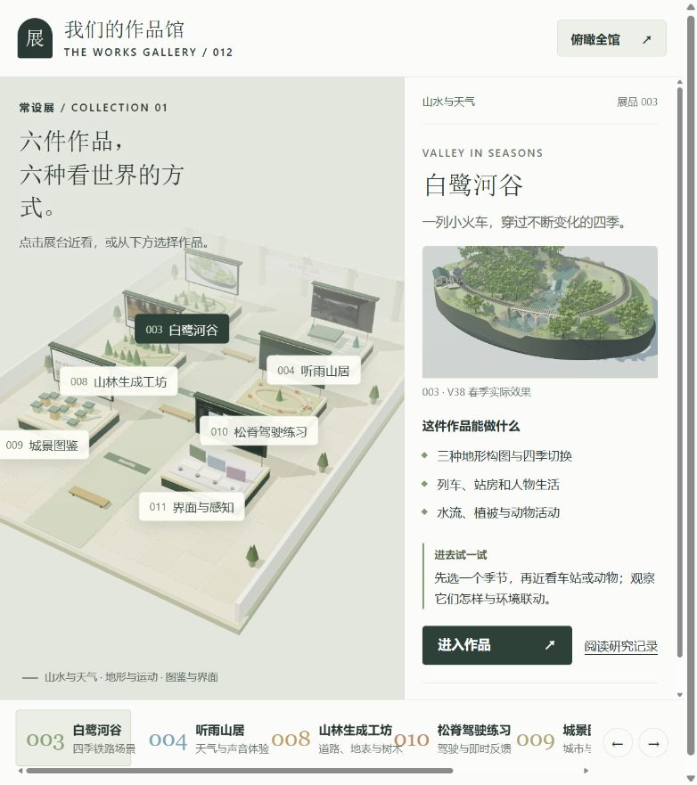
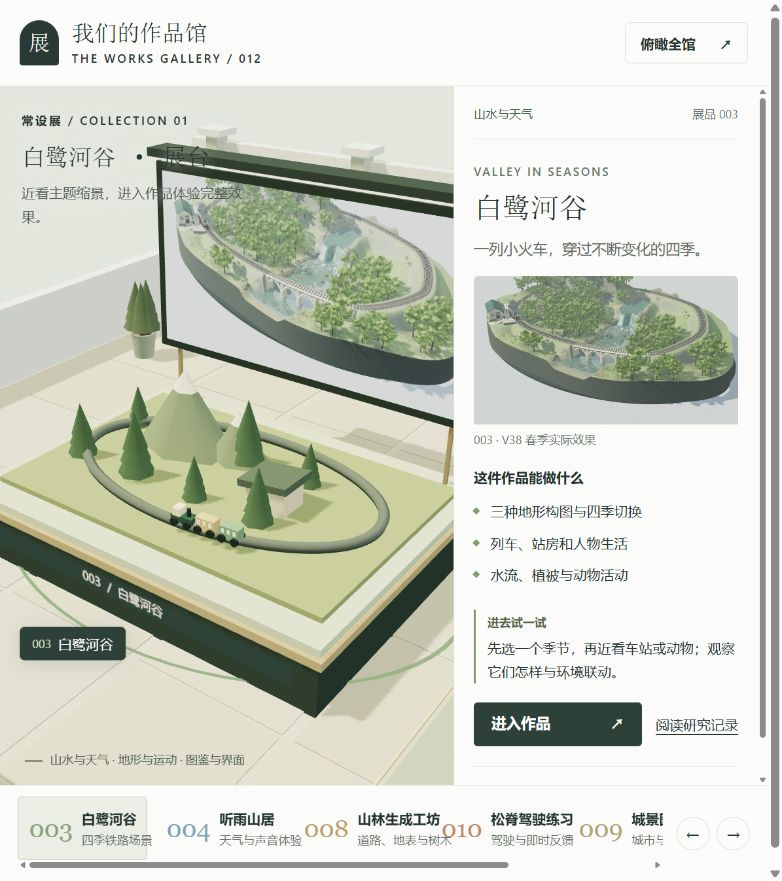
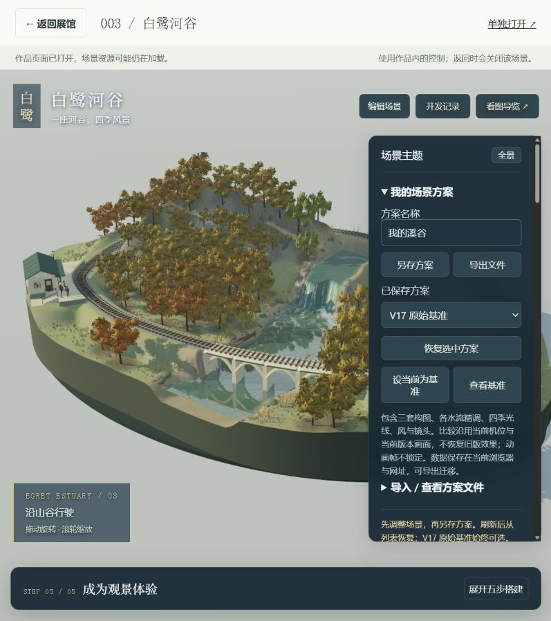

# 当前作品馆：从全馆到单展台的体验审视

[研究结论与场景方案](exhibit-research.md) · [实现说明](gallery.md) · [返回 012](README.md)

日期：2026-09-15。对象：当前本地 012，`http://127.0.0.1:8412/#railway`。工具：Codex 内置浏览器；使用当前窗口，未设手机模拟或固定分辨率。四张图片均为本轮实际截屏，保存后重新打开确认，没有生成或美化。截图文件及原始观察笔记见 [assets/audit-2026-09-15](assets/audit-2026-09-15/README.md)。

## 总体判断

**全馆 → 近看 → 打开 003 → 返回的基本链路走通。单展台仍是入口示意，尚未达到精细展品的观看质量。** 当前窄窗口里还出现标题叠压、近景裁切和水平滚动，说明整体组织与单台观看都需要进一步设计。

本轮没有修改应用。以下优先级按这次“让观众理解展品”的目标判断，不是全产品缺陷清单。

## 1 · 俯瞰全馆：可用，布局需调整

- **观察：**点击“俯瞰全馆”后看到六个编号展台和底部目录；右侧保留已选白鹭河谷。整体主题色与标牌一致。
- **问题：**截图为 782×881 像素，左右布局压缩了场景宽度，左侧标题折成四行；页面底部存在水平滚动，右侧目录内容超出可见区。部分展品图片在全景中很小。
- **建议：**按实际可用场景宽度决定布局，窄窗口先展示主体，说明按需展开；对“全馆”和“当前选中作品”的关系给出清晰反馈。
- **可达性风险：**较小、较浅的文字需要进一步量测对比度；截图不证明键盘能完成整条流程。

## 2 · 近看白鹭河谷展台：待重点提升

- **观察：**点击底部白鹭河谷后，相机确实拉近，标题变为单台状态。铁路、列车、山林可以辨认主题。
- **问题：**台上锥体山林、简化列车与背后的实际作品画面差异显著；背板和右侧又重复展示同一截图。拉近后展板右侧超出场景区域，左上文字与展板叠在一起。这个状态主要展示“作品入口”，没有直接引导到原作品的具体细节。
- **建议：**作为下一阶段首要工作，设计一个真正值得近看的主体、三处看点和一个有解释价值的操作；相机依据主体与可用视口取景，文字留出独立阅读空间。
- **可达性风险：**文字与复杂图像叠压影响阅读；未来看点需要同步提供文字按钮，避免只靠点模型。

## 3 · 打开完整作品：加载成功，参观入口需简化

- **观察：**点击“进入作品”，已发布 003 页面及三维画面实际可见；顶部提供返回、单独打开。当前截图为 797×898 像素；窗口尺寸自然变化，未用它做同尺寸视觉差异计算。
- **问题：**进入后原页面默认展开方案编辑、保存与基准等内容，初次参观者首先面对创作工具。面板占据画面右侧，遮住部分主体。外层状态始终保留“场景资源可能仍在加载”，无法准确说明就绪程度。
- **建议：**原场景增加可独立打开的参观模式，默认收起编辑功能，将“全景、看点、代表互动”放在首层；若需要准确加载反馈，另设计明确的就绪事件。
- **可达性与限制：**返回入口在可访问树中获得焦点，但未完整测试嵌入页的键盘遍历、读屏、音频或全部参数功能。场景显示成功不能等同于完整功能验收。

## 4 · 返回展馆：基本正常

- **观察：**点击返回后恢复白鹭河谷近景与选择，浏览器焦点回到“进入作品”。展馆重新显示，截图中的列车位置也发生变化。
- **问题：**仍然保留步骤 2 的裁切和文字叠压。
- **建议：**保留选择与返回约定；今后测试从具体看点进入/返回时的观看状态是否同样可预测。
- **限制：**一次返回成功不能证明重复进入无资源泄漏、GPU 资源完全释放或低端设备性能达标。

## 按影响排序的后续工作

1. **展品内容：**让单展品独立成立，原始场景质量、看点与讲解共同构成展示。
2. **观看空间：**修正窄窗口下的近景取景、文字叠压与水平溢出。
3. **参观模式：**将原作品的观赏流程与编辑工具分层，减少第一步的理解成本。
4. **验证补足：**再检查键盘、触控、对比度、减少动画、错误状态和实体手机性能。

本轮审视仅覆盖一个展品的入口链路，没有测试其余五件作品、全部宽度、全部作品内部互动或完整无障碍符合性。外部案例研究与本地截图观察在[深入研究](exhibit-research.md)中分别注明。
