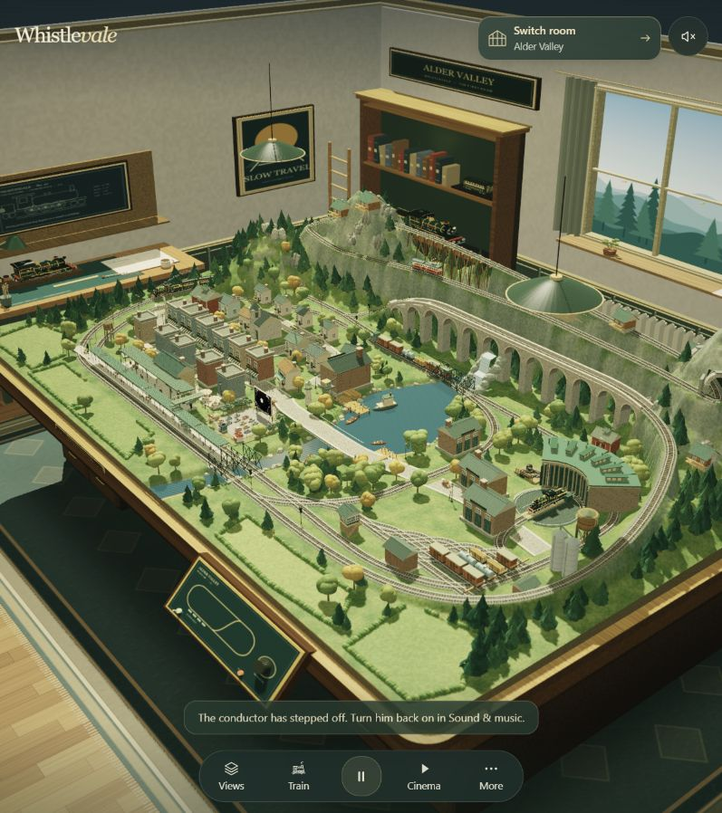
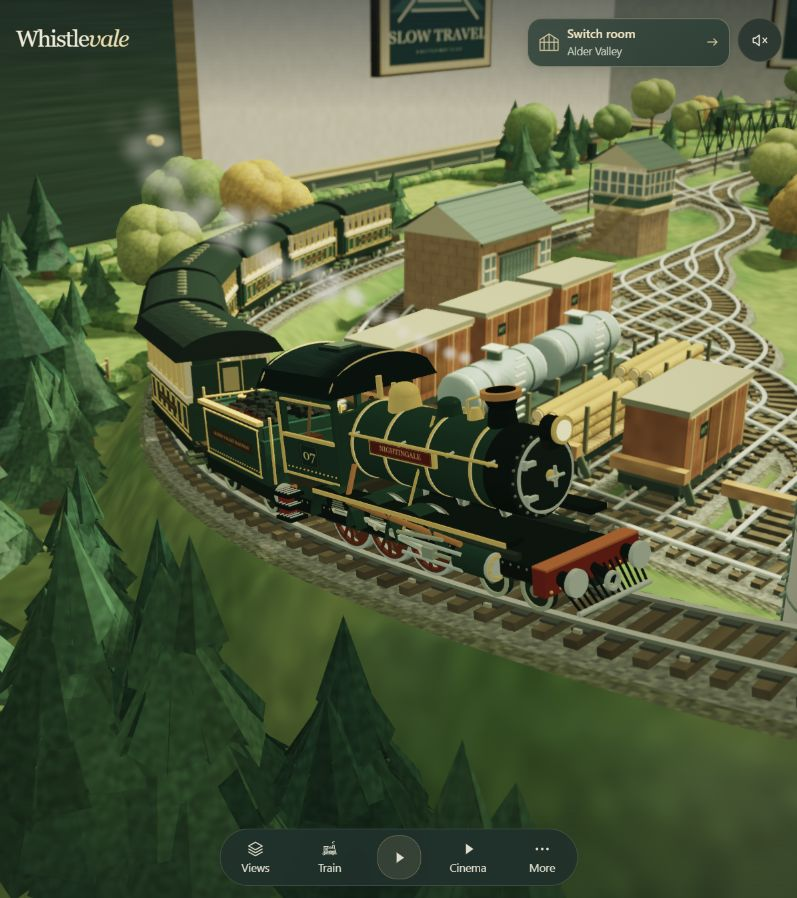
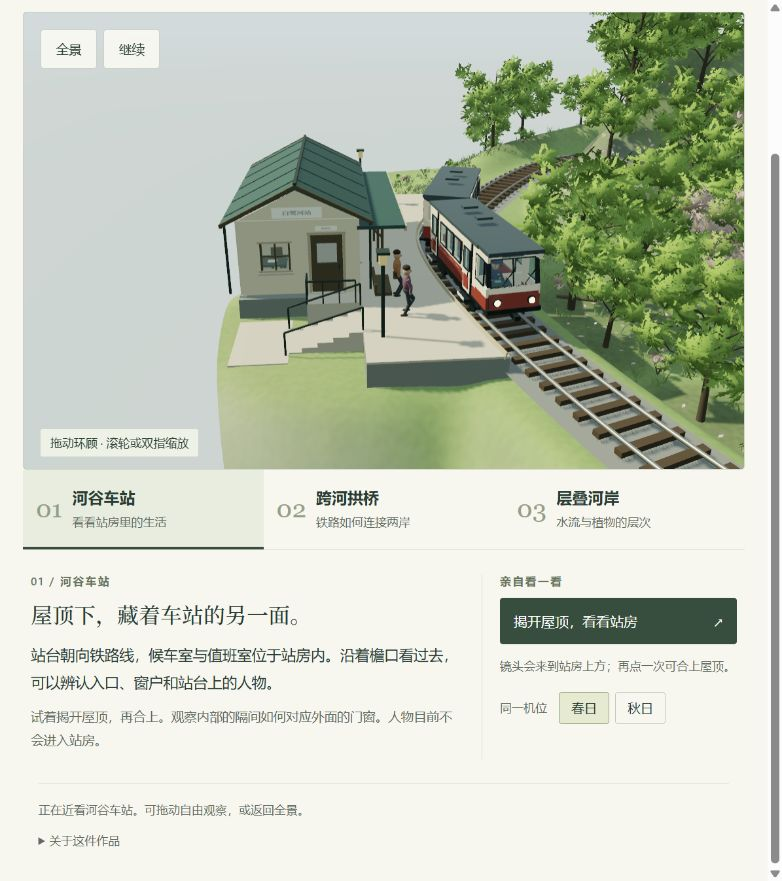
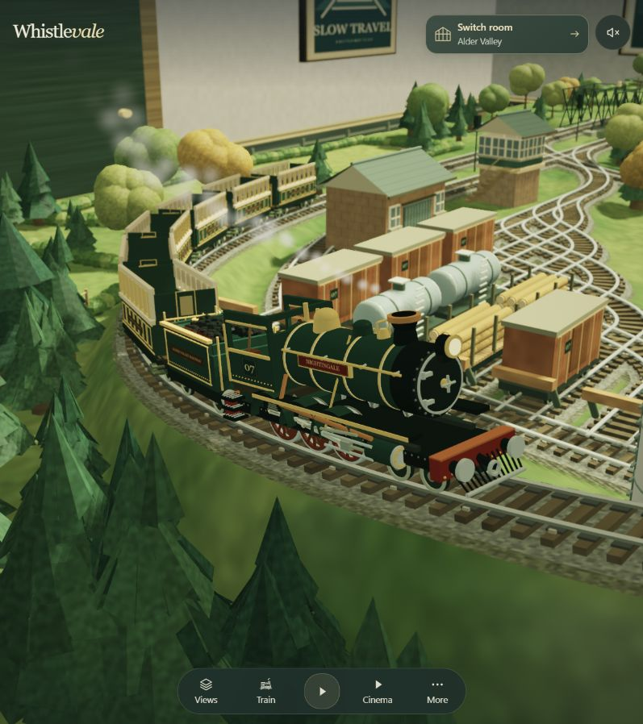
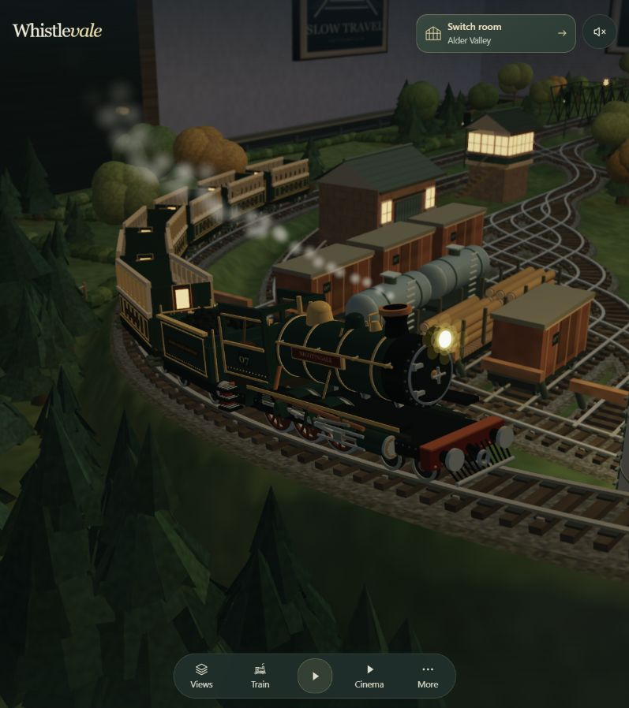

# 原生展品拆解：Alder Valley 与 Nightingale

**结论：选择 Alder Valley 这个原生房间，以 Nightingale 蒸汽机车为近景样本。它比我们当前作品更成熟的地方，是模型细节、材质、灯光与观看方式共同服务于“精致的微缩收藏品”。我们的四季、生态、水面和车站交互已有基础，下一步应集中打磨一个近看也成立的主角。**

[原作入口](https://whistlevale.com/?room=valley) · [我们的单展品](valley-exhibit.md) · [返回项目](README.md)

## 1. 为什么选它，比较的是哪一版

Alder Valley 是 Whistlevale 自己的铁路沙盘，房间、轨道、列车、材质和镜头都能沿原生实现追踪。Yamaai 是外接作品，不适合作为本次“原库自己的制作功力”的主要证据。这里把 Alder Valley 当作一个完整展品房间，Nightingale 是其中的主角；不把它等同于 Grand Hall 中一个普通展位。

| 对象 | 证据与版本 |
| :--- | :--- |
| 上游源码 | [nickfromlater/whistlevale](https://github.com/nickfromlater/whistlevale)，固定 [f3d769e8ea54d2f5a47d12f27773541b484c6302](https://github.com/nickfromlater/whistlevale/commit/f3d769e8ea54d2f5a47d12f27773541b484c6302)，提交日期 2026-09-13 |
| 许可证 | MIT，保留的[许可证原文](assets/UPSTREAM-LICENSE.txt)；不把可选音频一并视为 MIT |
| 原作画面 | 2026-09-15 访问作者线上 Alder Valley；线上部署 SHA 待核实，不能保证与固定源码逐字一致 |
| 我们的画面 | 同日访问本地 `012/app/valley.html`，春日全景与车站近景；主体来自 003，012 提供参观页 |
| 我们的源码 | 003 当前工作区；42 个被复用文件的 SHA-256 全部匹配已有[源文件快照](assets/valley-exhibit-v1/source-manifest.json)。012 生成副本的变换见该清单 |
| 检查边界 | 实际画面与交互观察、固定源码阅读；没有公平 FPS 基准、实体手机、全量功能或音质测试 |

以下分别标明画面观察、源码事实和改进判断。截图保持实际浏览器尺寸，没有裁图拼接或 AI 生成；双方尺寸与机位不同，不用于像素级优劣评分。

## 2. 先看差别：它的主角经得起靠近

**原作全景观察：**桌沿、柜体、地毯、窗户和书柜明确告诉人“这是房间里的一件模型”。桌上的站区、机务区、村庄、山地与高架铁路又有自己的层次。外围空间与桌上小世界的尺度相互说明。

**原作近景观察：**视线可以从机车整体轮廓落到锅炉、驾驶室，再落到箍带、扶手、轮辐和连杆。细节主要集中在值得看的物体上。前景树木虚化，机车较清晰，进一步引导注意力。

**我们的近景观察：**站房、楼梯、栏杆、屋面拼缝、窗框、人物和车窗都已经存在；车站与列车的关系也清楚。进一步靠近时，墙面、台面、车身的大块表面变化较少，连接和收边的层次较弱。植被比较丰富，建筑与车辆的精细程度还没有完全跟上。

**公平比较：**我们使用现代观景列车，原作使用蒸汽机车；现代车辆不需要照搬锅炉和外露连杆。真正可以比较的是：各自车型该有的结构是否清楚，材料是否可辨，接缝、窗框、底盘、扶手和灯具是否经得起近看。

## 3. 模型：它把“零件关系”做了出来

### 3.1 从轮廓到结构，再到连接细节

原生几何由 `Builder` 的盒体、圆柱、球体、梁等基础形体组成。每个顶点记录位置、法线、颜色、材质编号和 UV，最终上传为网格。它同样大量使用基本几何体，精致感来自组合、比例和零件层级。[Builder 与上传实现][builder]

有效的 `makeLoco` 实现从 `railway.js` 第 838 行开始：车架与踏板、弹簧、锅炉和箍带、烟箱门及铰链、管路、驾驶室仪表、扶手、车灯和排障器分别构造。轮子有轮辐、轮圈、配重和曲柄销；煤水车还有煤块、梯子和悬挂细节。[机车与车轮实现][loco]

这带来的不是单纯的“面数更多”，而是三个观察距离都有内容：

| 观察距离 | 原作提供什么 | 我们应借鉴什么 |
| :--- | :--- | :--- |
| 远看 | 清楚的车头与车厢轮廓、颜色分区 | 保持现代观景列车自己的辨识度 |
| 中看 | 锅炉、驾驶室、车架等结构分层 | 区分车身外壳、窗框、车门、车顶设备与底盘 |
| 近看 | 箍带、铰链、管路、轮辐等有用途的零件 | 补接缝、踏步、门把、灯罩、转向架与连接件；按实际观察距离分配细节 |

### 3.2 动起来的关系同样连贯

后加载的 `trains.js` 承担当前列车选择与绘制。Nightingale 调用上述模型。驱动轮相位决定曲柄位置，左右侧相位相差四分之一圈，连杆与滑块根据端点关系更新；车厢连接件连接实际变换后的端点。[动态机构][motion] [当前列车绘制][selected]

这是一套用于展示的运动学关系，不是蒸汽压力、受力或轮轨接触的工程仿真。

我们的[列车模块](../003-mountain-railway-diorama/app/scene-train.mjs)已经按轨道前后采样设置车身方向，转向架分别采样轨道，轮子随行驶距离转动。因此，优势应落在**机械细节与运动可读性**，不能说我们只有模型沿线平移。

### 3.3 揭顶是对模型内容的承诺

原作将可拆屋顶与主体分开绘制，客车还构造座位、隔间和乘客；驾驶室有仪表与操纵零件。截图能确认屋顶被移除，细小仪表和所有座位不在这张图里逐一可辨，具体内容依据源码。[机车和客车内部][loco] [屋顶切换][selected]

我们的站房也有[内部空间](../003-mountain-railway-diorama/app/scene-station-room.mjs)和揭顶交互，列车也有[驾驶室](../003-mountain-railway-diorama/app/scene-cab.mjs)。下一步适合增强内外门窗对应、室内材料和观察角度；无需重复做一个已有的“开关屋顶”功能。

## 4. 材质：同一个绿色，也能看出是车漆还是木头

原作在片元着色器里依据材质编号改变表面表现：地板有板缝和木纹，木制家具有方向性的纹理变化，砖墙有错缝与灰缝，车漆、金属、底盘和玻璃使用不同粗糙度、金属响应与高光处理。[材质分支][materials]

例如车漆分支的粗糙度参数为 `0.22`，抛光金属为 `0.17`、金属参数为 `0.92`；这些数值进入作者自定义光照公式，不能直接当成标准 PBR 材料测量值。更重要的是，**材料差别与部件用途对应**：箍带和扶手的亮边、车身较宽的反光、底盘较暗的表面互相区分。

我们的[通用材质](../003-mountain-railway-diorama/app/scene-world.mjs)、[站房](../003-mountain-railway-diorama/app/scene-station.mjs)和列车也使用不同粗糙度、金属度，并不是所有物体共用一个颜色材质。但是当前建筑与车身主要依靠基色和几何分区，缺少同等细致的表面层次。

**建议：**先在车站完成墙面、木作、屋顶、金属、玻璃五类材料的辨识，再补少量合理的边缘变化。风化和污迹应符合作品设定，不能给所有物体统一叠噪点。保留我们现有水面、湿润和植被专用着色能力。

## 5. 灯光与镜头：它在主动决定观众看哪里

### 5.1 夜景有多个层次

原作区分日光、夜间冷色环境、房间灯、沙盘灯和车头灯；太阳与环境亮度随黄昏、深夜分阶段变化。房间吊灯与工作灯采用不同衰减，桌板下方有专门的遮挡近似。[灯光实现][lighting]

这些都是针对场景设计的实时近似，不能称为全局光照；桌下加暗也不等于通用环境光遮蔽算法。

### 5.2 最后还做一次统一的画面处理

原生后处理读取颜色与深度，包含景深、亮部泛光、ACES 近似色调映射、伽马处理、轻微暗角和颗粒。景深根据物体深度与焦点距离决定模糊量，并使用深度权重减轻边缘串色。本次 Atmosphere 面板确认 Miniature lens 开启。[后处理][post]

人的直观感受是：焦点像微距摄影一样落在模型上，灯光亮但不只是纯白圆点，房间和沙盘有统一的色彩气氛。

我们的[渲染入口](../003-mountain-railway-diorama/app/scene.mjs)当前使用 `NoToneMapping`，具有日光、阴影与季节照明，却没有这一整套屏幕后处理。这里是可以明确指出的实现差距；它不意味着加上全部特效就会自动变好。对于需要看清结构的讲解视角，景深过强反而有害。

### 5.3 Cinema 不是简单转圈

`hobby.js` 的 Cinema 会平滑列车朝向，组合侧面、远景、尾部等观看方式；镜头位置与目标分别阻尼跟随，考虑地形高度、视线中的山脊和隧道，还对窄视口调整距离与视场。进入、离开时保留和恢复原有观看状态。[Cinema][cinema]

我们已有平滑机位切换、路径高度采样、跟随与自动机位，012 对观众开放三个看点。因此，更值得学习的是**为每个看点编排好主角大小、前后景与镜头节奏**，而非增加另一个“自动旋转”按钮。

## 6. 环境：小物件让人相信这里被使用过

原作房间中的桌面工作区有颜料瓶、画笔、尺子、手册与台灯；收藏柜、抽屉和模型展示又保持共同主题。吊灯甚至分开构造外壳与可见内壁，避免从下方看到实心锥体。这些细节来自实际几何构造，不只是一张背景图。[原生房间][room]

桌上场景同样有关系：站台边缘、棚架与人物服务于铁路；机务区与货场有自己的设施；乡野生成会避开轨道、道路、水边与既有建筑，草地和树篱留下观看列车的空间。[站区与乡野][district]

我们的河谷也已有布局约束、地形承托、桥、水流与生态系统。原作值得借鉴的是**成组出现的生活线索，以及有意保留的空处**。当前车站前场可以用少量长椅、时刻牌、排水边沟、候车用品与灯具强化故事，无需扩大整个城镇或继续增加满场植被。

如果以后面向旅游地介绍，这些生活线索要来自真实资料；本次双方都是微缩创作，不能把虚构招牌和年代当作地方史实。

## 7. 技术路线与代价：我们不必重写引擎

原作的建模、材质和渲染紧密配合，还合并几何数据、按需使用索引缓冲、缓存静态阴影并叠加动态列车阴影。[几何上传][upload] [渲染与阴影缓存][render]

但这种实现也有代价：较大的全局脚本、多处函数覆盖、后加载脚本包装原有行为。阅读 `railway.js` 早期同名模型函数容易看错，必须追到后面的有效定义与 `trains.js` 调用。独立修改和长期维护需要理解这条加载链。

我们已有模块化 Three.js 场景，改进材质、灯光、主体模型和镜头并不要求迁移到裸 WebGL。原作的批处理是可借鉴机制；在没有统一场景、设备和测试条件时，不能据此断言它一定更快、更省电或可稳定运行在某个 FPS。

**一个我们已有的具体能力：**[水面模块](../003-mountain-railway-diorama/app/scene-water.mjs)用镜像相机渲染到 768×768 半浮点目标，形成场景平面倒影。所查原生 Alder 水面材质主要采用波动法线、高光与随视角变化的环境色近似。[原生水面][water] 因此水面不能简单列为“我们缺少原库技术”的项目；两种方法各有视觉与性能取舍。

## 8. 对我们的意义：先做好一件能近看的作品

| 优先顺序 | 具体工作建议 | 用什么判断完成 |
| :--- | :--- | :--- |
| 1 | 以现有“车站 + 一节观景车”为重点，打磨零件、收边和材料 | 远景认得出，中景结构清楚，近景表面与连接关系仍可信 |
| 2 | 建立稳定的白天与夜间光照、曝光和色调方案 | 墙面不发白、底盘不糊黑；暖窗、车灯和环境各有层次 |
| 3 | 精调三个看点的构图，给重点细节设置合适观察距离 | 点击后能直接找到主角，不被树挡住，也不用再手动寻找细节 |
| 4 | 给车站添加少量成组的生活与设施细节 | 每件道具都能解释场景用途，保留视线与前场空处 |
| 5 | 把这套表现扩展到拱桥、河岸，再考虑展厅整体风格 | 单件作品达到一致质量后，展馆入口能准确预告里面的体验 |

**最终判断：原库最值得学习的是“近看仍有内容，而且知道怎样让你看见”。** 展厅整体布局负责把人带到作品前；单个展品的几何、材料、动作、灯光和镜头决定人愿不愿意留下。我们已经有可讲的内容和可用的交互，应把下一轮投入放在主角的完成度上。

以上是研究建议，本轮没有更改应用、提交或部署。

## 9. 本轮证据与验证记录

- 实际操作原作的机车近看、暂停、缩放、揭顶、夜景；检查景深开关状态。Cinema 算法本轮阅读源码，已有实际进入/退出证据见[早先场景记录](scene-guide.md)，本轮未重新验收所有 Cinema 机位。
- 原作四张、我们的作品两张，共六张新截图，全部重新查看；[图片说明](assets/alder-native-study/README.md)与[文件清单](assets/alder-native-study/image-manifest.json)保留来源、尺寸和 SHA-256。
- 阅读固定提交的原生模型、材质、渲染、房间、列车与镜头代码，并对照 003/012 当前实现；上游临时源码保存在被忽略的研究目录，没有收录完整上游仓库。
- 42 个 003 复用源文件与已有快照逐一匹配。本轮文档链接与图片文件检查结果补记于 [notes.md](notes.md)。未把历史应用构建、音频或性能测试记作本轮完成。

[builder]: https://github.com/nickfromlater/whistlevale/blob/f3d769e8ea54d2f5a47d12f27773541b484c6302/railway.js#L49
[upload]: https://github.com/nickfromlater/whistlevale/blob/f3d769e8ea54d2f5a47d12f27773541b484c6302/railway.js#L275
[loco]: https://github.com/nickfromlater/whistlevale/blob/f3d769e8ea54d2f5a47d12f27773541b484c6302/railway.js#L838
[motion]: https://github.com/nickfromlater/whistlevale/blob/f3d769e8ea54d2f5a47d12f27773541b484c6302/trains.js#L298
[selected]: https://github.com/nickfromlater/whistlevale/blob/f3d769e8ea54d2f5a47d12f27773541b484c6302/trains.js#L613
[materials]: https://github.com/nickfromlater/whistlevale/blob/f3d769e8ea54d2f5a47d12f27773541b484c6302/railway.js#L182
[lighting]: https://github.com/nickfromlater/whistlevale/blob/f3d769e8ea54d2f5a47d12f27773541b484c6302/railway.js#L218
[post]: https://github.com/nickfromlater/whistlevale/blob/f3d769e8ea54d2f5a47d12f27773541b484c6302/railway.js#L258
[cinema]: https://github.com/nickfromlater/whistlevale/blob/f3d769e8ea54d2f5a47d12f27773541b484c6302/hobby.js#L267
[room]: https://github.com/nickfromlater/whistlevale/blob/f3d769e8ea54d2f5a47d12f27773541b484c6302/railway.js#L738
[district]: https://github.com/nickfromlater/whistlevale/blob/f3d769e8ea54d2f5a47d12f27773541b484c6302/railway.js#L1987
[render]: https://github.com/nickfromlater/whistlevale/blob/f3d769e8ea54d2f5a47d12f27773541b484c6302/railway.js#L485
[water]: https://github.com/nickfromlater/whistlevale/blob/f3d769e8ea54d2f5a47d12f27773541b484c6302/railway.js#L241
