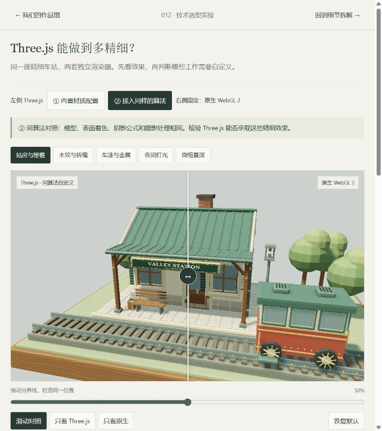
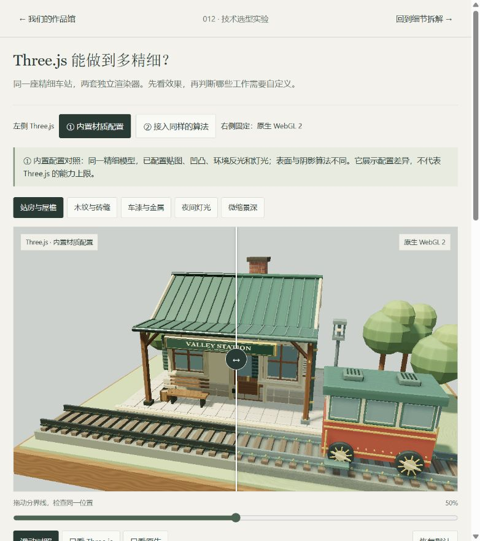
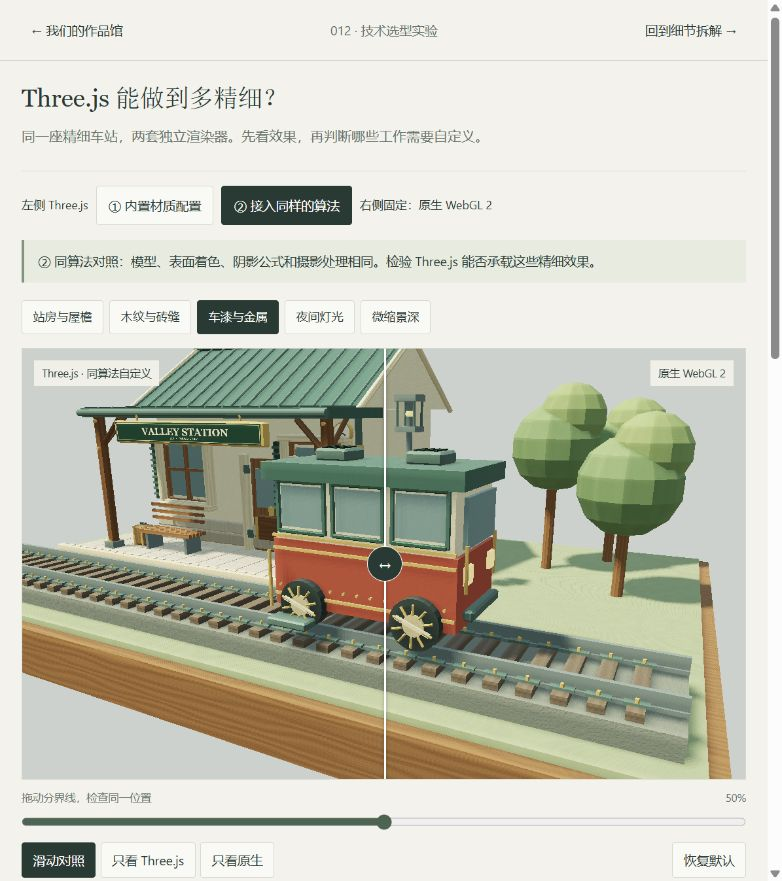

# Three.js 与原生 WebGL 2：同场景实际效果对照

**本次已实现两套独立渲染器。在站房、木纹砖缝、车漆金属、夜景和景深五个看点中，Three.js 接入相同算法后保留了本实验的精细效果。没有发现必须绕开 Three.js 才能实现的这一类画质需求。**

[打开本地实际对照](http://127.0.0.1:8412/renderer-compare.html) · [模型精细化实验](webgl-detail-study.md) · [七步入门](webgl2-study.md) · [返回项目](README.md)

研究日期：2026-09-15。使用已有本地 Three.js r185，MIT，保留[许可证](app/vendor/THREE-LICENSE.txt)。教学场景独立编写，参照上游 [Whistlevale，f3d769e8ea54d2f5a47d12f27773541b484c6302](https://github.com/nickfromlater/whistlevale/tree/f3d769e8ea54d2f5a47d12f27773541b484c6302)，主仓库 MIT；上游线上部署 SHA 待核实。本实验仅本地运行，未公开部署。

## 1. 先看真正的技术对照



页面右侧固定为原生 WebGL 2，左侧可以切换：

- **① 内置材质配置：**Three.js 的 `MeshStandardMaterial`，配置木纹和砖纹的颜色／凹凸贴图、金属环境反光、方向光、半球光、局部灯与阴影。使用同一精细模型，并非故意删除零件或不给金属环境贴图。
- **② 接入同样的算法：**Three.js 的 `RawShaderMaterial`，直接使用与原生版相同的表面、阴影和摄影 GLSL；场景、缓冲、材质和绘制仍由 Three.js 管理。

先选①观察风格差异，再切②验证同样的算法能否在框架内实现。通过“只看 Three.js”“只看原生”和滑动分界线观察同一位置；两侧没有独立运行的动画，车的位置固定。

**① 是一种内置能力的配置实例，不是 Three.js 画质上限。② 是同算法的移植实验，不是两边显示同一个渲染结果。**

## 2. 实际哪里不同，是否属于能力不足？

| 效果 | ① 的实际做法与差异 | ② 的验证结果 | 选型意义 |
| :--- | :--- | :--- | :--- |
| 倒角、窗框、屋檐与铆钉 | 同一精细几何完整显示 | 保留，模型均为 19,168 个三角形 | 内容制作即可，未发现框架限制 |
| 木纹和砖缝 | 采样生成的二维颜色／凹凸贴图；纹理分布和起伏与连续程序函数不同 | 相同程序纹理与高度法线算法能够接入 | 想精确复现特定程序纹理时需要自定义，不必更换框架 |
| 金属与车漆 | 内置物理材质与环境贴图；高光、反光和明暗风格不同 | 本实验的 Fresnel 与环境颜色近似保留 | 两种风格不构成高低排名；按目标观感选择材质方法 |
| 柔影与夜色 | Three.js 阴影滤波、半球光与点光；与手写补光公式不同 | 指定 5×5 深度滤波、补光和灯光公式保留 | 精确控制公式需要自定义；Three.js 能管理这些绘制步骤 |
| 微缩景深 | 两种 Three.js 配置都接入与原生版相同的后处理 | 颜色＋深度、景深与色调链路保留 | 需要额外后处理，单个内置材质不能包办整幅画面 |





本轮没有测试任意水面、体积云、毛发、真实折射、全局光照或路径追踪。不能由这座车站推出“Three.js 没有任何限制”，也不能把尚未测试的高级效果列为它“做不到”的项目。

## 3. 同算法对照的实测数据

使用浏览器内的两个独立 WebGL 2 上下文。每个渲染器完成当前帧后，立即读取 GPU 的 RGBA 输出；只比较 RGB，忽略 alpha。检测覆盖完整输出，包含背景，不包含 HTML 标签或分界线。不是 JPEG 截图像素比较。

本次各看点的输出尺寸为 **1105×658，即 727,090 个像素**；两侧颜色缓冲均为 RGBA16F，最终比较的是显示输出的 8 位 RGB。

| 看点 | RGB 通道平均绝对差／255 | 最大单通道差 | 任一通道差值超过 2 的像素占比 |
| :--- | ---: | ---: | ---: |
| 站房与屋檐 | 0.002131 | 194 | 0.008252% |
| 木纹与砖缝 | 0.002371 | 31 | 0.038647% |
| 车漆与金属 | 0.000752 | 93 | 0.003026% |
| 夜间灯光 | 0.000729 | 84 | 0.005089% |
| 微缩景深 | 0.001479 | 112 | 0.019392% |

**结论限定为：这五组固定观察条件下，画面非常接近，主要细节没有因 Three.js 而丢失。** 平均差很小不等于所有像素完全一致：少量像素仍存在较大差异，本轮没有逐个确定其来源。背景参与平均计算，也不能把均值理解为只针对模型表面的误差。

① 内置配置的平均差约为 6.69—16.48／255，因为材质、灯光与纹理算法不同；这不是“Three.js 损失了多少画质”。[全部十组参数、数据和运行日志](assets/renderer-comparison-v1/comparison-results.json)均已归档。

另用车厢看点组合修改光线方向 270°、夜色 0.45、粗糙度 0.08、景深 1.8、曝光 0.7；同算法平均差为 0.000456／255，结果见[参数联动实测](assets/renderer-comparison-v1/control-check.json)。

## 4. 为什么这次才支持选型判断

上一页是“基础与精细制作”的差异，左右都使用原生 WebGL 2。本页保持精细模型，分别由两套代码真正完成绘制：

```text
共享场景数据、变换矩阵和 GLSL 算法
 ├─ 原生：缓冲区／VAO → program／uniform → framebuffer → drawElements
 └─ Three.js：BufferGeometry → RawShaderMaterial → WebGLRenderTarget → render
```

共享算法是检验能否移植的必要条件。Three.js 侧没有调用原生渲染器，没有复制另一块画布或使用截图贴图；像素读取仅用于检测，不参与绘制。

比较固定了模型位置／法线／颜色／UV、相机矩阵、时间、光线方向、阴影深度尺寸、采样公式、输出分辨率、曝光和景深。原生阴影缓冲只带深度附件；Three.js 对照用渲染目标和深度纹理，关闭颜色写入。框架的内部资源和驱动执行细节不要求字节级相同。

① 的物理光照参数按其模型配置，例如方向光强度采用 π 系数；它并没有与手写近似共享所有光照公式与亮度参数。两侧①的“相同”条件是几何、相机、光源方向、输出尺寸、时间和统一摄影处理，不能混称为全算法相同。

## 5. 对我们下一次选型的具体结论

**对于本次五类精细效果，继续使用 Three.js＋必要的自定义算法有实际证据支持。**

1. 倒角、收边和铆钉：投入模型与生成规则。
2. 常规木纹、金属、凹凸与照明：先配置现成材质、贴图和灯光。
3. 特定程序纹理、指定阴影公式、独特摄影处理：在 Three.js 内增加自定义算法。
4. 若未来确实遇到无法合理表达的绘制流程或资源开销，再针对该问题建立底层原型并测量。

本页没有得出“Three.js 更快／更慢”“原生加载更小”或“哪条路线开发工时更短”。两套上下文同时运行，且①按材料分组、②按材料编号在着色器分支中处理，绘制组织不同，不能拿调用数或本页流畅度直接排名。源码行数也不等于开发与维护成本。

## 6. 实现、验证和边界

- [Three.js 绘制适配](app/three-study-renderer.mjs)：真实场景对象、几何、RawShaderMaterial、深度纹理、渲染目标和后处理。
- [内置材质配置](app/three-standard-study.mjs)：程序生成贴图、MeshStandardMaterial、环境贴图预处理及灯光。
- [公共场景输入与像素指标](app/renderer-scene.mjs)：没有绘制调用；两侧共享相机与物体变换，防止机位偏移造成假差异。
- [比较界面](app/renderer-compare.mjs)：同步参数、冻结时间、独立绘制后读取输出。
- 11 项数学、几何、比较状态和像素指标测试通过；原有展馆 96 项检查通过。012 构建 79 个文件，本地 HTTP 全部返回 200 且内容逐项匹配构建哈希。新增模块语法和两个实验入口的静态 DOM 引用检查通过。源码哈希与截图见[归档目录](assets/renderer-comparison-v1/README.md)。
- 浏览器实测两套材质模式、五个看点和组合参数，均完成渲染与像素检测；分界线 0／100 端点、拖动手柄、单侧观看和恢复默认正常。回归验证旧实验的精细模式、三角形、摄影回退对照及新页面入口。
- 未出现渲染 error；环境贴图预处理曾输出一条驱动精度警告，原始文本保留在数据文件中，未把日志写成“零警告”。
- 未测实体手机、无浮点缓冲设备、长时间内存、FPS；未测试完整上下文恢复。页面中断时明确显示错误并要求刷新。

### 官方资料

访问日期：2026-09-15。API 用法核对当前文档及仓库内 r185 实现。

- [RawShaderMaterial](https://threejs.org/docs/pages/RawShaderMaterial.html)：接入自定义 GLSL，避免自动补入内置属性与 uniform 定义。
- [MeshStandardMaterial](https://threejs.org/docs/pages/MeshStandardMaterial.html)：物理材质、颜色贴图、凹凸／法线与环境反光。本实验实际配置了环境贴图。
- [RenderTarget](https://threejs.org/docs/pages/RenderTarget.html)：将场景绘制到缓冲，用于后处理等效果。
