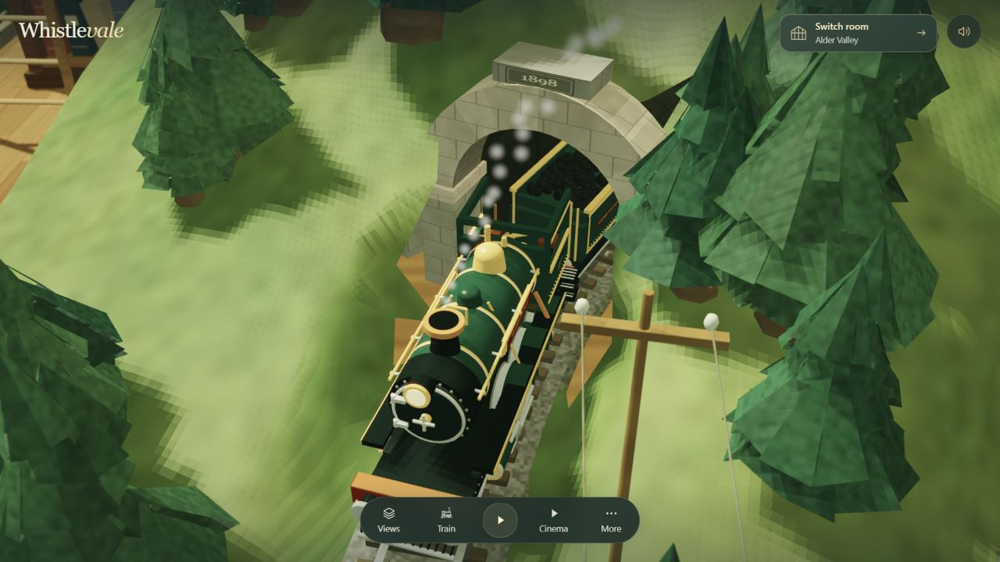
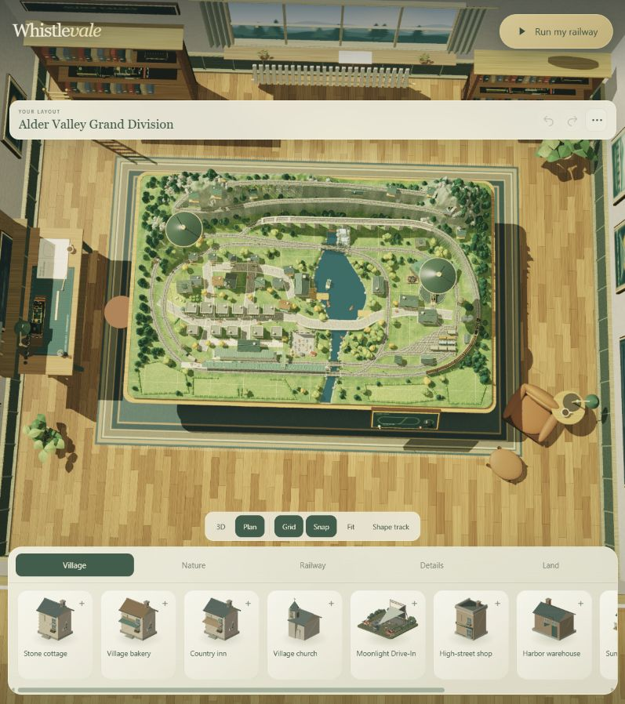

# 从 Alder Valley 一个场景理解 Whistlevale

[返回效果与能力](README.md) · [打开作者原作](https://whistlevale.com/?room=valley) · [源码与验证记录](notes.md)

建议先看画面，再动一个控制，最后阅读原理。截图来自作者线上版本；核心实现固定到 f3d769e8ea54d2f5a47d12f27773541b484c6302。二者尚未逐文件核对一致。

## 第一站：为什么它像一座模型沙盘

### 看什么与怎么操作

1. 打开原作，确认右上角当前房间为 Alder Valley。
2. 先辨认木桌与房间，再辨认村庄、湖泊、高架桥、隧道和车站。
3. 可拖动场景旋转、滚轮缩放，对照桌面与模型的大小关系。这两项是原作提供的观察方式，本轮未单独完成任意角度的覆盖验证。

### 如何实现

原生 `Builder` 将盒体、圆柱和曲面等组合起来，再以顶点、法线、颜色和材质信息提交给显卡。相同建模方法反复构建树木、屋舍与铁路设施。不是打开页面后调用 AI 临时生成模型。

整体可信感来自两层内容：桌上的景观负责铁路世界；桌子、灯具、书柜和窗景负责告诉观众“这是一个微缩模型”。地形、轨道与桥梁需要保持接地和支撑关系。

**能学走什么：**区分房间包装、场景布局与单个模型。一个模型可以复用，整体仍需要有意安排空间。

## 第二站：列车为什么能沿轨道前进

### 怎么操作

1. Train → Look at the locomotive，进入列车近景。
2. 再打开 Train → Lift off the roofs，观察揭顶后的车厢。
3. 关闭面板，用底部暂停按钮停住画面，再继续运行。上述操作本轮已完成。
4. 进一步可比较油门、Viaduct 路线和 Station stop；本轮仅检查这些入口与相关源码，尚未完整实测。

### 如何实现

`Edge` 用三次曲线构建轨道，并采样记录沿线累计距离。查询 `at(distance)` 时，找到距离附近的采样点，得到位置与前进方向。列车前进距离来自速度乘以经过时间，车厢按不同的后向距离取样，因此沿同一条轨道转弯。

简化例子：车头沿轨道走了 30 个场景单位，后车厢落后 3 个单位，那么车厢取轨道上 27 的位置。真实代码还处理路径衔接、车辆编组与变换；不能直接用世界坐标减 3 代替。

`workshopUpdateSimulation(dt)` 把油门转换为目标速度并限制加减速。请求停站时依据到车站的剩余距离降低目标速度，同时更新车轮、烟汽等表现。

**能学走什么：**分开轨道路径、运行状态与外观。视觉效果跟着状态变化，不是分别播放互不相关的动画。

**边界：**该机制没有证明真实轮轨接触、悬挂、脱轨或运输调度精度，适合交互展示与简化运行体验。

## 第三站：为什么同一场景能变成慢速电影

### 怎么操作

1. More → Atmosphere → Night run。
2. 同面板可控制 Workshop lamps、Miniature lens 和 Rain on the windows。
3. 关闭面板 → Cinema，本轮体验 Gentle drift。
4. Leave cinema 或 Esc 返回；恢复日间观察可选 Afternoon 或 Match local time。

本轮打开了夜间和窗雨开关，进入并退出 Cinema；夜间画面已截图。未将声音开启等同于听感验收，也未验证每一种镜头。

### 如何实现

相机由位置、注视目标和视野范围决定。普通观察与 Cinema 选择不同镜头规则，跟随模式使用运动列车作为参照。平滑过渡避免目标变化时突然跳动。

夜间状态通过插值渐变，传入渲染器调整光照。主渲染流程处理阴影、场景与动态物体，后处理结合深度控制微缩镜头的模糊效果。窗雨是面板中的明确能力，不能泛化为完整气象模拟。

**能学走什么：**一个场景的价值还来自光线、观察距离与镜头节奏。先设计“希望观众注意什么”，再选择镜头。

## 第四站：为什么场景可以编辑和保存

### 怎么操作

1. 退出 Cinema → More → Build your railway。
2. 切换 Plan 看布局关系；底部可切 Village、Nature、Railway、Details、Land。
3. 顶部 Project menu 可查看 Export layout (.json)、Export playable HTML、Import a saved layout。
4. Run my railway 返回运行模式。

本轮进入编辑器、切换 Plan、查看项目菜单并成功返回；没有改动布局、导出文件或导入存档。Shape track 的入口已看到，拖动与重建效果仍待验证。

### 如何实现

编辑结果首先是一组数据：物体类型、位置、旋转、缩放、轨道设计与场景名称等。`workshopSnapshot()` 形成快照，保存逻辑将状态写入本机 `localStorage`。编辑既有物体时，可更新对应几何范围，必要时重建场景。

JSON 表达可恢复布局；可玩 HTML 还要带上运行程序和资源。两种导出解决不同问题，不能仅凭菜单存在判断导出已完整可用。大型外接展室还存在不被完整打包的限制。

**能学走什么：**要把场景做成工具，需要“模型目录 + 布局数据 + 编辑操作 + 可恢复状态”。

## 第五站：一个场景怎样进入更大的展馆

### 怎么操作

Run my railway → Switch room，观察房间位置与进入按钮。本轮地图提供 Alder Valley、Coastal Gallery、Mountain Loft、Makers’ Shop、Commons、Hudson Terminal、Yamaai、Queens Pavilion、Grand Hall 九个入口；不是全部九个房间都深入测试。

### 如何实现

`registerHouseRoom()` 注册名称、场景构建方法、地图信息和观察位置等。共同导航层发现这些定义，场景层生成自己的世界。

外接场景更复杂：Yamaai 用专用适配层将原 Mountain Railway Diorama 的镜头、时间和天气状态接到宿主上。离开时销毁图形资源，避免多个复杂世界持续占用显存。它与本仓库 003 的联系是同一上游参考，不表示已接入我们的改造版本。

**能学走什么：**可扩展入口需要稳定接口，明确谁负责输入、镜头、更新、声音和资源释放。

## 把五站合起来

| 层次 | 场景中的例子 | 后续实践的启发 |
| :--- | :--- | :--- |
| 模型 | 屋舍、树木、桥、列车 | 形成可复用构件 |
| 布局 | 湖泊、村庄、轨道和桌面位置 | 保存为可编辑数据 |
| 运行 | 速度、距离、暂停和停站状态 | 让反馈由统一状态驱动 |
| 观看 | 镜头、昼夜、景深与窗雨 | 设计注意力与氛围 |
| 宿主 | 房间注册、地图、进入与退出 | 将多个作品组织成一致体验 |

**Whistlevale 把场景制作、运行、观看与编辑连接起来，再用展馆承接更多作品。** 后续复用宜先打通一个场景的小闭环，再决定是否扩展成完整展馆。
