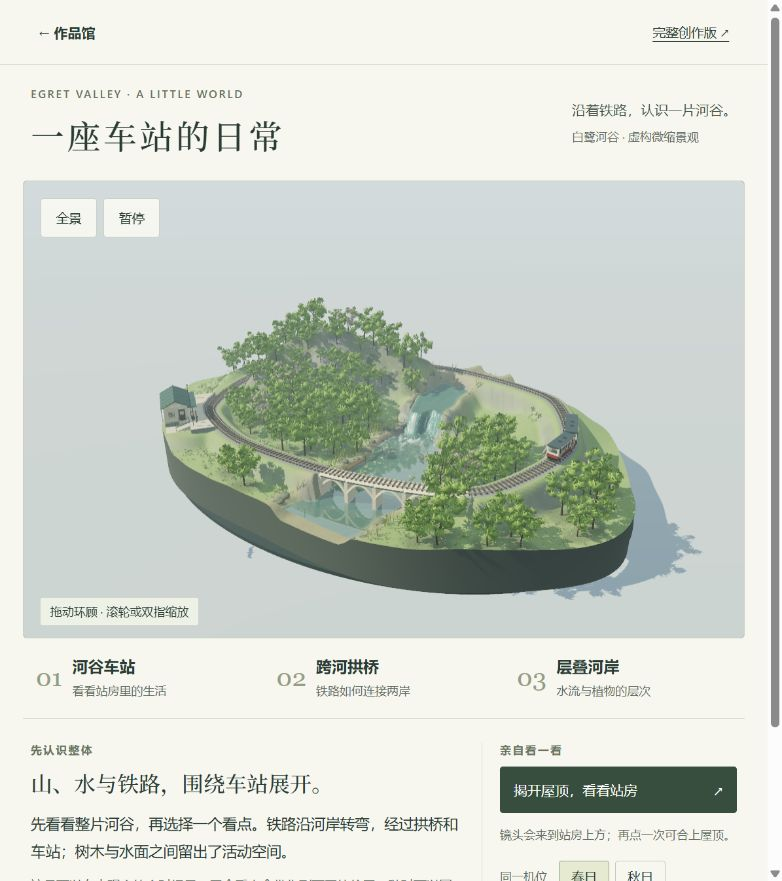
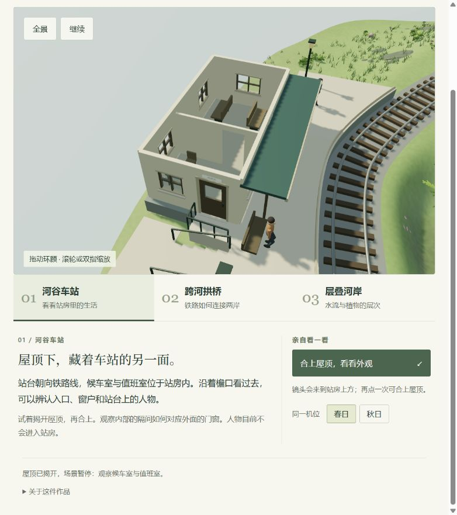
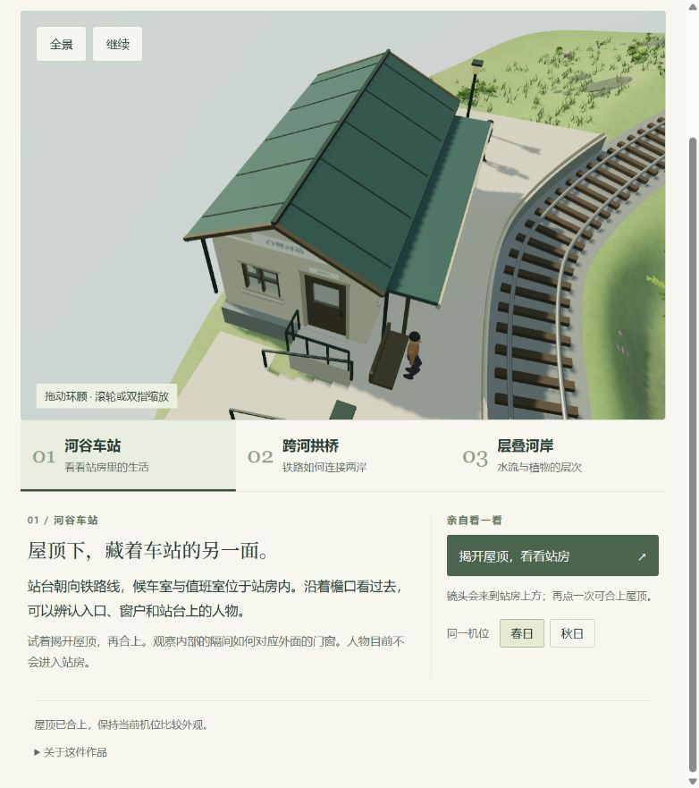
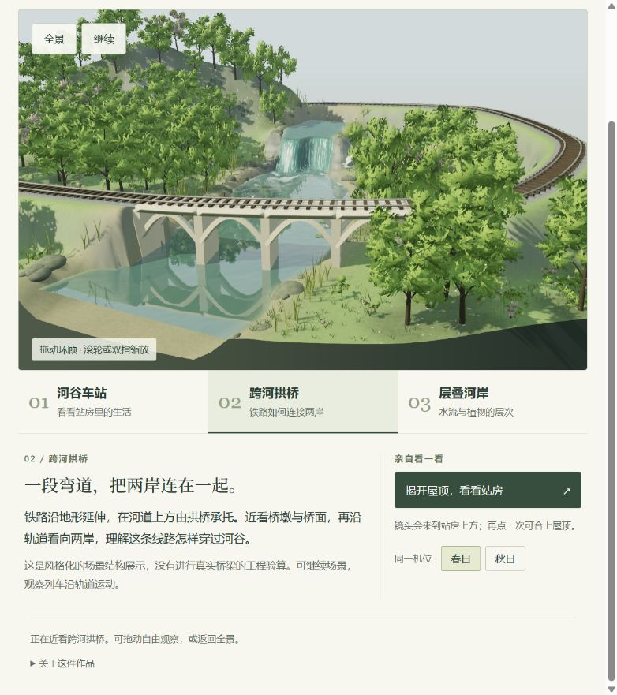
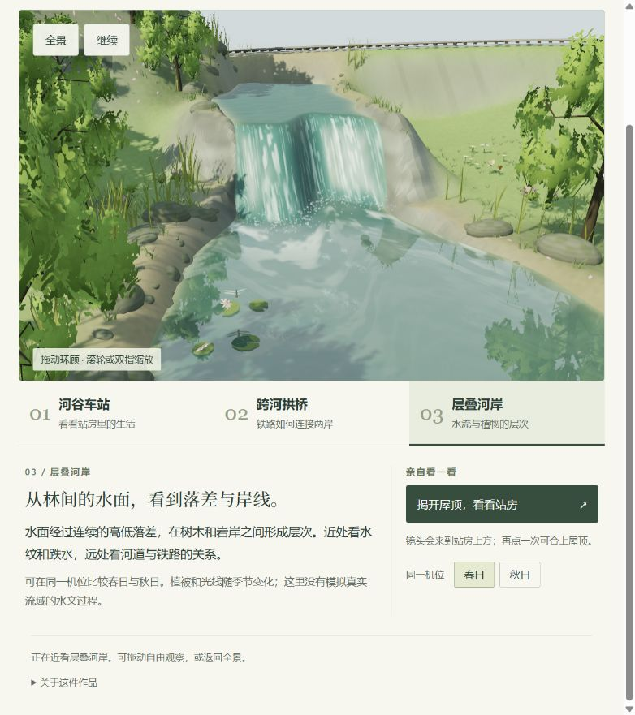
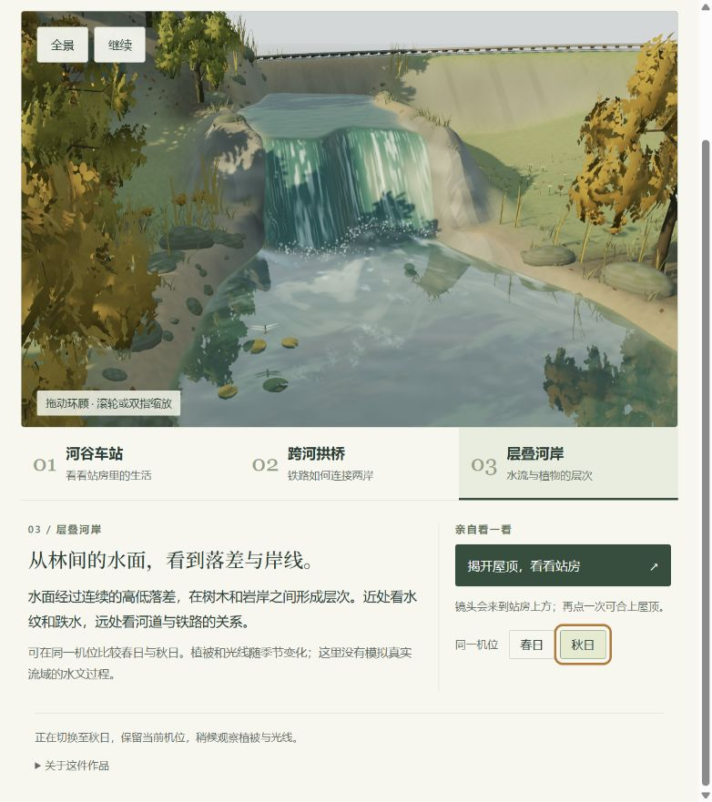

# 单展品样板 · 一座车站的日常

[本地参观](http://127.0.0.1:8412/valley.html) · [作品馆](gallery.md) · [场景研究](exhibit-research.md) · [返回 012](README.md)

2026-09-15：已实现第一版。主体复用本仓库 003 白鹭河谷的当前场景，新增面向参观者的界面与看点编排。它是虚构微缩景观，不对应真实旅游目的地；现已部署，见[在线体验](https://yydshly.github.io/0913_codex_project/012-whistlevale/valley.html)与[发布验证](publishing.md)。

## 体验

1. **完整主景：**河谷、铁路、拱桥、车站与山林，编辑器不出现在参观画面。
2. **三个看点：**河谷车站、跨河拱桥、层叠河岸；按钮切换实际镜头，讲解同步更新。
3. **揭顶与合顶：**来到站房上方并暂停，观察隔间、家具与门窗；合顶保持机位。
4. **比较春秋：**同机位切换植被与光线，保留暂停状态。
5. **自由观察：**环顾、缩放、暂停/继续、返回全景，以及回到作品馆。

此前近看的是简化缩景和展板，本轮让原场景直接成为主体，展示空间与文字区域分开。三个看点围绕铁路、车站与河谷的关系组织，使用一致的操作方式。没有重新制作 003 的模型；已有的建筑与景观细节通过新的观看和解释层呈现。

## 源码与复用边界

- [valley.html](app/valley.html)、[valley.css](app/valley.css)：参观界面。
- [valley.mjs](app/valley.mjs)：看点、讲解、原场景控制适配和就绪/失败反馈。
- [prepare-valley.mjs](app/prepare-valley.mjs)：从 003 当前工作区准备场景副本。

准备脚本从 `003/app/scene.mjs` 开始，复制依赖图及必需 HTML/CSS、Three.js 和许可到生成目录 `012/app/valley-runtime/`。该目录已忽略，启动或构建时生成。本轮捕获 42 个场景源文件，记录源与输出 SHA-256；003 包含未提交内容，不虚构固定版本，见[本轮来源清单](assets/valley-exhibit-v1/source-manifest.json)。

生成时隐藏原编辑与搭建界面；取消旧界面预留的相机偏移，并在减少动画偏好下直接切换镜头。003 原文件不写入、不重构、不运行其构建。输出保留原上游 MIT 和 Three.js MIT。

参观页以同源 iframe 加载本地副本，通过原有控件操作场景。实际 `data-ready` 就绪后启用控制；错误或超时提供图片与文字入口；退出时移除 iframe。这不是模型在大厅内的原生相机/深度合成。默认静音，没有接入语音素材。

## 运行

在 `012-whistlevale/app/` 执行 `node serve.mjs`，访问 `http://127.0.0.1:8412/valley.html`；`node build.mjs` 生成独立 `dist/`。

启动和构建显式依赖同仓库 003 场景源文件，输出包含参观体验所需本地资源。完整创作版与资料链接仍需网络。未复制完整上游仓库或嵌套 Git。

## 验证与限制

63 个构建资源通过本地 HTTP 与清单 SHA-256 对照，42 个场景源文件依赖无缺失。更新后展馆 95 项静态检查通过；新增模块语法、页面 DOM 引用及与 003 控件对应检查通过。

本轮在约 782 像素宽的当前内置浏览器观察场景并检查揭顶、合顶、拱桥/河岸近景和春秋切换。秋日按钮以 Enter 触发成功，不代表完整键盘或读屏验收。初查发现“揭顶后暂停”的文字与原控件行为不一致，已补上明确暂停操作，后续确认按钮显示“继续”。

已另外检查车站看点、继续运行、全景按钮、顶部返回作品馆，以及从白鹭河谷“进入参观样板”再次打开本地参观页。浏览器缓存恢复时会重新加载已释放的场景。

日志未见参观页运行错误；继承的旧阴影模式存在弃用提示，由渲染器自动使用替代模式。没有实体手机性能、长时间内存、所有失败路径或完整无障碍的验收结果；未人为设置手机视口。

尚未经过陌生观众的理解效果测试。人物未进入站房，桥梁不是工程模型，季节与水流是观景模拟。大厅原有问题仍见[首次审视](gallery-audit.md)，不把单展品改善当作全馆改造完成。

下一轮让首次观看者自行找到站房内部，说出与外部门窗的一处关系，再返回全景；依据实际理解困难细化内容，之后再做真实地点样板。
